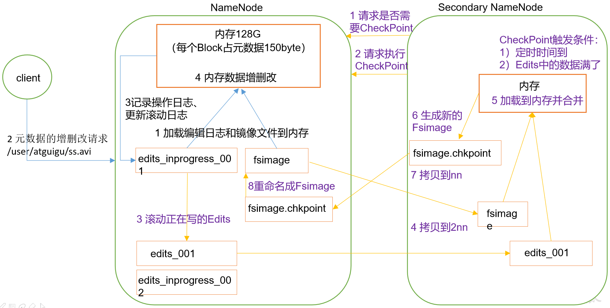

# NN与 与 SecondaryNameNode的工作机制

思考：NameNode中的元数 据是存储在哪里的？

首先，我们做个假设，如果存储在NameNode节点的磁盘中，因为经常需要进行随机访问，还有响应客户请求，必然是效率过低。因此，元数据需要存放在内存中。但如果只存在内存中，一旦断电，元数据丢失，整个集群就无法工作了。==因此**产生在磁盘中备份元数据的FsImage**==。

这样又会带来新的问题，当在内存中的元数据更新时，如果同时更新FsImage，就会导致效率过低，但如果不更新，就会发生一致性问题，一旦NameNode节点断电，就会产生数据丢失。==因此，引入Edits文件(只进行追加操作，效率很高)。**每当元数据有更新或者添加元数据时，修改内存中的元数据并追加到Edits中**==。这样，一旦NameNode节点断电，可以通过FsImage和Edits的合并，合成元数据。

但是，如果长时间添加数据到Edits中，会导致该文件数据过大，效率降低，而且一旦断电，恢复元数据需要的时间过长。因此，需要定期进行FsImage和Edits的合并，如果这个操作由NameNode节点完成，又会效率过低。==因此，引入一个新的节点SecondaryNamenode，**专门用于FsImage和Edits的合并**==


## 第一阶段：NameNode启动

- 第一次启动NameNode格式化之后
  - 创建**FsImage**，NameNode内存中元数据序列化后形成的文件
  - 创建**Edits**，记录客户端更新元数据信息的每一步操作（通过Edits运算得出元数据）
  - 滚动Edits并生成一个空的edits.inprogress（**进行中**日志）
  - 然后加载Edits和FsImage到内存中
    - 此时NameNode内存持有最新的元数据信息，Client开始对NameNode发送元数据的增删改的请求，请求记录会先被记录到edits.inprogress中，
      - 注意：查询操作不会记录在Edits中，查询操作不会更改元数据信息
    - 如果此时NameNode挂掉，==重启后会从Edits中读取元数据信息==，然后NameNode会在内存中执行元数据的增删改操作
  - 如果不是第一次启动，直接加载**编辑日志**和**镜像文件**到内存，加载期间处于安全模式
- 客户端对元数据发送增删改的请求
- NameNode记录操作日志，更新滚动日志
- NameNode在内存中对元数据进行增删改
  - 注意：先在编辑日志（edits.inprogress）中添加数据，然后再写入到内存中





## 第二阶段：Secondary NameNode工作

- 当Edits中记录的操作越来越多，Edits文件会越来越大

- 导致NameNode在**加载Edits会很慢**，所以要对Edits和FsImage进行合并

- 将Edits和FsImage加载到内存，安装Edits记录的操作执行，并生成一个新的FsImage

- Secondary NameNode询问NameNode是否需要CheckPoint

- NameNode直接在回复报文中返回是否检查结果

- 如果到了**CheckPoint**检查点，Secondary NameNode请求执行CheckPoint

  - 检查点
    - 一定时间到了
    - 日志达到条件，比如Edits中的数据写满了100万条记录，多少MB

- NameNode滚动正在写的Edits日志，并生成一个空的edits.inprogress

  - 滚动Edits的目的是给Edits打个标记，以后所有的操作都写入edits.inprogress

- NameNode将未合并的Edits和FsImage会拷贝到Secondary NameNode

- Secondary NameNode加载这2个文件到内存，并进行合并操作生成FsImage.chkpoint

- Secondary NameNode将该FsImage.chkpoint拷贝给NameNode

- NameNode重命名FsImage后替换原来的FsImage

  

# Fsimage和Edits

查看NameNode中存储的Fsimage和Edits信息

```shell
# 查看NameNode的存储情况
[ttshe@hadoop102 current]$ pwd
/opt/module/hadoop-2.7.2/data/tmp/dfs/name/current
# 查看该文件夹下的信息
[ttshe@hadoop102 current]$ ls
...
edits_0000000000000000575-0000000000000000576 # 编辑日志的历史信息
edits_0000000000000000577-0000000000000000578
edits_0000000000000000579-0000000000000000592
edits_0000000000000000593-0000000000000000608
edits_inprogress_0000000000000000609 # 当前的edits，当前的增删改的操作存储在这里
fsimage_0000000000000000592 # 上一个fsimage，用于回滚
fsimage_0000000000000000592.md5
fsimage_0000000000000000608 # 当前最新的fsimage
fsimage_0000000000000000608.md5
seen_txid # 指示当前的edits编号
VERSION
[ttshe@hadoop102 current]$ cat seen_txid 
609

# 查看Secondary NameNode存储情况
[ttshe@hadoop104 current]$ pwd
/opt/module/hadoop-2.7.2/data/tmp/dfs/namesecondary/current
[ttshe@hadoop104 current]$ ls
...
edits_0000000000000000575-0000000000000000576
edits_0000000000000000577-0000000000000000578
edits_0000000000000000579-0000000000000000592
edits_0000000000000000593-0000000000000000608
fsimage_0000000000000000592
fsimage_0000000000000000592.md5
fsimage_0000000000000000608
fsimage_0000000000000000608.md5
VERSION
# 可见是与NameNode相同，唯一不同的是NameNode有edits_inprogress_0000000000000000609
```

NameNode在格式化之后，启动hdfs，会在/opt/module/hadoop-2.7.2/data/tmp/dfs/name/current 目录中产生如下文件

```shell
fsimage_0000000000000000000
fsimage_0000000000000000000.md5
seen_txid
VERSION
```

- Fsimage文件：HDFS系统元数据的一个==永久性的检查点==，包含HDFS文件系统的所有目录和文件inode的序列化信息
- Edits文件：存放HDFS文件系统的所有更新操作的路径，文件系统客户端执行的所有写操作首先会被记录到Edits文件中
- seen_txid文件：保存一个数字，表示最新的edits的版本
- 每次NameNode==启动的时候==都会将Fsimage文件写入到内存，加载Edits里面的更新操作，保证内存中的元数据信息是最新的，同步的，可以看出NameNode启动的时候就将Fsimage和Edits进行了一次合并。

 

先进行预先操作，清空data ,log信息，然后格式化NameNode，重启HDFS，在HDFS中放入如下信息后，为接下来的例子做准备

```shell
[ttshe@hadoop102 hadoop-2.7.2]$ hadoop fs -mkdir -p /user/ttshe/
[ttshe@hadoop102 hadoop-2.7.2]$ hadoop fs -put /opt/module/hadoop-2.7.2/wcinput/wc.input /user/ttshe/wc.input
```


## oiv查看Fsimage文件

Fsimage文件是序列化后的文件，需要使用特定的命令进行查看

基本语法

```shell
hdfs oiv -p 文件类型 -i镜像文件 -o 转换后文件输出路径
```

将指定的Fsimge输出到本地，并查看生成的XML文件

```xml
[ttshe@hadoop102 current]$ hdfs oiv -p XML -i fsimage_0000000000000000000 -o ./fsimage.xml
[ttshe@hadoop102 current]$ cat fsimage.xml 
<?xml version="1.0"?>
<fsimage>
    <NameSection>
        <genstampV1>1000</genstampV1>
        <genstampV2>1000</genstampV2>
        <genstampV1Limit>0</genstampV1Limit>
        <lastAllocatedBlockId>1073741824</lastAllocatedBlockId>
        <txid>0</txid>
    </NameSection>
    <INodeSection>
        <lastInodeId>16385</lastInodeId>
        <inode>
            <id>16385</id>
            <type>DIRECTORY</type>
            <name></name>
            <mtime>0</mtime>
            <permission>ttshe:supergroup:rwxr-xr-x</permission>
            <nsquota>9223372036854775807</nsquota>
            <dsquota>-1</dsquota>
        </inode>
    </INodeSection>
    <INodeReferenceSection></INodeReferenceSection>
    <SnapshotSection>
        <snapshotCounter>0</snapshotCounter>
    </SnapshotSection>
    <INodeDirectorySection></INodeDirectorySection>
    <FileUnderConstructionSection></FileUnderConstructionSection>
    <SnapshotDiffSection>
        <diff>
            <inodeid>16385</inodeid>
        </diff>
    </SnapshotDiffSection>
    <SecretManagerSection>
        <currentId>0</currentId>
        <tokenSequenceNumber>0</tokenSequenceNumber>
    </SecretManagerSection>
    <CacheManagerSection>
        <nextDirectiveId>1</nextDirectiveId>
    </CacheManagerSection>
</fsimage>
```

- 注意：Fsimage中==没有记录块所对应的DataNode==，原因是集群启动后，DataNode会上报数据块信息，并每隔一段时间再次上报。


## oev查看Edits文件

基本语法

```shell
hdfs oev -p 文件类型 -i编辑日志 -o 转换后文件输出路径
```

将指定的Edits文件转换为XML进行输出

```xml
[ttshe@hadoop102 current]$ hdfs oev -p XML -i edits_inprogress_0000000000000000003 -o ./edits.xml
[ttshe@hadoop102 current]$ cat edits.xml 
<?xml version="1.0" encoding="UTF-8"?>
<EDITS>
  <EDITS_VERSION>-63</EDITS_VERSION>
  <RECORD>
    <OPCODE>OP_START_LOG_SEGMENT</OPCODE>
    <DATA>
      <TXID>3</TXID>
    </DATA>
  </RECORD>
  <RECORD>
    <OPCODE>OP_MKDIR</OPCODE> // 创建文件夹操作
    <DATA>
      <TXID>4</TXID>
      <LENGTH>0</LENGTH>
      <INODEID>16386</INODEID>
      <PATH>/user</PATH>
      <TIMESTAMP>1556849338353</TIMESTAMP>
      <PERMISSION_STATUS>
        <USERNAME>ttshe</USERNAME>
        <GROUPNAME>supergroup</GROUPNAME>
        <MODE>493</MODE>
      </PERMISSION_STATUS>
    </DATA>
  </RECORD>
  <RECORD>
    <OPCODE>OP_MKDIR</OPCODE>
    <DATA>
      <TXID>5</TXID>
      <LENGTH>0</LENGTH>
      <INODEID>16387</INODEID>
      <PATH>/user/ttshe</PATH>
      <TIMESTAMP>1556849338365</TIMESTAMP>
      <PERMISSION_STATUS>
        <USERNAME>ttshe</USERNAME>
        <GROUPNAME>supergroup</GROUPNAME>
        <MODE>493</MODE>
      </PERMISSION_STATUS>
    </DATA>
  </RECORD>
  <RECORD>
    <OPCODE>OP_ADD</OPCODE>
    <DATA>
      <TXID>6</TXID>
      <LENGTH>0</LENGTH>
      <INODEID>16388</INODEID>
        // 上传文件操作，不是直接上传，而是重命名一个文件，上传成功后再改名称
        <PATH>/user/ttshe/wc.input._COPYING_</PATH> 
      
        <REPLICATION>3</REPLICATION>
      <MTIME>1556849342139</MTIME>
      <ATIME>1556849342139</ATIME>
      <BLOCKSIZE>134217728</BLOCKSIZE> // 块的大小
      <CLIENT_NAME>DFSClient_NONMAPREDUCE_1805037964_1</CLIENT_NAME>
      <CLIENT_MACHINE>192.168.1.102</CLIENT_MACHINE>
      <OVERWRITE>true</OVERWRITE>
      <PERMISSION_STATUS>
        <USERNAME>ttshe</USERNAME>
        <GROUPNAME>supergroup</GROUPNAME>
        <MODE>420</MODE>
      </PERMISSION_STATUS>
      <RPC_CLIENTID>5e5cffd0-882c-4d25-8f8e-ec67532dd0cb</RPC_CLIENTID>
      <RPC_CALLID>3</RPC_CALLID>
    </DATA>
  </RECORD>
  <RECORD>
    <OPCODE>OP_ALLOCATE_BLOCK_ID</OPCODE>
    <DATA>
      <TXID>7</TXID>
      <BLOCK_ID>1073741825</BLOCK_ID>
    </DATA>
  </RECORD>
  <RECORD>
    <OPCODE>OP_SET_GENSTAMP_V2</OPCODE>
    <DATA>
      <TXID>8</TXID>
      <GENSTAMPV2>1001</GENSTAMPV2>
    </DATA>
  </RECORD>
  <RECORD>
    <OPCODE>OP_ADD_BLOCK</OPCODE>
    <DATA>
      <TXID>9</TXID>
      <PATH>/user/ttshe/wc.input._COPYING_</PATH>
      <BLOCK>
        <BLOCK_ID>1073741825</BLOCK_ID>
        <NUM_BYTES>0</NUM_BYTES>
        <GENSTAMP>1001</GENSTAMP>
      </BLOCK>
      <RPC_CLIENTID></RPC_CLIENTID>
      <RPC_CALLID>-2</RPC_CALLID>
    </DATA>
  </RECORD>
  <RECORD>
    <OPCODE>OP_CLOSE</OPCODE>
    <DATA>
      <TXID>10</TXID>
      <LENGTH>0</LENGTH>
      <INODEID>0</INODEID>
      <PATH>/user/ttshe/wc.input._COPYING_</PATH>
      <REPLICATION>3</REPLICATION>
      <MTIME>1556849342931</MTIME>
      <ATIME>1556849342139</ATIME>
      <BLOCKSIZE>134217728</BLOCKSIZE>
      <CLIENT_NAME></CLIENT_NAME>
      <CLIENT_MACHINE></CLIENT_MACHINE>
      <OVERWRITE>false</OVERWRITE>
      <BLOCK>
        <BLOCK_ID>1073741825</BLOCK_ID>
        <NUM_BYTES>66</NUM_BYTES>
        <GENSTAMP>1001</GENSTAMP>
      </BLOCK>
      <PERMISSION_STATUS>
        <USERNAME>ttshe</USERNAME>
        <GROUPNAME>supergroup</GROUPNAME>
        <MODE>420</MODE>
      </PERMISSION_STATUS>
    </DATA>
  </RECORD>
  <RECORD>
    <OPCODE>OP_RENAME_OLD</OPCODE>
    <DATA>
      <TXID>11</TXID>
      <LENGTH>0</LENGTH>
      <SRC>/user/ttshe/wc.input._COPYING_</SRC> // 上传完毕后，进行重命名操作
      <DST>/user/ttshe/wc.input</DST>
      <TIMESTAMP>1556849342940</TIMESTAMP>
      <RPC_CLIENTID>5e5cffd0-882c-4d25-8f8e-ec67532dd0cb</RPC_CLIENTID>
      <RPC_CALLID>9</RPC_CALLID>
    </DATA>
  </RECORD>
</EDITS>
```

整个操作划分为多个操作日志记录


# CheckPoint 设置

- 通常情况下 `SecondaryNameNode` 每隔1小时执行一次，在`hdfs-default.xml`文件中可以看到

```shell
<property>
  <name>dfs.namenode.checkpoint.period</name>
  <value>3600</value> # 单位s
</property>
```

- 每100万记录执行一次，这里的次数是记录在NN上的，2NN要获取次数需要每次调用查询次数，查询的间隔是1分钟

```shell
<property>
  <name>dfs.namenode.checkpoint.txns</name>
  <value>1000000</value>
<description>操作动作次数</description>
</property>

<property>
  <name>dfs.namenode.checkpoint.check.period</name>
  <value>60</value>
<description> 1分钟检查一次操作次数</description>
</property >
```


# NameNode故障处理

- 方式1：将SecondaryNameNode中的数据拷贝到NameNode存储的数据目录中

```shell
# kill -9 NameNode进程
[ttshe@hadoop102 current]$ kill -9 55189
# 删除NameNode存储的数据，注意是name中的数据
[ttshe@hadoop102 hadoop-2.7.2]$ rm -rf /opt/module/hadoop-2.7.2/data/tmp/dfs/name/
# 拷贝SecondaryNameNode中的数据到原NameNode存储的数据目录下
[ttshe@hadoop102 dfs]$ scp -r ttshe@hadoop104:/opt/module/hadoop-2.7.2/data/tmp/dfs/namesecondary/* ./name/
# 注意./name后的/不要漏了
# 重新启动NameNode
[ttshe@hadoop102 hadoop-2.7.2]$ sbin/hadoop-daemon.sh start namenode
```

注意：该方式会丢失edits_inprogress_xxx的操作数据，除非拷贝出来重新合并


- 方式2：使用-importCheckpoint选项启动NameNode守护进程，将SecondaryNameNode中的数据拷贝到NameNode目录中
  - 与上个例子类似，不过是HDFS自动拷贝
  - 在hdfs-site.xml进行相应的配置

```shell
[ttshe@hadoop102 hadoop]$ pwd
/opt/module/hadoop-2.7.2/etc/hadoop
# 原先是1小时执行一次，现在测试120s执行一次
<property>
	<name>dfs.namenode.checkpoint.period</name>
	<value>120</value>
</property>
# 设置name拷贝的路径
<property>
	<name>dfs.namenode.name.dir</name>
	<value>/opt/module/hadoop-2.7.2/data/tmp/dfs/name</value>
</property>	
# 同步到其他服务器
[ttshe@hadoop102 hadoop]$ xsync hdfs-site.xml 
```

​	操作

```shell
# kill -9 NameNode进程
[ttshe@hadoop102 hadoop]$ jps
57056 NameNode
55328 DataNode
59410 Jps
5420 NodeManager
[ttshe@hadoop102 hadoop]$ kill -9 57056
# 删除 NameNode存储的数据
[ttshe@hadoop102 name]$ rm -rf /opt/module/hadoop-2.7.2/data/tmp/dfs/name/
# 如果SecondaryNameNode不和NameNode在一个主机节点上，需要将SecondaryNameNode存储数据的目录拷贝到NameNode存储数据的平级目录，并删除in_use.lock文件
[ttshe@hadoop102 dfs]$ scp -r ttshe@hadoop104:/opt/module/hadoop-2.7.2/data/tmp/dfs/namesecondary ./
[ttshe@hadoop102 namesecondary]$ rm -rf in_use.lock
[ttshe@hadoop102 dfs]$ ls
data  name  namesecondary
# 导入检查点数据
[ttshe@hadoop102 dfs]$ hdfs namenode -importCheckpoint
# 等待一会Ctrl+C结束
# 启动NameNode
[ttshe@hadoop102 dfs]$ hadoop-daemon.sh start namenode
```


# 集群安全模式

- NameNode启动时，首先将Fsimage载入内存，并执行编辑日志Edits中的各项操作，一旦在内存中成功建立文件系统元数据映像，则创建一个新的Fsimage文件和一个空的Edits文件，此时NameNode开始监听DataNode的请求，==在该过程期间，NameNode一直处于安全模式，NameNode的文件系统对于客户端是只读的==
- DataNode启动，==系统中的数据块的位置不是由NameNode进行维护，而是以块列表的形式存储在DataNode中==，在系统的正常操作期间，NameNode会在内存中保留所有块位置的映射信息，在安全模式下，各个DataNode会向NameNode发送最新==块列表==信息，NameNode了解到足够多的块位置信息之后，可以高效的运行文件系统。
- NN磁盘小于90%会进入安全模式


## 安全模式退出判断

- 满足==最小副本条件==时，NameNode会在30s之后退出安全模式
  - 最小副本条件
    - 在整个文件系统中99.9%的块满足最小副本级别（默认值是dfs.replication.min=1）,就是指，绝大部分的块都至少有一个副本。
- 在启动一个刚刚格式化的HDFS集群时候，系统还没有任何块，NameNode不会进入安全模式


## 基本语法

> HDFS处于安全模式，不能执行写操作，集群启动完成后，自动退出安全模式


在http://hadoop102:50070/dfshealth.html#tab-overview 可以看到是否开启

```shell
# 查看安全模式状态
bin/hdfs dfsadmin -safemode get
# 进入安全模式
bin/hdfs dfsadmin -safemode enter
# 离开完全模式
bin/hdfs dfsadmin -safemode leave
# 等待安全模式结束，执行后在此阻塞，可以编写脚本并用于安全模式结束，需要立刻执行的任务
bin/hdfs dfsadmin -safemode wait
```


### 查看当前模式

```shell
[ttshe@hadoop102 hadoop-2.7.2]$ hdfs dfsadmin -safemode get
Safe mode is OFF
```


### 进入安全模式

```shell
[ttshe@hadoop102 hadoop-2.7.2]$ hdfs dfsadmin -safemode enter
Safe mode is ON
```


### 测试

- 测试等待安全模式，指的是安全模式一旦接触，立刻执行一个操作

  - 先创建一个脚本

  ```shell
  [ttshe@hadoop102 hadoop-2.7.2]$ touch safemode-demo.sh
  [ttshe@hadoop102 hadoop-2.7.2]$ vim safemode-demo.sh 
  
  # !/bin/bash
  hdfs dfsadmin -safemode wait
  hdfs dfs -put /opt/module/hadoop-2.7.2/README.txt /
  
  [ttshe@hadoop102 hadoop-2.7.2]$ chmod 777 safemode-demo.sh 
  [ttshe@hadoop102 hadoop-2.7.2]$ ./safemode-demo.sh 
  # 开始阻塞
  ```

  - 再打开一个窗口.执行离开安全模式，查看是否立刻出发上传文件操作

  ```shell
  [ttshe@hadoop102 hadoop-2.7.2]$ bin/hdfs dfsadmin -safemode leave
  Safe mode is OFF
  ```

  - 观察上一个窗口，有输出，同时文件上传成功

  ```shell
  ...
  [ttshe@hadoop102 hadoop-2.7.2]$ ./safemode-demo.sh 
  # 阻塞结束
  Safe mode is OFF
  ```


# 多目录配置

> NameNode 的本地可以配置多个目录，每个目录放置的内容相同，增加了可靠性
> 多个文件夹备份
> 在建立集群的时候就需要考虑目录的个数，因为配置需要重置集群

先关闭集群 sbin/stop-dfs.sh

配置如下

- 在hdfs-site.xml文件中增加如下内容

```shell
[ttshe@hadoop102 hadoop]$ pwd
/opt/module/hadoop-2.7.2/etc/hadoop
[ttshe@hadoop102 hadoop]$ vim hdfs-site.xml 

# 增加或修改的内容
    <property>
        <name>dfs.namenode.name.dir</name>
        <value>
        	file:///${hadoop.tmp.dir}/dfs/name1,
        	file:///${hadoop.tmp.dir}/dfs/name2
        </value>
    </property>

# 分发更新配置
[ttshe@hadoop102 hadoop]$ xsync hdfs-site.xml
```

- 删除data和logs数据
- 格式化集群并启动

```shell
[ttshe@hadoop102 hadoop-2.7.2]$ rm -rf data/ logs/
# 在格式化的时候，就会生成name1和name2文件夹
[ttshe@hadoop102 hadoop-2.7.2]$ bin/hdfs namenode -format 
[ttshe@hadoop102 hadoop-2.7.2]$ sbin/start-dfs.sh
# 查看结果
[ttshe@hadoop102 dfs]$ ll
总用量 12
drwx------. 3 ttshe ttshe 4096 5月   3 22:57 data
drwxrwxr-x. 3 ttshe ttshe 4096 5月   3 22:57 name1
drwxrwxr-x. 3 ttshe ttshe 4096 5月   3 22:57 name2
```