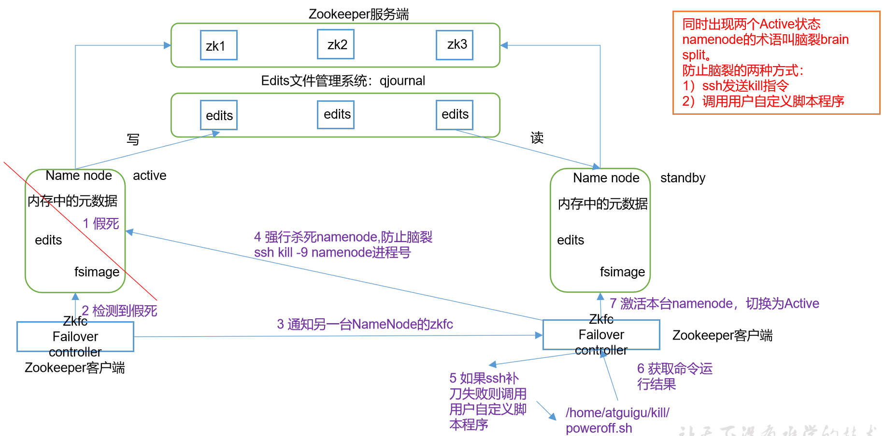
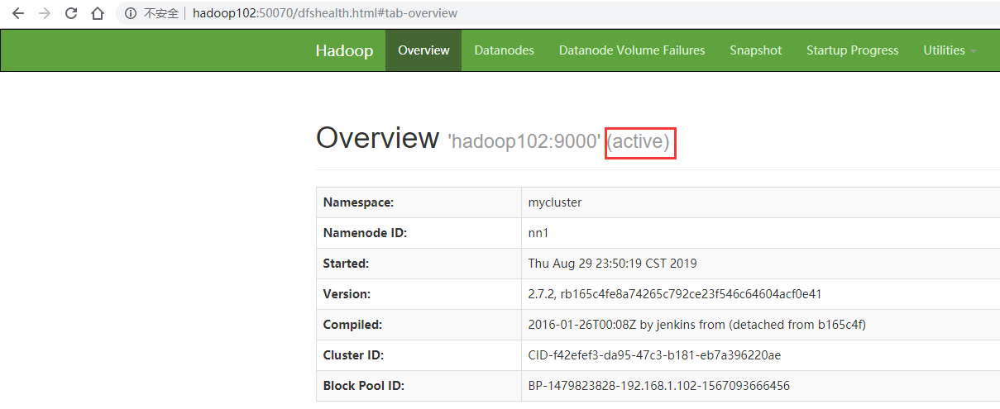
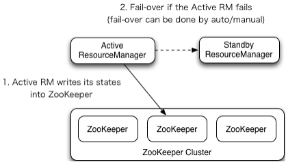

# 概述

- HA
  - High Available
  - 高可用（7*24小时不中断服务）
- 实现高可用最关键的策略是消除单点故障
- HA严格来说应该分成各个组件的HA机制
  - HDFS-HA
  - YARN-HA

- Hadoop2.0之前，在HDFS集群中NameNode存在单点故障

  - SPOF

    

# HDFS-HA

- NameNode节点主要在以下两个方面影响HDFS集群
  - 机器发生意外
    - 如宕机，集群将无法使用，直到管理员重启
  - 机器需要升级
    - 包括软件、硬件升级，此时集群也将无法使用

- HDFS - HA功能配置
  - Active
    - NameNode节点
  - Standby
    - NameNode节点
  - 实现在集群中对NameNode的热备来解决上述问题
  - 如果Active出现故障
    - 将NameNode切换到Standby

- 工作机制
  - 通过双NameNode消除单点故障


## 工作要点

- 元数据管理方式需要改变

  - 内存中各自保存一份元数据

  - Edits日志只有Active状态的NameNode节点可以做写操作

  - 两个NameNode都可以读取Edits

  - 共享的Edits放在一个共享存储中管理

    - QJM和NFS两个主流实现

      

- Active，StandBy，2个NN，脑裂，Split Brain
- 2个NN出现数据同步的问题
  - 2份元数据
  - 解决
    - 2个NN共享一份元数据
      - NFS
        - 基于Linux系统的文件共享
        - 不可靠
      - QJM
        - 高可靠存储数据
        - 3个JournalNode存储元数据
          - 轻量级
          - 可以与DataNode，Yarn，NameNode可以混合安装在一台机器
        - DataNode向这三个节点存储数据

- 需要一个状态管理功能模块
  - 实现zkfailover
    - 常驻在每一个namenode所在的节点
    - 每一个zkfailover负责监控自己所在NameNode节点
    - 利用zk进行状态标识
    - 当需要进行状态切换时，由zkfailover来负责切换，切换时需要防止brain-split现象的发生。

- 必须保证两个NameNode之间能够ssh无密码登录

- ==隔离（Fence），即同一时刻仅仅有一个NameNode对外提供服务==


## 自动故障转移工作机制

- 手动故障转移
  - `hdfs haadmin -failover`
  - 现役NameNode失效，系统不会自动从现役NameNode转移到待机NameNode

- 自动故障转移
  - 新增组件
    - ZooKeeper
    - ZKFailoverController（ZKFC）进程


### ZooKeeper

- 维护少量协调数据
- 通知客户端这些数据的改变和监视客户端故障的高可用服务
- HA的自动故障转移依赖于ZooKeeper的以下功能


#### 故障检测

- 集群中的每个NameNode在ZooKeeper中维护了一个持久会话
- 如果机器崩溃，ZooKeeper中的会话将终止，ZooKeeper通知另一个NameNode需要触发故障转移。


#### 现役NameNode选择

- ZooKeeper提供了一个简单的机制用于唯一的选择一个节点为active状态
- 如果目前现役NameNode崩溃，另一个节点可从ZooKeeper获得特殊的**排外锁**以表明它应该成为现役NameNode。

- ZKFC是ZooKeeper的客户端
  - 监视和管理NameNode的状态
  - ==每个运行NameNode的主机也运行了一个ZKFC进程==
  - ZKFC负责
    - 健康监测
      - ZKFC使用一个健康检查命令定期地ping与之在相同主机的NameNode
      - 只要该NameNode及时地回复健康状态，ZKFC认为该节点是健康的
      - 如果该节点崩溃，冻结或进入不健康状态，健康监测器标识该节点为非健康的
    - ZooKeeper会话管理
      - 本地NameNode是健康的，ZKFC保持一个在ZooKeeper中打开的会话
      - 若本地NameNode处于active状态，ZKFC也保持一个临时节点，特殊的znode锁
        - 该锁使用了ZooKeeper对==短暂节点==的支持
        - 如果会话终止，锁节点将自动删除
    - 基于ZooKeeper的选择
      - 如果本地NameNode是健康的，且ZKFC发现没有其它的节点当前持有znode锁，它将为自己获取该锁。
      - 如果成功获取锁
        - 赢得了选择
        - 负责运行故障转移进程以使它的本地NameNode为Active
        - 故障转移进程与前面描述的手动故障转移相似
          - 首先如果必要保护之前的现役NameNode，然后本地NameNode转换为Active状态





- 注意

  - 开启一个ZKFC进程的含义
    - 非侵入式，对NameNode客户端没有影响
  - ZKFC与ZK进行交互，而NameNode与ZK不进行通信操作，ZKFC与NameNode进行通信判断是否存活

  - 通知另一台NameNode的ZKFC原理
    - 在ZK中去除临时节点，删除**排外锁**
    - 另一台检测到ZK的没有排外锁，说明当前NameNode节点假死
  - 如果是NameNode网络故障，或者宕机，那么需要**补充自定义脚本**
    - 如果没有自定义脚本，那么在NameNode宕机后
      - 只有kill 命令，可能会因为网络故障发送失败
      - 造成一直没有回应，导致2个NameNode都不会启动，不会有active切换
    - 一般添加电源关闭脚本，防止脑裂的发生


## 集群配置


### 环境准备

- 修改IP

- 修改主机名及主机名和IP地址的映射

- 关闭防火墙

- ssh免密登录
- 安装JDK，配置环境变量等


### 集群规划

| hadoop102   | hadoop103       | hadoop104   |
| ----------- | --------------- | ----------- |
| NameNode    | NameNode        |             |
| JournalNode | JournalNode     | JournalNode |
| DataNode    | DataNode        | DataNode    |
| ZK          | ZK              | ZK          |
|             | ResourceManager |             |
| NodeManager | NodeManager     | NodeManager |


### 配置Zookeeper集群


#### 集群规划

- 在hadoop102、hadoop103和hadoop104三个节点上部署Zookeeper


#### 解压安装

- 解压Zookeeper安装包到/opt/module/目录下

```bash
[ttshe@hadoop102 software]$ tar -zvxf zookeeper-3.4.5.tar.gz -C /opt/module/
```

- 在/opt/module/zookeeper-3.4.5/这个目录下创建zkData

```bash
[ttshe@hadoop102 zookeeper-3.4.5]$ mkdir -p zkData
```

- 拷贝/opt/module/zookeeper-3.4.5/conf这个目录下的zoo_sample.cfg为zoo.cfg

```bash
[ttshe@hadoop102 conf]$ cp zoo_sample.cfg zoo.cfg
```


#### 修改zoo.cfg

- 修改数据存放目录

```bash
dataDir=/opt/module/zookeeper-3.4.5/zkData
```

- 增加集群配置

```bash
#######################cluster##########################
server.2=hadoop102:2888:3888
server.3=hadoop103:2888:3888
server.4=hadoop104:2888:3888
```


#### 配置myid

- 在dataDir下创建一个myid文件，分别在三个服务器节点上配置2,3,4数字
- 添加myid文件，注意一定要在linux里面创建，在notepad++里面很可能乱码

```bash
[ttshe@hadoop102 zkData]$ cat myid 
2
```


#### 同步到其他服务器

```bash
[ttshe@hadoop102 module]$ xsync zookeeper-3.4.5/
```

- 注意修改myid文件


#### 配置参数解析

- Server.A=B:C:D。
  - A
    - 数字
    - 表示是第几号服务器
    - 数字与myId中对应
  - B
    - IP地址
    - 表示ZK节点所在的服务器
  - C
    - 端口
    - ZK服务器与集群中的Leader服务器交换信息使用
  - D
    - 端口
    - 当集群中Leader服务器宕机时，执行选举通信使用


#### 集群操作

- 分别启动ZK

```bash
[ttshe@hadoop102 zookeeper-3.4.5]$ bin/zkServer.sh start
JMX enabled by default
Using config: /opt/module/zookeeper-3.4.5/bin/../conf/zoo.cfg
Starting zookeeper ... STARTED

[ttshe@hadoop103 zookeeper-3.4.5]$ bin/zkServer.sh start
[ttshe@hadoop104 zookeeper-3.4.5]$ bin/zkServer.sh start
```

- 查看状态

```bash
[ttshe@hadoop103 zookeeper-3.4.5]$ bin/zkServer.sh status
JMX enabled by default
Using config: /opt/module/zookeeper-3.4.5/bin/../conf/zoo.cfg
Mode: leader

[ttshe@hadoop102 zookeeper-3.4.5]$ bin/zkServer.sh status
JMX enabled by default
Using config: /opt/module/zookeeper-3.4.5/bin/../conf/zoo.cfg
Mode: follower

[ttshe@hadoop104 zookeeper-3.4.5]$ bin/zkServer.sh status
JMX enabled by default
Using config: /opt/module/zookeeper-3.4.5/bin/../conf/zoo.cfg
Mode: follower
```


### 配置HDFS-HA集群

- 官方地址：<http://hadoop.apache.org/>

- 在opt目录下创建一个ha文件夹

```bash
mkdir ha
```

- 将/opt/module/下的 hadoop-2.7.2拷贝到/opt/ha目录下

```bash
[ttshe@hadoop102 module]$ cp -r hadoop-2.7.2/ /opt/ha/
```

- 配置hadoop-env.sh

```bash
[ttshe@hadoop102 hadoop]$ pwd
/opt/ha/hadoop-2.7.2/etc/hadoop
# 配置JDK
export JAVA_HOME=/opt/module/jdk1.8.0_144
```


#### 配置core-site.xml

```xml
<configuration>
	<!-- 把两个NameNode的地址组装成一个集群mycluster -->
    <property>
        <name>fs.defaultFS</name>
        <value>hdfs://mycluster</value>
    </property>
    <!-- 指定hadoop运行时产生文件的存储目录 -->
    <property>
        <name>hadoop.tmp.dir</name>
        <value>/opt/ha/hadoop-2.7.2/data/tmp</value>
    </property>
</configuration>
```


#### 配置hdfs-site.xml

- 需要输入`set paste` 确保格式后粘贴

```xml
<configuration>
    <!-- 完全分布式集群名称 -->
    <property>
        <name>dfs.nameservices</name>
        <value>mycluster</value>
    </property>

    <!-- 集群中NameNode节点都有哪些 -->
    <property>
        <name>dfs.ha.namenodes.mycluster</name>
        <value>nn1,nn2</value>
    </property>

    <!-- nn1的RPC通信地址 -->
    <property>
        <name>dfs.namenode.rpc-address.mycluster.nn1</name>
        <value>hadoop102:9000</value>
    </property>

    <!-- nn2的RPC通信地址 -->
    <property>
        <name>dfs.namenode.rpc-address.mycluster.nn2</name>
        <value>hadoop103:9000</value>
    </property>

    <!-- nn1的http通信地址 -->
    <property>
        <name>dfs.namenode.http-address.mycluster.nn1</name>
        <value>hadoop102:50070</value>
    </property>

    <!-- nn2的http通信地址 -->
    <property>
        <name>dfs.namenode.http-address.mycluster.nn2</name>
        <value>hadoop103:50070</value>
    </property>

    <!-- 指定NameNode元数据在JournalNode上的存放位置 -->
    <property>
        <name>dfs.namenode.shared.edits.dir</name>		         	
    <value>qjournal://hadoop102:8485;hadoop103:8485;hadoop104:8485/mycluster</value>
    </property>

    <!-- 配置隔离机制，即同一时刻只能有一台服务器对外响应 -->
    <property>
        <name>dfs.ha.fencing.methods</name>
        <value>sshfence</value>
    </property>

    <!-- 使用隔离机制时需要ssh无秘钥登录-->
    <property>
        <name>dfs.ha.fencing.ssh.private-key-files</name>
        <value>/home/ttshe/.ssh/id_rsa</value>
    </property>

    <!-- 声明journalnode服务器存储目录-->
    <property>
        <name>dfs.journalnode.edits.dir</name>
        <value>/opt/ha/hadoop-2.7.2/data/jn</value>
    </property>

    <!-- 关闭权限检查-->
    <property>
        <name>dfs.permissions.enable</name>
        <value>false</value>
    </property>

    <!-- 访问代理类：client，mycluster，active配置失败自动切换实现方式-->
    <property>
        <name>dfs.client.failover.proxy.provider.mycluster</name>     <value>org.apache.hadoop.hdfs.server.namenode.ha.ConfiguredFailoverProxyProvider</value>
    </property>
</configuration>
```

- 拷贝配置好的hadoop环境到其他节点
  - 注意其他主机上需要建立ha目录，以及对应的权限

```bash
[ttshe@hadoop102 opt]$ xsync ha/
```


## 启动集群

 

### 启动JournalNode

- 在各个JournalNode节点上，输入以下命令启动journalnode服务

```bash
[ttshe@hadoop102 hadoop-2.7.2]$ sbin/hadoop-daemon.sh start journalnode
[ttshe@hadoop103 hadoop-2.7.2]$ sbin/hadoop-daemon.sh start journalnode
[ttshe@hadoop104 hadoop-2.7.2]$ sbin/hadoop-daemon.sh start journalnode
```

- 查看jps是否启动

```bash
[ttshe@hadoop102 hadoop-2.7.2]$ jps
76816 QuorumPeerMain
79795 JournalNode
79861 Jps
```


### 启动NameNode1

- 在[nn1]上，对其进行格式化，并启动

```bash
[ttshe@hadoop102 hadoop-2.7.2]$ rm -rf data/ logs/
[ttshe@hadoop102 hadoop-2.7.2]$ bin/hdfs namenode -format
[ttshe@hadoop102 hadoop-2.7.2]$ sbin/hadoop-daemon.sh start namenode
```


### 同步NN1的元数据

- 在[nn2]上，同步nn1的元数据信息

```bash
[ttshe@hadoop103 hadoop-2.7.2]$ bin/hdfs namenode -bootstrapStandby
```


### 启动NameNode2

```bash
[ttshe@hadoop103 hadoop-2.7.2]$ sbin/hadoop-daemon.sh start namenode
```


### 查看页面

- 查看NameNode1的页面 http://hadoop102:50070/dfshealth.html#tab-overview

 


- 查看NameNode2的页面http://hadoop103:50070/dfshealth.html#tab-overview
  - 也是standBy


### 启动DataNode

-  在[nn1]上，启动所有datanode

```bash
[ttshe@hadoop102 hadoop-2.7.2]$ sbin/hadoop-daemon.sh start datanode
```


### 将NameNode1切换Active

- 将[nn1]切换为Active

```bash
[ttshe@hadoop102 hadoop-2.7.2]$ bin/hdfs haadmin -transitionToActive nn1
```

- 查看是否是Active

```bash
[ttshe@hadoop102 hadoop-2.7.2]$ bin/hdfs haadmin -getServiceState nn1
active
[ttshe@hadoop102 hadoop-2.7.2]$ bin/hdfs haadmin -getServiceState nn2
standby
```

- 访问页面

 

### 注意

- 此时还不具有自动故障转移
- 只是配置了集群模式，因此需要手动触发Active状态


## 配置自动故障转移


### hdfs-site.xml

- 增加如下配置

```xml
<property>
	<name>dfs.ha.automatic-failover.enabled</name>
	<value>true</value>
</property>
```


### core-site.xml

- 增加如下配置

```xml
<property>
	<name>ha.zookeeper.quorum</name>
	<value>hadoop102:2181,hadoop103:2181,hadoop104:2181</value>
</property>
```


- 注意：进行分发配置给其他节点

```bash
[ttshe@hadoop102 etc]$ xsync hadoop/
```


### 启动配置


#### 关闭所有HDFS服务

```bash
[ttshe@hadoop102 hadoop-2.7.2]$ sbin/stop-dfs.sh
Stopping namenodes on [hadoop102 hadoop103]
hadoop102: stopping namenode
hadoop103: stopping namenode
hadoop102: stopping datanode
hadoop103: no datanode to stop
hadoop104: no datanode to stop
Stopping journal nodes [hadoop102 hadoop103 hadoop104]
hadoop103: stopping journalnode
hadoop102: stopping journalnode
hadoop104: stopping journalnode
Stopping ZK Failover Controllers on NN hosts [hadoop102 hadoop103]
hadoop103: no zkfc to stop
hadoop102: no zkfc to stop
```


#### 启动Zookeeper集群

- 如果已经启动则不需要再启动

```bash
[ttshe@hadoop102 zookeeper-3.4.5]$ bin/zkServer.sh start
[ttshe@hadoop103 zookeeper-3.4.5]$ bin/zkServer.sh start
[ttshe@hadoop104 zookeeper-3.4.5]$ bin/zkServer.sh start
```


#### 初始化HA在Zookeeper中状态

```bash
[ttshe@hadoop102 hadoop-2.7.2]$ bin/hdfs zkfc -formatZK
```

- 此时观察ZK
  - 创建了一个hadoop-ha的持久化节点

```bash
[zk: localhost:2181(CONNECTED) 5] ls /
[zookeeper, hadoop-ha]
[zk: localhost:2181(CONNECTED) 7] ls /hadoop-ha/mycluster
[]
[zk: localhost:2181(CONNECTED) 8] get /hadoop-ha/mycluster

cZxid = 0x100000009
ctime = Fri Aug 30 00:11:13 CST 2019
mZxid = 0x100000009
mtime = Fri Aug 30 00:11:13 CST 2019
pZxid = 0x100000009
cversion = 0
dataVersion = 0
aclVersion = 0
ephemeralOwner = 0x0
dataLength = 0
numChildren = 0
```


#### 启动HDFS服务

```bash
[ttshe@hadoop102 hadoop-2.7.2]$ sbin/start-dfs.sh
Starting namenodes on [hadoop102 hadoop103]
hadoop102: starting namenode, logging to /opt/ha/hadoop-2.7.2/logs/hadoop-ttshe-namenode-hadoop102.out
hadoop103: starting namenode, logging to /opt/ha/hadoop-2.7.2/logs/hadoop-ttshe-namenode-hadoop103.out
hadoop103: starting datanode, logging to /opt/ha/hadoop-2.7.2/logs/hadoop-ttshe-datanode-hadoop103.out
hadoop102: starting datanode, logging to /opt/ha/hadoop-2.7.2/logs/hadoop-ttshe-datanode-hadoop102.out
hadoop104: starting datanode, logging to /opt/ha/hadoop-2.7.2/logs/hadoop-ttshe-datanode-hadoop104.out
Starting journal nodes [hadoop102 hadoop103 hadoop104]
hadoop103: starting journalnode, logging to /opt/ha/hadoop-2.7.2/logs/hadoop-ttshe-journalnode-hadoop103.out
hadoop104: starting journalnode, logging to /opt/ha/hadoop-2.7.2/logs/hadoop-ttshe-journalnode-hadoop104.out
hadoop102: starting journalnode, logging to /opt/ha/hadoop-2.7.2/logs/hadoop-ttshe-journalnode-hadoop102.out
Starting ZK Failover Controllers on NN hosts [hadoop102 hadoop103]
hadoop103: starting zkfc, logging to /opt/ha/hadoop-2.7.2/logs/hadoop-ttshe-zkfc-hadoop103.out
hadoop102: starting zkfc, logging to /opt/ha/hadoop-2.7.2/logs/hadoop-ttshe-zkfc-hadoop102.out
```


#### 启动DFSZK

- 在各个NameNode节点上启动DFSZK Failover Controller，先在哪台机器启动，哪个机器的NameNode就是Active NameNode
  - 在start-dfs.sh时，已经启动了

```bash
[ttshe@hadoop102 hadoop-2.7.2]$ sbin/hadoop-daemon.sh start zkfc
```


#### 观察ZK

- 在成功启动NameNode1作为Active节点后
  - 创建了一个**临时节点**作为**排外锁**
    - 含有hadoop102的信息
    - 当NameNode1宕机后，该锁释放，节点删除
    - Standby节点获取排外锁，给NameNode1发送ssh指令，删除NameNode进程
  - 创建一个持久节点
    - 包含hadoop102的信息
    - Standby收到NameNode1删除进程成功消息后，对持久节点进行修改
      - 如果收不到消息，那么Standby就不会成为Active状态节点

```bash
[zk: localhost:2181(CONNECTED) 12] ls /hadoop-ha/mycluster
[ActiveBreadCrumb, ActiveStandbyElectorLock]
[zk: localhost:2181(CONNECTED) 14] get /hadoop-ha/mycluster/ActiveStandbyElectorLock

	myclusternn1	hadoop102 �F(�>
cZxid = 0x10000000c
ctime = Fri Aug 30 00:13:52 CST 2019
mZxid = 0x10000000c
mtime = Fri Aug 30 00:13:52 CST 2019
pZxid = 0x10000000c
cversion = 0
dataVersion = 0
aclVersion = 0
ephemeralOwner = 0x46cddc566400003
dataLength = 33
numChildren = 0

[zk: localhost:2181(CONNECTED) 15] get /hadoop-ha/mycluster/ActiveBreadCrumb        

	myclusternn1	hadoop102 �F(�>
cZxid = 0x10000000d
ctime = Fri Aug 30 00:13:52 CST 2019
mZxid = 0x10000000d
mtime = Fri Aug 30 00:13:52 CST 2019
pZxid = 0x10000000d
cversion = 0
dataVersion = 0
aclVersion = 0
ephemeralOwner = 0x0
dataLength = 33
numChildren = 0
```


### 验证


#### 将Active NameNode 进程kill

```bash
kill -9 nameNode的pid
```

- 观察ZK
  - 排他锁已经释放

```bash
[zk: localhost:2181(CONNECTED) 19] ls /hadoop-ha/mycluster
[ActiveBreadCrumb]
```


#### 将Active NameNode机器断开网络

```bash
service network stop
```

- StandBy没有转换为Active状态
- 隔离机制没有生效
- 需要添加自定义脚本，关闭原Active节点服务器


# YARN-HA

官方文档：

<http://hadoop.apache.org/docs/r2.7.2/hadoop-yarn/hadoop-yarn-site/ResourceManagerHA.html>


## 工作机制

- ResourceManager集成了ZK客户端





## 配置集群

- 环境准备
  - 修改IP
  - 修改主机名及主机名和IP地址的映射
  - 关闭防火墙
  - ssh免密登录
  - 安装JDK，配置环境变量等
  - 配置Zookeeper集群


### 规划

| hadoop102       | hadoop103       | hadoop104   |
| --------------- | --------------- | ----------- |
| NameNode        | NameNode        |             |
| JournalNode     | JournalNode     | JournalNode |
| DataNode        | DataNode        | DataNode    |
| ZK              | ZK              | ZK          |
| ResourceManager | ResourceManager |             |
| NodeManager     | NodeManager     | NodeManager |


### 配置


#### yarn-site.xml

```xml
<configuration>

    <property>
        <name>yarn.nodemanager.aux-services</name>
        <value>mapreduce_shuffle</value>
    </property>

    <!--启用resourcemanager ha-->
    <property>
        <name>yarn.resourcemanager.ha.enabled</name>
        <value>true</value>
    </property>
 
    <!--声明两台resourcemanager的地址-->
    <property>
        <name>yarn.resourcemanager.cluster-id</name>
        <value>cluster-yarn1</value>
    </property>

    <property>
        <name>yarn.resourcemanager.ha.rm-ids</name>
        <value>rm1,rm2</value>
    </property>

    <property>
        <name>yarn.resourcemanager.hostname.rm1</name>
        <value>hadoop102</value>
    </property>

    <property>
        <name>yarn.resourcemanager.hostname.rm2</name>
        <value>hadoop103</value>
    </property>
 
    <!--指定zookeeper集群的地址--> 
    <property>
        <name>yarn.resourcemanager.zk-address</name>
        <value>hadoop102:2181,hadoop103:2181,hadoop104:2181</value>
    </property>

    <!--启用自动恢复--> 
    <property>
        <name>yarn.resourcemanager.recovery.enabled</name>
        <value>true</value>
    </property>
 
    <!--指定resourcemanager的状态信息存储在zookeeper集群--> 
    <property>
        <name>yarn.resourcemanager.store.class</name>     <value>org.apache.hadoop.yarn.server.resourcemanager.recovery.ZKRMStateStore</value>
</property>

</configuration>
```

- 同步更新到其他节点

```bash
[ttshe@hadoop102 hadoop]$ xsync yarn-site.xml
```


## 启动


### 启动HDFS

```bash
[ttshe@hadoop102 hadoop-2.7.2]$ sbin/start-dfs.sh
Starting namenodes on [hadoop102 hadoop103]
hadoop103: starting namenode, logging to /opt/ha/hadoop-2.7.2/logs/hadoop-ttshe-namenode-hadoop103.out
hadoop102: starting namenode, logging to /opt/ha/hadoop-2.7.2/logs/hadoop-ttshe-namenode-hadoop102.out
hadoop103: starting datanode, logging to /opt/ha/hadoop-2.7.2/logs/hadoop-ttshe-datanode-hadoop103.out
hadoop104: starting datanode, logging to /opt/ha/hadoop-2.7.2/logs/hadoop-ttshe-datanode-hadoop104.out
hadoop102: starting datanode, logging to /opt/ha/hadoop-2.7.2/logs/hadoop-ttshe-datanode-hadoop102.out
Starting journal nodes [hadoop102 hadoop103 hadoop104]
hadoop103: starting journalnode, logging to /opt/ha/hadoop-2.7.2/logs/hadoop-ttshe-journalnode-hadoop103.out
hadoop104: starting journalnode, logging to /opt/ha/hadoop-2.7.2/logs/hadoop-ttshe-journalnode-hadoop104.out
hadoop102: starting journalnode, logging to /opt/ha/hadoop-2.7.2/logs/hadoop-ttshe-journalnode-hadoop102.out
Starting ZK Failover Controllers on NN hosts [hadoop102 hadoop103]
hadoop103: starting zkfc, logging to /opt/ha/hadoop-2.7.2/logs/hadoop-ttshe-zkfc-hadoop103.out
hadoop102: starting zkfc, logging to /opt/ha/hadoop-2.7.2/logs/hadoop-ttshe-zkfc-hadoop102.out
```


### 启动YARN

- 在hadoop102中执行

```bash
[ttshe@hadoop102 hadoop-2.7.2]$ sbin/start-yarn.sh
starting yarn daemons
starting resourcemanager, logging to /opt/ha/hadoop-2.7.2/logs/yarn-ttshe-resourcemanager-hadoop102.out
hadoop102: starting nodemanager, logging to /opt/ha/hadoop-2.7.2/logs/yarn-ttshe-nodemanager-hadoop102.out
hadoop103: starting nodemanager, logging to /opt/ha/hadoop-2.7.2/logs/yarn-ttshe-nodemanager-hadoop103.out
hadoop104: starting nodemanager, logging to /opt/ha/hadoop-2.7.2/logs/yarn-ttshe-nodemanager-hadoop104.out
```

- 在hadoop103中执行

```bash
[ttshe@hadoop103 hadoop-2.7.2]$ sbin/yarn-daemon.sh start resourcemanager
starting resourcemanager, logging to /opt/ha/hadoop-2.7.2/logs/yarn-ttshe-resourcemanager-hadoop103.out
```

- 查看服务状态

```bash
[ttshe@hadoop102 hadoop-2.7.2]$ bin/yarn rmadmin -getServiceState rm1
active
[ttshe@hadoop102 hadoop-2.7.2]$ bin/yarn rmadmin -getServiceState rm2
standby
```

- 访问页面 http://hadoop102:8088/cluster/nodes
  - 当访问hadoop103的时候，会自动跳转到102上
  - 访问StandBy节点会自动跳转到Active节点上


# HDFS Federation

> Federation 联邦


## NameNode架构的局限性

- Namespace（命名空间）的限制
  - 在内存中存储所有的元数据
    - metadata
    - 150byte
  - 单个NameNode所能存储的对象（文件+块）数目受到NameNode所在JVM的heap size的限制
  - 50G的heap能够存储20亿（200million）个对象
    - 20亿个对象支持4000个DataNode，12PB的存储
      - 假设文件平均大小为40MB
    - 随着数据的飞速增长，存储的需求也随之增长
      - 单个DataNode从4T增长到36T
      - 集群的尺寸增长到8000个DataNode
      - 存储的需求从12PB增长到大于100PB。
- 隔离问题
  - HDFS仅有一个NameNode，无法隔离各个程序
  - HDFS上的一个实验程序就很有可能影响整个HDFS上运行的程序。

- 性能的瓶颈
  - 单个NameNode的HDFS架构
  - 整个HDFS文件系统的吞吐量受限于单个NameNode的吞吐量


## 架构设计

 

- 能不能有多个NameNode

| NameNode | NameNode | NameNode          |
| -------- | -------- | ----------------- |
| 元数据   | 元数据   | 元数据            |
| Log      | machine  | 电商数据/话单数据 |


## 应用思考

- 不同应用使用不同NameNode进行数据管理
  - 图片业务
  - 爬虫业务
  - 日志审计业务

- Hadoop生态系统中，不同的框架使用不同的NameNode进行管理NameSpace
  - 隔离性