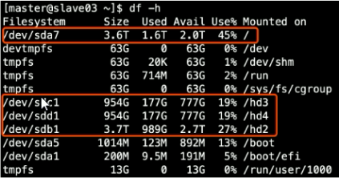
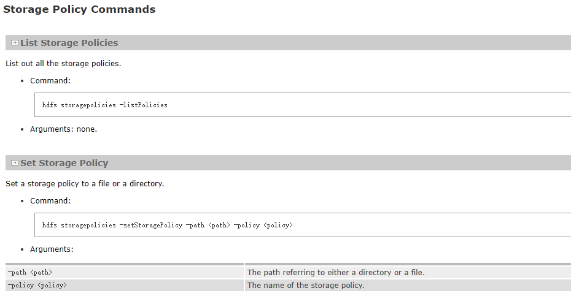

## hdfs 分层存储

- 纵向扩展：分层存储

  - `spark-shell --master yarn` 执行命令后，查看hadoop102:4040页面，执行sc.textFile(path).count
    - 查看页面中的input大小，说明瓶颈最后在输入的数据的IO
  - 加入SSD
  - 将热点数据放入到SSD，普通的数据放在机械硬盘上
  - 那些是热点数据
    - 近半年的数据放在SSD上
    - 数仓的所有数据
  - 普通的数据
    - 其他的数据，半年以上的数据
  - 分层存储
    - hadoop2.6以后出现，存储策略如下
    - hot：所有副本存储在磁盘上
    - cold：ARCHIVE，将数据达成har包，存储在普通机器的磁盘上作为备份使用
    - warm：一些副本存储在磁盘上，一些副本以ARCHIVE的方式存储在磁盘上
    - All_SSD：所有副本都在SSD上
    - One_SSD：一个副本在SSD上，其他存储在磁盘上
    - Lazy_Persist：副本第一时间存储在RAM_DISK（内存）上，然后在懒持久化到DISK

  


| **Policy** **ID** | **Policy** **Name** | **Block Placement** **(n  replicas)** | **Fallback storages** **for creation** | **Fallback storages** **for replication** |
| :---------------- | :------------------ | :------------------------------------ | :------------------------------------- | :---------------------------------------- |
| 15                | Lazy_Persist        | RAM_DISK: 1, DISK: *n*-1              | DISK                                   | DISK                                      |
| 12                | All_SSD             | SSD: n                                | DISK                                   | DISK                                      |
| 10                | One_SSD             | SSD: 1, DISK: *n*-1                   | SSD, DISK                              | SSD, DISK                                 |
| 7                 | Hot (default)       | DISK: n                               | <none>                                 | ARCHIVE                                   |
| 5                 | Warm                | DISK: 1, ARCHIVE: *n*-1               | ARCHIVE, DISK                          | ARCHIVE, DISK                             |
| 2                 | Cold                | ARCHIVE: n                            | <none>                                 | <none>                                    |
| 1                 | Provided            | PROVIDED: 1, DISK: *n*-1              | PROVIDED, DISK                         | PROVIDED, DISK                            |


### 配置

hdfs-default.xml

- dfs.datanode.data.dir 配置hdfs存储的目录
  - 默认值：file://${hadoop.tmp.dir}/dfs/data
  - 示例：ssd，disk
    - [SSD]/opt/hfds/data
    - [DISK]/var/hdfs/data
  - 按图配置有，hd3，hd4是ssd
     
  - [SSD]/hd3/hdfs/data,[SSD]/hd4/hdfs/data,[DISK]/hadoop/data,[DISK]/hd2/hdfs/data
  - 注意：集群配置的每台机器最好目录一致，否则要单独配置
  - 配置完重启服务


### 设置策略



```bash
hdfs storagepolicies -setStoragePolicy -path <path> -policy <policy>

# 示例1，path中含有数据 path 指的是hdfs策略
hdfs storagepolicies -setStoragePolicy -path /user/hive/warehouse/ -policy One_SSD

# 执行数据转移命令后，才会将数据转移
hdfs mover -p /user/hive/warehouse

# 示例2 path中没有数，后期往目录中插入数据,不需要执行转移
hdfs storagepolicies -setStoragePolicy -path /user/hive/warehouse/new -policy All_SSD

# 查询策略信息
hdfs storagepolicies -listPolicies

# 取消策略,执行后注意要执行转移 hadoop2.9版本以上才有
hdfs storagepolicies -unsetStoreagePolicy -path <path>

# 获取路径策略
hdfs storagepolicies -getStoragePolicy -path <path>
```

