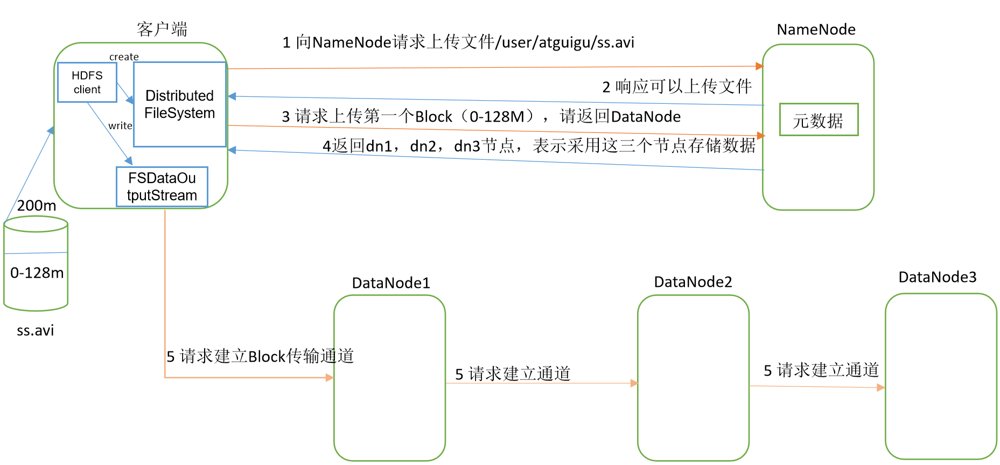
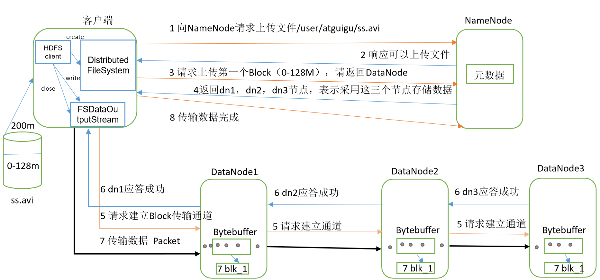
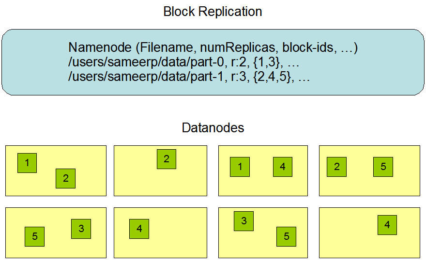
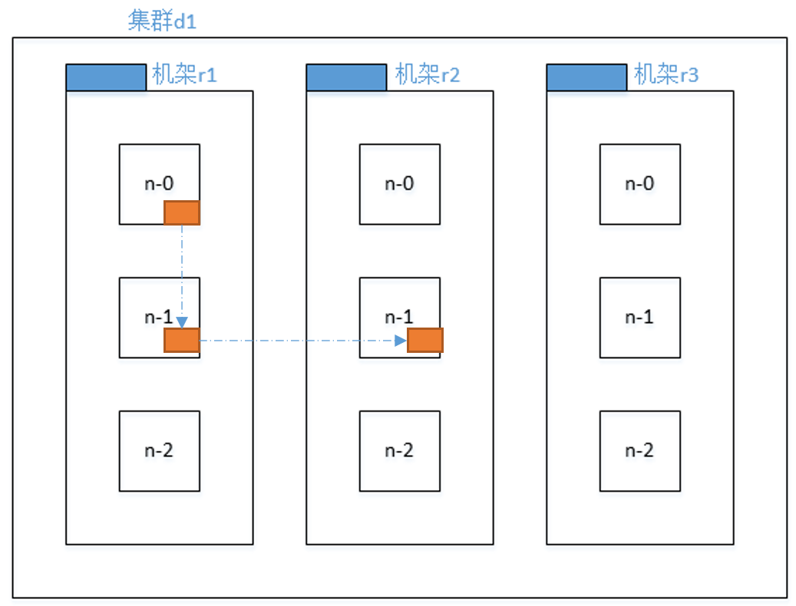
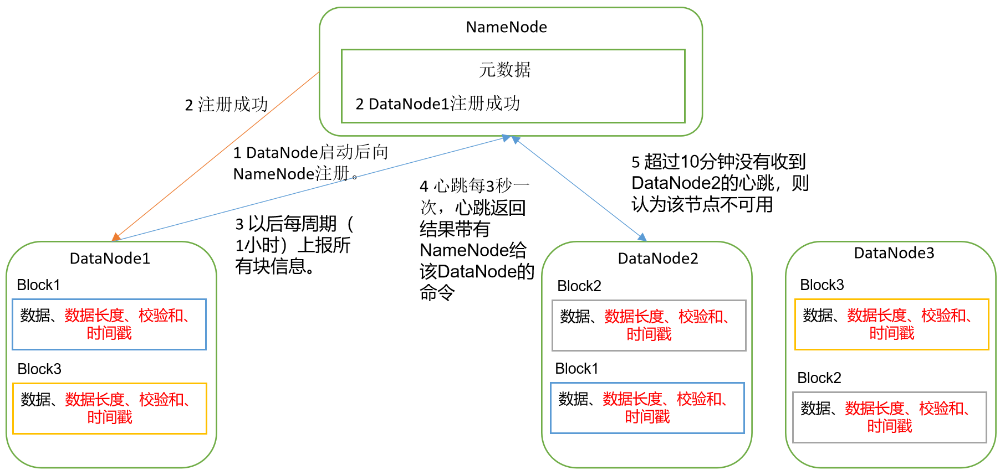

# 数据流（重点）


## 写数据流程




- 客户端通过Distributed File System 模块向NameNode 请求上传文件，NameNode检查文件是否存在，父目录是否存在
- NameNode返回是否可以上传
- 客户端请求第一个Block上传到哪几个DataNode服务器上
- NameNode返回3个DataNode节点，分别是dn1，dn2，dn3（通过计算距离和负载情况，返回合适的dn）
- 客户端通过FSDataOutputStream模块请求dn1上传数据，dn1收到数据会继续调用dn2，然后dn2调用dn3，将==通信管道==建立完成




- dn1，dn2，dn3逐级应答客户端，打通流的通道
- 客户端开始往dn1上传第一个Block（先存内存，从磁盘读取数据放到一个本地内存缓存），以Packet为单位（64byte），dn1收到一个Packet就会传给dn2，dn2传给dn3；==dn1每传一个Packet就会放一个应答队列等待应答==
  - Packet存储在每个dn的内存中（byteBuffer）然后将内存中的数据序列化到磁盘上（7 blk_1）
  - bytebuffer中的数据传递给下一个dn，下一个dn继续序列化到本地磁盘
  - 最后一个dn序列化Packet到本地之后，逐级发送返回结果报文，上一个节点删除byteBuffer内的Packet，然后再发送返回结果报文给上一个dn，从而逐级删除byteBuffer中的该Packet
- 当一个Block传输完成后，客户端再次请求NameNode上传第二个Block的DataNode服务器，重复上面3~7的步骤


### 网络拓扑-节点距离计算

在HDFS写数据过程中，NameNode会选择距离待上传数据最近距离的DataNode接收数据，如何计算最近距离？

- 节点距离：2个节点到达最近的==共同祖先==的距离总和


### 机架感知-副本节点的选择

如果数据有3个副本，那这3个副本存储在哪几个节点合适

参考：http://hadoop.apache.org/docs/r2.7.2/hadoop-project-dist/hadoop-hdfs/HdfsDesign.html#Data_Replication



```html
The placement of replicas is critical to HDFS reliability and performance. Optimizing replica placement distinguishes HDFS from most other distributed file systems. This is a feature that needs lots of tuning and experience. The purpose of a rack-aware replica placement policy is to improve data reliability, availability, and network bandwidth utilization. The current implementation for the replica placement policy is a first effort in this direction. The short-term goals of implementing this policy are to validate it on production systems, learn more about its behavior, and build a foundation to test and research more sophisticated policies.

Large HDFS instances run on a cluster of computers that commonly spread across many racks. Communication between two nodes in different racks has to go through switches. In most cases, network bandwidth between machines in the same rack is greater than network bandwidth between machines in different racks.

The NameNode determines the rack id each DataNode belongs to via the process outlined in Hadoop Rack Awareness. A simple but non-optimal policy is to place replicas on unique racks. This prevents losing data when an entire rack fails and allows use of bandwidth from multiple racks when reading data. This policy evenly distributes replicas in the cluster which makes it easy to balance load on component failure. However, this policy increases the cost of writes because a write needs to transfer blocks to multiple racks.

For the common case, when the replication factor is three, HDFS’s placement policy is to put one replica on one node in the local rack, another on a different node in the local rack, and the last on a different node in a different rack. This policy cuts the inter-rack write traffic which generally improves write performance. The chance of rack failure is far less than that of node failure; this policy does not impact data reliability and availability guarantees. However, it does reduce the aggregate network bandwidth used when reading data since a block is placed in only two unique racks rather than three. With this policy, the replicas of a file do not evenly distribute across the racks. One third of replicas are on one node, two thirds of replicas are on one rack, and the other third are evenly distributed across the remaining racks. This policy improves write performance without compromising data reliability or read performance.

The current, default replica placement policy described here is a work in progress.
```



- 第一个副本在Client所处于的节点上，如果在集群外，则随机选择一个
- 第二个副本和第一个副本位于相同机架，随机节点
- 第三个副本位于不同机架，不同节点

好处：

- 在同一个机架上上传第二个副本，由于在一个机架上，IO可靠性提升
- 机架的故障率小于节点的故障率，减少传输失败的几率
- 由于副本在不同的机架上的不同节点，提高了数据的可靠性，同时在可靠性不变的情况下，先进行同机架的拷贝，提升了写入性能。

其他：

- 原先版本在第二个副本上有差异，先在不同的机架的不同节点上传副本，然后在该机架上的不同节点上上传第三个副本，写入性能没有新版本的高。


## 读数据流程

​	

- 客户端通过Distributed File System 向 NameNode请求下载文件
- NameNode通过查询元数据找到文件所在的DataNode地址
- 挑选一台DataNode服务器读取数据（就近原则，然后随机）
- DataNode开始传输数据给客户端，从磁盘里面读取数据输入流，以Packet为单位进行校验
  - 读取数据不是并行读取，而是串行读取所有block
- 客户端以Packet为单位接收，先本地缓存，然后写入目标文件


## NameNode（重点）


### NN与 与 SecondaryNameNode的工作机制

思考：NameNode中的元数据是存储在哪里的？

首先，我们做个假设，如果存储在NameNode节点的磁盘中，因为经常需要进行随机访问，还有响应客户请求，必然是效率过低。因此，元数据需要存放在内存中。但如果只存在内存中，一旦断电，元数据丢失，整个集群就无法工作了。==因此**产生在磁盘中备份元数据的FsImage**==。

这样又会带来新的问题，当在内存中的元数据更新时，如果同时更新FsImage，就会导致效率过低，但如果不更新，就会发生一致性问题，一旦NameNode节点断电，就会产生数据丢失。==因此，引入Edits文件(只进行追加操作，效率很高)。**每当元数据有更新或者添加元数据时，修改内存中的元数据并追加到Edits中**==。这样，一旦NameNode节点断电，可以通过FsImage和Edits的合并，合成元数据。

但是，如果长时间添加数据到Edits中，会导致该文件数据过大，效率降低，而且一旦断电，恢复元数据需要的时间过长。因此，需要定期进行FsImage和Edits的合并，如果这个操作由NameNode节点完成，又会效率过低。==因此，引入一个新的节点SecondaryNamenode，**专门用于FsImage和Edits的合并**==


#### 第一阶段：NameNode启动

- 第一次启动NameNode格式化之后
  - 创建**FsImage**，NameNode内存中元数据序列化后形成的文件
  - 创建**Edits**，记录客户端更新元数据信息的每一步操作（通过Edits运算得出元数据）
  - 滚动Edits并生成一个空的edits.inprogress（**进行中**日志）
  - 然后加载Edits和FsImage到内存中
    - 此时NameNode内存持有最新的元数据信息，Client开始对NameNode发送元数据的增删改的请求，请求记录会先被记录到edits.inprogress中，
      - 注意：查询操作不会记录在Edits中，查询操作不会更改元数据信息
    - 如果此时NameNode挂掉，==重启后会从Edits中读取元数据信息==，然后NameNode会在内存中执行元数据的增删改操作
  - 如果不是第一次启动，直接加载**编辑日志**和**镜像文件**到内存
- 客户端对元数据发送增删改的请求
- NameNode记录操作日志，更新滚动日志
- NameNode在内存中对元数据进行增删改
  - 注意：先在编辑日志（edits.inprogress）中添加数据，然后再写入到内存中


#### 第二阶段：Secondary NameNode工作

- 当Edits中记录的操作越来越多，Edits文件会越来越大
- 导致NameNode在**加载Edits会很慢**，所以要对Edits和FsImage进行合并
  - 将Edits和FsImage加载到内存，安装Edits记录的操作执行，并生成一个新的FsImage

- Secondary NameNode询问NameNode是否需要CheckPoint

- NameNode直接在回复报文中返回是否检查结果

- 如果到了**CheckPoint**检查点，Secondary NameNode请求执行CheckPoint

  - 检查点
    - 一定时间到了
    - 日志达到条件，比如Edits中的数据写满了100万条记录，多少MB

- NameNode滚动正在写的Edits日志，并生成一个空的edits.inprogress

  - 滚动Edits的目的是给Edits打个标记，以后所有的操作都写入edits.inprogress

- NameNode将未合并的Edits和FsImage会拷贝到Secondary NameNode

- Secondary NameNode加载这2个文件到内存，并进行合并操作生成FsImage.chkpoint

- Secondary NameNode将该FsImage.chkpoint拷贝给NameNode

- NameNode重命名FsImage后替换原来的FsImage

  

### Fsimage和Edits

查看NameNode中存储的Fsimage和Edits信息

```shell
# 查看NameNode的存储情况
[ttshe@hadoop102 current]$ pwd
/opt/module/hadoop-2.7.2/data/tmp/dfs/name/current
# 查看该文件夹下的信息
[ttshe@hadoop102 current]$ ls
...
edits_0000000000000000575-0000000000000000576 # 编辑日志的历史信息
edits_0000000000000000577-0000000000000000578
edits_0000000000000000579-0000000000000000592
edits_0000000000000000593-0000000000000000608
edits_inprogress_0000000000000000609 # 当前的edits，当前的增删改的操作存储在这里
fsimage_0000000000000000592 # 上一个fsimage，用于回滚
fsimage_0000000000000000592.md5
fsimage_0000000000000000608 # 当前最新的fsimage
fsimage_0000000000000000608.md5
seen_txid # 指示当前的edits编号
VERSION
[ttshe@hadoop102 current]$ cat seen_txid 
609

# 查看Secondary NameNode存储情况
[ttshe@hadoop104 current]$ pwd
/opt/module/hadoop-2.7.2/data/tmp/dfs/namesecondary/current
[ttshe@hadoop104 current]$ ls
...
edits_0000000000000000575-0000000000000000576
edits_0000000000000000577-0000000000000000578
edits_0000000000000000579-0000000000000000592
edits_0000000000000000593-0000000000000000608
fsimage_0000000000000000592
fsimage_0000000000000000592.md5
fsimage_0000000000000000608
fsimage_0000000000000000608.md5
VERSION
# 可见是与NameNode相同，唯一不同的是NameNode有edits_inprogress_0000000000000000609
```

NameNode在格式化之后，启动hdfs，会在/opt/module/hadoop-2.7.2/data/tmp/dfs/name/current 目录中产生如下文件

```shell
fsimage_0000000000000000000
fsimage_0000000000000000000.md5
seen_txid
VERSION
```

- Fsimage文件：HDFS系统元数据的一个==永久性的检查点==，包含HDFS文件系统的所有目录和文件inode的序列化信息
- Edits文件：存放HDFS文件系统的所有更新操作的路径，文件系统客户端执行的所有写操作首先会被记录到Edits文件中
- seen_txid文件：保存一个数字，表示最新的edits的版本
- 每次NameNode==启动的时候==都会将Fsimage文件写入到内存，加载Edits里面的更新操作，保证内存中的元数据信息是最新的，同步的，可以看出NameNode启动的时候就将Fsimage和Edits进行了一次合并。

 

先进行预先操作，清空data ,log信息，然后格式化NameNode，重启HDFS，在HDFS中放入如下信息后，为接下来的例子做准备

```shell
[ttshe@hadoop102 hadoop-2.7.2]$ hadoop fs -mkdir -p /user/ttshe/
[ttshe@hadoop102 hadoop-2.7.2]$ hadoop fs -put /opt/module/hadoop-2.7.2/wcinput/wc.input /user/ttshe/wc.input
```


#### oiv查看Fsimage文件

Fsimage文件是序列化后的文件，需要使用特定的命令进行查看

基本语法

```shell
hdfs oiv -p 文件类型 -i镜像文件 -o 转换后文件输出路径
```

将指定的Fsimge输出到本地，并查看生成的XML文件

```xml
[ttshe@hadoop102 current]$ hdfs oiv -p XML -i fsimage_0000000000000000000 -o ./fsimage.xml
[ttshe@hadoop102 current]$ cat fsimage.xml 
<?xml version="1.0"?>
<fsimage>
    <NameSection>
        <genstampV1>1000</genstampV1>
        <genstampV2>1000</genstampV2>
        <genstampV1Limit>0</genstampV1Limit>
        <lastAllocatedBlockId>1073741824</lastAllocatedBlockId>
        <txid>0</txid>
    </NameSection>
    <INodeSection>
        <lastInodeId>16385</lastInodeId>
        <inode>
            <id>16385</id>
            <type>DIRECTORY</type>
            <name></name>
            <mtime>0</mtime>
            <permission>ttshe:supergroup:rwxr-xr-x</permission>
            <nsquota>9223372036854775807</nsquota>
            <dsquota>-1</dsquota>
        </inode>
    </INodeSection>
    <INodeReferenceSection></INodeReferenceSection>
    <SnapshotSection>
        <snapshotCounter>0</snapshotCounter>
    </SnapshotSection>
    <INodeDirectorySection></INodeDirectorySection>
    <FileUnderConstructionSection></FileUnderConstructionSection>
    <SnapshotDiffSection>
        <diff>
            <inodeid>16385</inodeid>
        </diff>
    </SnapshotDiffSection>
    <SecretManagerSection>
        <currentId>0</currentId>
        <tokenSequenceNumber>0</tokenSequenceNumber>
    </SecretManagerSection>
    <CacheManagerSection>
        <nextDirectiveId>1</nextDirectiveId>
    </CacheManagerSection>
</fsimage>
```

- 注意：Fsimage中==没有记录块所对应的DataNode==，原因是集群启动后，DataNode会上报数据块信息，并每隔一段时间再次上报。


#### oev查看Edits文件

基本语法

```shell
hdfs oev -p 文件类型 -i编辑日志 -o 转换后文件输出路径
```

将指定的Edits文件转换为XML进行输出

```xml
[ttshe@hadoop102 current]$ hdfs oev -p XML -i edits_inprogress_0000000000000000003 -o ./edits.xml
[ttshe@hadoop102 current]$ cat edits.xml 
<?xml version="1.0" encoding="UTF-8"?>
<EDITS>
  <EDITS_VERSION>-63</EDITS_VERSION>
  <RECORD>
    <OPCODE>OP_START_LOG_SEGMENT</OPCODE>
    <DATA>
      <TXID>3</TXID>
    </DATA>
  </RECORD>
  <RECORD>
    <OPCODE>OP_MKDIR</OPCODE> // 创建文件夹操作
    <DATA>
      <TXID>4</TXID>
      <LENGTH>0</LENGTH>
      <INODEID>16386</INODEID>
      <PATH>/user</PATH>
      <TIMESTAMP>1556849338353</TIMESTAMP>
      <PERMISSION_STATUS>
        <USERNAME>ttshe</USERNAME>
        <GROUPNAME>supergroup</GROUPNAME>
        <MODE>493</MODE>
      </PERMISSION_STATUS>
    </DATA>
  </RECORD>
  <RECORD>
    <OPCODE>OP_MKDIR</OPCODE>
    <DATA>
      <TXID>5</TXID>
      <LENGTH>0</LENGTH>
      <INODEID>16387</INODEID>
      <PATH>/user/ttshe</PATH>
      <TIMESTAMP>1556849338365</TIMESTAMP>
      <PERMISSION_STATUS>
        <USERNAME>ttshe</USERNAME>
        <GROUPNAME>supergroup</GROUPNAME>
        <MODE>493</MODE>
      </PERMISSION_STATUS>
    </DATA>
  </RECORD>
  <RECORD>
    <OPCODE>OP_ADD</OPCODE>
    <DATA>
      <TXID>6</TXID>
      <LENGTH>0</LENGTH>
      <INODEID>16388</INODEID>
        // 上传文件操作，不是直接上传，而是重命名一个文件，上传成功后再改名称
        <PATH>/user/ttshe/wc.input._COPYING_</PATH> 
      
        <REPLICATION>3</REPLICATION>
      <MTIME>1556849342139</MTIME>
      <ATIME>1556849342139</ATIME>
      <BLOCKSIZE>134217728</BLOCKSIZE> // 块的大小
      <CLIENT_NAME>DFSClient_NONMAPREDUCE_1805037964_1</CLIENT_NAME>
      <CLIENT_MACHINE>192.168.1.102</CLIENT_MACHINE>
      <OVERWRITE>true</OVERWRITE>
      <PERMISSION_STATUS>
        <USERNAME>ttshe</USERNAME>
        <GROUPNAME>supergroup</GROUPNAME>
        <MODE>420</MODE>
      </PERMISSION_STATUS>
      <RPC_CLIENTID>5e5cffd0-882c-4d25-8f8e-ec67532dd0cb</RPC_CLIENTID>
      <RPC_CALLID>3</RPC_CALLID>
    </DATA>
  </RECORD>
  <RECORD>
    <OPCODE>OP_ALLOCATE_BLOCK_ID</OPCODE>
    <DATA>
      <TXID>7</TXID>
      <BLOCK_ID>1073741825</BLOCK_ID>
    </DATA>
  </RECORD>
  <RECORD>
    <OPCODE>OP_SET_GENSTAMP_V2</OPCODE>
    <DATA>
      <TXID>8</TXID>
      <GENSTAMPV2>1001</GENSTAMPV2>
    </DATA>
  </RECORD>
  <RECORD>
    <OPCODE>OP_ADD_BLOCK</OPCODE>
    <DATA>
      <TXID>9</TXID>
      <PATH>/user/ttshe/wc.input._COPYING_</PATH>
      <BLOCK>
        <BLOCK_ID>1073741825</BLOCK_ID>
        <NUM_BYTES>0</NUM_BYTES>
        <GENSTAMP>1001</GENSTAMP>
      </BLOCK>
      <RPC_CLIENTID></RPC_CLIENTID>
      <RPC_CALLID>-2</RPC_CALLID>
    </DATA>
  </RECORD>
  <RECORD>
    <OPCODE>OP_CLOSE</OPCODE>
    <DATA>
      <TXID>10</TXID>
      <LENGTH>0</LENGTH>
      <INODEID>0</INODEID>
      <PATH>/user/ttshe/wc.input._COPYING_</PATH>
      <REPLICATION>3</REPLICATION>
      <MTIME>1556849342931</MTIME>
      <ATIME>1556849342139</ATIME>
      <BLOCKSIZE>134217728</BLOCKSIZE>
      <CLIENT_NAME></CLIENT_NAME>
      <CLIENT_MACHINE></CLIENT_MACHINE>
      <OVERWRITE>false</OVERWRITE>
      <BLOCK>
        <BLOCK_ID>1073741825</BLOCK_ID>
        <NUM_BYTES>66</NUM_BYTES>
        <GENSTAMP>1001</GENSTAMP>
      </BLOCK>
      <PERMISSION_STATUS>
        <USERNAME>ttshe</USERNAME>
        <GROUPNAME>supergroup</GROUPNAME>
        <MODE>420</MODE>
      </PERMISSION_STATUS>
    </DATA>
  </RECORD>
  <RECORD>
    <OPCODE>OP_RENAME_OLD</OPCODE>
    <DATA>
      <TXID>11</TXID>
      <LENGTH>0</LENGTH>
      <SRC>/user/ttshe/wc.input._COPYING_</SRC> // 上传完毕后，进行重命名操作
      <DST>/user/ttshe/wc.input</DST>
      <TIMESTAMP>1556849342940</TIMESTAMP>
      <RPC_CLIENTID>5e5cffd0-882c-4d25-8f8e-ec67532dd0cb</RPC_CLIENTID>
      <RPC_CALLID>9</RPC_CALLID>
    </DATA>
  </RECORD>
</EDITS>
```

整个操作划分为多个操作日志记录


### CheckPoint 设置

- 通常情况下 `SecondaryNameNode` 每隔1小时执行一次，在`hdfs-default.xml`文件中可以看到

```shell
<property>
  <name>dfs.namenode.checkpoint.period</name>
  <value>3600</value> # 单位s
</property>
```

- 每100万记录执行一次，这里的次数是记录在NN上的，2NN要获取次数需要每次调用查询次数，查询的间隔是1分钟

```shell
<property>
  <name>dfs.namenode.checkpoint.txns</name>
  <value>1000000</value>
<description>操作动作次数</description>
</property>

<property>
  <name>dfs.namenode.checkpoint.check.period</name>
  <value>60</value>
<description> 1分钟检查一次操作次数</description>
</property >
```


### NameNode故障处理

- 方式1：将SecondaryNameNode中的数据拷贝到NameNode存储的数据目录中

```shell
# kill -9 NameNode进程
[ttshe@hadoop102 current]$ kill -9 55189
# 删除NameNode存储的数据，注意是name中的数据
[ttshe@hadoop102 hadoop-2.7.2]$ rm -rf /opt/module/hadoop-2.7.2/data/tmp/dfs/name/
# 拷贝SecondaryNameNode中的数据到原NameNode存储的数据目录下
[ttshe@hadoop102 dfs]$ scp -r ttshe@hadoop104:/opt/module/hadoop-2.7.2/data/tmp/dfs/namesecondary/* ./name/
# 注意./name后的/不要漏了
# 重新启动NameNode
[ttshe@hadoop102 hadoop-2.7.2]$ sbin/hadoop-daemon.sh start namenode
```

注意：该方式会丢失edits_inprogress_xxx的操作数据，除非拷贝出来重新合并


- 方式2：使用-importCheckpoint选项启动NameNode守护进程，从而将SecondaryNameNode中的数据拷贝到NameNode目录中
  - 与上个例子类似，不过是HDFS自动拷贝
  - 在hdfs-site.xml进行相应的配置

```shell
[ttshe@hadoop102 hadoop]$ pwd
/opt/module/hadoop-2.7.2/etc/hadoop
# 原先是1小时执行一次，现在测试120s执行一次
<property>
	<name>dfs.namenode.checkpoint.period</name>
	<value>120</value>
</property>
# 设置name拷贝的路径
<property>
	<name>dfs.namenode.name.dir</name>
	<value>/opt/module/hadoop-2.7.2/data/tmp/dfs/name</value>
</property>	
# 同步到其他服务器
[ttshe@hadoop102 hadoop]$ xsync hdfs-site.xml 
```

​	操作

```shell
# kill -9 NameNode进程
[ttshe@hadoop102 hadoop]$ jps
57056 NameNode
55328 DataNode
59410 Jps
5420 NodeManager
[ttshe@hadoop102 hadoop]$ kill -9 57056
# 删除 NameNode存储的数据
[ttshe@hadoop102 name]$ rm -rf /opt/module/hadoop-2.7.2/data/tmp/dfs/name/
# 如果SecondaryNameNode不和NameNode在一个主机节点上，需要将SecondaryNameNode存储数据的目录拷贝到NameNode存储数据的平级目录，并删除in_use.lock文件
[ttshe@hadoop102 dfs]$ scp -r ttshe@hadoop104:/opt/module/hadoop-2.7.2/data/tmp/dfs/namesecondary ./
[ttshe@hadoop102 namesecondary]$ rm -rf in_use.lock
[ttshe@hadoop102 dfs]$ ls
data  name  namesecondary
# 导入检查点数据
[ttshe@hadoop102 dfs]$ hdfs namenode -importCheckpoint
# 等待一会Ctrl+C结束
# 启动NameNode
[ttshe@hadoop102 dfs]$ hadoop-daemon.sh start namenode
```


### 集群安全模式

- NameNode启动时，首先将Fsimage载入内存，并执行编辑日志Edits中的各项操作，一旦在内存中成功建立文件系统元数据映像，则创建一个新的Fsimage文件和一个空的Edits文件，此时NameNode开始监听DataNode的请求，==在该过程期间，NameNode一直处于安全模式，NameNode的文件系统对于客户端是只读的==
- DataNode启动，==系统中的数据块的位置不是由NameNode进行维护，而是以块列表的形式存储在DataNode中==，在系统的正常操作期间，NameNode会在内存中保留所有块位置的映射信息，在安全模式下，各个DataNode会向NameNode发送最新==块列表==信息，NameNode了解到足够多的块位置信息之后，可以高效的运行文件系统。


#### 安全模式退出判断

- 满足==最小副本条件==时，NameNode会在30s之后退出安全模式
- 最小副本条件：在整个文件系统中99.9%的块满足最小副本级别（默认值是dfs.replication.min=1）,就是指，绝大部分的块都至少有一个副本。
- 在启动一个刚刚格式化的HDFS集群时候，系统还没有任何块，NameNode不会进入安全模式


#### 基本语法

> HDFS处于安全模式，不能执行写操作，集群启动完成后，自动退出安全模式


在http://hadoop102:50070/dfshealth.html#tab-overview 可以看到是否开启

```shell
# 查看安全模式状态
bin/hdfs dfsadmin -safemode get
# 进入安全模式
bin/hdfs dfsadmin -safemode enter
# 离开完全模式
bin/hdfs dfsadmin -safemode leave
# 等待安全模式结束，执行后在此阻塞，可以编写脚本并用于安全模式结束，需要立刻执行的任务
bin/hdfs dfsadmin -safemode wait
```


##### 查看当前模式

```shell
[ttshe@hadoop102 hadoop-2.7.2]$ hdfs dfsadmin -safemode get
Safe mode is OFF
```


##### 进入安全模式

```shell
[ttshe@hadoop102 hadoop-2.7.2]$ hdfs dfsadmin -safemode enter
Safe mode is ON
```


##### 测试

- 测试等待安全模式，指的是安全模式一旦接触，立刻执行一个操作

  - 先创建一个脚本

  ```shell
  [ttshe@hadoop102 hadoop-2.7.2]$ touch safemode-demo.sh
  [ttshe@hadoop102 hadoop-2.7.2]$ vim safemode-demo.sh 
  
  # !/bin/bash
  hdfs dfsadmin -safemode wait
  hdfs dfs -put /opt/module/hadoop-2.7.2/README.txt /
  
  [ttshe@hadoop102 hadoop-2.7.2]$ chmod 777 safemode-demo.sh 
  [ttshe@hadoop102 hadoop-2.7.2]$ ./safemode-demo.sh 
  # 开始阻塞
  ```

  - 再打开一个窗口.执行离开安全模式，查看是否立刻出发上传文件操作

  ```shell
  [ttshe@hadoop102 hadoop-2.7.2]$ bin/hdfs dfsadmin -safemode leave
  Safe mode is OFF
  ```

  - 观察上一个窗口，有输出，同时文件上传成功

  ```shell
  ...
  [ttshe@hadoop102 hadoop-2.7.2]$ ./safemode-demo.sh 
  # 阻塞结束
  Safe mode is OFF
  ```


### 多目录配置

> NameNode 的本地可以配置多个目录，每个目录放置的内容相同，增加了可靠性
> 多个文件夹备份
> 在建立集群的时候就需要考虑目录的个数，因为配置需要重置集群

先关闭集群 sbin/stop-dfs.sh

配置如下

- 在hdfs-site.xml文件中增加如下内容

```shell
[ttshe@hadoop102 hadoop]$ pwd
/opt/module/hadoop-2.7.2/etc/hadoop
[ttshe@hadoop102 hadoop]$ vim hdfs-site.xml 

# 增加或修改的内容
    <property>
        <name>dfs.namenode.name.dir</name>
        <value>
        	file:///${hadoop.tmp.dir}/dfs/name1,
        	file:///${hadoop.tmp.dir}/dfs/name2
        </value>
    </property>

# 分发更新配置
[ttshe@hadoop102 hadoop]$ xsync hdfs-site.xml
```

- 删除data和logs数据
- 格式化集群并启动

```shell
[ttshe@hadoop102 hadoop-2.7.2]$ rm -rf data/ logs/
# 在格式化的时候，就会生成name1和name2文件夹
[ttshe@hadoop102 hadoop-2.7.2]$ bin/hdfs namenode -format 
[ttshe@hadoop102 hadoop-2.7.2]$ sbin/start-dfs.sh
# 查看结果
[ttshe@hadoop102 dfs]$ ll
总用量 12
drwx------. 3 ttshe ttshe 4096 5月   3 22:57 data
drwxrwxr-x. 3 ttshe ttshe 4096 5月   3 22:57 name1
drwxrwxr-x. 3 ttshe ttshe 4096 5月   3 22:57 name2
```


## DataNode


### 工作机制




- DataNode的数据块
  - 文件形式存储在磁盘上
  - 数据本身
  - 元数据
    - 数据块的长度
    - 块数据的校验和
    - 时间戳
- 定期上报信息
  - 默认值1小时
  - DataNode 启动后向NameNode注册通过后开始通知
  - 上报所有块信息
- 心跳
  - 每3秒一次
  - 返回结果带有NameNode给该DataNode的命令
    - 如复制块数据到另一个节点，或删除摸个数据块
  - 如果10分钟没有收到某个DataNode的心跳，则认为该节点不可用
- 集群运行中可以安全加入或退出一些机器


### 数据完整性

> 对数据进行校验，判断数据是否发生更改，常用的有CRC校验

- 奇偶校验
  - 在数据最后添加奇偶校验位
  - 传输数据bit中1的个数位偶数的，校验位为0
  - 传输数据bit中1的个数位奇数的，校验位为1
  - 有误差，不能完全检验数据的完整性
- CRC校验
  - 有32位，64位
  - 位数越多检验的性能消耗越多


DataNode检验数据完整性：

- 当DataNode读取Block的时候，计算CheckSum
- 若计算后的CheckSum与Block创建时的值不一致，说明Block已经损坏
- Client读取其他DataNode上的Block
- DataNode在其文件创建后**周期验证**CheckSum


### 掉线时限参数设置

- DataNode 进程死亡或者网络故障造成DataNode无法与NameNode进行通信

- NameNode不会立刻把该节点判断为死亡，需要经过一段时间，这段时间成为超时时长

  - 默认10分钟+30秒

- 如果定义超时时间为TimeOut

  - 公式$TimeOut = 2*dfs.name.enode.heartbeat.recheck.interval + 10*dfs.heartbeat.interval$ 

  - dfs.name.enode.heartbeat.recheck.interval 默认值5分钟
  - dfs.heartbeat.interval 默认是3秒

在hdfs-site.xml中进行配置

```xml
<property>
    <name>dfs.namenode.heartbeat.recheck-interval</name>
    <value>300000</value> <!--单位ms--> 
</property>
<property>
    <name>dfs.heartbeat.interval</name>
    <value>3</value> <!--单位s--> 
</property>
```


### 服役新数据节点

> 随着公司业务的增长，数据量增加，原有的数据节点容量已经不满足存储数据的需求，需要在原有的集群基础上动态的添加新的数据节点

- 准备换机
  - 在hadoop104上克隆一台hadoop105
  - 修改主机IP和名称
  - ==删除原先的HDFS文件上系统保留的文件 data 与 logs==
  - source 一下配置文件 etc/profile
- 直接启动DataNode 即可关联到集群

```shell
[ttshe@hadoop105 hadoop-2.7.2]$ sbin/hadoop-daemon.sh start datanode
[ttshe@hadoop105 hadoop-2.7.2]$ sbin/yarn-daemon.sh start nodemanager
```


- 在hadoop105上上传文件

```shell
[ttshe@hadoop105 hadoop-2.7.2]$ hadoop fs -put /opt/module/hadoop-2.7.2/LICENSE.txt /
```

- 如果数据不均衡，使用如下命令实现集群==再平衡==

```shell
[ttshe@hadoop102 sbin]$ ./start-balancer.sh
starting balancer, logging to /opt/module/hadoop-2.7.2/logs/hadoop-atguigu-balancer-hadoop102.out
Time Stamp               Iteration#  Bytes Already Moved  Bytes Left To Move  Bytes Being Moved
```


### 退役旧数据节点

注意：**不允许白名单和黑名单同时出现同一个主机的名称**

#### 设置白名单

> 可以添加DataNode到白名单，NameNode只从白名单中关联登记的DataNode，不在白名单中的主机节点，会被退出

- 在NameNode的/opt/module/hadoop-2.7.2/etc/hadoop目录下创建dfs.hosts文件

```shell
[ttshe@hadoop102 hadoop]$ pwd
/opt/module/hadoop-2.7.2/etc/hadoop
[ttshe@hadoop102 hadoop]$ touch dfs.hosts
[ttshe@hadoop102 hadoop]$ vi dfs.hosts
# 添加DataNode的hostname，注意：不能有空格和换行
hadoop102
hadoop103
hadoop104
```

此时这里没有hadoop105

- 在NameNode的hdfs-site.xml配置文件中增加dfs.hosts属性

```xml
<property>
	<name>dfs.hosts</name>
	<value>/opt/module/hadoop-2.7.2/etc/hadoop/dfs.hosts</value>
</property>
```

- 分发配置

```shell
[ttshe@hadoop102 hadoop]$ xsync hdfs-site.xml
```

- 刷新NameNode

```shell
[ttshe@hadoop102 hadoop-2.7.2]$ hdfs dfsadmin -refreshNodes
Refresh nodes successful
```

- 更新ResourceManager节点

```shell
[ttshe@hadoop102 hadoop-2.7.2]$ yarn rmadmin -refreshNodes
17/06/24 14:17:11 INFO client.RMProxy: Connecting to ResourceManager at hadoop103/192.168.1.103:8033
```

- 在web上查看，hadoop105已经消失
- 如果数据不均衡，可以使用命令集群再均衡


#### 设置黑名单

> 在黑名单上的主机会被强制退出

- 在NameNode的/opt/module/hadoop-2.7.2/etc/hadoop目录下创建dfs.hosts.exclude文件

```shell
[ttshe@hadoop102 hadoop]$ pwd
/opt/module/hadoop-2.7.2/etc/hadoop
[ttshe@hadoop102 hadoop]$ touch dfs.hosts.exclude
[ttshe@hadoop102 hadoop]$ vi dfs.hosts.exclude
# 设置不能访问的节点hadoop105，注意：也不能有空格和换行
hadoop105
```

- 在NameNode的hdfs-site.xml配置文件中增加dfs.hosts.exclude属性

```xml
<property>
	<name>dfs.hosts.exclude</name>
    <value>
        /opt/module/hadoop-2.7.2/etc/hadoop/dfs.hosts.exclude
    </value>
</property>
```

- 刷新NameNode和ResourceManager

```shell
[ttshe@hadoop102 hadoop-2.7.2]$ hdfs dfsadmin -refreshNodes
Refresh nodes successful

[ttshe@hadoop102 hadoop-2.7.2]$ yarn rmadmin -refreshNodes
17/06/24 14:55:56 INFO client.RMProxy: Connecting to ResourceManager at hadoop103/192.168.1.103:8033
```

- 检查Web浏览器，退役节点的状态为==decommission in progress（退役中）==，说明数据节点正在复制块到其他节点


- 等待退役节点状态为==decommissioned（所有块已经复制完成==），停止该节点及节点资源管理器。注意：如果副本数是3，服役的节点小于等于3，是不能退役成功的，需要修改副本数后才能退役

  

```shell
# 此时关闭hadoop105的dataNode
[ttshe@hadoop105 hadoop-2.7.2]$ sbin/hadoop-daemon.sh stop datanode
stopping datanode
[ttshe@hadoop105 hadoop-2.7.2]$ sbin/yarn-daemon.sh stop nodemanager
```

- 如果数据不均衡，可以使用命令再均衡


### 多目录配置

> DataNode的多目录配置与NameNode的多目录配置不一样
> NameNode多目录配置：多个副本，内容一样
> DataNode多目录配置：每个目录存储的数据不一样，数据不是副本

在hdfs-site.xml中进行配置

```xml
<property>
    <name>dfs.datanode.data.dir</name>
	<value>
    	file:///${hadoop.tmp.dir}/dfs/data1,
    	file:///${hadoop.tmp.dir}/dfs/data2
    </value>
</property>
```

