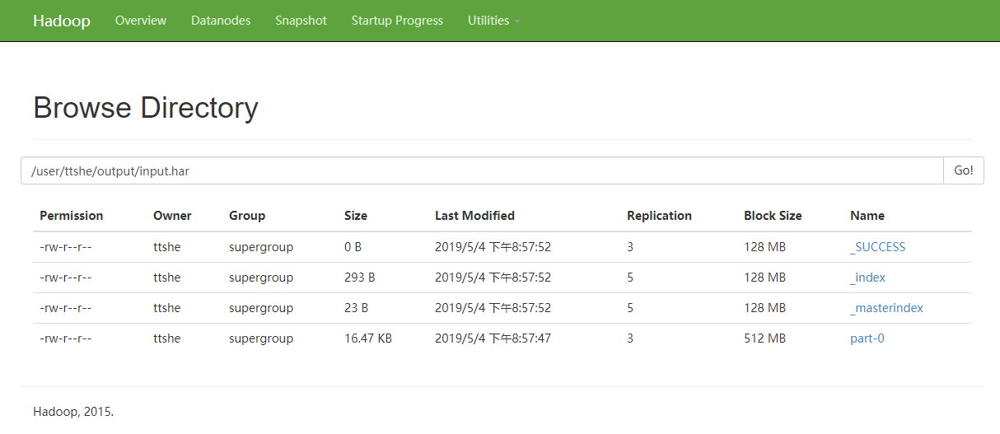
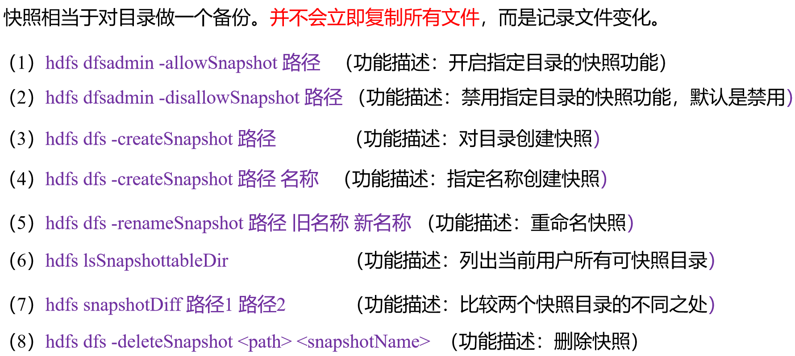

## HDFS2.x新特性


### 集群间数据拷贝

> 中小型企业会使用，前期使用小集群，后期数据量增加需要进行迁移

- 方式1：使用scp实现两个远程主机之间的文件复制

```shell
# 推 push
scp -r hello.txt root@hadoop103:/user/ttshe/hello.txt		
# 拉 pull
scp -r root@hadoop103:/user/ttshe/hello.txt  hello.txt
# 通过本地主机中转实现两个远程主机的文件复制；如果在两个远程主机之间ssh没有配置的情况下可以使用该方式
scp -r root@hadoop103:/user/ttshe/hello.txt root@hadoop104:/user/ttshe   
```


- 方式2：采用distcp命令实现2个Hadoop集群间的递归数据复制

```shell
[ttshe@hadoop102 hadoop-2.7.2]$  bin/hadoop distcp
hdfs://haoop102:9000/user/ttshe/hello.txt hdfs://hadoop103:9000/user/ttshe/hello.txt
```


### 小文件存档

#### 解决的问题

- HDFS中每个文件按块存储，每个块的元数据存储在NameNode的内存中，因此HDFS存储小文件会非常低效，==大量的小文件会耗尽NameNode中的大部分内存==

- 注意：==存储小文件的DataNode开辟的磁盘空间与数据块大小无关==，一个1MB的文件设置为128MB的块存储，实际使用的是1MB的磁盘空间


#### 使用HAR文件

使用HAR将HDFS中多个小文件打包成一个HAR文件，HDFS存档HAR文件对内还是一个个的小文件，但是对NameNode而言却是一个整体，减少了NameNode的内存

示例：先启动YARN进程，上传一些小文件

```shell
[ttshe@hadoop102 hadoop-2.7.2]$ hadoop fs -put wcinput/wc.input /user/ttshe/input
[ttshe@hadoop102 hadoop-2.7.2]$ hadoop fs -put README.txt /user/ttshe/input
[ttshe@hadoop102 hadoop-2.7.2]$ hadoop fs -put LICENSE.txt /user/ttshe/input
```

- 归档文件

```shell
# 命令
archive -archiveName NAME -p <parent path> <src>* <dest> create a hadoop archive
# 本质上进行了MapReduce操作了
[ttshe@hadoop102 hadoop-2.7.2]$ hadoop archive -archiveName input.har -p /user/ttshe/input /user/ttshe/output
```



- 查看归档

```shell
[ttshe@hadoop102 hadoop-2.7.2]$ hadoop fs -ls -R har:///user/ttshe/output/input.har
-rw-r--r--   3 ttshe supergroup      15429 2019-05-04 20:55 har:///user/ttshe/output/input.har/LICENSE.txt
-rw-r--r--   3 ttshe supergroup       1366 2019-05-04 20:55 har:///user/ttshe/output/input.har/README.txt
-rw-r--r--   3 ttshe supergroup         66 2019-05-04 20:54 har:///user/ttshe/output/input.har/wc.input
```

- 解归档文件

```shell
[ttshe@hadoop102 hadoop-2.7.2]$ hadoop fs -cp har:/// user/ttshe/output/input.har/*    /user/ttshe
```


### 回收站

> 默认关闭，开启回收站功能，可以将删除的文件在不超时的情况下，恢复原数据，防止误删除
> 一般企业很少使用，数据都是单独备份

#### 设置

在core-site.xml中进行设置

- fs.trash.interval
  - 默认值：0, 表示禁用回收站
  - 其他值表示设置文件的存活时间
- fs.trash.checkpoint.interval
  - 默认值：0
  - 检查回收站的间隔时间，每次扫描，判断回收站内的哪些文件需要删除
  - 如果设置为0，表示和fs.trash.interval含义相同
- 要求：fs.trash.checkpoint.interval <= fs.trash.interval


示例：

- 启用回收站

```shell
# 修改core-site.xml 配置垃圾回收时间为1min
<property>
   <name>fs.trash.interval</name>
	<value>1</value>
 </property>
```

注意：配置完成后分发给其他节点xsync core-site.xml

```shell
# 删除一个数据
[ttshe@hadoop102 hadoop-2.7.2]$ hadoop fs -rm /user/wc.input
# 删除之后会生成一个新的路径/user/ttshe/.Trash/….
```

- 修改访问垃圾回收站用户名称

进入垃圾回收站用户名称，默认是dr.who，修改为ttshe用户，修改core-site.xml文件，修改用户

```xml
<property>
  <name>hadoop.http.staticuser.user</name>
  <value>ttshe</value>
</property>
```

- 修改完成后需要重启集群

```shell
sbin/stop-yarn.sh
sbin/stop-dfs.sh
# 然后再开启
sbin/start-dfs.sh
sbin/start-yarn.sh
```

- 通过程序删除的文件不会经过回收站，需要调用moveToTrash()才进入回收站

```java
Trash trash = new Trash(conf);
trash.moveToTrash(path);
```

- 恢复回收站数据

```shell
[ttshe@hadoop102 hadoop-2.7.2]$ hadoop fs -mv
/user/ttshe/.Trash/Current/user/ttshe/input    /user/ttshe/input
```

- 清空回收站，会封装成一个时间戳文件夹，过一会系统再删除

```shell
[ttshe@hadoop102 hadoop-2.7.2]$ hadoop fs -expunge
```


### 快照管理




案例实操

```shell
（1）开启/禁用指定目录的快照功能
[atguigu@hadoop102 hadoop-2.7.2]$ hdfs dfsadmin -allowSnapshot /user/atguigu/input
[atguigu@hadoop102 hadoop-2.7.2]$ hdfs dfsadmin -disallowSnapshot /user/atguigu/input
（2）对目录创建快照
[atguigu@hadoop102 hadoop-2.7.2]$ hdfs dfs -createSnapshot /user/atguigu/input\
通过web访问hdfs://hadoop102:50070/user/atguigu/input/.snapshot/s…..// 快照和源文件使用相同数据
[atguigu@hadoop102 hadoop-2.7.2]$ hdfs dfs -lsr /user/atguigu/input/.snapshot/
（3）指定名称创建快照
[atguigu@hadoop102 hadoop-2.7.2]$ hdfs dfs -createSnapshot /user/atguigu/input  miao170508
（4）重命名快照
[atguigu@hadoop102 hadoop-2.7.2]$ hdfs dfs -renameSnapshot /user/atguigu/input/  miao170508 atguigu170508
（5）列出当前用户所有可快照目录
[atguigu@hadoop102 hadoop-2.7.2]$ hdfs lsSnapshottableDir
（6）比较两个快照目录的不同之处
[atguigu@hadoop102 hadoop-2.7.2]$ hdfs snapshotDiff
 /user/atguigu/input/  .  .snapshot/atguigu170508	
（7）恢复快照
[atguigu@hadoop102 hadoop-2.7.2]$ hdfs dfs -cp
/user/atguigu/input/.snapshot/s20170708-134303.027 /user
```