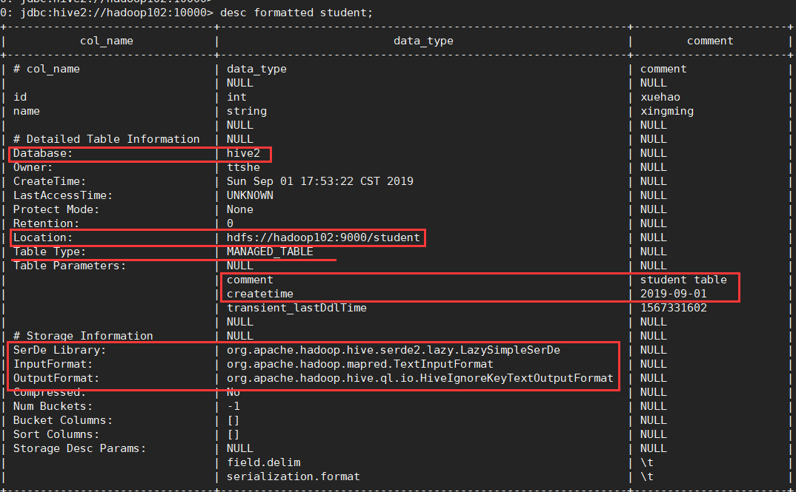
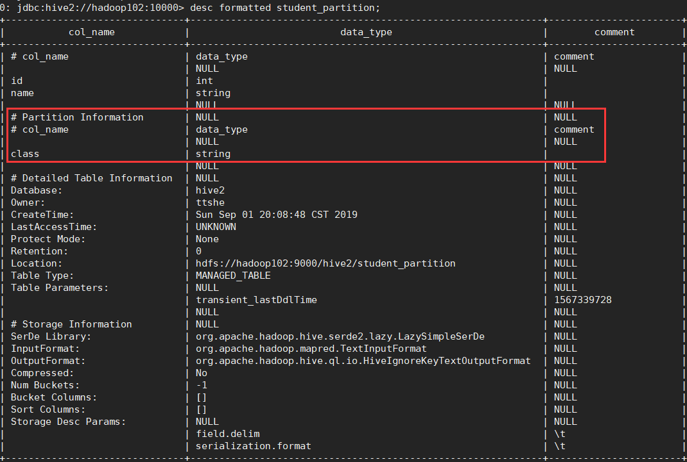

# 创建表


## 语法

```sql
CREATE [EXTERNAL] TABLE [IF NOT EXISTS] table_name 
[(col_name data_type [COMMENT col_comment], ...)] 
[COMMENT table_comment] 
[PARTITIONED BY (col_name data_type [COMMENT col_comment], ...)] 
[CLUSTERED BY (col_name, col_name, ...) 
[SORTED BY (col_name [ASC|DESC], ...)] INTO num_buckets BUCKETS] 
[ROW FORMAT row_format]

	row_format：
        DELIMITED [FIELDS TERMINATED BY char] [COLLECTION ITEMS TERMINATED BY char]
                [MAP KEYS TERMINATED BY char] [LINES TERMINATED BY char] 
      | SERDE serde_name [WITH SERDEPROPERTIES (property_name=property_value, ...)]

[STORED AS file_format] 
[LOCATION hdfs_path]
[TBLPROPERTIES (property_name=property_value, ...)]
[AS select_statement]
```


- **CREATE TABLE** 
  - 创建一个指定名字的表
  - 如果相同名字的表已经存在，则抛出异常
  - 可以用 **IF NOT EXISTS** 选项来忽略这个异常

- **EXTERNAL** 
  - 指定为外部表
  - 默认没有该关键字
    - 表示内部表
  - 在建表的同时可以指定一个指向实际数据的路径（LOCATION）
  - 删除表时
    - ==内部表的元数据和数据会被一起删除==
    - ==外部表只删除元数据，不删除数据==

- **COMMENT**
  
  - 为表和列添加注释
  
- **PARTITIONED BY** 
  - 创建分区表
  - 注意与Hadoop中的分区是不一样的

- **CLUSTERED BY**
  
  - 创建分桶表
  
- **SORTED BY**
  
  - 不常用，对桶中的一个或多个列另外排序
  
- **ROW FORMAT** 

  ```sql
  DELIMITED [FIELDS TERMINATED BY char] [COLLECTION ITEMS TERMINATED BY char]
  [MAP KEYS TERMINATED BY char] [LINES TERMINATED BY char] 
  | SERDE serde_name [WITH SERDEPROPERTIES (property_name=property_value, property_name=property_value, ...)]
  ```
  - SerDe
    - Serialize/Deserilize的
    - hive使用Serde进行行对象的序列与反序列化
      - 可对json字符串进行处理
    - 用户在建表的时候可以自定义SerDe或者使用自带的SerDe
  - 如果没有指定ROW FORMAT 或者ROW FORMAT DELIMITED，将会使用自带的SerDe
  - 在建表时，用户需要为表指定列，用户在指定表的列的同时也会指定自定义的SerDe
  - Hive通过SerDe确定表的具体的列的数据

- **STORED AS**
  - 指定存储文件类型
    - SEQUENCEFILE
      - 二进制序列文件
      - 如果数据需要压缩，使用 STORED AS SEQUENCEFILE
    - TEXTFILE
      - 文本
      - 如果文件数据是纯文本，可以使用STORED AS TEXTFILE
    - RCFILE
      - 列式存储格式文件

- ==**LOCATION**==
  
  - 指定表在HDFS上的存储位置
  
- **AS**
  
  - 后跟查询语句，根据查询结果创建表
  
- **LIKE**
  
  - 允许用户复制现有的表结构，但不复制数据
  
- **TBLPROPERTIES**

  - 表的自定义属性

  

## 管理表(内部表)

- 默认创建的表都是管理表（内部表）
  - Hive会控制着数据的生命周期
- Hive默认情况下会将这些表的数据存储在由配置项hive.metastore.warehouse.dir所定义的目录的子目录下
  - 如/user/hive/warehouse
- ==删除一个管理表时，Hive也会删除这个表中数据==
  - hdfs对应的数据会被删除
- 管理表不适合和其他工具共享数据


### 普通创建

- 创建一个外部表
  - 添加注释
  - 指定location
  - 指定stored
    - 默认textfile
  - 添加自定义属性
  - 执行成功后在hdfs上会创建一个student目录

```sql
hive (hive2)> create table student(
            > id int comment 'xuehao',
            > name string comment 'xingming')
            > comment 'student table'
            > row format delimited
            > fields terminated by '\t'
            > stored as textfile
            > location '/student'
            > tblproperties ('createtime' = '2019-09-01');
```

- 查看表结构

```sql
0: jdbc:hive2://hadoop102:10000> desc student;
+-----------+------------+-----------+--+
| col_name  | data_type  |  comment  |
+-----------+------------+-----------+--+
| id        | int        | xuehao    |
| name      | string     | xingming  |
+-----------+------------+-----------+--+
2 rows selected (0.268 seconds)
```

- 查看表的扩展字段
  - 查看表类型，管理表
  - 表位置，在student文件夹下
  - 表的扩展属性，在Table Parameters中
  - 表的序列化和输入输出使用的类

```sql
0: jdbc:hive2://hadoop102:10000> desc formatted student;
```




### 通过查询结果创建 `AS`

- 根据查询结果创建表
- ==查询的结果会添加到新创建的表中==

示例

- 导入数据

```sql
hive (hive2)> load data local inpath '/opt/module/datas/student.txt' into table student;
```

- 查询是否有值

```sql
hive (hive2)> select * from student;
OK
student.id	student.name
1001	zhangshan
1002	lishi
1003	zhaoliu
Time taken: 0.051 seconds, Fetched: 3 row(s)
```

- 依据查询的结果创建表
  - 会执行MR程序

```sql
hive (hive2)> create table student2 as select * from student;
```

- 查询新建的表
  - 表结构基本一致，但是特殊字段，比如自定义属性以及注释缺失

```sql
show tables;
select * from student2;
desc formatted student2;
```


### 通过已存在的表结构创建 `LIKE`

```sql
hive (hive2)> create table if not exists student3 like student;
```

- 查看表结构
  - 含有表列的注释信息
  - 也缺失了自定义属性，其他的基本保持不变

```sql
0: jdbc:hive2://hadoop102:10000> desc formatted student3;
```


### 查询表的扩展信息 `FORMATTED`

```sql
desc formatted student2;
```


## 外部表

- ==删除外部表不会删除hdfs的数据==

- 描述表的元数据信息会被删除
  
- metastore数据库表中对应的元数据会被删除
  
- **经常结合location使用**

  - 先导入数据，再创建外部表

  - 先创建外部表，再导入数据

  - 都是可以的

- 使用场景

  - 每天将收集到的网站日志定期流入HDFS文本文件
  - 在外部表（原始日志表）的基础上做大量的统计分析
    - 用到的中间表、结果表使用内部表存储
    - 数据通过SELECT+INSERT进入内部表


- 在hdfs上创建目录，然后上传数据

```sql
hive (hive2)> dfs -mkdir /student2;
hive (hive2)> dfs -put /opt/module/datas/student.txt /student2/;
```

- 基于hdfs上的目录创建相应的表

```sql
hive (hive2)> create external table student_ex(
            > id int,
            > name string
            > )
            > row format delimited
            > fields terminated by '\t'
            > location '/student2';
```

- 查询数据

```sql
hive (hive2)> select * from student_ex;
```

- 查看表扩展信息

```sql
0: jdbc:hive2://hadoop102:10000> desc formatted student_ex;
...
| Location:                     | hdfs://hadoop102:9000/student2             
| Table Type:                   | EXTERNAL_TABLE                             
```

- 删除表，查看数据是否被删除

```sql
hive (hive2)> drop table student_ex;
```


## 管理表与外部表的相互转换

- 管理表与外部表的相互转换

- 建立外部表

```sql
create external table student_ex(
id int,
name string
)
row format delimited
fields terminated by '\t'
location '/student2';
```

- 查看表类型
  - EXTERNAL字段为TRUE表示外部表

```sql
0: jdbc:hive2://hadoop102:10000> desc formatted student_ex;
...
Location:                     | hdfs://hadoop102:9000/student2                         
Table Type:                   | EXTERNAL_TABLE                                         
	EXTERNAL                  | TRUE    
```

- 转换为内部表
  - ==注意('EXTERNAL'='TRUE')和('EXTERNAL'='FALSE')为固定写法，区分大小写==

```sql
hive (hive2)> alter table student_ex set tblproperties('EXTERNAL'='FALSE');
```

- 转换为外部表

```sql
hive (hive2)> alter table student_ex set tblproperties('EXTERNAL'='TRUE');
```


# 分区表


- 分区表是对应一个HDFS文件系统上的独立的目录
  - 该目录下是该分区所有的数据文件
  - Hive中的分区是分目录
    - 把一个大的数据集根据业务需要分割成小的数据集
    - 在查询时通过WHERE子句中的表达式选择查询所需要的指定的分区
    - 查询效率会提高
    - 不会进行全表扫描，只需查询对应分区的内容

- 对分区列可以看做一个伪列
  - 每个伪列在表下的目录创建一个对应的目录


## 创建分区表

- ==分区字段不能是表中已经存在的数据，可将分区字段看作表的伪列==
- 指定分区字段不能是创建表已经存在的字段

```sql
create table student_partition(
    id int,
    name string
)
partitioned by (class string)
row format delimited
fields terminated by '\t';
```

- 查看表的信息

```sql
0: jdbc:hive2://hadoop102:10000> desc formatted student_partition;
```




## 导入分区数据

- 导入数据需要添加分区信息
  - `partition(xxx='yyy')`
    - xxx 是分区名称
    - yyy 是分区值

```sql
load data local inpath '/opt/module/datas/student.txt' into table student_partition partition(class='02');
load data local inpath '/opt/module/datas/student.txt' into table student_partition partition(class='03');
```

- 如果导入不添加分区信息那么会导入失败
  - 报错信息提示目标表格是分区表，需要有分区信息

```sql
hive (hive2)> load data local inpath '/opt/module/datas/student.txt' into table student_partition;
FAILED: SemanticException [Error 10062]: Need to specify partition columns because the destination table is partitioned
```

- 导入成功后查看hdfs
  - 分区目录名称是上传设置的分区信息

 

- 查看metastore数据库

 

- 查询信息
  - 查询所有信息时，会将分区列带上

```sql
hive (hive2)> select * from student_partition;
OK
student_partition.id	student_partition.name	student_partition.class
1001	zhangshan	02
1002	lishi	02
1003	zhaoliu	02
1001	zhangshan	03
1002	lishi	03
1003	zhaoliu	03
Time taken: 0.058 seconds, Fetched: 6 row(s)

hive (hive2)> select * from student_partition where class = '02';
OK
student_partition.id	student_partition.name	student_partition.class
1001	zhangshan	02
1002	lishi	02
1003	zhaoliu	02
Time taken: 0.268 seconds, Fetched: 3 row(s)
```

- 联合查询
  - 执行联合查询是需要走MR程序

```sql
select * from student_partition where class = '02'
union
select * from student_partition where class = '03';
...
_u2.id	_u2.name	_u2.class
1001	zhangshan	02
1001	zhangshan	03
1002	lishi	02
1002	lishi	03
1003	zhaoliu	02
1003	zhaoliu	03
Time taken: 21.379 seconds, Fetched: 6 row(s)
```

结果等价于

- 但是没有走MR

```sql
select * from student_partition where class='02' or class='03';

OK
student_partition.id	student_partition.name	student_partition.class
1001	zhangshan	02
1002	lishi	02
1003	zhaoliu	02
1001	zhangshan	03
1002	lishi	03
1003	zhaoliu	03
Time taken: 0.058 seconds, Fetched: 6 row(s)
```


## 查看分区 [show partitions xx]

```sql
show partitions student_partition;

OK
partition
class=02
class=03
Time taken: 0.186 seconds, Fetched: 2 row(s)
```


## 增加分区 [alter table xx add partition(yy=zz)...]

- 增加单个分区

```sql
alter table student_partition add partition(class='04');
```

- 增加多个分区

```sql
alter table student_partition add partition(class='05') partition(class='06');
```


## 删除分区 [alter table xx drop partition(yy=zz)]

- 删除单个分区
  - 如果该表示内部表，删除分区后，对应的hdfs上的目录也删除

```sql
alter table student_partition drop partition(class='02');
```

- 删除多个分区
  - 注意与增加多个分区的区别，删除时需要 `,` 号

```sql
alter table student_partition drop partition(class='04'),partition(class='05');
```


## 二级分区

- 在原先分区的基础上再进行多次分区
  - 上传时需要二次分区的全部伪列的值
- 创建二次分区表
  - 示例在month中再添加day分区

```sql
create table student_partition2(id int,name string)
partitioned by(month string,day string)
row format delimited
fields terminated by '\t';
```

- 查看表信息

```sql
desc formatted student_partition2;
...
| # Partition Information       | NULL
| # col_name                    | data_type  
| month                         | string
| day                           | string   
```


### 导入数据

```sql
load data local inpath '/opt/module/datas/student.txt' into table student_partition2
partition(month='09');

FAILED: SemanticException Line 0:-1 Partition not found ''09''
```
注意需要2个分区参数与创建表声明保持一致

- 否则会失败
```sql
load data local inpath '/opt/module/datas/student.txt' into table student_partition2
partition(month='09',day='01');
```

- 查看hdfs


- 查询数据

```sql
hive (hive2)> select * from student_partition2;
OK
student_partition2.id	student_partition2.name	student_partition2.month	student_partition2.day
1001	zhangshan	09	01
1002	lishi	09	01
1003	zhaoliu	09	01
Time taken: 0.246 seconds, Fetched: 3 row(s)


hive (hive2)> select * from student_partition2 where month='09' and day='01';
OK
student_partition2.id	student_partition2.name	student_partition2.month	student_partition2.day
1001	zhangshan	09	01
1002	lishi	09	01
1003	zhaoliu	09	01
Time taken: 0.202 seconds, Fetched: 3 row(s)
```


## 数据与分区表关联


### 上传数据后执行修复指令

- 先在hdfs上创建一个新的分区目录与数据

```sql
hive (hive2)> dfs -mkdir -p /hive2/student_partition2/month=10/day=02;
hive (hive2)> dfs -put /opt/module/datas/student.txt /hive2/student_partition2/month=10/day=02/;
```

- 先查询
  - 还没有关联上没有数据

```sql
hive (hive2)> select * from student_partition2 where month='10' and day='02';
```

- **执行修复指令**
  - 执行指令之后，再执行查询看是否有结果

```sql
msck repair table student_partition2;
```


### 上传数据后添加分区

- 新建hdfs目录并上传数据
- 执行增加分区操作，完成关联

```sql
hive (hive2)> dfs -mkdir -p /hive2/student_partition2/month=11/day=03;
hive (hive2)> dfs -put /opt/module/datas/student.txt /hive2/student_partition2/month=11/day=03/;
hive (hive2)> alter table student_partition2 add partition(month='11',day='03');
hive (hive2)> select * from student_partition2 where month='11' and day='03';
```


### 创建分区文件夹后load数据到分区

- 创建hdfs文件夹，然后使用load命令到指定的分区
- 本质上与导入分区数据一致


# 修改表


## 表重命名 [alter table xx rename to yy]

- 语法
  - 会将hdfs和metastore中对应的目录和表名进行修改

```sql
ALTER TABLE table_name RENAME TO new_table_name;
```

- 操作

```sql
hive (hive2)> alter table student_partition2 rename to student_partition3;
```


## 增加列 [alter table xx add columns yy(...)]

- 查看表结构

```sql
0: jdbc:hive2://hadoop102:10000> desc student_partition;
+--------------------------+-----------------------+-----------------------+--+
|         col_name         |       data_type       |        comment        |
+--------------------------+-----------------------+-----------------------+--+
| id                       | int                   |                       |
| name                     | string                |                       |
| class                    | string                |                       |
|                          | NULL                  | NULL                  |
| # Partition Information  | NULL                  | NULL                  |
| # col_name               | data_type             | comment               |
|                          | NULL                  | NULL                  |
| class                    | string                |                       |
+--------------------------+-----------------------+-----------------------+--+
```

- `alter table add columns...`

```sql
alter table student_partition add columns(age int);
```


## 更改列 [alter table xx change column yy zz ...]

- 使用 `change column`
  - 注意是 `column`

```sql
alter table student_partition change column age age2 string;
```

- 更改列的顺序
  - first 将当前列更新到第一列

```sql
alter table student_partition change column age2 age2 string first;
```


## 替换所有列 [alter table xx replace columns(...)]

- `replace columns`
  - 注意是`columns`

- 使用替换列达到删除列的效果
- 如果是分区表，对分区表的虚拟列没有影响

```sql
alter table student_partition replace columns(id int,name string);
```


# 删除表 [drop table xx]

```sql
hive (default)> drop table dept_partition;
```
