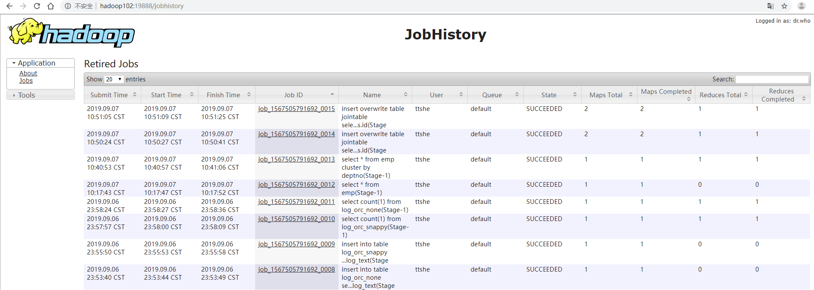
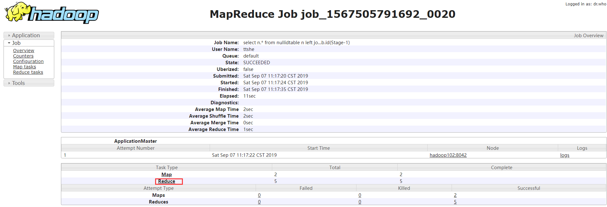
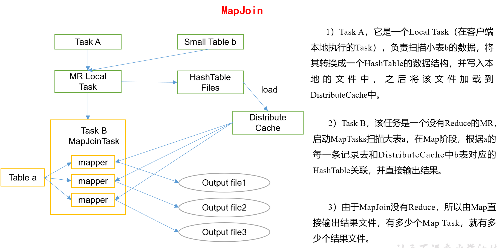
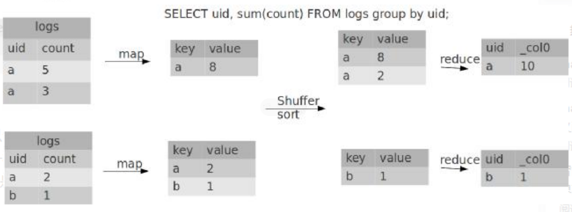

# Fetch抓取

- Hive中对某些情况的查询可不必使用MapReduce计算
  - 如：SELECT * FROM employees;
  - 可读取employee对应的存储目录下的文件，输出查询结果到控制台
- hive-default.xml.template文件中配置
  - hive.fetch.task.conversion默认是more
  - 老版本hive默认是minimal
  - 该属性修改为==more==以后，以下都不执行MR
    - ==全局查找==
    - ==字段查找==
    - ==limit查找==
- 减少MR的执行，提升速度
- 详细配置

```xml
<property>
    <name>hive.fetch.task.conversion</name>
    <value>more</value>
    <description>
        Expects one of [none, minimal, more].
        Some select queries can be converted to single FETCH task minimizing latency.
        Currently the query should be single sourced not having any subquery and should not have any aggregations or distincts (which incurs RS), lateral views and joins.
        0. none : disable hive.fetch.task.conversion
        1. minimal : SELECT STAR, FILTER on partition columns, LIMIT only
        2. more  : SELECT, FILTER, LIMIT only (support TABLESAMPLE and virtual columns)
    </description>
</property>
```

示例

- 把hive.fetch.task.conversion设置成none
  - 执行查询语句
  - 都会执行mapreduce程序

```sql
hive (select_test)> set hive.fetch.task.conversion=none;
hive (select_test)> select * from emp;
hive (select_test)> select * from emp;
hive (select_test)> select ename from emp;
hive (select_test)> select ename from emp limit 3;
...执行MR
```

- 把hive.fetch.task.conversion设置成more
  - 执行查询语句
  - 如下查询方式都不会执行mapreduce程序

```sql
hive (select_test)> set hive.fetch.task.conversion=more;
hive (select_test)> select * from emp;
hive (select_test)> select ename from emp;
hive (select_test)> select ename from emp limit 3;
```


# 本地模式

- 当数据量比较小，执行Hadoop Job会耗费大量时间
  - 查询触发执行任务消耗的时间可能会比实际job的执行时间要多的多
- Hive可通过本地模式在单台机器上处理所有的任务
  - 对于小数据集，执行时间可以明显被缩短。
- 设置`hive.exec.mode.local.auto`的值为true
  - Hive在适当的时候自动启动这个优化
  - 默认是false
- 其他配置

```sql
//开启本地mr
set hive.exec.mode.local.auto=true; 
//设置local mr的最大输入数据量，当输入数据量小于这个值时采用local mr的方式，默认为134217728，即128M
set hive.exec.mode.local.auto.inputbytes.max=50000000;
//设置local mr的最大输入文件个数，当输入文件个数小于这个值时采用local mr的方式，默认为4
set hive.exec.mode.local.auto.input.files.max=10;
```

示例

- 开启本地模式，执行查询
  - 执行本地MR

```sql
hive (select_test)> set hive.exec.mode.local.auto=true; 
hive (select_test)> select * from emp cluster by deptno;
Time taken: 1.209 seconds, Fetched: 14 row(s)
```

- 关闭本地模式执行查询
  - 在Hadoop上执行MR

```sql
hive (select_test)> set hive.exec.mode.local.auto=false; 
hive (select_test)> select * from emp cluster by deptno;
Time taken: 14.665 seconds, Fetched: 14 row(s)
```


# 表的优化


## 小表、大表 Join

- 将key相对分散且数据量小的表放在join的左边
  - 有效减少内存溢出错误发生的几率
- 使用map join让小的维度表（1000条以下的记录条数）先进内存
  - 在map端完成reduce
- 新版的hive已经对小表JOIN大表和大表JOIN小表进行了优化
  - **小表放在左边和右边已经没有明显区别**

示例

- 建表

```sql
// 创建大表
create table bigtable(
id bigint, time bigint, uid string, keyword string, url_rank int, click_num int, click_url string
) 
row format delimited fields terminated by '\t';

// 创建小表
create table smalltable(
id bigint, time bigint, uid string, keyword string, url_rank int, click_num int, click_url string
) 
row format delimited fields terminated by '\t';

// 创建join后表的语句
create table jointable(
id bigint, time bigint, uid string, keyword string, url_rank int, click_num int, click_url string
) 
row format delimited fields terminated by '\t';
```

- 导入数据

```sql
hive (default)>load data local inpath '/opt/module/datas/bigtable' into table bigtable;
hive (default)>load data local inpath '/opt/module/datas/smalltable' into table smalltable;
```

- 关闭mapjoin功能
  - 默认开启

```sql
set hive.auto.convert.join = false;
```

- 执行小表join大表

```sql
insert overwrite table jointable
select b.id, b.time, b.uid, b.keyword, b.url_rank, b.click_num, b.click_url
from smalltable s
left join bigtable b
on b.id = s.id;

Time taken: 18.894 seconds
```

- 执行大表join小表

```sql
insert overwrite table jointable
select b.id, b.time, b.uid, b.keyword, b.url_rank, b.click_num, b.click_url
from bigtable b
left join smalltable s
on b.id = s.id;

Time taken: 22.579 seconds
```


## 大表 join 大表


### 配置历史服务器

- 配置mapred-site.xml

```xml
<property>
<name>mapreduce.jobhistory.address</name>
<value>hadoop102:10020</value>
</property>
<property>
    <name>mapreduce.jobhistory.webapp.address</name>
    <value>hadoop102:19888</value>
</property>
```

- 启动历史服务器

```bash
sbin/mr-jobhistory-daemon.sh start historyserver
```

- 查看启动
  - http://hadoop102:19888/jobhistory

 


### 空 KEY 过滤

- 有时join超时是因为某些key对应的数据太多
- 相同key对应的数据都会发送到相同的reducer上，从而导致内存不够
- 仔细分析这些异常的key，很多情况下
  - 这些key对应的数据是异常数据
  - 需要在SQL语句中进行过滤
    - 如key对应的字段为空

示例

- 建表
  - 创建原始数据表、空id表、合并后数据表

```sql
// 创建原始表
create table ori(id bigint, time bigint, uid string, keyword string, url_rank int, click_num int, click_url string) 
row format delimited fields terminated by '\t';
// 创建空id表
create table nullidtable(id bigint, time bigint, uid string, keyword string, url_rank int, click_num int, click_url string) 
row format delimited fields terminated by '\t';
// 创建join后表的语句
create table jointable(id bigint, time bigint, uid string, keyword string, url_rank int, click_num int, click_url string) 
row format delimited fields terminated by '\t';
```

- 导入数据
  - 分别加载原始数据和空id数据到对应表中

```sql
load data local inpath '/opt/module/datas/ori' into table ori;
load data local inpath '/opt/module/datas/nullid' into table nullidtable;
```

- 测试不过滤空id

```sql
insert overwrite table jointable select n.* from nullidtable n
left join ori o on n.id = o.id;

Time taken: 14.307 seconds
```

- 测试过滤空id

```sql
insert overwrite table jointable select n.* from (select * from nullidtable where id is not null ) n  left join ori o on n.id = o.id;

Time taken: 13.889 seconds
```


### 空 KEY 转换

- 虽然某个key为空对应的数据很多，但是相应的数据不是异常数据，必须要包含在join的结果中
- 可以表a中key为空的字段赋一个随机的值
  - 使得数据随机均匀地分不到不同的reducer上

示例

**不随机分布空null值**

- 设置5个reduce个数
- 注意关闭mapjoin优化

```sql
set mapreduce.job.reduces=5;
set hive.auto.convert.join = false;
```

- JOIN两张表

```sql
insert overwrite table jointable
select n.* 
from nullidtable n 
left join ori b 
on n.id = b.id;
```

- 查看历史reduce执行时间




- 由于数据量比较小，此处看不出数据倾斜

**随机分布空null值**

```sql
set mapreduce.job.reduces=5;
set hive.auto.convert.join = false;
```

- join两张表
  - rand() 表示产生一个随机数

```sql
insert overwrite table jointable
select n.* from nullidtable n full join ori o on 
case when n.id is null then concat('hive', rand()) else n.id end = o.id;
```


## 小表 join 大表

- 如果不指定MapJoin或者不符合MapJoin的条件，Hive解析器会将Join操作转换成Common Join
  - 在Reduce阶段完成join
  - 容易发生数据倾斜
- 可用MapJoin把小表全部加载到内存在map端进行join，避免reducer处理
- 设置自动选择Mapjoin

```sql
set hive.auto.convert.join = true; 默认为true
```

- 大表小表的阈值设置
  - 默认25M一下认为是小表

```sql
set hive.mapjoin.smalltable.filesize=25000000;
```

- MapJoin工作机制



示例

- 开启Mapjoin功能

```sql
set hive.auto.convert.join = true;
```

- 执行小表JOIN大表语句

```sql
insert overwrite table jointable
select b.id, b.time, b.uid, b.keyword, b.url_rank, b.click_num, b.click_url
from smalltable s
join bigtable  b
on s.id = b.id;

Time taken: 16.764 seconds
```

- 执行大表JOIN小表语句

```sql
insert overwrite table jointable
select b.id, b.time, b.uid, b.keyword, b.url_rank, b.click_num, b.click_url
from bigtable  b
join smalltable  s
on s.id = b.id;

Time taken: 16.922 seconds
```


## Group By

- 默认情况下，Map阶段同一Key数据分发给一个reduce

  - 容易产生数据倾斜

   

- 不是所有的聚合操作都需要在Reduce端完成，很多聚合操作都可以先在Map端进行部分聚合，最后在Reduce端得出最终结果

  - 等价于在map阶段有一个自定义的Combiner

参数设置

- 开启Map端聚合参数设置
- 是否在Map端进行聚合
  - 默认为True

```sql
set hive.map.aggr = true
```

- 在Map端进行聚合操作的条目数目

```sql
set hive.groupby.mapaggr.checkinterval = 100000
```

- 有数据倾斜的时候进行负载均衡
  - 默认是false
  - ==设定为 true，生成的查询计划会有两个MR Job==
  - 第一个MR Job中，Map的输出结果会随机分布到Reduce中，每个Reduce做部分聚合操作，并输出结果
    - 相同的Group By Key有可能被分发到不同的Reduce中，从而达到负载均衡的目的
  - 第二个MR Job再根据预处理的数据结果按照Group By Key分布到Reduce中
    - 这个过程可保证相同的Group By Key被分布到同一个Reduce中
  - 最后完成最终的聚合操作

```sql
set hive.groupby.skewindata = true
```

示例

```sql
hive (default)> select deptno from emp group by deptno;
Stage-Stage-1: Map: 1  Reduce: 5   Cumulative CPU: 23.68 sec   HDFS Read: 19987 HDFS Write: 9 SUCCESS
Total MapReduce CPU Time Spent: 23 seconds 680 msec
OK
deptno
10
20
30
```

- 优化以后

```sql
hive (default)> set hive.groupby.skewindata = true;
hive (default)> select deptno from emp group by deptno;
Stage-Stage-1: Map: 1  Reduce: 5   Cumulative CPU: 28.53 sec   HDFS Read: 18209 HDFS Write: 534 SUCCESS
Stage-Stage-2: Map: 1  Reduce: 5   Cumulative CPU: 38.32 sec   HDFS Read: 15014 HDFS Write: 9 SUCCESS
Total MapReduce CPU Time Spent: 1 minutes 6 seconds 850 msec
OK
deptno
10
20
30
```


## Count(Distinct) 去重统计

- 数据量小的时候无所谓
- 数据量大的情况下，由于COUNT DISTINCT的全聚合操作
  - 即使设定了reduce task个数，set mapred.reduce.tasks=100
    - hive也只会启动一个reducer
  - 造成一个Reduce处理的数据量太大，导致整个Job很难完成
- 一般COUNT DISTINCT使用先GROUP BY再COUNT的方式替换

示例

- 建表

```sql
create table bigtable(id bigint, time bigint, uid string, keyword
string, url_rank int, click_num int, click_url string) 
row format delimited fields terminated by '\t';
```

- 导入数据

```sql
load data local inpath '/opt/module/datas/bigtable' into table bigtable;
```

- 设置reducer个数

```sql
set mapreduce.job.reduces = 5;
```

- 执行去重id查询

```sql
select count(distinct id) from bigtable;

Stage-Stage-1: Map: 1  Reduce: 1   Cumulative CPU: 7.13 sec   HDFS Read: 120741963 HDFS Write: 7 SUCCESS
Total MapReduce CPU Time Spent: 7 seconds 130 msec
OK
c0
100001
Time taken: 17.633 seconds, Fetched: 1 row(s)
```

- 采用GROUP by去重id
  - 转换为子查询
  - 2次MR

```sql
select count(id) from (select id from bigtable group by id) a;

Stage-Stage-1: Map: 1  Reduce: 5   Cumulative CPU: 19.65 sec   HDFS Read: 120752809 HDFS Write: 580 SUCCESS
Stage-Stage-2: Map: 1  Reduce: 1   Cumulative CPU: 2.31 sec   HDFS Read: 6051 HDFS Write: 7 SUCCESS
Total MapReduce CPU Time Spent: 21 seconds 960 msec
OK
_c0
100001
Time taken: 40.797 seconds, Fetched: 1 row(s)
```

- 虽然会多用一个Job来完成，但在数据量大的情况下，这个绝对是值得的


## 笛卡尔积

尽量避免笛卡尔积，join的时候不加on条件，或者无效的on条件，Hive只能使用1个reducer来完成笛卡尔积


## 行列过滤

- 列处理
  - 在SELECT中，只拿需要的列
  - 尽量使用分区过滤，少用SELECT *
- 行处理
  - 在分区剪裁中，当使用外关联时，如果将副表的过滤条件写在Where后面，那么就会先全表关联，之后再过滤
    - 建议使用子查询过滤副表

示例

- 测试先关联两张表，再用where条件过滤

```sql
select o.id 
from bigtable b
join ori o on o.id = b.id
where o.id <= 10;

Stage-Stage-3: Map: 1   Cumulative CPU: 3.25 sec   HDFS Read: 120741362 HDFS Write: 0 SUCCESS
Total MapReduce CPU Time Spent: 3 seconds 250 msec
OK
o.id
Time taken: 14.544 seconds
```

- 通过子查询后，再关联表

```sql
select b.id 
from bigtable b
join (
select id from ori where id <= 10 
) o on b.id = o.id;

Stage-Stage-3: Map: 1   Cumulative CPU: 3.69 sec   HDFS Read: 120741121 HDFS Write: 0 SUCCESS
Total MapReduce CPU Time Spent: 3 seconds 690 msec
OK
b.id
Time taken: 14.014 seconds
```


## 动态分区调整

- 关系型数据库中对分区表Insert数据时，数据库自动会根据分区字段的值，将数据插入到相应的分区中
- Hive中也提供了类似的机制，即动态分区(Dynamic Partition)
  - 使用Hive的动态分区，需要进行相应的配置

## 参数设置

- 开启动态分区参数设置
- ==开启动态分区功能==
  - 默认true，开启

```sql
set hive.exec.dynamic.partition=true;
```

- 设置为非严格模式
  - 动态分区的模式
    - 默认strict
      - 表示必须指定至少一个分区为静态分区
    - nonstrict模式
      - 允许所有的分区字段都可以使用动态分区

```sql
set hive.exec.dynamic.partition.mode=nonstrict;
```

- 在所有执行MR的节点上，最多总共可以创建多少个动态分区
  - 默认1000

```sql
set hive.exec.max.dynamic.partitions=1000;
```

- 在每个执行MR的节点上，最大可以创建多少个动态分区
  - 该参数需要根据实际的数据来设定
    - 如源数据中包含了一年的数据
      - 即day字段有365个值，那么该参数就需要设置成大于365
      - 如果使用默认值100，则会报错

```sql
set hive.exec.max.dynamic.partitions.pernode=100;
```

- 整个MR Job中，最大可以创建多少个HDFS文件
  - 默认100000

```sql
set hive.exec.max.created.files=100000;
```

- 当有空分区生成时，是否抛出异常
  - 一般不需要设置
  - 默认false

```sql
set hive.error.on.empty.partition=false;
```


#### 示例

- 需求
  - 将dept表中的数据按照地区（loc字段），插入到目标表dept_partition的相应分区中
- 建表

```sql
create table dept_partition(id int, name string) 
partitioned by (location int) 
row format delimited fields terminated by '\t';
```

- 设置非严格模式

```sql
set hive.exec.dynamic.partition.mode = nonstrict;
```

- 插入数据
  - 注意：select 时，分区表的字段要放在最后

```sql
insert into table dept_partition 
partition(location) 
select deptno, dname, loc from dept;
```

- 查看目标分区表的分区情况

```sql
show partitions dept_partition;

OK
partition
location=1700
location=1800
location=1900
Time taken: 0.045 seconds, Fetched: 3 row(s)
```

- 思考：目标分区表是如何匹配到分区字段的？
  - 依据select 查询的最后一个字段进行位置匹配的


## 分桶

- 提高hive的查询效率

## 分区

- 提高hive的查询效率


# 合理设置Map及Reduce数

- 通常情况下job会通过input的目录产生一个或者多个map任务
- 主要的决定因素
  - input的文件总个数
  - input的文件大小
  - 集群设置的文件块大小
- 是不是map数越多越好
  - 否定的
  - 如果一个任务有很多小文件
    - 远远小于块大小128m
  - 每个小文件也会被当做一个块，用一个map任务来完成
  - 一个map任务启动和初始化的时间远远大于逻辑处理的时间，就会造成很大的资源浪费。
  - 同时可执行的map数是受限的
- 是不是保证每个map处理接近128m的文件块，就高枕无忧了？
  - 不一定
  - 如有一个127m的文件，正常会用一个map去完成
    - 但这个文件只有一个或者两个小字段，却有几千万的记录
    - 如果map处理的逻辑比较复杂，用一个map任务去做，肯定也比较耗时
- 针对上面的问题，需要采取两种方式来解决
  - 即减少map数和增加map数


## 复杂文件增加Map数

- 当input的文件都很大，任务逻辑复杂，map执行非常慢的场景
  - 考虑增加Map数
    - 使每个map处理的数据量减少
    - 提高任务的执行效率
- 增加map的方法
  - 根据computeSliteSize(Math.max(minSize,Math.min(maxSize,blocksize)))=blocksize=128M公式
  - 调整maxSize最大值
  - 让maxSize最大值低于blocksize就可以增加map的个数

示例

- 执行查询

```sql
select count(*) from emp;

Hadoop job information for Stage-1: number of mappers: 1; number of reducers: 1
```

- 设置最大切片值为100个字节

```sql
set mapreduce.input.fileinputformat.split.maxsize;

mapreduce.input.fileinputformat.split.maxsize=256000000

set mapreduce.input.fileinputformat.split.maxsize=100;
select count(*) from emp;

Hadoop job information for Stage-1: number of mappers: 6; number of reducers: 
```


## 小文件进行合并

在map执行前合并小文件，减少map数

- CombineHiveInputFormat
  - 具有对小文件进行合并的功能
  - 系统默认的格式
- HiveInputFormat
  - 没有对小文件合并功能

```sql
set hive.input.format= org.apache.hadoop.hive.ql.io.CombineHiveInputFormat;
```


在Map-Reduce的**任务结束**时合并小文件的设置

- 在map-only任务结束时合并小文件
  - 默认true

```sql
set hive.merge.mapfiles = true;
```

- 在map-reduce任务结束时合并小文件
  - 默认false

```sql
set hive.merge.mapredfiles = true;
```

- 合并文件的大小
  - 默认256M

```sql
set hive.merge.size.per.task = 268435456;
```

- 当输出文件的平均大小小于该值时
  - 启动一个独立的map-reduce任务进行文件merge

```sql
SET hive.merge.smallfiles.avgsize = 16777216;
```


# 合理设置Reduce数


## 默认机制

- 每个Reduce处理的数据量默认是256MB

```sql
hive.exec.reducers.bytes.per.reducer=256000000
```

- 每个任务最大的reduce数，默认为1009

```sql
hive.exec.reducers.max=1009
```

- 计算reducer数的公式

```sql
N=min(参数2，总输入数据量/参数1)
```


## 手动修改

- 在hadoop的mapred-default.xml文件中修改
- 设置每个job的Reduce个数

```sql
set mapreduce.job.reduces = 15;
```


## 设置原则

- reduce个数并不是越多越好
  - 过多的启动和初始化reduce也会消耗时间和资源
  - 有多少个reduce，就会有多少个输出文件
    - 如果生成了很多个小文件，那这些小文件作为下一个任务的输入，则也会出现小文件过多的问题- 
- 在设置reduce个数的时候也需要考虑这两个原则
  - 处理大数据量利用合适的reduce数
  - 使单个reduce任务处理数据量大小要合适


# 并行执行

- Hive会将一个查询转化成一个或者多个阶段

  - MapReduce阶段
  - 抽样阶段
  - 合并阶段
  - limit阶段
  - 或者Hive执行过程中可能需要的其他阶段

- 默认情况下，Hive一次只会执行一个阶段

- 某个特定的job可能包含众多的阶段

  - 阶段可能并非完全互相依赖
  - 有些阶段是可以并行执行
    - 使整个job的执行时间缩短

- 如果有更多的阶段可以并行执行，那么job可能就越快完成

- 需要在系统资源比较空闲的时候才有优势

  

设置

- 通过设置参数hive.exec.parallel值为true，就可以开启并发执行
- 在共享集群中，需要注意如果job中并行阶段增多，那么集群利用率就会增加

```sql
//打开任务并行执行
set hive.exec.parallel=true;              
//同一个sql允许最大并行度，默认为8
set hive.exec.parallel.thread.number=16;  
```


# 严格模式

- Hive提供了一个严格模式
- 防止用户执行那些可能意想不到的不好影响的查询
- 通过设置属性hive.mapred.mode值
  - 默认是nonstrict ，非严格模式
- 开启严格模式
  - 修改hive.mapred.mode值为strict
- 开启严格模式可以禁止3种类型的查询

```xml
<property>
    <name>hive.mapred.mode</name>
    <value>strict</value>
    <description>
      The mode in which the Hive operations are being performed. 
      In strict mode, some risky queries are not allowed to run. They include:
        Cartesian Product.
        No partition being picked up for a query.
        Comparing bigints and strings.
        Comparing bigints and doubles.
        Orderby without limit.
</description>
</property
```

- 对于分区表，==除非where语句中含有分区字段过滤条件来限制范围，否则不允许执行==
  - 用户不允许扫描所有分区
  - 进行这个限制的原因是
    - 通常分区表都拥有非常大的数据集，而且数据增加迅速
    - 没有进行分区限制的查询可能会消耗令人不可接受的巨大资源来处理这个表
- 对于==使用了order by语句的查询，要求必须使用limit语句==
  - order by为了执行排序过程会将所有的结果数据分发到同一个Reducer中进行处理
  - 强制要求用户增加这个LIMIT语句可以防止Reducer额外执行很长一段时间
- ==限制笛卡尔积的查询==
  - 对关系型数据库非常了解的用户可能期望在执行JOIN查询的时候不使用ON语句而是使用where语句
    - 关系数据库的执行优化器可高效地将WHERE语句转化成那个ON语句
  - Hive并不会执行这种优化
    - 如果表足够大，那么这个查询就会出现不可控的情况


# JVM重用

- JVM重用是Hadoop调优参数的内容，其对Hive的性能具有非常大的影响
- 特别是对于很难避免==小文件的场景或task特别多的场景，这类场景大多数执行时间都很短==
- Hadoop的默认配置通常是使用派生JVM来执行map和Reduce任务的
- 这时JVM的启动过程可能会造成相当大的开销，尤其是执行的job包含有成百上千task任务的情况
- ==JVM重用可以使得JVM实例在同一个job中重新使用N次==
- N的值可以在Hadoop的mapred-site.xml文件中进行配置
  - 通常在10-20之间
  - 具体多少需要根据具体业务场景测试得出

```xml
<property>
  <name>mapreduce.job.jvm.numtasks</name>
  <value>10</value>
  <description>How many tasks to run per jvm. If set to -1, there is
  no limit. 
  </description>
</property>
```

- 缺点
  - 开启JVM重用将一直占用使用到的task插槽，以便进行重用，直到任务完成后才能释放
  - 如果某个“不平衡的”job中有某几个reduce task执行的时间要比其他Reduce task消耗的时间多的多的话，那么保留的插槽就会一直空闲着却无法被其他的job使用，直到所有的task都结束了才会释放


# 推测执行

- 在分布式集群环境下，因为程序Bug（包括Hadoop本身的bug），负载不均衡或者资源分布不均等原因，会造成同一个作业的多个任务之间运行速度不一致，有些任务的运行速度可能明显慢于其他任务（比如一个作业的某个任务进度只有50%，而其他所有任务已经运行完毕），则这些任务会拖慢作业的整体执行进度
- 为了避免这种情况发生，Hadoop采用了推测执行（Speculative Execution）机制
  - 根据一定的法则推测出“拖后腿”的任务，并为这样的任务启动一个备份任务
  - 让该任务与原始任务同时处理同一份数据
  - 最终选用最先成功运行完成任务的计算结果作为最终结果
- 设置开启推测执行参数：Hadoop的mapred-site.xml文件中进行配置，默认是true

```xml
<property>
  <name>mapreduce.map.speculative</name>
  <value>true</value>
  <description>If true, then multiple instances of some map tasks 
               may be executed in parallel.</description>
</property>

<property>
  <name>mapreduce.reduce.speculative</name>
  <value>true</value>
  <description>If true, then multiple instances of some reduce tasks 
               may be executed in parallel.</description>
</property>
```

- 不过hive本身也提供了配置项来控制reduce-side的推测执行：默认是true

```xml
  <property>
    <name>hive.mapred.reduce.tasks.speculative.execution</name>
    <value>true</value>
    <description>Whether speculative execution for reducers should be turned on. </description>
  </property>
```

- 关于调优这些推测执行变量，还很难给一个具体的建议
  - ==如果用户对于运行时的偏差非常敏感的话，那么可以将这些功能关闭掉==
  - 如果用户因为输入数据量很大而需要执行长时间的map或者Reduce task的话，那么启动推测执行造成的浪费是非常巨大大。


# 压缩


# 执行计划

- 基本语法

```sql
EXPLAIN [EXTENDED | DEPENDENCY | AUTHORIZATION] query
```

- 示例查看执行计划

```sql
hive (select_test)>  explain select * from emp;
OK
Explain
STAGE DEPENDENCIES:
  Stage-0 is a root stage

STAGE PLANS:
  Stage: Stage-0
    Fetch Operator
      limit: -1
      Processor Tree:
        TableScan
          alias: emp
          Statistics: Num rows: 2 Data size: 656 Basic stats: COMPLETE Column stats: NONE
          Select Operator
            expressions: empno (type: int), ename (type: string), job (type: string), mgr (type: int), hiredate (type: string), sal (type: double), comm (type: double), deptno (type: int)
            outputColumnNames: _col0, _col1, _col2, _col3, _col4, _col5, _col6, _col7
            Statistics: Num rows: 2 Data size: 656 Basic stats: COMPLETE Column stats: NONE
            ListSink

Time taken: 0.12 seconds, Fetched: 17 row(s)
```

```sql
hive (select_test)> explain select deptno, avg(sal) avg_sal from emp group by deptno;
OK
Explain
STAGE DEPENDENCIES:
  Stage-1 is a root stage
  Stage-0 depends on stages: Stage-1

STAGE PLANS:
  Stage: Stage-1
    Map Reduce
      Map Operator Tree:
          TableScan
            alias: emp
            Statistics: Num rows: 54 Data size: 656 Basic stats: COMPLETE Column stats: NONE
            Select Operator
              expressions: deptno (type: int), sal (type: double)
              outputColumnNames: deptno, sal
              Statistics: Num rows: 54 Data size: 656 Basic stats: COMPLETE Column stats: NONE
              Group By Operator
                aggregations: avg(sal)
                keys: deptno (type: int)
                mode: hash
                outputColumnNames: _col0, _col1
                Statistics: Num rows: 54 Data size: 656 Basic stats: COMPLETE Column stats: NONE
                Reduce Output Operator
                  key expressions: _col0 (type: int)
                  sort order: +
                  Map-reduce partition columns: _col0 (type: int)
                  Statistics: Num rows: 54 Data size: 656 Basic stats: COMPLETE Column stats: NONE
                  value expressions: _col1 (type: struct<count:bigint,sum:double,input:double>)
      Reduce Operator Tree:
        Group By Operator
          aggregations: avg(VALUE._col0)
          keys: KEY._col0 (type: int)
          mode: mergepartial
          outputColumnNames: _col0, _col1
          Statistics: Num rows: 27 Data size: 328 Basic stats: COMPLETE Column stats: NONE
          File Output Operator
            compressed: false
            Statistics: Num rows: 27 Data size: 328 Basic stats: COMPLETE Column stats: NONE
            table:
                input format: org.apache.hadoop.mapred.TextInputFormat
                output format: org.apache.hadoop.hive.ql.io.HiveIgnoreKeyTextOutputFormat
                serde: org.apache.hadoop.hive.serde2.lazy.LazySimpleSerDe

  Stage: Stage-0
    Fetch Operator
      limit: -1
      Processor Tree:
        ListSink

Time taken: 0.037 seconds, Fetched: 48 row(s)
```

- 查看详细执行计划

```sql
hive (select_test)>  explain extended select * from emp;
OK
Explain
ABSTRACT SYNTAX TREE:
  
TOK_QUERY
   TOK_FROM
      TOK_TABREF
         TOK_TABNAME
            emp
   TOK_INSERT
      TOK_DESTINATION
         TOK_DIR
            TOK_TMP_FILE
      TOK_SELECT
         TOK_SELEXPR
            TOK_ALLCOLREF


STAGE DEPENDENCIES:
  Stage-0 is a root stage

STAGE PLANS:
  Stage: Stage-0
    Fetch Operator
      limit: -1
      Processor Tree:
        TableScan
          alias: emp
          Statistics: Num rows: 2 Data size: 656 Basic stats: COMPLETE Column stats: NONE
          GatherStats: false
          Select Operator
            expressions: empno (type: int), ename (type: string), job (type: string), mgr (type: int), hiredate (type: string), sal (type: double), comm (type: double), deptno (type: int)
            outputColumnNames: _col0, _col1, _col2, _col3, _col4, _col5, _col6, _col7
            Statistics: Num rows: 2 Data size: 656 Basic stats: COMPLETE Column stats: NONE
            ListSink

Time taken: 0.022 seconds, Fetched: 34 row(s)
```

```sql
hive (select_test)> explain extended select deptno, avg(sal) avg_sal from emp group by deptno;
OK
Explain
ABSTRACT SYNTAX TREE:
  
TOK_QUERY
   TOK_FROM
      TOK_TABREF
         TOK_TABNAME
            emp
   TOK_INSERT
      TOK_DESTINATION
         TOK_DIR
            TOK_TMP_FILE
      TOK_SELECT
         TOK_SELEXPR
            TOK_TABLE_OR_COL
               deptno
         TOK_SELEXPR
            TOK_FUNCTION
               avg
               TOK_TABLE_OR_COL
                  sal
            avg_sal
      TOK_GROUPBY
         TOK_TABLE_OR_COL
            deptno


STAGE DEPENDENCIES:
  Stage-1 is a root stage
  Stage-0 depends on stages: Stage-1

STAGE PLANS:
  Stage: Stage-1
    Map Reduce
      Map Operator Tree:
          TableScan
            alias: emp
            Statistics: Num rows: 54 Data size: 656 Basic stats: COMPLETE Column stats: NONE
            GatherStats: false
            Select Operator
              expressions: deptno (type: int), sal (type: double)
              outputColumnNames: deptno, sal
              Statistics: Num rows: 54 Data size: 656 Basic stats: COMPLETE Column stats: NONE
              Group By Operator
                aggregations: avg(sal)
                keys: deptno (type: int)
                mode: hash
                outputColumnNames: _col0, _col1
                Statistics: Num rows: 54 Data size: 656 Basic stats: COMPLETE Column stats: NONE
                Reduce Output Operator
                  key expressions: _col0 (type: int)
                  sort order: +
                  Map-reduce partition columns: _col0 (type: int)
                  Statistics: Num rows: 54 Data size: 656 Basic stats: COMPLETE Column stats: NONE
                  tag: -1
                  value expressions: _col1 (type: struct<count:bigint,sum:double,input:double>)
                  auto parallelism: false
      Path -> Alias:
        hdfs://hadoop102:9000/user/hive/warehouse/select_test.db/emp [emp]
      Path -> Partition:
        hdfs://hadoop102:9000/user/hive/warehouse/select_test.db/emp 
          Partition
            base file name: emp
            input format: org.apache.hadoop.mapred.TextInputFormat
            output format: org.apache.hadoop.hive.ql.io.HiveIgnoreKeyTextOutputFormat
            properties:
              COLUMN_STATS_ACCURATE true
              bucket_count -1
              columns empno,ename,job,mgr,hiredate,sal,comm,deptno
              columns.comments 
              columns.types int:string:string:int:string:double:double:int
              field.delim 	
              file.inputformat org.apache.hadoop.mapred.TextInputFormat
              file.outputformat org.apache.hadoop.hive.ql.io.HiveIgnoreKeyTextOutputFormat
              location hdfs://hadoop102:9000/user/hive/warehouse/select_test.db/emp
              name select_test.emp
              numFiles 1
              serialization.ddl struct emp { i32 empno, string ename, string job, i32 mgr, string hiredate, double sal, double comm, i32 deptno}
              serialization.format 	
              serialization.lib org.apache.hadoop.hive.serde2.lazy.LazySimpleSerDe
              totalSize 656
              transient_lastDdlTime 1567350967
            serde: org.apache.hadoop.hive.serde2.lazy.LazySimpleSerDe
          
              input format: org.apache.hadoop.mapred.TextInputFormat
              output format: org.apache.hadoop.hive.ql.io.HiveIgnoreKeyTextOutputFormat
              properties:
                COLUMN_STATS_ACCURATE true
                bucket_count -1
                columns empno,ename,job,mgr,hiredate,sal,comm,deptno
                columns.comments 
                columns.types int:string:string:int:string:double:double:int
                field.delim 	
                file.inputformat org.apache.hadoop.mapred.TextInputFormat
                file.outputformat org.apache.hadoop.hive.ql.io.HiveIgnoreKeyTextOutputFormat
                location hdfs://hadoop102:9000/user/hive/warehouse/select_test.db/emp
                name select_test.emp
                numFiles 1
                serialization.ddl struct emp { i32 empno, string ename, string job, i32 mgr, string hiredate, double sal, double comm, i32 deptno}
                serialization.format 	
                serialization.lib org.apache.hadoop.hive.serde2.lazy.LazySimpleSerDe
                totalSize 656
                transient_lastDdlTime 1567350967
              serde: org.apache.hadoop.hive.serde2.lazy.LazySimpleSerDe
              name: select_test.emp
            name: select_test.emp
      Truncated Path -> Alias:
        /select_test.db/emp [emp]
      Needs Tagging: false
      Reduce Operator Tree:
        Group By Operator
          aggregations: avg(VALUE._col0)
          keys: KEY._col0 (type: int)
          mode: mergepartial
          outputColumnNames: _col0, _col1
          Statistics: Num rows: 27 Data size: 328 Basic stats: COMPLETE Column stats: NONE
          File Output Operator
            compressed: false
            GlobalTableId: 0
            directory: hdfs://hadoop102:9000/tmp/hive/ttshe/5c6d4697-bd86-4a5d-9671-b411502a3abb/hive_2019-09-07_13-38-00_479_904833730574702155-1/-mr-10000/.hive-staging_hive_2019-09-07_13-38-00_479_904833730574702155-1/-ext-10001
            NumFilesPerFileSink: 1
            Statistics: Num rows: 27 Data size: 328 Basic stats: COMPLETE Column stats: NONE
            Stats Publishing Key Prefix: hdfs://hadoop102:9000/tmp/hive/ttshe/5c6d4697-bd86-4a5d-9671-b411502a3abb/hive_2019-09-07_13-38-00_479_904833730574702155-1/-mr-10000/.hive-staging_hive_2019-09-07_13-38-00_479_904833730574702155-1/-ext-10001/
            table:
                input format: org.apache.hadoop.mapred.TextInputFormat
                output format: org.apache.hadoop.hive.ql.io.HiveIgnoreKeyTextOutputFormat
                properties:
                  columns _col0,_col1
                  columns.types int:double
                  escape.delim \
                  hive.serialization.extend.additional.nesting.levels true
                  serialization.format 1
                  serialization.lib org.apache.hadoop.hive.serde2.lazy.LazySimpleSerDe
                serde: org.apache.hadoop.hive.serde2.lazy.LazySimpleSerDe
            TotalFiles: 1
            GatherStats: false
            MultiFileSpray: false

  Stage: Stage-0
    Fetch Operator
      limit: -1
      Processor Tree:
        ListSink

Time taken: 0.03 seconds, Fetched: 143 row(s)
```

