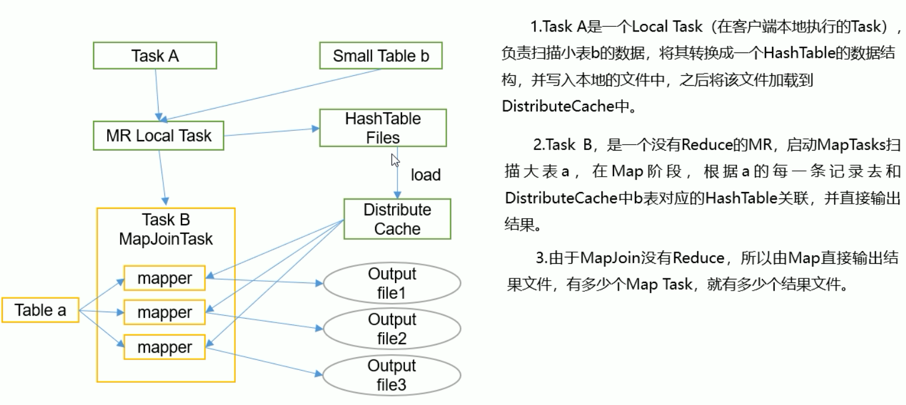
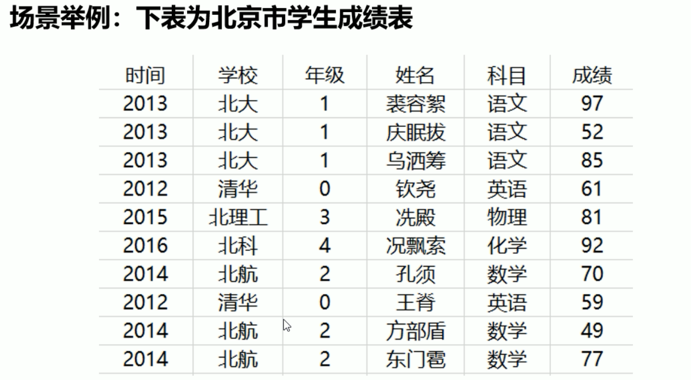

# 面试

## hive的理解和优化策略

- hive的概念

  - 数据仓库工具
  - 数据存储在hdfs
  - 元数据存储在metastore里面
  - 把结构化的文件映射到一张表中

- hive的本质

  - 将HQL语句转换为MR程序
  - MR程序的解析器
  - 基于Hadoop
    - 把HQL转换为MR
    - 调用HDFS上数据
    - 调用Yarn

- 优化策略

  - 表的优化
    - 大表join大表
      - 空key的过滤
      - 空key的转换，随机
  - MapJoin
    - 大表join小表 
      - 小表存储在内存中
    - 只有Map
    - 没有reduce阶段
    - 少了IO
    - 没有数据倾斜
  - GroupBy的优化
    - 设置数据参数，解决数据倾斜
    - 生成2个MR
  - 列过滤
    - 尽量不用select * 
    - 尽量用分区过滤，分目录，指定分区字段
      - 提高查询效率
  - 行过滤
    - 先过滤，再join
  - JVM重用
    - 重点
  - 本地模式
  - 并行执行
  - 压缩

  

## Hive中，建的表为压缩表，输入文件为非压缩格式，会有什么现象和结果

- 如果表为压缩表
  - 要求表中的数据为压缩格式
  - 导入的数据为非压缩格式
- load data方式导入数据
  - 查询表中的数据，无法解析
  - 查询不到表中的数据
- insert  select 方式导入
  - 执行MR程序
  - 将数据压缩后导入表中
  - 可以查询到数据


## mapjoin原理和实际应用

 


## 开窗函数

 

- 需求

  - 分组TOPN ，选出2016年每个学校，每个年级，分数前三的科目
    - 每个学校，每个年级，每个科目的前三
  - 考虑到开窗函数
    - rank
    - dense_rank
    - row_number

  ```sql
  select time,shool,grade,name,subject,score,rank
  from(
      select time,school,grade,name,subject,score,
      row_number() over(
          partition by school, grade ,subject
          order by score desc ) rank
      from tb_score
      where time = 2016
  ) t
  where t.rank <=3;
  ```


# Hive总结

 


## Hive和数据库比较

Hive 和数据库除了拥有类似的查询语言，再无类似之处

- 数据存储位置
  - Hive 存储在 HDFS 
  - 数据库将数据保存在块设备或者本地文件系统中
- 数据更新
  - Hive中不建议对数据的改写
  - 数据库中的数据通常是需要经常进行修改的，
- 执行延迟
  - Hive 执行延迟较高
  - 数据库的执行延迟较低
    - 当然，这个是有条件的，即数据规模较小，当数据规模大到超过数据库的处理能力的时候，Hive的并行计算显然能体现出优势
- 数据规模
  - Hive支持很大规模的数据计算
  - 数据库可以支持的数据规模较小


## 内部表和外部表

- 管理表
  - 当我们删除一个管理表时，Hive也会删除这个表中数据
  - ==管理表不适合和其他工具共享数据==
- 外部表
  - ==删除该表并不会删除掉原始数据==，删除的是表的元数据
- 什么时候用到内部表
  - 在创建临时表的时候


## By区别

- Order By
  - 全局排序，只有一个Reducer
- Sort By
  - 分区内有序
- Distrbute By
  - 类似MR中Partition，进行分区，结合sort by使用
- Cluster By
  - 当Distribute by和Sorts by字段相同时，可以使用Cluster by方式
  - Cluster by除了具有Distribute by的功能外还兼具Sort by的功能
    - 排序只能是升序排序
    - 不能指定排序规则为ASC或者DESC


## 窗口函数

- 窗口函数
  - OVER()
    - 指定分析函数工作的数据窗口大小，这个数据窗口大小可能会随着行的变而变化
    - 常用partition by 分区order by排序
  - CURRENT ROW：当前行
  - n PRECEDING：往前n行数据
  - n FOLLOWING：往后n行数据
  - UNBOUNDED：起点，UNBOUNDED PRECEDING 表示从前面的起点， UNBOUNDED FOLLOWING表示到后面的终点
  - LAG(col,n)：往前第n行数据
  - LEAD(col,n)：往后第n行数据
  - NTILE(n)：把有序分区中的行分发到指定数据的组中，各个组有编号，编号从1开始，对于每一行，NTILE返回此行所属的组的编号。注意：n必须为int类型
- 排序函数
  - RANK() 排序相同时会重复，总数不会变
  - DENSE_RANK() 排序相同时会重复，总数会减少
  - ROW_NUMBER() 会根据顺序计算


## 在项目中是否自定义过UDF、UDTF函数，以及用他们处理了什么问题？

- 自定义过。
- 用UDF函数解析公共字段；用UDTF函数解析事件字段
- 自定义UDF步骤
  - 定义一个类继承UDF，重写evaluate方法
- 自定义UDTF步骤
  - 定义一个类继承GenericUDTF，重写初始化方法、关闭方法和process方法


## Hive优化

- MapJoin
  - 如果不指定MapJoin或者不符合MapJoin的条件，那么Hive解析器会将Join操作转换成Common Join，即：在Reduce阶段完成join。容易发生数据倾斜。可以用MapJoin把小表全部加载到内存在map端进行join，避免reducer处理
- 行列过滤
  - 列处理：在SELECT中，只拿需要的列，如果有，尽量使用分区过滤，少用SELECT *。
  - 行处理：在分区剪裁中，当使用外关联时，如果将副表的过滤条件写在Where后面，那么就会先全表关联，之后再过滤。 
- 采用分桶技术
- 采用分区技术
- 合理设置Map数
  - 通常情况下，作业会通过input的目录产生一个或者多个map任务
    - 主要的决定因素有
      - input的文件总个数，input的文件大小，集群设置的文件块大小
  - 是不是map数越多越好
    - 答案是否定的
    - 如果一个任务有很多小文件（远远小于块大小128m），则每个小文件也会被当做一个块，用一个map任务来完成，而一个map任务启动和初始化的时间远远大于逻辑处理的时间，就会造成很大的资源浪费。而且，同时可执行的map数是受限的。
  - 是不是保证每个map处理接近128m的文件块，就高枕无忧了
    - 答案也是不一定。比如有一个127m的文件，正常会用一个map去完成，但这个文件只有一个或者两个小字段，却有几千万的记录，如果map处理的逻辑比较复杂，用一个map任务去做，肯定也比较耗时
    - 针对上面的问题2和3，我们需要采取两种方式来解决：即减少map数和增加map数；
- 小文件进行合并
  - 在Map执行前合并小文件，减少Map数：CombineHiveInputFormat具有对小文件进行合并的功能（系统默认的格式）。HiveInputFormat没有对小文件合并功能
- 合理设置Reduce数
  - Reduce个数并不是越多越好
    - 过多的启动和初始化Reduce也会消耗时间和资源；
    - 另外，有多少个Reduce，就会有多少个输出文件，如果生成了很多个小文件，那么如果这些小文件作为下一个任务的输入，则也会出现小文件过多的问题；
  - 在设置Reduce个数的时候也需要考虑这两个原则
    - ==处理大数据量利用合适的Reduce数==
    - ==使单个Reduce任务处理数据量大小要合适==
- ==常用参数==
  - 输出合并小文件

```properties
SET hive.merge.mapfiles = true; -- 默认true，在map-only任务结束时合并小文件
SET hive.merge.mapredfiles = true; -- 默认false，在map-reduce任务结束时合并小文件
SET hive.merge.size.per.task = 268435456; -- 默认256M
SET hive.merge.smallfiles.avgsize = 16777216; -- 当输出文件的平均大小小于该值时，启动一个独立的map-reduce任务进行文件merge
```


## 注意使用group进行分组，求count，避免使用distinct出现异常

```sql
select xx,count(1)
from yy
where xx=...
group by xx
```

