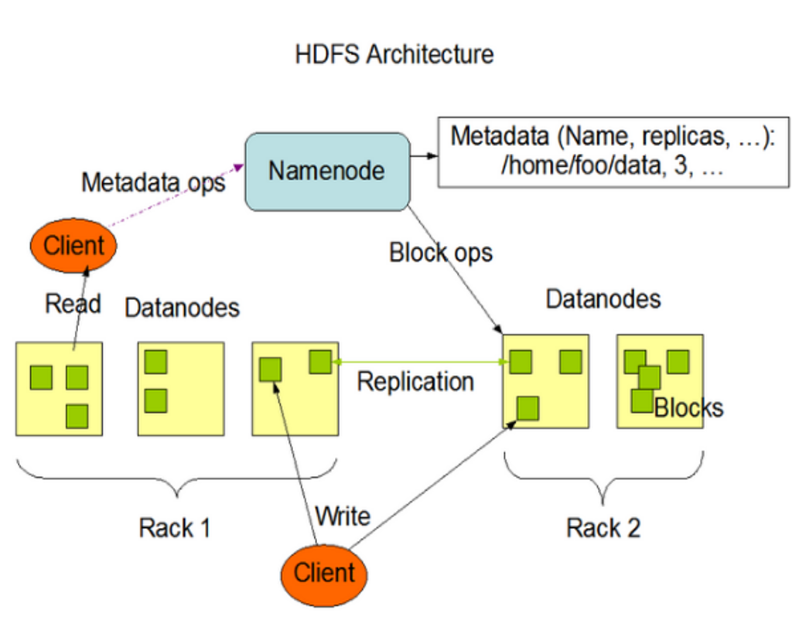
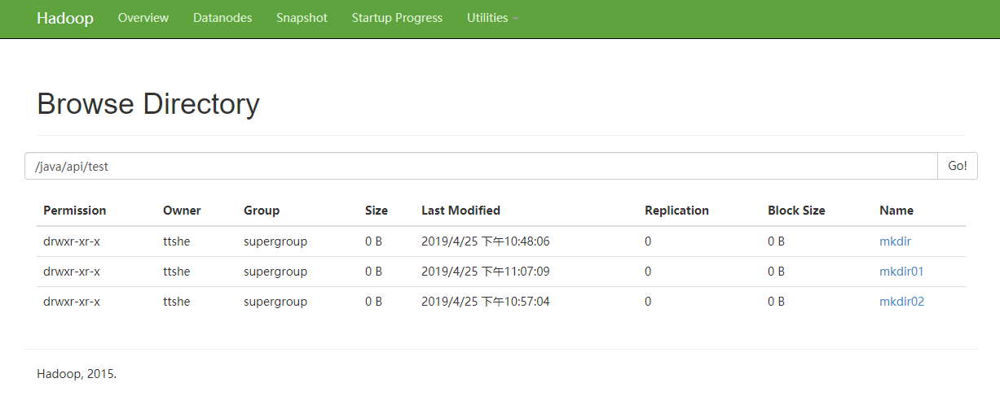

# HDFS学习

> 数据量增大，数据分配到不同的系统中进行存储，那么就需要一个系统来管理多个机器上的文件，这就是分布式文件系统，HDFS是分布式文件系统的一种。


## 概述


### 定义

HDFS Hadoop Distributed File System 是一个文件系统，用于存储文件，通过==目录树==来定位文件，也是一个分布式的系统，由多台服务器组合实现。


### 使用场景

==一次写入，多次读取==的场景，不支持文件修改，适合作为数据分析，不适合做网盘应用


### 优点

- 高容错性

  - 数据自动保存多个副本，通过增加副本的方式提高容错性

  - 某一个副本丢失后，可以自动恢复，当某个副本丢失，重新搭建副本时，可以再次恢复

- 适合处理大数据

  - 数据规模：可以处理数据规模达到GB，TB，PB的数据

  - 文件规模：可以处理==百万==规模以上的文件数量

- 可构建在==廉价==的机器上，通过多副本机制，提高可靠性


### 缺点

- ==不适合低延时==的数据访问，比如毫秒级别的存储数据
- 无法高效的对大量的==小文件==进行存储
  - 原因
    - 如果存储大量小文件，会占用NameNode大量内存来存储文件信息和块信息，但是NameNode本身是有存储限制的。
    - 小文件存储的寻址时间会超过读取时间，违反了HDFS的设计目标
- ==不支持并发写入==，不支持文件随机修改
  - 一个文件只能有一个写入操作，不允许有多个线程同时写同一个文件
  - ==仅支持数据append(追加)==，不支持文件随机修改


### 组成架构



#### NameNode

> nn 作为master，是一个主管，管理者

- 管理HDFS的名称空间
- 配置副本策略
- 管理数据块（Block）映射信息
- 处理客户端读写请求


#### DataNode

> slave，NameNode下发命令，DataNode执行实际的操作

- 存储实际的数据块
- 执行数据块的读写操作


#### SecondaryNameNode

> 不是NameNode的热备份，当NameNode挂掉的时候，并不能马上替换NameNode并提供服务，当恢复成NameNode的时候，会有数据丢失的情况

- 辅助NameNode，分担工作量，定期合并Fsimage和Edits，并推送给NameNode
- 在紧急情况下，可辅助恢复NameNode


#### Client

> 客户端，shell，api调用的客户端命令

- 文件切分，文件上传到HDFS的时候，Client将文件切分成一个个的Block，然后上传
- 与NameNode交互，获取文件位置信息
- 与DataNode交互，读取或者写入数据
- 提供一些命令管理HDFS，如NameNode的格式化
- 提供一些命令访问HDFS，如对HDFS增删改查操作


### 关于Block大小定义

HDFS 中文件在物理上是分块存储的（Block），块的大小是通过配置参数（dfs.blocksize）进行配置

- 默认大小在Hadoop2.x版本中是128Mb
- 在Hadoop1.x版本中的大小是64Mb


#### 定义背景

- 如果寻址的时间约为10ms，即查找到目标的block的时间是10ms
- ==寻址的时间为网络访问传输时间的1%，则为最佳状态==，那么网络访问时间长为1s（10ms/0.01=1s）
- 磁盘的传输速率普通速率为100Mb/s
- 那么在1s内可以访问的数据量大小是100Mb左右，因此一个Block大小定义为128Mb
- 如果固态硬盘，传输速率可以达到300Mb/s，那么Block就大小就可以设定为256Mb


#### 为什么块大小不能设置太小或者太大

- HDFS的块设置太小，==会增加寻址块的时间==，程序可能会一直在查找块的位置

- HDFS的块设置太大，从==磁盘传输数据的时间==会明显==大于定位这个块开始位置的时间==，导致程序在处理这个块的数据的时候，会变慢。

- HDFS块的大小设置主要取决于==磁盘的传输速率==


## shell操作


### 基本语法

```shell
# 写法1
bin/hadoop fs <具体命令>
# 写法2
bin/hdfs dfs <具体命令>
```


### 命令大全

```shell
[root@hadoop102 hadoop-2.7.2]# bin/hadoop fs
Usage: hadoop fs [generic options]
	[-appendToFile <localsrc> ... <dst>]
	[-cat [-ignoreCrc] <src> ...]
	[-checksum <src> ...]
	[-chgrp [-R] GROUP PATH...]
	[-chmod [-R] <MODE[,MODE]... | OCTALMODE> PATH...]
	[-chown [-R] [OWNER][:[GROUP]] PATH...]
	[-copyFromLocal [-f] [-p] [-l] <localsrc> ... <dst>]
	[-copyToLocal [-p] [-ignoreCrc] [-crc] <src> ... <localdst>]
	[-count [-q] [-h] <path> ...]
	[-cp [-f] [-p | -p[topax]] <src> ... <dst>]
	[-createSnapshot <snapshotDir> [<snapshotName>]]
	[-deleteSnapshot <snapshotDir> <snapshotName>]
	[-df [-h] [<path> ...]]
	[-du [-s] [-h] <path> ...]
	[-expunge]
	[-find <path> ... <expression> ...]
	[-get [-p] [-ignoreCrc] [-crc] <src> ... <localdst>]
	[-getfacl [-R] <path>]
	[-getfattr [-R] {-n name | -d} [-e en] <path>]
	[-getmerge [-nl] <src> <localdst>]
	[-help [cmd ...]]
	[-ls [-d] [-h] [-R] [<path> ...]]
	[-mkdir [-p] <path> ...]
	[-moveFromLocal <localsrc> ... <dst>]
	[-moveToLocal <src> <localdst>]
	[-mv <src> ... <dst>]
	[-put [-f] [-p] [-l] <localsrc> ... <dst>]
	[-renameSnapshot <snapshotDir> <oldName> <newName>]
	[-rm [-f] [-r|-R] [-skipTrash] <src> ...]
	[-rmdir [--ignore-fail-on-non-empty] <dir> ...]
	[-setfacl [-R] [{-b|-k} {-m|-x <acl_spec>} <path>]|[--set <acl_spec> <path>]]
	[-setfattr {-n name [-v value] | -x name} <path>]
	[-setrep [-R] [-w] <rep> <path> ...]
	[-stat [format] <path> ...]
	[-tail [-f] <file>]
	[-test -[defsz] <path>]
	[-text [-ignoreCrc] <src> ...]
	[-touchz <path> ...]
	[-truncate [-w] <length> <path> ...]
	[-usage [cmd ...]]

Generic options supported are
-conf <configuration file>     specify an application configuration file
-D <property=value>            use value for given property
-fs <local|namenode:port>      specify a namenode
-jt <local|resourcemanager:port>    specify a ResourceManager
-files <comma separated list of files>    specify comma separated files to be copied to the map reduce cluster
-libjars <comma separated list of jars>    specify comma separated jar files to include in the classpath.
-archives <comma separated list of archives>    specify comma separated archives to be unarchived on the compute machines.

The general command line syntax is
bin/hadoop command [genericOptions] [commandOptions]
```


### 常用命令

> 先启动Hadoop集群
> sbin/start-dfs.sh
> sbin/start-yarn.sh


#### -help

```shell
# 输出这个命令参数
[ttshe@hadoop102 hadoop-2.7.2]# hadoop fs -help rm
-rm [-f] [-r|-R] [-skipTrash] <src> ... :
  Delete all files that match the specified file pattern. Equivalent to the Unix
  command "rm <src>"
                                                                                 
  -skipTrash  option bypasses trash, if enabled, and immediately deletes <src>   
  -f          If the file does not exist, do not display a diagnostic message or 
              modify the exit status to reflect an error.                        
  -[rR]       Recursively deletes directories
```


#### -ls

```shell
# 显示目录信息
[ttshe@hadoop102 hadoop-2.7.2]# hadoop fs -ls /
Found 2 items
drwx------   - ttshe supergroup          0 2019-04-21 15:17 /tmp
drwxr-xr-x   - ttshe supergroup          0 2019-04-21 14:51 /user
[ttshe@hadoop102 hadoop-2.7.2]# hadoop fs -ls /user
Found 1 items
drwxr-xr-x   - ttshe supergroup          0 2019-04-21 15:17 /user/ttshe
```


#### -mkdir

```shell
# 在HDFS 上创建目录
[ttshe@hadoop102 hadoop-2.7.2]$ hadoop fs -mkdir -p /dir01/dir02
# -p 表示如果文件已经存在则忽略创建，不报错
```


#### -moveFromLocal

```shell
# 从本地剪切到HDFS
# 创建一个文件
[ttshe@hadoop102 hadoop-2.7.2]$ touch test.txt
# 将该文件从本地放入HDFS中
[ttshe@hadoop102 hadoop-2.7.2]$ hadoop fs -moveFromLocal ./test.txt /dir01/dir02
[ttshe@hadoop102 hadoop-2.7.2]$ hadoop fs -ls /dir01/dir02
Found 1 items
-rw-r--r--   3 ttshe supergroup          0 2019-04-22 22:11 /dir01/dir02/test.txt
```


#### -appendToFile

```shell
# 追加一个文件到已经存在的文件末尾
# 创建一个文件，并填写内容，再追加到test.txt中
[ttshe@hadoop102 hadoop-2.7.2]$ touch test02.txt
[ttshe@hadoop102 hadoop-2.7.2]$ vi test02.txt
[ttshe@hadoop102 hadoop-2.7.2]$ cat test02.txt 
hello hadoop hdfs
[ttshe@hadoop102 hadoop-2.7.2]$ hadoop fs -appendToFile test02.txt /dir01/dir02/test.txt
[ttshe@hadoop102 hadoop-2.7.2]$ hadoop fs -cat /dir01/dir02/test.txt
hello hadoop hdfs
```


#### -cat

```shell
# 显示文件内容
[ttshe@hadoop102 hadoop-2.7.2]$ hadoop fs -cat /dir01/dir02/test.txt
hello hadoop hdfs
```


#### -chgrp，-chmod，-chown

```shell
# 修改文件所属权限
[ttshe@hadoop102 hadoop-2.7.2]$ hadoop fs -ls /dir01/dir02
Found 1 items
-rw-r--r--   3 ttshe supergroup         18 2019-04-22 22:13 /dir01/dir02/test.txt
[ttshe@hadoop102 hadoop-2.7.2]$ hadoop fs -chmod 666 /dir01/dir02/test.txt
[ttshe@hadoop102 hadoop-2.7.2]$ hadoop fs -chown ttshe:ttshe /dir01/dir02/test.txt
[ttshe@hadoop102 hadoop-2.7.2]$ hadoop fs -ls /dir01/dir02
Found 1 items
-rw-rw-rw-   3 ttshe ttshe         18 2019-04-22 22:13 /dir01/dir02/test.txt
```


#### -copyFromLocal

```shell
# 从本地文件系统拷贝到HDFS路径中
[ttshe@hadoop102 hadoop-2.7.2]$ hadoop fs -copyFromLocal README.txt /user/ttshe/
```


#### -copyToLocal

```shell
# 从HDFS 拷贝到本地
[ttshe@hadoop102 hadoop-2.7.2]$ hadoop fs -copyToLocal /dir01/dir02/test.txt /opt/software/
```


#### -cp

```shell
# 从HDFS的一个路径拷贝到HDFS的另一个路径
[ttshe@hadoop102 hadoop-2.7.2]$ hadoop fs -cp /user/ttshe/README.txt /user/
```


#### -mv

```shell
# 在HDFS中移动文件
[ttshe@hadoop102 hadoop-2.7.2]$ hadoop fs -mv /user/README.txt /dir01/dir02/
[ttshe@hadoop102 hadoop-2.7.2]$ hadoop fs -ls /user
Found 1 items
drwxr-xr-x   - ttshe supergroup          0 2019-04-22 22:56 /user/ttshe
[ttshe@hadoop102 hadoop-2.7.2]$ hadoop fs -ls /dir01/dir02
Found 2 items
-rw-r--r--   3 ttshe supergroup       1366 2019-04-22 22:57 /dir01/dir02/README.txt
-rw-rw-rw-   3 ttshe ttshe              18 2019-04-22 22:13 /dir01/dir02/test.txt
```


#### -get = copyToLocal

```shell
# 等同于copyToLocal，从HDFS的文件下载到本地
[ttshe@hadoop102 hadoop-2.7.2]$ hadoop fs -get /dir01/dir02/README.txt /opt/software/
```


#### -getmerge

```shell
# 合并下载多个文件，如HDFS目录/dir01/dir02/下有多个文件，合并成一个文件输出
[ttshe@hadoop102 hadoop-2.7.2]$ hadoop fs -getmerge /dir01/dir02/* /opt/software/merge.txt
```


#### -put = copyFromLocal

```shell
[ttshe@hadoop102 hadoop-2.7.2]$ hadoop fs -put /opt/software/merge.txt /dir01/dir02/
[ttshe@hadoop102 hadoop-2.7.2]$ hadoop fs -ls /dir01/dir02
Found 3 items
-rw-r--r--   3 ttshe supergroup       1366 2019-04-22 22:57 /dir01/dir02/README.txt
-rw-r--r--   3 ttshe supergroup       1384 2019-04-22 23:11 /dir01/dir02/merge.txt
-rw-rw-rw-   3 ttshe ttshe              18 2019-04-22 22:13 /dir01/dir02/test.txt
```


#### -tail

```shell
# 显示一个文件的末尾1kb的信息
[ttshe@hadoop102 hadoop-2.7.2]$ hadoop fs -tail -f /dir01/dir02/merge.txt
# -f 表示也显示增长的信息
```


#### -rm

```shell
# 删除文件或文件夹
[ttshe@hadoop102 hadoop-2.7.2]$ hadoop fs -rm /dir01/dir02/merge.txt
19/04/22 23:14:59 INFO fs.TrashPolicyDefault: Namenode trash configuration: Deletion interval = 0 minutes, Emptier interval = 0 minutes.
Deleted /dir01/dir02/merge.txt
```


#### -rmdir

```shell
# 删除空目录，注意非空目录
[ttshe@hadoop102 hadoop-2.7.2]$ hadoop fs -rmdir /dir01/dir02
rmdir: `/dir01/dir02': Directory is not empty
[ttshe@hadoop102 hadoop-2.7.2]$ hadoop fs -mkdir /test
[ttshe@hadoop102 hadoop-2.7.2]$ hadoop fs -rmdir /test
# -p  Do not fail if the directory already exists 
```


#### -du

```shell
# 统计文件夹的大小信息
[ttshe@hadoop102 hadoop-2.7.2]$ hadoop fs -du -s -h /dir01/dir02/
1.4 K  /dir01/dir02
[ttshe@hadoop102 hadoop-2.7.2]$ hadoop fs -du -h /dir01/dir02/
1.3 K  /dir01/dir02/README.txt
18     /dir01/dir02/test.txt
```

参数描述

```shell
  -s  Rather than showing the size of each individual file that matches the      
      pattern, shows the total (summary) size.                                   
  -h  Formats the sizes of files in a human-readable fashion rather than a number
      of bytes.                                                                  
  Note that, even without the -s option, this only shows size summaries one level
  deep into a directory.
```


#### -setrep

> 这里设置的副本只是记录在NameNode的元数据中，真实的副本集的个数要以DataNode为准，DataNode的个数是3个，那么副本最多是3个，增加DataNode个数才会增加副本个数。

```shell
# 设置HDFS 中文件的副本数量
[ttshe@hadoop102 hadoop-2.7.2]$ hadoop fs -setrep 10 /dir01/dir02/test.txt
Replication 10 set: /dir01/dir02/test.txt
```


## 客户端操作（开发重点）

### 环境准备

- 依据电脑环境，将对应编译后的hadoop.jar包解压在非中文路径下，并且配置HADOOP_HOME的环境变量。这里使用的是win10环境编译的hadoop.jar包

- 配置环境变量HADOOP_HOME=D:\dev-tools\hadoop-2.7.2，配置%HADOOP_HOME%\bin

- 创建一个maven工程
- 添加依赖

```xml
<dependencies>
		<dependency>
			<groupId>junit</groupId>
			<artifactId>junit</artifactId>
			<version>RELEASE</version>
		</dependency>
		<dependency>
			<groupId>org.apache.logging.log4j</groupId>
			<artifactId>log4j-core</artifactId>
			<version>2.8.2</version>
		</dependency>
		<dependency>
			<groupId>org.apache.hadoop</groupId>
			<artifactId>hadoop-common</artifactId>
			<version>2.7.2</version>
		</dependency>
		<dependency>
			<groupId>org.apache.hadoop</groupId>
			<artifactId>hadoop-client</artifactId>
			<version>2.7.2</version>
		</dependency>
		<dependency>
			<groupId>org.apache.hadoop</groupId>
			<artifactId>hadoop-hdfs</artifactId>
			<version>2.7.2</version>
		</dependency>
		<dependency>
			<groupId>jdk.tools</groupId>
			<artifactId>jdk.tools</artifactId>
			<version>1.8</version>
			<scope>system</scope>
			<systemPath>${JAVA_HOME}/lib/tools.jar</systemPath>
		</dependency>
</dependencies>
```


### HDFS的API操作

#### 创建文件夹

- 方式1：在运行的VM上配置用户名，在代码中不指定用户名，需要额外的配置，如下


- 方式2：在代码中添加用户名（推荐）

```java
package com.stt.demo.hdfs.api;

import org.apache.hadoop.conf.Configuration;
import org.apache.hadoop.fs.FileSystem;
import org.apache.hadoop.fs.Path;
import org.junit.Test;

import java.io.IOException;
import java.net.URI;
import java.net.URISyntaxException;

/**
 * 使用api的方式在hdfs上创建目录
 * Created by Administrator on 2019/4/25.
 */
public class D01_mkdir {
	/**
	 * 运行方式1，需要在VM options添加配置-DHADOOP_USER_NAME=ttshe
	 * @throws IOException
	 */
	@Test
	public void handle1() throws IOException {
		// 获取文件系统
		Configuration configuration = new Configuration();
		// 配置在集群上运行，注意这里配置的信息是core-site.xml上的NameNode的信息
		configuration.set("fs.defaultFS","hdfs://hadoop102:9000");
		// 设置文件系统用户
		FileSystem fs = FileSystem.get(configuration);
		// 创建目录
		fs.mkdirs(new Path("/java/api/test/mkdir01"));
		// 关闭资源
		fs.close();
	}
	/**
	 * 运行方式2
	 * @throws URISyntaxException
	 * @throws IOException
	 * @throws InterruptedException
	 */
	@Test
	public void handle2() throws URISyntaxException, IOException, InterruptedException {
		// 获取文件系统
		Configuration configuration = new Configuration();
		// 设置文件系统用户
		FileSystem fs = FileSystem.get(new URI("hdfs://hadoop102:9000"), configuration, "ttshe");
		// 创建目录
		fs.mkdirs(new Path("/java/api/test/mkdir02"));
		// 关闭资源
		fs.close();
	}
}
```

运行完成在http://hadoop102:50070/explorer.html#/java/api/test 可以看到结果如下




#### 文件上传


#### 文件下载


#### 文件夹删除


#### 文件名更改


#### 文件详情查看


#### 文件和文件夹判断


### HDFS的IO操作


#### 文件上传


#### 文件下载


#### 定位文件读取


## 数据流


## NameNode 与 SecondaryNameNode


## DataNode


## HDFS2.x新特性


## HDFS HA 高可用