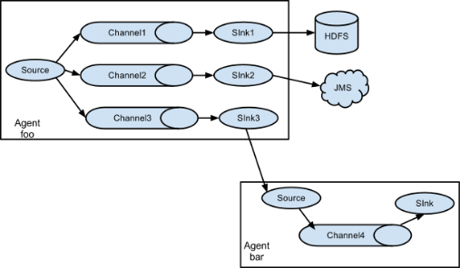
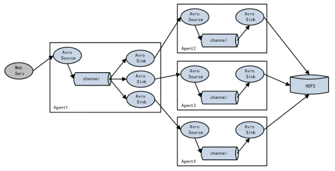
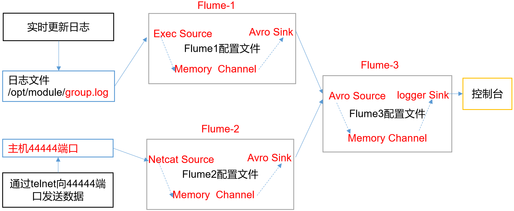

- flume封装的比较齐备，大部分场景下只需要写配置文件即可
- flume支持导入文本数据格式
  - log
  - txt


# 官方案例

- 需求
  - 首先启动Flume任务，监控本机44444端口，服务端
  - 然后通过netcat工具向本机44444端口发送消息，客户端
  - 最后Flume将监听的数据实时显示在控制台


## 安装netcat

- 也可使用telnet
- 安装netcat

```bash
[ttshe@hadoop102 module]$ sudo yum install -y nc
```


## 判断端口占用

- 判断44444端口是否被占用

```bash
[ttshe@hadoop102 module]$ sudo netstat -tunlp | grep 44444
```

- netstat功能描述
  - 是一个监控TCP/IP网络的非常有用的工具，可显示路由表、实际的网络连接以及每一个网络接口设备的状态信息。
  - 基本语法
    - netstat [选项]
  - 选项参数
    - -t或--tcp
      - 显示TCP传输协议的连线状况
    - -u或--udp
      - 显示UDP传输协议的连线状况
    - -n或--numeric
      - 直接使用ip地址，而不通过域名服务器
    - -l或--listening
      - 显示监控中的服务器的Socket
    - -p或--programs
      - 显示正在使用Socket的程序识别码（PID）和程序名称


## 创建配置文件

- 参考http://flume.apache.org/FlumeUserGuide.html
- 在flume目录下创建job文件夹

```bash
[ttshe@hadoop102 flume]$ mkdir job
```

- 在job文件夹下创建Flume Agent配置文件flume-netcat-logger.conf

```bash
[ttshe@hadoop102 flume]$ cd job
[ttshe@hadoop102 job]$ vim flume-netcat-logger.conf 
```

- 在flume-netcat-logger.conf文件中添加如下内容
  - 需要用面向对象的思想考虑配置文件的组成

```bash
# Name the components on this agent 
# a1 表示agent的对象的名称
# 注意这里的source 与 sink以及channel是复数，使用空格可以配置多个
a1.sources = r1  # r1 表示a1 的输入源
a1.sinks = k1    # k1 表示a1 的输出目的地
a1.channels = c1 # c1 表示a1 的缓冲区

# Describe/configure the source
a1.sources.r1.type = netcat    # 表示a1的输入源类型为netcat 端口类型
a1.sources.r1.bind = localhost # 表示a1的监听的主机
a1.sources.r1.port = 44444     # 表示a1的监听的端口号

# Describe the sink
a1.sinks.k1.type = logger # 表示a1的输出目的地是控制台logger类型，type类型与执行命令的type相对应

# Use a channel which buffers events in memory
a1.channels.c1.type = memory   # 表示a1的channel类型是memory内存类型
a1.channels.c1.capacity = 1000 # a1 的 channel总容量是1000个event
# 传输容量是指take与put中的list的大小，此处是100，而capacity是1000，那么操作10次可以完成数据的传输
a1.channels.c1.transactionCapacity = 100 # a1 的channel传输时收集到了100个event后再去提交事务

# Bind the source and sink to the channel
a1.sources.r1.channels = c1 # 表示将r1和c1 连接起来，channels说明一个sources可以添加多个channel
a1.sinks.k1.channel = c1 # 表示将k1和c1 连接起来，注意这里的channel是单数，说明sink只能和一个channel通信
```


## 查看帮助

```bash
[ttshe@hadoop102 flume]$ bin/flume-ng help
Usage: bin/flume-ng <command> [options]...

commands:
  help                      display this help text
  agent                     run a Flume agent
  avro-client               run an avro Flume client
  version                   show Flume version info

global options:
  --conf,-c <conf>          use configs in <conf> directory
  --classpath,-C <cp>       append to the classpath
  --dryrun,-d               do not actually start Flume, just print the command
  --plugins-path <dirs>     colon-separated list of plugins.d directories. See the
                            plugins.d section in the user guide for more details.
                            Default: $FLUME_HOME/plugins.d
  -Dproperty=value          sets a Java system property value
  -Xproperty=value          sets a Java -X option

agent options:
  --name,-n <name>          the name of this agent (required)
  --conf-file,-f <file>     specify a config file (required if -z missing)
  --zkConnString,-z <str>   specify the ZooKeeper connection to use (required if -f missing)
  --zkBasePath,-p <path>    specify the base path in ZooKeeper for agent configs
  --no-reload-conf          do not reload config file if changed
  --help,-h                 display help text

avro-client options:
  --rpcProps,-P <file>   RPC client properties file with server connection params
  --host,-H <host>       hostname to which events will be sent
  --port,-p <port>       port of the avro source
  --dirname <dir>        directory to stream to avro source
  --filename,-F <file>   text file to stream to avro source (default: std input)
  --headerFile,-R <file> File containing event headers as key/value pairs on each new line
  --help,-h              display help text

  Either --rpcProps or both --host and --port must be specified.

Note that if <conf> directory is specified, then it is always included first
in the classpath.
```


## 执行命令

- 写法1
  - --name
    - 指定agent对象的名称为a1
  - --conf
    - 读取全局配置
    - 本次启动读取的配置文件是在job文件夹下的flume-telnet.conf文件
  - --conf-file
    - 读取本地agent的job的配置
  - -Dflume.root.logger=INFO,console
    - -D表示flume运行时动态修改flume.root.logger参数属性值
    - 将控制台日志打印级别设置为INFO级别
      - 日志级别包括:log、info、warn、error

```bash
[ttshe@hadoop102 flume]$ bin/flume-ng agent --conf conf/ --name a1 --conf-file job/flume-netcat-logger.conf -Dflume.root.logger=INFO,console
```

- 写法2

```bash
[ttshe@hadoop102 flume]$ bin/flume-ng agent -c conf/ -n a1 –f job/flume-netcat-logger.conf -Dflume.root.logger=INFO,console
```


## 测试

- 使用netcat工具向本机的44444端口发送内容

```bash
[ttshe@hadoop102 module]$ nc localhost 44444
hello flume
OK
```

- 查看接收的数据

```bash
2019-09-11 16:01:36,617 (SinkRunner-PollingRunner-DefaultSinkProcessor) [INFO - org.apache.flume.sink.LoggerSink.process(LoggerSink.java:95)] Event: { headers:{} body: 68 65 6C 6C 6F 20 66 6C 75 6D 65                hello flume }
```

- telnet hadoop102 44444， flume也可以接收到


# 实时读取本地文件到HDFS

- 需求
  - 实时监控Hive日志，并上传到HDFS中

 


## 配置Hadoop的jar包

- Flume要想将数据输出到HDFS，必须持有Hadoop相关jar包，拷贝到`/opt/module/flume/lib`文件夹下
  - commons-configuration-1.6.jar
  - hadoop-auth-2.7.2.jar
  - hadoop-common-2.7.2.jar
  - hadoop-hdfs-2.7.2.jar
  - commons-io-2.4.jar
  - htrace-core-3.1.0-incubating.jar


## 创建配置文件

```bash
[ttshe@hadoop102 job]$ vim flume-file-hdfs.conf
```

```bash
# Name the components on this agent
a2.sources = r2
a2.sinks = k2
a2.channels = c2

# Describe/configure the source
a2.sources.r2.type = exec
a2.sources.r2.command = tail -F /opt/module/hive/logs/hive.log
# 可忽略不写
a2.sources.r2.shell = /bin/sh -c 

# Describe the sink
a2.sinks.k2.type = hdfs
# 在hdfs创建相应的文件夹，动态创建，以 年月日/小时 的目录结构
a2.sinks.k2.hdfs.path = hdfs://hadoop102:9000/flume/log/%Y%m%d/%H
#上传文件的前缀
a2.sinks.k2.hdfs.filePrefix = logs-
#是否按照时间滚动文件夹
a2.sinks.k2.hdfs.round = true
#多少时间单位创建一个新的文件夹
a2.sinks.k2.hdfs.roundValue = 1
#重新定义时间单位
a2.sinks.k2.hdfs.roundUnit = hour
#是否使用本地时间戳 ***
a2.sinks.k2.hdfs.useLocalTimeStamp = true
#积攒多少个Event才flush到HDFS一次
a2.sinks.k2.hdfs.batchSize = 1000
#设置文件类型，可支持压缩
a2.sinks.k2.hdfs.fileType = DataStream
#多久生成一个新的文件 单位s
a2.sinks.k2.hdfs.rollInterval = 600
#设置每个文件的滚动大小
a2.sinks.k2.hdfs.rollSize = 134217700
#文件的滚动与Event数量无关
a2.sinks.k2.hdfs.rollCount = 0

# Use a channel which buffers events in memory
a2.channels.c2.type = memory
a2.channels.c2.capacity = 1000
a2.channels.c2.transactionCapacity = 100

# Bind the source and sink to the channel
a2.sources.r2.channels = c2
a2.sinks.k2.channel = c2
```

- 要想读取Linux系统中的文件，要按照Linux命令的规则执行命令
- 由于Hive日志在Linux系统中所以读取文件的类型选择
  - exec
    - execute执行的意思
    - 表示执行Linux命令来读取文件
- 对于所有与时间相关的转义序列，Event Header中必须存在以 “timestamp”的key
  - 除非hdfs.useLocalTimeStamp设置为true
  - 此方法会使用TimestampInterceptor自动添加timestamp
  - ==a3.sinks.k3.hdfs.useLocalTimeStamp = true==


## 启动flume

```bash
[ttshe@hadoop102 flume]$ bin/flume-ng agent --conf conf/ --name a2 --conf-file job/flume-file-hdfs.conf
```

- 开启Hadoop和Hive并操作Hive产生日志

```bash
[ttshe@hadoop102 hadoop-2.7.2]$ sbin/start-dfs.sh
[ttshe@hadoop103 hadoop-2.7.2]$ sbin/start-yarn.sh

[ttshe@hadoop102 hive]$ bin/hive
hive (default)>
```

- 在HDFS上查看文件

 


# 实时读取目录文件到HDFS

- 需求

  - 使用Flume监听整个目录的文件

  - 前提是该文件是滚动更新的

  - 当监听的文件夹有xxx.log文件生成，则上传到flume，flume将该文件重命名为xxx.log.COMPLETED

    - 防止重复上传

  - 而正在写入的文件yyy.log.tmp则会被忽略，一旦.tmp文件成为了.log文件，flume就会上传到hdfs

    

 


## 创建配置文件

- type
  - spooldir
    - 滚动文件夹
  - fileSuffix
    - 后缀
    - 表示文件处理完

```bash
[ttshe@hadoop102 job]$ touch flume-dir-hdfs.conf
[ttshe@hadoop102 job]$ vim flume-dir-hdfs.conf
```

```bash
a3.sources = r3
a3.sinks = k3
a3.channels = c3

# Describe/configure the source
a3.sources.r3.type = spooldir
a3.sources.r3.spoolDir = /opt/module/flume/upload
a3.sources.r3.fileSuffix = .COMPLETED
a3.sources.r3.fileHeader = true
#忽略所有以.tmp结尾的文件，不上传,注意^ 后面的空格
a3.sources.r3.ignorePattern = ([^ ]*\.tmp)

# Describe the sink
a3.sinks.k3.type = hdfs
a3.sinks.k3.hdfs.path = hdfs://hadoop102:9000/flume/upload/%Y%m%d/%H
#上传文件的前缀
a3.sinks.k3.hdfs.filePrefix = upload-
#是否按照时间滚动文件夹
a3.sinks.k3.hdfs.round = true
#多少时间单位创建一个新的文件夹
a3.sinks.k3.hdfs.roundValue = 1
#重新定义时间单位
a3.sinks.k3.hdfs.roundUnit = hour
#是否使用本地时间戳
a3.sinks.k3.hdfs.useLocalTimeStamp = true
#积攒多少个Event才flush到HDFS一次
a3.sinks.k3.hdfs.batchSize = 100
#设置文件类型，可支持压缩
a3.sinks.k3.hdfs.fileType = DataStream
#多久生成一个新的文件，单位s
a3.sinks.k3.hdfs.rollInterval = 60
#设置每个文件的滚动大小大概是128M
a3.sinks.k3.hdfs.rollSize = 134217700
#文件的滚动与Event数量无关
a3.sinks.k3.hdfs.rollCount = 0

# Use a channel which buffers events in memory
a3.channels.c3.type = memory
a3.channels.c3.capacity = 1000
a3.channels.c3.transactionCapacity = 100

# Bind the source and sink to the channel
a3.sources.r3.channels = c3
a3.sinks.k3.channel = c3
```


## 启动flume测试

- 创建上传文件夹

```bash
[ttshe@hadoop102 flume]$ mkdir upload
```

- 启动

```bash
bin/flume-ng agent -c conf/ -n a3 -f job/flume-dir-hdfs.conf
```

- 在upload文件夹中放入文件
  - flume扫描到了文件会给该文件重命名

```bash
[ttshe@hadoop102 upload]$ touch abc.log
[ttshe@hadoop102 upload]$ ll
总用量 0
-rw-rw-r--. 1 ttshe ttshe 0 9月  11 18:05 abc.log.COMPLETED
```

 


## 注意

- 如果存放的文件格式不支持，flume会报错，导致再添加支持的格式的文件也没有办法继续运行
- 解决：删除问题文件，重启flume
- 如果创建了2个一样的文件，一前一后，也会运行失败，需要重启

```bash
java.lang.IllegalStateException: File name has been re-used with different files. Spooling assumptions violated for /opt/module/flume/upload/abc.log.COMPLETED
```


# 单数据源多出口案例 (复制，选择器)

 

- 需求
  - 使用Flume-1监控文件变动
  - Flume-1将变动内容传递给Flume-2
    - Flume-2负责存储到HDFS
  - Flume-1将变动内容传递给Flume-3
    - Flume-3负责输出到Local FileSystem

  

## 关于Avro

- 用于agent之间传递数据
- ==数据格式是json==
- 由Hadoop创始人Doug Cutting创建的一种语言无关的数据序列化和RPC框架
  - RPC
    - Remote Procedure Call
    - 远程过程调用
    - 一种通过网络从远程计算机程序上请求服务
    - 不需要了解底层网络技术的协议


## 配置文件

- 在flume/job/下创建group文件夹

```bash
[ttshe@hadoop102 job]$ mkdir group
[ttshe@hadoop102 job]$ cd group/
```


### flume-avro-flume.conf

- 配置1个接收日志文件的source和两个channel、两个sink
- 分别输送给flume-avro-hdfs和flume-avro-dir
- 参数
  - a1.sources.r1.selector.type

```bash
[ttshe@hadoop102 group]$ vim flume-avro-flume.conf
```

```bash
# Name the components on this agent
a1.sources = r1
a1.sinks = k1 k2
a1.channels = c1 c2
# 将数据流复制给所有channel ***
# 还有multiplexing,用于自定义规则选择不同的channel
a1.sources.r1.selector.type = replicating

# Describe/configure the source
a1.sources.r1.type = exec
a1.sources.r1.command = tail -F /opt/module/hive/logs/hive.log
a1.sources.r1.shell = /bin/sh -c

# Describe the sink
# sink端的avro是一个数据发送者
a1.sinks.k1.type = avro
a1.sinks.k1.hostname = hadoop102 
a1.sinks.k1.port = 4141

a1.sinks.k2.type = avro
a1.sinks.k2.hostname = hadoop102
a1.sinks.k2.port = 4142

# Describe the channel
a1.channels.c1.type = memory
a1.channels.c1.capacity = 1000
a1.channels.c1.transactionCapacity = 100

a1.channels.c2.type = memory
a1.channels.c2.capacity = 1000
a1.channels.c2.transactionCapacity = 100

# Bind the source and sink to the channel
a1.sources.r1.channels = c1 c2
a1.sinks.k1.channel = c1
a1.sinks.k2.channel = c2
```


### flume-avro-hdfs.conf

- 配置上级Flume输出的Source，输出是到HDFS的Sink

```bash
[ttshe@hadoop102 group]$ vim flume-avro-hdfs.conf
```

```bash
# Name the components on this agent
a2.sources = r1
a2.sinks = k1
a2.channels = c1

# Describe/configure the source
# source端的avro是一个数据接收服务
a2.sources.r1.type = avro
a2.sources.r1.bind = hadoop102
a2.sources.r1.port = 4141

# Describe the sink
a2.sinks.k1.type = hdfs
a2.sinks.k1.hdfs.path = hdfs://hadoop102:9000/flume2/%Y%m%d/%H
#上传文件的前缀
a2.sinks.k1.hdfs.filePrefix = flume2-
#是否按照时间滚动文件夹
a2.sinks.k1.hdfs.round = true
#多少时间单位创建一个新的文件夹
a2.sinks.k1.hdfs.roundValue = 1
#重新定义时间单位
a2.sinks.k1.hdfs.roundUnit = hour
#是否使用本地时间戳
a2.sinks.k1.hdfs.useLocalTimeStamp = true
#积攒多少个Event才flush到HDFS一次
a2.sinks.k1.hdfs.batchSize = 100
#设置文件类型，可支持压缩
a2.sinks.k1.hdfs.fileType = DataStream
#多久生成一个新的文件
a2.sinks.k1.hdfs.rollInterval = 600
#设置每个文件的滚动大小大概是128M
a2.sinks.k1.hdfs.rollSize = 134217700
#文件的滚动与Event数量无关
a2.sinks.k1.hdfs.rollCount = 0

# Describe the channel
a2.channels.c1.type = memory
a2.channels.c1.capacity = 1000
a2.channels.c1.transactionCapacity = 100

# Bind the source and sink to the channel
a2.sources.r1.channels = c1
a2.sinks.k1.channel = c1
```


### flume-avro-dir.conf

- 配置上级Flume输出的Source，输出是到本地目录的Sink

```bash
[ttshe@hadoop102 group]$ vim flume-avro-dir.conf
```

```bash
# Name the components on this agent
a3.sources = r1
a3.sinks = k1
a3.channels = c2

# Describe/configure the source
a3.sources.r1.type = avro
a3.sources.r1.bind = hadoop102
a3.sources.r1.port = 4142

# Describe the sink
a3.sinks.k1.type = file_roll
a3.sinks.k1.sink.directory = /opt/module/datas/flume3

# Describe the channel
a3.channels.c2.type = memory
a3.channels.c2.capacity = 1000
a3.channels.c2.transactionCapacity = 100

# Bind the source and sink to the channel
a3.sources.r1.channels = c2
a3.sinks.k1.channel = c2
```

- 创建datas/flume3文件夹


## 启动

- 分别开启对应配置文件：flume-avro-dir，flume-avro-hdfs，flume-avro-flume
- 注意考虑启动顺序
  - 先下游flume，再上游flume

```bash
[ttshe@hadoop102 flume]$ bin/flume-ng agent --conf conf/ --name a3 --conf-file job/group/flume-avro-dir.conf

[ttshe@hadoop102 flume]$ bin/flume-ng agent --conf conf/ --name a2 --conf-file job/group/flume-avro-hdfs.conf

[ttshe@hadoop102 flume]$ bin/flume-ng agent --conf conf/ --name a1 --conf-file job/group/flume-avro-flume.conf
```

- 启动Hadoop和Hive，在hive中进行操作
- 查看hdfs和datas/flume3中查看是否有文件生成


# 单数据源多出口案例 (Sink组负载均衡)

- 单Source、Channel多Sink(负载均衡)
  - 凤凰网
    - 一层39个flume
    - 二层5个flume

 

- 需求
  - 使用Flume-1监控文件变动
  - Flume-1将变动内容传递给Flume-2
    - Flume-2负责存储到HDFS
  - Flume-1将变动内容传递给Flume-3
    - Flume-3也负责存储到HDFS

 

## 配置

- 在/opt/module/flume/job目录下创建group2文件夹

```bash
[ttshe@hadoop102 job]$ mkdir group2
[ttshe@hadoop102 job]$ cd group2
```

- 主要参数
  - sinkgroups
  - processor.type
    - load_balance
  - processor.selector
    - round_robin


### flume-netcat-flume.conf

- 配置1个接收日志文件的source和1个channel、两个sink
- 分别输送给flume-flume-console1和flume-flume-console2

```bash
[ttshe@hadoop102 group2]$ vim flume-netcat-flume.conf
```

```bash
# Name the components on this agent
a1.sources = r1
a1.channels = c1
a1.sinkgroups = g1
a1.sinks = k1 k2

# Describe/configure the source
a1.sources.r1.type = netcat
a1.sources.r1.bind = localhost
a1.sources.r1.port = 44444

# ****
a1.sinkgroups.g1.processor.type = load_balance
a1.sinkgroups.g1.processor.backoff = true
a1.sinkgroups.g1.processor.selector = round_robin
a1.sinkgroups.g1.processor.selector.maxTimeOut=10000

# Describe the sink
a1.sinks.k1.type = avro
a1.sinks.k1.hostname = hadoop102
a1.sinks.k1.port = 4141

a1.sinks.k2.type = avro
a1.sinks.k2.hostname = hadoop102
a1.sinks.k2.port = 4142

# Describe the channel
a1.channels.c1.type = memory
a1.channels.c1.capacity = 1000
a1.channels.c1.transactionCapacity = 100

# Bind the source and sink to the channel
a1.sources.r1.channels = c1
a1.sinkgroups.g1.sinks = k1 k2
a1.sinks.k1.channel = c1
a1.sinks.k2.channel = c1
```


### flume-flume-console1.conf

- 配置上级Flume输出的Source，输出是到本地控制台

```bash
[ttshe@hadoop102 group2]$ touch flume-flume-console1.conf
[ttshe@hadoop102 group2]$ vim flume-flume-console1.conf
```

```bash
# Name the components on this agent
a2.sources = r1
a2.sinks = k1
a2.channels = c1

# Describe/configure the source
a2.sources.r1.type = avro
a2.sources.r1.bind = hadoop102
a2.sources.r1.port = 4141

# Describe the sink
a2.sinks.k1.type = logger

# Describe the channel
a2.channels.c1.type = memory
a2.channels.c1.capacity = 1000
a2.channels.c1.transactionCapacity = 100

# Bind the source and sink to the channel
a2.sources.r1.channels = c1
a2.sinks.k1.channel = c1
```


### flume-flume-console2.conf

配置上级Flume输出的Source，输出是到本地控制台

```bash
[ttshe@hadoop102 group2]$ touch flume-flume-console2.conf
[ttshe@hadoop102 group2]$ vim flume-flume-console2.conf
```

```bash
# Name the components on this agent
a3.sources = r1
a3.sinks = k1
a3.channels = c2

# Describe/configure the source
a3.sources.r1.type = avro
a3.sources.r1.bind = hadoop102
a3.sources.r1.port = 4142

# Describe the sink
a3.sinks.k1.type = logger

# Describe the channel
a3.channels.c2.type = memory
a3.channels.c2.capacity = 1000
a3.channels.c2.transactionCapacity = 100

# Bind the source and sink to the channel
a3.sources.r1.channels = c2
a3.sinks.k1.channel = c2
```


## 启动

分别开启对应配置文件：flume-flume-console2，flume-flume-console1，flume-netcat-flume

- 注意顺序

```bash
[ttshe@hadoop102 flume]$ bin/flume-ng agent -c conf/ -n a3 -f job/group2/flume-flume-console2.conf -Dflume.root.logger=INFO,console
[ttshe@hadoop102 flume]$ bin/flume-ng agent -c conf/ -n a2 -f job/group2/flume-flume-console1.conf -Dflume.root.logger=INFO,console
[ttshe@hadoop102 flume]$ bin/flume-ng agent -c conf/ -n a1 -f job/group2/flume-netcat-flume.conf
```


## 测试

使用netcat工具向本机的44444端口发送内容

```bash
nc localhost 44444
```

查看Flume2及Flume3的控制台打印日志

- ==当有一个子flume失效，会发送给另一个子flume==


# 多数据源汇总 (聚合，常用）

 

- 需求
  - hadoop103上的Flume-1监控文件/opt/module/group.log
  - hadoop102上的Flume-2监控某一个端口的数据流
  - Flume-1与Flume-2将数据发送给hadoop104上的Flume-3，Flume-3将最终数据打印到控制台

  


## 配置

- 在hadoop102/opt/module/flume/job目录下创建一个group3文件夹

```bash
[ttshe@hadoop102 job]$ mkdir group3
[ttshe@hadoop102 job]$ cd group3
```


### flume1-logger-flume.conf

- 配置Source用于监控hive.log文件，配置Sink输出数据到下一级Flume

```bash
[ttshe@hadoop102 group3]$ vim flume1-logger-flume.conf
```

```bash
# Name the components on this agent
a1.sources = r1
a1.sinks = k1
a1.channels = c1

# Describe/configure the source
a1.sources.r1.type = exec
a1.sources.r1.command = tail -F /opt/module/group.log
a1.sources.r1.shell = /bin/sh -c

# Describe the sink
a1.sinks.k1.type = avro
a1.sinks.k1.hostname = hadoop104
a1.sinks.k1.port = 4141

# Describe the channel
a1.channels.c1.type = memory
a1.channels.c1.capacity = 1000
a1.channels.c1.transactionCapacity = 100

# Bind the source and sink to the channel
a1.sources.r1.channels = c1
a1.sinks.k1.channel = c1
```


### flume2-netcat-flume.conf

- 配置Source监控端口44444数据流，配置Sink数据到下一级Flume

```bash
[ttshe@hadoop102 group3]$ vim flume2-netcat-flume.conf
```

```bash
# Name the components on this agent
a2.sources = r1
a2.sinks = k1
a2.channels = c1

# Describe/configure the source
a2.sources.r1.type = netcat
a2.sources.r1.bind = hadoop102
a2.sources.r1.port = 44444

# Describe the sink
a2.sinks.k1.type = avro
a2.sinks.k1.hostname = hadoop104
a2.sinks.k1.port = 4141

# Use a channel which buffers events in memory
a2.channels.c1.type = memory
a2.channels.c1.capacity = 1000
a2.channels.c1.transactionCapacity = 100

# Bind the source and sink to the channel
a2.sources.r1.channels = c1
a2.sinks.k1.channel = c1
```


### flume3-flume-logger.conf

- 配置source用于接收flume1与flume2发送过来的数据流，最终合并后sink到控制台

```bash
[ttshe@hadoop102 group3]$ vim flume3-flume-logger.conf
```

```bash
# Name the components on this agent
a3.sources = r1
a3.sinks = k1
a3.channels = c1

# Describe/configure the source
a3.sources.r1.type = avro
a3.sources.r1.bind = hadoop104
a3.sources.r1.port = 4141

# Describe the sink
a3.sinks.k1.type = logger

# Describe the channel
a3.channels.c1.type = memory
a3.channels.c1.capacity = 1000
a3.channels.c1.transactionCapacity = 100

# Bind the source and sink to the channel
a3.sources.r1.channels = c1
a3.sinks.k1.channel = c1
```


## 启动

- 先分发

```bash
[ttshe@hadoop102 module]$ xsync flume
```

- 依次启动
  - 分别开启对应配置文件
    - flume3-flume-logger.conf，flume2-netcat-flume.conf，flume1-logger-flume.conf

```bash
[ttshe@hadoop104 flume]$ bin/flume-ng agent --conf conf/ --name a3 --conf-file job/group3/flume3-flume-logger.conf -Dflume.root.logger=INFO,console

[ttshe@hadoop102 flume]$ bin/flume-ng agent --conf conf/ --name a2 --conf-file job/group3/flume2-netcat-flume.conf

[ttshe@hadoop103 flume]$ bin/flume-ng agent --conf conf/ --name a1 --conf-file job/group3/flume1-logger-flume.conf
```


## 测试

- 在hadoop103上向/opt/module目录下的group.log追加内容

```bash
[ttshe@hadoop103 module]$ echo 'hello' > group.log
```

- 在hadoop102上向44444端口发送数据

```bash
[ttshe@hadoop102 flume]$ telnet hadoop102 44444
dfdsf
OK
```

- 在检查hadoop104上数据

```bash
2019-09-12 10:49:00,328 (SinkRunner-PollingRunner-DefaultSinkProcessor) [INFO - org.apache.flume.sink.LoggerSink.process(LoggerSink.java:95)] Event: { headers:{} body: 68 65 6C 6C 6F                                  hello }
2019-09-12 10:49:24,957 (SinkRunner-PollingRunner-DefaultSinkProcessor) [INFO - org.apache.flume.sink.LoggerSink.process(LoggerSink.java:95)] Event: { headers:{} body: 64 66 64 73 66                                  dfdsf }
```


# 扩展


## 正则

| 元字符 | 描述                                                         |
| ------ | ------------------------------------------------------------ |
| ^      | 匹配输入字符串的开始位置。如果设置了RegExp对象的Multiline属性，^也匹配“\n”或“\r”之后的位置。 |
| $      | 匹配输入字符串的结束位置。如果设置了RegExp对象的Multiline属性，$也匹配“\n”或“\r”之前的位置。 |
| *      | 匹配前面的子表达式任意次。例如，zo*能匹配“z”，“zo”以及“zoo”。*等价于{0,}。 |
| +      | 匹配前面的子表达式一次或多次(大于等于1次）。例如，“zo+”能匹配“zo”以及“zoo”，但不能匹配“z”。+等价于{1,}。 |
| [a-z]  | 字符范围。匹配指定范围内的任意字符。例如，“[a-z]”可以匹配“a”到“z”范围内的任意小写字母字符。注意:只有连字符在字符组内部时,并且出现在两个字符之间时,才能表示字符的范围; 如果出字符组的开头,则只能表示连字符本身. |

