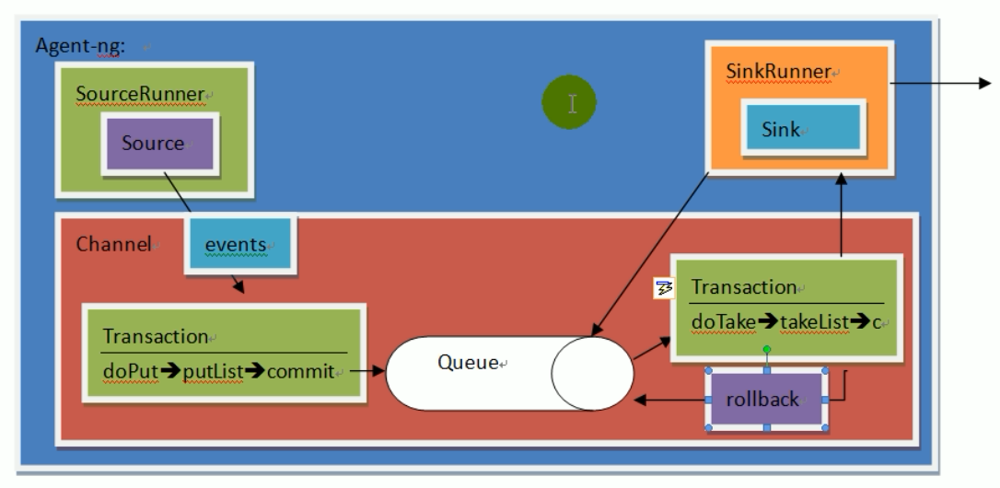

# 面试


## wait和sleep的区别

- wait
  - 释放锁
  - 调用者是对象，==调用对象的线程==进行wait操作
- sleep
  - 不释放锁
  - 调用者是类对象Thread，==调用的当前线程==进行sleep操作


## 如何实现Flume数据传输的监控

- 使用第三方框架Ganglia实时监控Flume


## Flume的Source，Sink，Channel的作用

- Source组件是专门用来收集数据的，可以处理各种类型、各种格式的日志数据，包括avro、thrift、exec、jms、spooling directory、netcat、sequence generator、syslog、http、legacy

- Channel组件对采集到的数据进行缓存
  - 可以存放在Memory或File中
- Sink组件是用于把数据发送到目的地的组件
  - 目的地包括Hdfs、Logger、avro、thrift、ipc、file、Hbase、solr、自定义


## Source是什么类型

- 我公司采用的Source类型为
  - 监控后台日志：exec
  - 监控后台产生日志的端口
    - netcat
    - Exec
    - spooldir


## Flume参数调优

- Source
  - 增加Source个数
    - 使用Tair Dir Source时可增加FileGroups个数
    - 可以增大Source的读取数据的能力
  - 例如：当某一个目录产生的文件过多时需要将这个文件目录拆分成多个文件目录，同时配置好多个Source 以保证Source有足够的能力获取到新产生的数据

- batchSize
  - 决定Source一次批量运输到Channel的event条数
  - 适当调大该参数可以提高Source搬运Event到Channel时的性能
  - 参数决定Sink一次批量从Channel读取的event条数
  - 适当调大这个参数可以提高Sink从Channel搬出event的性能

- Channel 
  - type 选择memory时Channel的性能最好，但是如果Flume进程意外挂掉可能会丢失数据
  - type选择file时Channel的容错性更好，但是性能上会比memory channel差
    - 使用file Channel时dataDirs配置多个不同盘下的目录可以提高性能

- Capacity
  - 决定Channel可容纳最大的event条数
- transactionCapacity 
  - 决定每次Source往channel里面写的最大event条数
  - 每次Sink从channel里面读的最大event条数
  - transactionCapacity需要大于Source和Sink的batchSize参数

- Sink 
  - 增加Sink的个数可以增加Sink消费event的能力
  - Sink也不是越多越好够用就行
  - 过多的Sink会占用系统资源，造成系统资源不必要的浪费


## Flume的事务机制

- 类似数据库的事务机制
- Flume使用两个独立的事务分别负责从Soucrce到Channel，以及从Channel到Sink的事件传递
- 比如spooling directory source 为文件的每一行创建一个事件
- 一旦事务中所有的事件全部传递到Channel且提交成功，那么Soucrce就将该文件标记为完成
- 事务以类似的方式处理从Channel到Sink的传递过程
  - 如果因为某种原因使得事件无法记录，那么事务将会回滚
- 所有的事件都会保持到Channel中，等待重新传递


## Flume采集数据会丢失吗

- 使用memoryChannel会丢失
  - 解决
    - Channel存储可以存储在File中，数据传输自身有事务


## Flume为什么分两层

- 如果只有一层，日志采集服务器非常多，此时会有很多个Flume agent，同时向HDFS写数据会产生多个client，对HDFS来说压力过大
- 只有一层时，部分业务配置只能在这层配置，如后续配置修改，则要修改的位置太多，不利于后期维护


## FileChannel和MemoryChannel区别

- MemoryChannel传输数据速度更快，但因为数据保证在==JVM的堆内存中==，agent进程挂掉会导致数据丢失，适用于对数据质量要求不高的需求
- FileChannel传输速度相对于Memory慢，但数据安全保障高，agent进程挂掉也可以从失败中恢复数据


## HDFS存入大量小文件，有什么影响

- 元数据层面
  - 每个小文件都有一份元数据，其中包括文件路径，文件名，所有者，所属组，权限，创建时间等，这些信息都保存在Namenode内存中
  - 小文件过多，会占用Namenode服务器大量内存，影响Namenode性能和使用寿命
- 计算层面
  - 默认情况下MR会对每个小文件启用一个Map任务计算，非常影响计算性能
  - 同时也影响磁盘寻址时间


## Flume组件

- Source
  - **Taildir Source**
    - 相比Exec Source、Spooling Directory Source的优势
      - ==断点续传==
      - 多目录
      - Flume1.6以前要自定义Source记录每次读取文件位置，实现断点续传
  - Exec Source
    - 可实时搜集数据
    - 在Flume不运行或者Shell命令出错的情况下，数据将会丢失
  - Spooling Directory Source
    - 监控目录
    - 不支持断点续传
- batchSize大小如何设置
  - Event 1K左右时，500-1000合适
  - 默认为100
- Channel
  - 采用==Kafka Channel==
    - 省去Sink
    - 提高效率


## 内存优化

- 问题描述：如果启动消费Flume抛出如下异常

```bash
ERROR hdfs.HDFSEventSink: process failed
java.lang.OutOfMemoryError: GC overhead limit exceeded
```

- 解决方案步骤
  - 在hadoop102服务器的/opt/module/flume/conf/flume-env.sh文件中增加如下配置
  - 同步配置到hadoop103、hadoop104服务器

```bash
export JAVA_OPTS="-Xms4096m -Xmx4096m -Dcom.sun.management.jmxremote"
```

- Flume内存参数设置及优化
  - JVM heap一般设置为4G或更高，部署在单独的服务器上
    - 4核8线程16G内存
  - -Xmx与-Xms最好设置一致
    - 减少内存抖动带来的性能影响
    - 如果设置不一致容易导致频繁fullgc


## Channel优化

- FileChannel和MemoryChannel区别
  - MemoryChannel
    - 传输数据速度更快，但因为数据保存在JVM的堆内存中
    - Agent进程挂掉会导致数据丢失，适用于对数据质量要求不高的需求
  - FileChannel
    - 传输速度相对于Memory慢，但数据安全保障高
    - Agent进程挂掉也可以从失败中恢复数据
- FileChannel优化
  - 通过配置==dataDirs指向多个路径==，每个路径对应不同的硬盘，增大Flume吞吐量
  - checkpointDir和backupCheckpointDir也尽量配置在不同硬盘对应的目录中
    - 保证checkpoint坏掉后，可快速使用backupCheckpointDir恢复数据
  - 官方说明如下

```text
Comma separated list of directories for storing log files. Using multiple directories on separate disks can improve file channel peformance
```


## HDFS Sink优化

- HDFS存入大量小文件，有什么影响
  - 元数据层面
    - 每个小文件都有一份元数据，其中包括文件路径，文件名，所有者，所属组，权限，创建时间等，这些信息都保存在Namenode内存中
    - 小文件过多，会占用Namenode服务器大量内存，影响Namenode性能和使用寿命
  - 计算层面
    - 默认情况下MR会对每个小文件启用一个Map任务计算，非常影响计算性能
    - 同时也影响磁盘寻址时间
- ==HDFS小文件处理==
  - 官方默认的三个参数配置写入HDFS后会产生小文件
    - hdfs.rollInterval
    - hdfs.rollSize
    - hdfs.rollCount
  - 基于以上hdfs.rollInterval=3600，hdfs.rollSize=134217728，hdfs.rollCount =0，hdfs.roundValue=10，hdfs.roundUnit= second几个参数综合作用，效果如下
    - tmp文件在达到128M时会滚动生成正式文件
    - tmp文件创建超3600秒时会滚动生成正式文件
      - 时间优先级高
    - 如：
      - 在2018-01-01 05:23的时侯sink接收到数据，那会产生如下tmp文件
        - /atguigu/20180101/atguigu.201801010620.tmp
        - 即使文件内容没有达到128M，也会在06:23时滚动生成正式文件


# 总结

- 定义
- 高可靠，高可用，海量日志数据采集聚合系统，可传输数据
- ==修改配置文件后会自动重新读取重置agent==
  - 默认开启的配置，可关闭，查询官网
  - 设置-Dflume.root.logger=DEBUG,console显示日志

```log
2020-01-19 21:17:23,591 (conf-file-poller-0) [DEBUG - org.apache.flume.node.PollingPropertiesFileConfigurationProvider$FileWatcherRunnable.run(PollingPropertiesFileConfigurationProvider.java:127)] Checking file:job/flume2hdfs.conf for changes
```

- 组件

  - Agent
  - Source
  - Sink
  - Channel

- 流程

  

- 自定义

- 优点

  - 数据采集的多样化
  - 解耦，如下解耦
    - 数据的来源
    - 数据的目标
  - 数据不丢失
    - 使用FileChannel
  - 传输的组合很多

- 缺点

  - 数据无法保存
    - flume是传输工具，不进行保存
    - 无法做延时获取
  - 增加消费者
    - 增加channel，增加sink
      - 增加性能消耗，数据冗余
    - 需要修改配置
      - 需要重启
        - 影响到了之前的消费者
      - 违背了OCP的原则（开放封闭原则）
  - 消费者想要重复消费做不到
  - 解决：和kafka配合使用


# Flume相关总结

- Flume组成，Put事务，Take事务
  - Taildir Source
    - 支持断点续传、多目录
    - Flume1.6以前需要自己自定义Source记录每次读取文件位置，实现断点续传
- File Channel
  - 数据存储在磁盘，宕机数据可以保存。但是传输速率慢
  - 适合对数据传输可靠性要求高的场景
  - 比如，金融行业
- Memory Channel
  - 数据存储在内存中，宕机数据丢失
  - 传输速率快。适合对数据传输可靠性要求不高的场景
  - 比如，普通的日志数据
- Kafka Channel
  - 减少了Flume的Sink阶段，提高了传输效率
- Source到Channel是Put事务
- Sink
  - 解决小文件
  - 需要配置3个值，达到1小时生成一个文件，或者达到128M生成一个小文件，event个数一般不用，设置为0
- Channel到Sink是Take事务
- Flume拦截器
  - 拦截器注意事项
- 项目中自定义了
  - ETL拦截器和区分类型拦截器
- 采用两个拦截器的优缺点
  - 优点，模块化开发和可移植性
  - 缺点，性能会低一些
- 自定义拦截器步骤
  - 实现 Interceptor
  - 重写四个方法
    - initialize 初始化
    - public Event intercept(Event event) 处理单个Event
    - public List<Event> intercept(List<Event> events) 处理多个Event，在这个方法中调用Event intercept(Event event)
    - close 方法
  - 静态内部类
    - 实现Interceptor.Builder


- Flume 监控器
  - Ganglia
  - 尝试的次数大于成功的次数，需要增大flume的内存
- Flume采集数据会丢失吗?
  - 不会
  - Channel存储可以存储在File中，数据传输自身有事务，选择tailDir，可以断点续传
- Flume内存
  - 开发中在flume-env.sh中设置JVM heap为4G或更高，部署在单独的服务器上（4核8线程16G内存）
  - -Xmx与-Xms最好设置一致，减少内存抖动带来的性能影响，如果设置不一致容易导致频繁fullgc
- FileChannel优化
  - 通过配置dataDirs指向多个路径，每个路径对应不同的硬盘，增大Flume吞吐量
  - 官方说明如下
    - Comma separated list of directories for storing log files. Using multiple directories on separate disks can improve file channel peformance
  - checkpointDir和backupCheckpointDir也尽量配置在不同硬盘对应的目录中，保证checkpoint坏掉后，可以快速使用backupCheckpointDir恢复数据
- Sink：HDFS Sink小文件处理
  - HDFS存入大量小文件，有什么影响？
    - 元数据层面
      - 每个小文件都有一份元数据，其中包括文件路径，文件名，所有者，所属组，权限，创建时间等，这些信息都保存在Namenode内存中。所以小文件过多，会占用Namenode服务器大量内存，影响Namenode性能和使用寿命
    - 计算层面
      - 默认情况下MR会对每个小文件启用一个Map任务计算，非常影响计算性能。同时也影响磁盘寻址时间
    - HDFS小文件处理
      - 官方默认的这三个参数配置写入HDFS后会产生小文件，hdfs.rollInterval、hdfs.rollSize、hdfs.rollCount
      - 基于以上hdfs.rollInterval=3600，hdfs.rollSize=134217728，hdfs.rollCount =0，hdfs.roundValue=10，hdfs.roundUnit= second几个参数综合作用，效果如下：
        - tmp文件在达到128M时会滚动生成正式文件
        - tmp文件创建超10秒时会滚动生成正式文件
        - 举例：在2018-01-01 05:23的时侯sink接收到数据，那会产生如下tmp文件
          - /atguigu/20180101/atguigu.201801010520.tm
          - 即使文件内容没有达到128M，也会在05:33时滚动生成正式文件