# 概念

- 一个拥有集群自动化安装、中心化管理、集群监控、报警功能的一个工具

- 使得安装集群从几天的时间缩短在几个小时内，运维人员从数十人降低到几人以内，极大的提高集群管理的效率


# 功能

- 管理：对集群进行管理，如添加、删除节点等操作。

- 监控：监控集群的健康情况，对设置的各种指标和系统运行情况进行全面监控。

-  诊断：对集群出现的问题进行诊断，对出现的问题给出建议解决方案。

-  集成：多组件进行整合。


# 架构

- Server
  - 核心组件
  - 负责软件安装、配置，启动和停止服务，管理服务运行的群集。

- Agent
  - 安装在每台主机上
  - 负责启动和停止的过程，配置，监控主机

- Management Service
  - 由一组执行各种监控，警报和报告功能角色的服务
  - 可视化页面显示

- Database
  - 存储配置和监视信息

- Cloudera Repository
  - 软件由Cloudera 管理分布存储库
  - 有点类似Maven的中心仓库

-  Clients
  - 是用于与服务器进行交互的接口
  - API和Admin Console


# 环境要求


## 内存分配

将3台虚拟机分配好内存

hadoop102

- 内存10g
- 硬盘50g

hadoop103

- 内存2g
- 硬盘20g

hadoop104

- 内存2g
- 硬盘20g


## JDK

安装JDK配置环境变量


## 关闭SELINUX

- 临时关闭： setenforce 0

- 修改配置文件/etc/selinux/config
  - 重启生效
  - 将SELINUX=enforcing 改为SELINUX=disabled


## ssh免密登录

将hadoop102，hadoop103，hadoop104相互之间配置免密登陆


## 下载第三方依赖

在三台节点（所有agent的节点）上执行下载第三方依赖

```bash
yum -y install chkconfig python bind-utils psmisc libxslt zlib sqlite cyrus-sasl-plain cyrus-sasl-gssapi fuse fuse-libs redhat-lsb
```


## 安装MySQL

在hadoop102上安装mysql，配置相应的用户权限


## MySQL中创建数据库


### 集群监控数据库

```bash
create database amon DEFAULT CHARSET utf8 COLLATE utf8_general_ci;
```


### hive数据库

```bash
create database hive DEFAULT CHARSET utf8 COLLATE utf8_general_ci;
```


### oozie数据库

```bash
create database oozie DEFAULT CHARSET utf8 COLLATE utf8_general_ci;
```


### hue数据库

```bash
create database hue DEFAULT CHARSET utf8 COLLATE utf8_general_ci;
```


# 安装

- CM下载地址：http://archive.cloudera.com/cm5/cm/5/cloudera-manager-el6-cm5.12.1_x86_64.tar.gz
- 离线库下载地址：http://archive.cloudera.com/cdh5/parcels/latest/


- ==注意：以下操作都需要在root用户下进行==
- 需要的文件

```bash
[root@hadoop102 software]# ll
总用量 2564316
-rw-r--r-- 1 root  root  1620405492 9月  26 2018 CDH-5.12.1-1.cdh5.12.1.p0.3-el6.parcel
-rw-r--r-- 1 root  root          41 9月  26 2018 CDH-5.12.1-1.cdh5.12.1.p0.3-el6.parcel.sha1
-rw-r--r-- 1 root  root   742029734 9月   6 2018 cloudera-manager-el6-cm5.12.1_x86_64.tar.gz
-rw-r--r-- 1 ttshe ttshe  185515842 8月  19 2017 jdk-8u144-linux-x64.tar.gz
-rw-r--r-- 1 root  root       72312 9月  26 2018 manifest.json
drwxr-xr-x 2 root  root        4096 6月  26 2015 mysql-libs
-rw-r--r-- 1 root  root    77807942 3月   3 2017 mysql-libs.zip
```

- 解压cloudera-manager-el6-cm5.12.1_x86_64.tar.gz

```bash
[root@hadoop102 module]# mkdir /opt/module/cloudera-manager
[root@hadoop102 module]# tar -zxvf /opt/software/cloudera-manager-el6-cm5.12.1_x86_64.tar.gz -C /opt/module/cloudera-manager/
```

- 解压之后
  - cloudera
    - 离线库文件夹，这里暂时用不到，使用自己的离线库
  - cm-5.12.1
    - CM的安装目录

```bash
[root@hadoop102 cloudera-manager]# ll
总用量 8
drwxr-xr-x 4 1106 4001 4096 8月  19 2017 cloudera
drwxr-xr-x 9 1106 4001 4096 8月  19 2017 cm-5.12.1
```


## 创建用户cloudera-scm（所有节点）

- Cloudera Manager默认用户为cloudera-scm，创建具有此名称的用户是最简单的方法
- 安装完成后，将自动使用此用户

```bash
[root@hadoop102 software]# useradd --system --home=/opt/module/cloudera-manager/cm-5.12.1/run/cloudera-scm-server --no-create-home --shell=/bin/false --comment "Cloudera SCM User" cloudera-scm
[root@hadoop102 software]# id cloudera-scm
uid=495(cloudera-scm) gid=492(cloudera-scm) 组=492(cloudera-scm)
```

- 参数说明
  - --system
    - 创建一个系统账户
  - --home
    - 指定用户登入时的主目录
    - 替换系统默认值/home/<用户名>
  - --no-create-home
    - 不要创建用户的主目录
  - --shell
    - 用户的登录 shell 名
  - --comment
    - 用户的描述信息

- 可以使用`man useradd`帮助
  - 也可以使用`useradd --help`	


## 配置CM Agent

- 指定server的host

```bash
[root@hadoop102 software]# vim /opt/module/cloudera-manager/cm-5.12.1/etc/cloudera-scm-agent/config.ini

server_host=hadoop102
```


## 配置CM的数据库

- 拷贝`mysql-connector-java.jar`文件到目录` /usr/share/java/`
  -  注意jar包名称要修改为mysql-connector-java.jar

```bash
[root@hadoop102]# mkdir /usr/share/java/
[root@hadoop102 /]# cp /opt/software/mysql-libs/mysql-connector-java-5.1.27/mysql-connector-java-5.1.27-bin.jar /usr/share/java/
[root@hadoop102 /]# mv /usr/share/java/mysql-connector-java-5.1.27-bin.jar /usr/share/java/mysql-connector-java.jar 
```

- 在mysql中创建cm库

```sql
[root@hadoop102 /]# /opt/module/cloudera-manager/cm-5.12.1/share/cmf/schema/scm_prepare_database.sh mysql cm -hhadoop102 -uroot -p123456 --scm-host hadoop102 scm scm scm
```

- 参数说明
  - cm表示创建的库名称
  - -h 表示Database host
  - -u 表示Database username
  - -p 表示Database Password
  - --scm-host 表示server所在的节点ip
  - scm固定形式

```bash
[root@hadoop102 schema]# cat scm_prepare_database.sh 
...
OPTIONS
   -h|--host       Database host. Default is to connect locally.
   -P|--port       Database port. If not specified, the database specific
                   default will be used: namely, 3306 for MySQL,
                   5432 for PostgreSQL, and 1521 for Oracle.
   -u|--user       Database username that has privileges for creating
                   users and grants.  The default is '$USER'.
                   Typical values are 'root' for MySQL and
                   'postgres' for PostgreSQL. Not applicable for Oracle.
   -p|--password   Database Password. Default is no password.
   --scm-host      SCM server's hostname. Omit if SCM is colocated with MySQL.
   --config-path   Path to SCM configuration files.
                   Default is /etc/cloudera-scm-server.
   --scm-password-script Instead of obtaining the SCM username's password
                   directly, execute a script whose stdout is used as the
                   password.
   -f|--force      Don't stop when an error is encountered.
   -v|--verbose    Print more informational messages.
   -?|--help       Show this message.
...
```


## 分发cloudera-manager

```bash
[root@hadoop102 module]# scp -r /opt/module/cloudera-manager/ hadoop103:/opt/module/
[root@hadoop102 module]# scp -r /opt/module/cloudera-manager/ hadoop104:/opt/module/
```


## 创建Parcel-repo 目录

- 在Server节点创建目录/opt/cloudera/parcel-repo
  - 配置中指定该路径作为离线库
- 修改该目录的权限

```bash
[root@hadoop102 module]# mkdir -p /opt/cloudera/parcel-repo
[root@hadoop102 module]# chown cloudera-scm:cloudera-scm /opt/cloudera/parcel-repo
```

- 拷贝下载文件到/opt/cloudera/parcel-repo
  - 注意CDH-5.12.1-1.cdh5.12.1.p0.3-el6.parcel.sha1需要重命名

```bash
[root@hadoop102 software]# mv CDH-5.12.1-1.cdh5.12.1.p0.3-el6.parcel.sha1 CDH-5.12.1-1.cdh5.12.1.p0.3-el6.parcel.sha
[root@hadoop102 software]# cp CDH-5.12.1-1.cdh5.12.1.p0.3-el6.parcel.sha /opt/cloudera/parcel-repo/
[root@hadoop102 software]# cp CDH-5.12.1-1.cdh5.12.1.p0.3-el6.parcel /opt/cloudera/parcel-repo/
[root@hadoop102 software]# cp manifest.json /opt/cloudera/parcel-repo/
```

- 在Agent 节点创建目录/opt/cloudera/parcels
  - hadoop102，hadoop103，hadoop104
  - 在安装parcel格式的文件，需要对该文件进行解压，解压后的文件所在的文件夹就是/opt/cloudera/parcels
  - 存放各个服务的目录

```bash
[root@hadoop102 /]# mkdir -p /opt/cloudera/parcels
[root@hadoop102 /]# chown cloudera-scm:cloudera-scm /opt/cloudera/parcels
[root@hadoop103 /]# mkdir -p /opt/cloudera/parcels
[root@hadoop103 /]# chown cloudera-scm:cloudera-scm /opt/cloudera/parcels
[root@hadoop104 /]# mkdir -p /opt/cloudera/parcels
[root@hadoop104 /]# chown cloudera-scm:cloudera-scm /opt/cloudera/parcels
```


## 分发Parcel-repo

```bash
[root@hadoop102 opt]# scp -r /opt/cloudera/ hadoop103:/opt/
[root@hadoop102 opt]# scp -r /opt/cloudera/ hadoop104:/opt/  
```


# 使用


## 启动

- 启动过程非常慢，Manager 启动成功需要等待一段时间，过程中会在数据库中创建对应的表需要耗费一些时间

### 服务节点

- hadoop102
- 通过7180端口号查看是否启动成功
  - server和agent是使用python编写的，使用jps查看不到

```bash
[root@hadoop102 /]# /opt/module/cloudera-manager/cm-5.12.1/etc/init.d/cloudera-scm-server start
Starting cloudera-scm-server:                              [确定]
[root@hadoop102 /]# netstat -anp | grep 7180
tcp        0      0 0.0.0.0:7180                0.0.0.0:*                   LISTEN      3327/java   
```


### 工作节点

- hadoop102，hadoop103，hadoop104

```bash
[root@hadoop102 /]# /opt/module/cloudera-manager/cm-5.12.1/etc/init.d/cloudera-scm-agent start
[root@hadoop103 /]# /opt/module/cloudera-manager/cm-5.12.1/etc/init.d/cloudera-scm-agent start
[root@hadoop104 /]# /opt/module/cloudera-manager/cm-5.12.1/etc/init.d/cloudera-scm-agent start
```


## 访问

- 访问http://hadoop102:7180
  - 用户名、密码：admin

### 设置


- 全部勾选，添加到集群管理中


- 注意离线库的版本

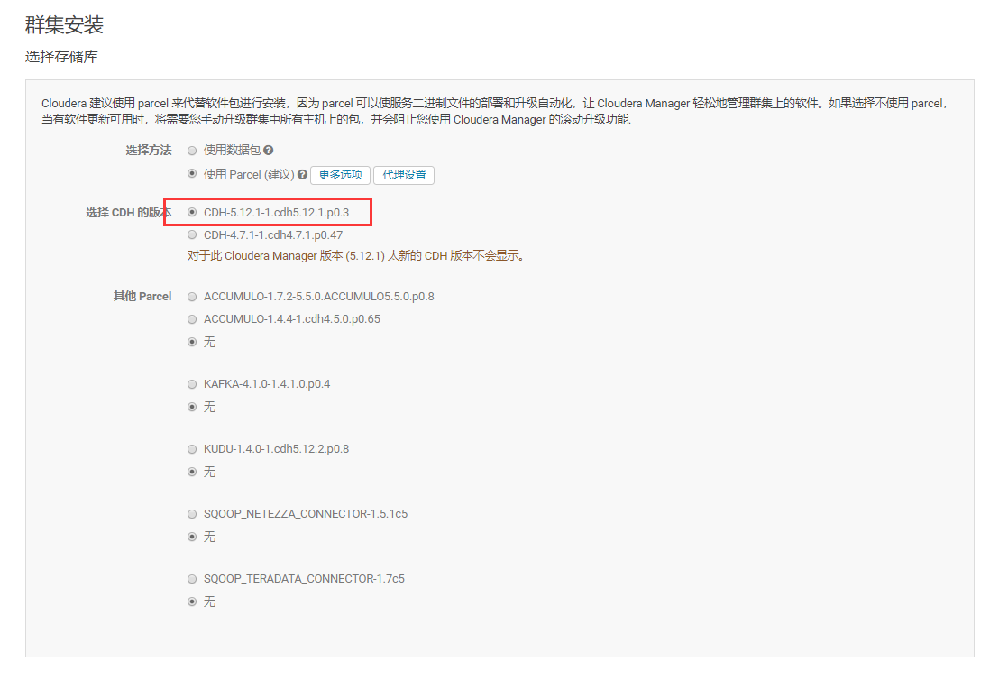


- 查看版本

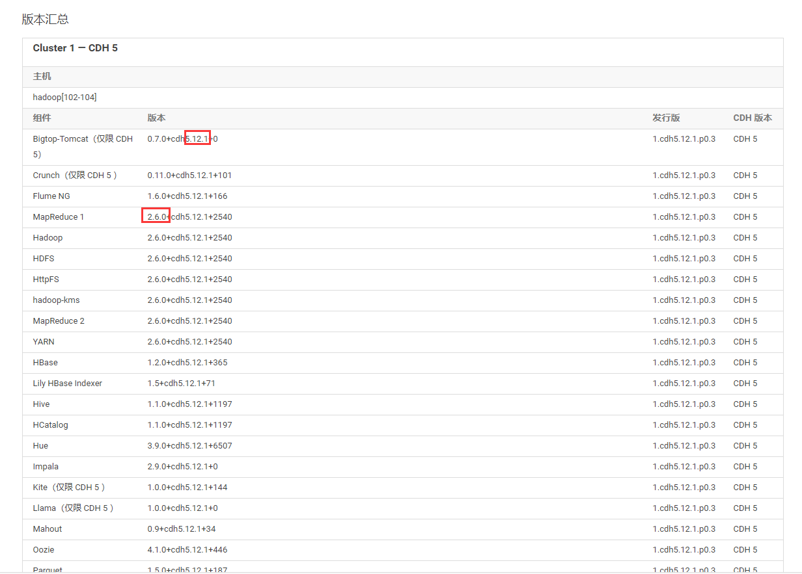


- 先选择hdfs和yarn安装


- 说明kafka需要离线安装组件


- 选择角色

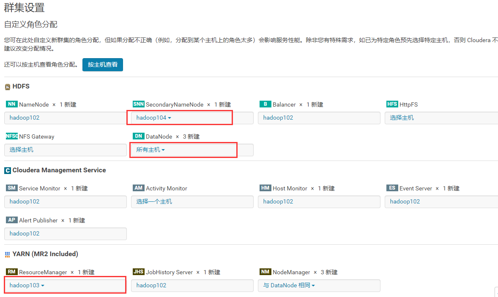


- 关注配置


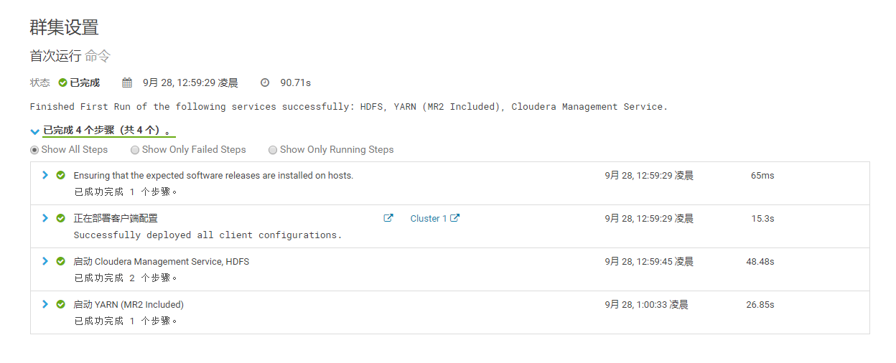


## 关闭

- 关闭之前将所有的服务停止


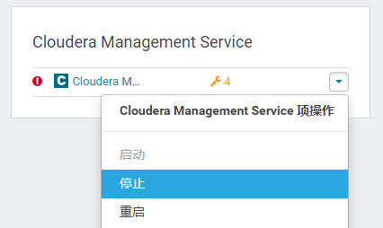


### 服务节点

```bash
[root@hadoop102 init.d]# /opt/module/cloudera-manager/cm-5.12.1/etc/init.d/cloudera-scm-server stop
```


###  工作节点

```bash
[root@hadoop102 init.d]# /opt/module/cloudera-manager/cm-5.12.1/etc/init.d/cloudera-scm-agent stop
[root@hadoop103 init.d]# /opt/module/cloudera-manager/cm-5.12.1/etc/init.d/cloudera-scm-agent stop
[root@hadoop104 init.d]# /opt/module/cloudera-manager/cm-5.12.1/etc/init.d/cloudera-scm-agent stop
```


# 主机模板

- 选择主机-->主机模板

- 主机模板定义了多组角色组，利用这些角色组可以轻松地扩展群集，方法是用角色填充新主机。

  例如，如要通过利用 DataNodes、TaskTrackers 和 RegionServers 添加更多的主机来扩展现有的群集，可以按照适合新主机的硬件配置的方式创建和配置包含角色组（每个角色类型一个角色组）的主机模板，然后可以将该主机模板应用到新主机，同时通过单次操作创建所有的角色。

  您还可以将主机模板应用到包含已有角色的主机以重新配置这些主机。包含已有角色的主机将会获得新的角色，但是不会丢失现有角色。


- 将多个角色付给一个模板

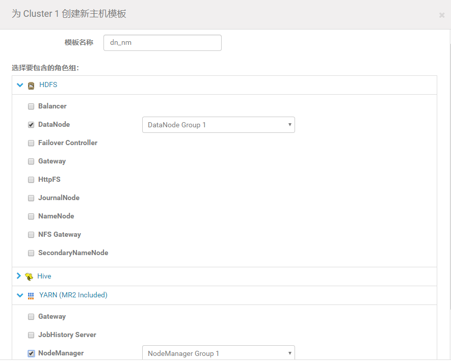

- 勾选新添加的主机，点击应用主机模板，选择相应的模板，可以使主机具有相应的节点功能

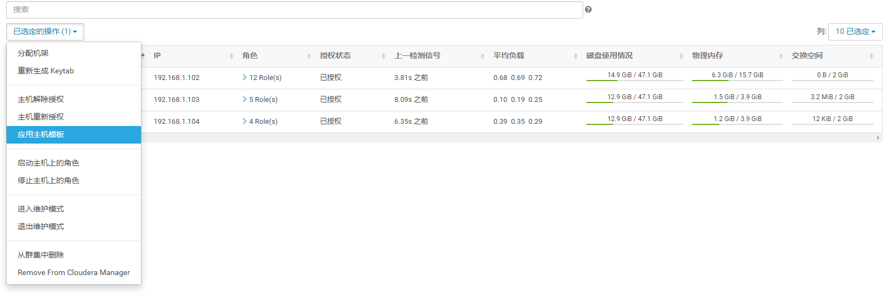


# 库的下载

- 点击主机--> Parcel

- 从Parcel中心库下载需要的组件


# 自定义图表显示

- 输入指定的查询条件，生成相应的图表
- 点击文件查看帮助
- 点击度量标准列表，获取查询字段


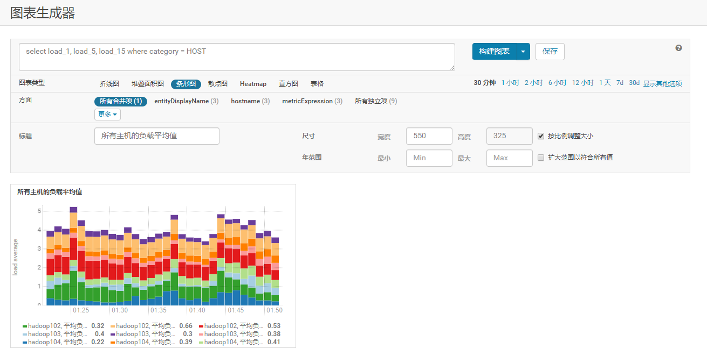

- 可以创建自定义仪表板，将自定义生成的图表显示在自定义仪表板上


# 下载当前配置

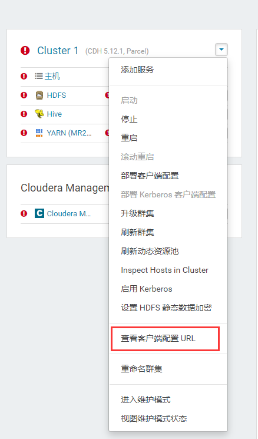

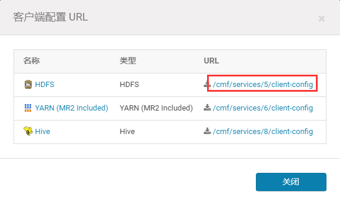

# HDFS操作

## 配置HDFS-HA

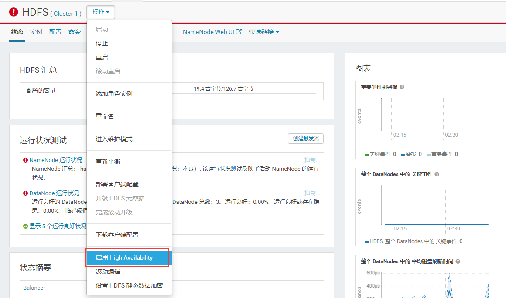

- 配置namenode的名称服务


- 需要指定jn数据存储的磁盘目录


## 查看实例


## 测试

- 查看文件

```bash
[root@hadoop102 ~]# hadoop fs -ls /
Found 2 items
drwxrwxrwt   - hdfs supergroup          0 2019-09-28 01:17 /tmp
drwxr-xr-x   - hdfs supergroup          0 2019-09-28 01:18 /user
```

- 上传

```bash
[root@hadoop102 software]# hadoop fs -put manifest.json /
put: Permission denied: user=root, access=WRITE, inode="/":hdfs:supergroup:drwxr-xr-x

# 权限不足，每个组件有各自的用户权限
# 方式1：关闭hdfs的权限管理
# 方式2：修改hdfs该文件夹的所属权限，可写
[root@hadoop102 software]# su - hdfs
[hdfs@hadoop102 ~]$ hadoop fs -chmod -R 777 /

[hdfs@hadoop102 ~]$ su - root
[root@hadoop102 ~]# cd /opt/software/
[root@hadoop102 software]# hadoop fs -put manifest.json /
```

- 查看所有用户以及用户组

```bash
cat /etc/passwd
```


# Hive操作


## 安装Hive

- 添加服务

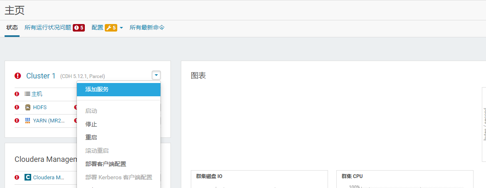

- 选择Hive


- 配置


- 注意Hive数据库要提前准备好

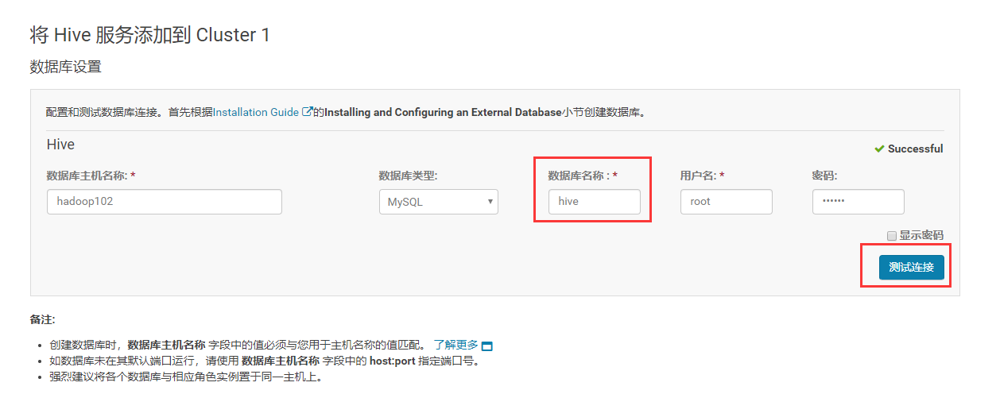


- 连接hive，注意用户名是hive

```bash
[root@hadoop102 software]# beeline
beeline> !connect jdbc:hive2://hadoop102:10000
Connecting to jdbc:hive2://hadoop102:10000
Enter username for jdbc:hive2://hadoop102:10000: hive
Enter password for jdbc:hive2://hadoop102:10000: 
Connected to: Apache Hive (version 1.1.0-cdh5.12.1)
Driver: Hive JDBC (version 1.1.0-cdh5.12.1)
Transaction isolation: TRANSACTION_REPEATABLE_READ
0: jdbc:hive2://hadoop102:10000> 
```


# 其他


## 启动异常

- 可能是uuid重复，查看uuid
  - 如果uuid相同，那么删除uuid和cm_guid文件

```bash
[root@hadoop102 cloudera-scm-agent]# ll
总用量 24
-rw-r--r-- 1 root root    36 9月  28 00:31 cm_guid
-rw------- 1 root root 12940 9月  28 00:31 response.avro
-rw-r--r-- 1 root root    36 9月  28 00:31 uuid
[root@hadoop102 cloudera-scm-agent]# pwd
/opt/module/cloudera-manager/cm-5.12.1/lib/cloudera-scm-agent
```

