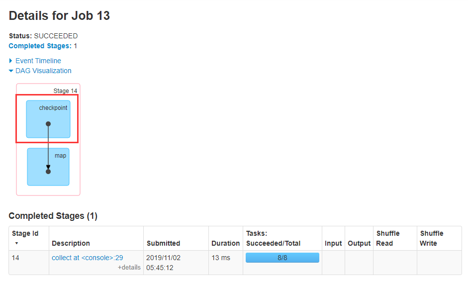

# RDD 缓存

- RDD通过persist方法或cache方法将前面的计算结果缓存
- 但是并不是这两个方法被调用时立即缓存，触发后面的action时，该RDD将会被缓存在计算节点的内存中，并供后面重用
- 一般将重要的数据和计算量大的数据进行缓存
- 缓存在本地


## persist|cache

- 默认情况下 persist() 会把数据以序列化的形式缓存在 JVM 的堆空间中


## 存储级别

```scala
// RDD.scala
// Persist this RDD with the default storage level (`MEMORY_ONLY`).
def persist(): this.type = persist(StorageLevel.MEMORY_ONLY)
def cache(): this.type = persist()

// 存储级别
// 在存储级别的末尾加上“_2”来把持久化数据存为两份
object StorageLevel {
  val NONE = new StorageLevel(false, false, false, false)
  val DISK_ONLY = new StorageLevel(true, false, false, false)
  val DISK_ONLY_2 = new StorageLevel(true, false, false, false, 2)
  val MEMORY_ONLY = new StorageLevel(false, true, false, true)
  val MEMORY_ONLY_2 = new StorageLevel(false, true, false, true, 2)
    // 序列化的方式
  val MEMORY_ONLY_SER = new StorageLevel(false, true, false, false)
  val MEMORY_ONLY_SER_2 = new StorageLevel(false, true, false, false, 2)
  val MEMORY_AND_DISK = new StorageLevel(true, true, false, true)
  val MEMORY_AND_DISK_2 = new StorageLevel(true, true, false, true, 2)
  val MEMORY_AND_DISK_SER = new StorageLevel(true, true, false, false)
  val MEMORY_AND_DISK_SER_2 = new StorageLevel(true, true, false, false, 2)
  val OFF_HEAP = new StorageLevel(true, true, true, false, 1)
```

 

- 缓存有可能丢失，或者存储存储于内存的数据由于内存不足而被删除

- RDD的缓存容错机制保证了即使缓存丢失也能保证计算的正确执行

- 通过基于RDD的一系列转换，丢失的数据会被重算

  - 由于RDD的各个Partition是相对独立的，因此只需要计算丢失的部分即可，并不需要重算全部Partition

  

## 示例

```scala
scala> var rdd = sc.makeRDD(Array("ss"))
rdd: org.apache.spark.rdd.RDD[String] = ParallelCollectionRDD[13] at makeRDD at <console>:24

scala> var nocache = rdd.map(_.toString+System.currentTimeMillis)
nocache: org.apache.spark.rdd.RDD[String] = MapPartitionsRDD[14] at map at <console>:26
// 没有缓存，每次计算是变化的
scala> nocache.collect
res7: Array[String] = Array(ss1572643507657)

scala> nocache.collect
res8: Array[String] = Array(ss1572643508575)

// 进行缓存操作
scala> var cache = rdd.map(_.toString+System.currentTimeMillis).cache
cache: org.apache.spark.rdd.RDD[String] = MapPartitionsRDD[16] at map at <console>:26

scala> cache.collect
res9: Array[String] = Array(ss1572643563774)
// 每次计算从缓存中获取数据，结果一致
scala> cache.collect
res10: Array[String] = Array(ss1572643563774)

// 查看依赖，可以看到CachedPartitions
scala> cache.toDebugString
res12: String =
(8) MapPartitionsRDD[16] at map at <console>:26 [Memory Deserialized 1x Replicated]
 |       CachedPartitions: 8; MemorySize: 208.0 B; ExternalBlockStoreSize: 0.0 B; DiskSize: 0.0 B
 |  ParallelCollectionRDD[13] at makeRDD at <console>:24 [Memory Deserialized 1x Replicated]
```

- map中绿色的点表示缓存
- cache没有打断血缘关系，还是从makeRDD开始

 


# RDD checkPoint

- 缓存在hdfs

- Spark中对于数据的保存除了持久化操作之外，还提供了一种检查点的机制
- 检查点本质是通过将RDD写入Disk做检查点
- 通过lineage做容错的辅助，lineage过长会造成容错成本过高，不如在中间阶段做检查点容错，如果之后有节点出现问题而丢失分区，从做检查点的RDD开始重做Lineage，就会减少开销
- ==检查点通过将数据写入到HDFS文件系统实现了RDD的检查点功能==
- 若为当前RDD设置检查点
  - 该函数将会创建一个二进制的文件，并存储到checkpoint目录中
  - 该目录是用`SparkContext.setCheckpointDir()`设置的
  - 在checkpoint的过程中，该RDD的所有依赖于父RDD中的信息将全部被移除
  - 对RDD进行checkpoint操作并不会马上被执行，==必须执行Action操作才能触发==

```scala
scala> sc.setCheckpointDir("hdfs://hadoop102:9000/checkpoint")

scala> var rdd = sc.makeRDD(Array("aa"))
rdd: org.apache.spark.rdd.RDD[String] = ParallelCollectionRDD[17] at makeRDD at <console>:24

scala> var ch = rdd.map(_.toString+System.currentTimeMillis)
ch: org.apache.spark.rdd.RDD[String] = MapPartitionsRDD[18] at map at <console>:26

scala> ch.checkpoint
scala> ch.collect

scala> ch.collect
res16: Array[String] = Array(aa1572644680427)
// 此时计算开始一致
scala> ch.collect
res17: Array[String] = Array(aa1572644680468)

scala> ch.collect
res18: Array[String] = Array(aa1572644680468)

scala> ch.collect
res19: Array[String] = Array(aa1572644680468)

// 血缘关系从checkPoint开始
scala> ch.toDebugString
res20: String =
(8) MapPartitionsRDD[18] at map at <console>:26 []
 |  ReliableCheckpointRDD[19] at collect at <console>:29 []
```

- 从checkPoint开始
  - 如果在HDFS上检查点的数据丢失则会报错

 

