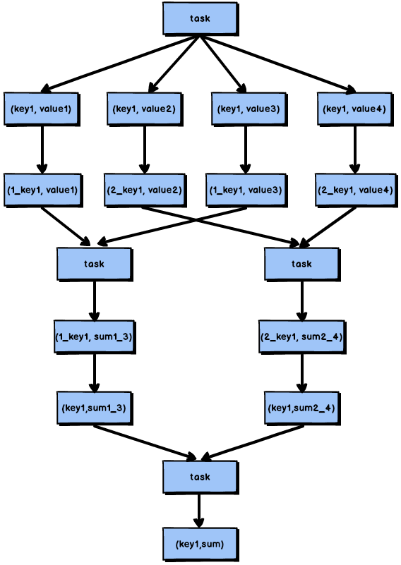

# 数据倾斜

- Spark中的数据倾斜问题主要指shuffle过程中出现的数据倾斜问题，是由于不同的key对应的数据量不同导致的不同task所处理的数据量不同的问题
- 如reduce点一共要处理100万条数据
  - 第一个和第二个task分别被分配到了1万条数据
    - 计算5分钟内完成
  - 第三个task分配到了98万数据
    - 可能需要10个小时完成
    - 使整个Spark作业需要10个小时才能运行完成，这就是数据倾斜所带来的后果
- **注意，要区分开数据倾斜与数据量过量这两种情况**
  - **数据倾斜是指少数task被分配了绝大多数的数据，因此少数task运行缓慢**
  - **数据过量是指所有task被分配的数据量都很大，相差不多，所有task都运行缓慢**
- 数据倾斜的表现
  - Spark作业的大部分task都执行迅速，只有有限的几个task执行的非常慢，此时可能出现了数据倾斜，作业可以运行，但是运行得非常慢
  - Spark作业的大部分task都执行迅速，但是有的task在运行过程中会突然报出OOM，反复执行几次都在某一个task报出OOM错误，此时可能出现了数据倾斜，作业无法正常运行
- 定位数据倾斜问题
  - 查阅代码中的shuffle算子，例如reduceByKey、countByKey、groupByKey、join等算子，根据代码逻辑判断此处是否会出现数据倾斜
  - 查看Spark作业的log文件，log文件对于错误的记录会精确到代码的某一行，可根据异常定位到的代码位置来明确错误发生在第几个stage，对应的shuffle算子是哪一个

## 聚合原数据

> 避免shuffle过程

- 绝大多数情况下，Spark作业的数据来源都是Hive表
  - Hive表基本都是经过ETL之后的昨天的数据
- 为了避免数据倾斜，可考虑避免shuffle过程，如果避免了shuffle过程，那么从根本上就消除了发生数据倾斜问题的可能
- 如果Spark作业的数据来源于Hive表，可先在Hive表中对数据进行聚合
  - 如按照key进行分组，将同一key对应的所有value用一种特殊的格式拼接到一个字符串里去
    - 一个key就只有一条数据了
    - 对一个key的所有value进行处理时只要进行map操作，无需再进行任何的shuffle操作
  - 通过上述方式就避免了执行shuffle操作，也就不可能会发生任何的数据倾斜问题
- 对于Hive表中数据的操作，不一定是拼接成一个字符串，也可以是直接对key的每一条数据进行累计计算
- **要区分开，处理的数据量大和数据倾斜的区别**

> 缩小key粒度（增大数据倾斜可能性，降低每个task的数据量）

- key的数量增加，可能使数据倾斜更严重

> 增大key粒度（减小数据倾斜可能性，增大每个task的数据量）

- 如果没有办法对每个key聚合出来一条数据，在特定场景下，可以考虑扩大key的聚合粒度
  - 如有10万条用户数据，当前key的粒度是（省，城市，区，日期）
    - 扩大粒度，将key的粒度扩大为（省，城市，日期）
    - key的数量会减少，key之间的数据量差异也有可能会减少
    - 可减轻数据倾斜的现象和问题
  - 此方法只针对特定类型的数据有效，当应用场景不适宜时，会加重数据倾斜

## 提高shuffle操作中的reduce并行度

- 增加分区数，之前放到同一分区的数据就可能分布到不同的分区中
- 之前方案对于数据倾斜的处理没有很好的效果时，可考虑提高shuffle过程中的reduce端并行度
- reduce端并行度的提高就增加了reduce端task的数量，则每个task分配到的数据量就会相应减少，由此缓解数据倾斜问题
- reduce端并行度的设置
  - 在大部分的shuffle算子中，都可以传入一个并行度的设置参数
    - 如reduceByKey(500)，这个参数会决定shuffle过程中reduce端的并行度，在进行shuffle操作的时候，就会对应着创建指定数量的reduce task
    - 对于Spark SQL中的shuffle类语句，比如group by、join等，需要设置一个参数
      - 即`spark.sql.shuffle.partitions`
        - 默认是200
        - 对于很多场景来说都有点过小
      - 代表了shuffle read task的并行度
  - 增加shuffle read task的数量，让原本分配给一个task的多个key分配给多个task，让每个task处理比原来更少的数据。如果原本有5个key，每个key对应10条数据，这5个key都是分配给一个task的，那么这个task就要处理50条数据。而增加了shuffle read task以后，每个task就分配到一个key，即每个task就处理10条数据，那么自然每个task的执行时间都会变短
- 不足
  - 提高reduce端并行度并没有从根本上改变数据倾斜的本质和问题
  - 只是尽可能地去缓解和减轻shuffle reduce task的数据压力，以及数据倾斜的问题，适用于有较多key对应的数据量都比较大的情况
  - 该方案通常无法彻底解决数据倾斜，因为如果出现一些极端情况，如某个key对应的数据量有100万，那么无论你的task数量增加到多少，这个对应着100万数据的key肯定还是会分配到一个task中去处理，因此还是会发生数据倾斜的
  - 这种方案只能说是在发现数据倾斜时尝试使用的第一种手段，尝试去用嘴简单的方法缓解数据倾斜而已，或者是和其他方案结合起来使用
  - 在理想情况下，reduce端并行度提升后，会在一定程度上减轻数据倾斜的问题，甚至基本消除数据倾斜
  - 一些情况下，只会让原来由于数据倾斜而运行缓慢的task运行速度稍有提升，或者避免了某些task的OOM问题，但是仍然运行缓慢

## 使用随机key实现双重聚合

- 在key前面加一个随机数，让相同的key分布到不同的分区中
- 当使用了类似于groupByKey、reduceByKey这样的算子时，考虑使用随机key实现双重聚合

 

- 首先通过map算子给每个数据的key添加随机数前缀，对key进行打散，将原先一样的key变成不一样的key
- 然后进行第一次聚合，可以让原本被一个task处理的数据分散到多个task上去做局部聚合
- 随后去除掉每个key的前缀，再次进行聚合
- 此方法对于由groupByKey、reduceByKey这类算子造成的数据倾斜由比较好的效果
  - 仅适用于聚合类的shuffle操作，适用范围相对较窄
  - 如果是join类的shuffle操作，还得用其他的解决方案。

## 将reduce join转换为map join

- 正常情况下join操作都会执行shuffle过程，并且执行的是reduce join，先将所有相同的key和对应的value汇聚到一个reduce task中进行join

 

- 普通的join是会走shuffle过程的，而一旦shuffle，就相当于会将相同key的数据拉取到一个shuffle read task中再进行join，此时就是reduce join
- 如果一个RDD是比较小的，则可以采用广播小RDD全量数据+map算子来实现与join同样的效果，也就是map join，此时就不会发生shuffle操作，也就不会发生数据倾斜
- 注意，RDD是并不能进行广播的，只能将RDD内部的数据通过collect拉取到Driver内存然后再进行广播
- 核心思路
  - 不使用join算子进行连接操作，而使用Broadcast变量与map类算子实现join操作，进而完全规避掉shuffle类的操作，彻底避免数据倾斜的发生和出现
  - 将较小RDD中的数据直接通过collect算子拉取到Driver端的内存中来，然后对其创建一个Broadcast变量
  - 接着对另外一个RDD执行map类算子，在算子函数内，从Broadcast变量中获取较小RDD的全量数据，与当前RDD的每一条数据按照连接key进行比对，如果连接key相同的话，那么就将两个RDD的数据用需要的方式连接起来
  - 根据上述思路，根本不会发生shuffle操作，从根本上杜绝了join操作可能导致的数据倾斜问题
  - 当join操作有数据倾斜问题并且其中一个RDD的数据量较小时，可优先考虑这种方式，效果非常好

 

- 不适合场景
  - 由于Spark的广播变量是在每个Executor中保存一个副本，如果两个RDD数据量都比较大，那么如果将一个数据量比较大的RDD做成广播变量，那么很有可能会造成内存溢出

## sample采样对倾斜key单独进行join

- 在Spark中，如果某个RDD只有一个key，那么在shuffle过程中会默认将此key对应的数据打散，由不同的reduce端task进行处理
- ==当由单个key导致数据倾斜时==，可有将发生数据倾斜的key单独提取出来，组成一个RDD，然后用这个原本会导致倾斜的key组成的RDD根其他RDD单独join，此时根据Spark的运行机制，此RDD中的数据会在shuffle阶段被分散到多个task中去进行join操作

 

- 适合场景
  - 对于RDD中的数据，可以将其转换为一个中间表，或者是直接使用countByKey()的方式，看一个这个RDD中各个key对应的数据量
  - 如果你发现整个RDD就一个key的数据量特别多，可以考虑使用这种方法
  - 当数据量非常大时，可考虑使用sample采样获取10%的数据，然后分析这10%的数据中哪个key可能会导致数据倾斜，然后将这个key对应的数据单独提取出来
- 不适合场景
  - 如果一个RDD中导致数据倾斜的key很多，那么此方案不适用

## 使用随机数以及扩容进行join

- 如果在进行join操作时，RDD中有大量的key导致数据倾斜，那么进行分拆key也没什么意义，对于join操作可考虑对其中一个RDD数据进行扩容，另一个RDD进行稀释后再join
- 将原先一样的key通过附加随机前缀变成不一样的key，将这些处理后的“不同key”分散到多个task中去处理，而不是让一个task处理大量的相同key
- 这种方案是针对有大量倾斜key的情况，没法将部分key拆分出来进行单独处理，需要对整个RDD进行数据扩容，对内存资源要求很高
- 核心思想
  - 选择一个RDD，使用flatMap进行扩容，对每条数据的key添加数值前缀（1~N的数值），将一条数据映射为多条数据（扩容）
  - 选择另外一个RDD，进行map映射操作，每条数据的key都打上一个随机数作为前缀（1~N的随机数）（稀释）
  - 将两个处理后的RDD，进行join操作

 

- 局限性
  - 如果两个RDD都很大，那么将RDD进行N倍的扩容显然行不通
  - 使用扩容的方式只能缓解数据倾斜，不能彻底解决数据倾斜问题
- 分析
  - 当RDD中有几个key导致数据倾斜时，方案5不再适用，而方案6又非常消耗资源，此时可以引入方案6的思想完善方案5
    - 对包含少数几个数据量过大的key的那个RDD，通过sample算子采样出一份样本来，然后统计一下每个key的数量，计算出来数据量最大的是哪几个key
    - 然后将这几个key对应的数据从原来的RDD中拆分出来，形成一个单独的RDD，并给每个key都打上n以内的随机数作为前缀，而不会导致倾斜的大部分key形成另外一个RDD
    - 接着将需要join的另一个RDD，也过滤出来那几个倾斜key对应的数据并形成一个单独的RDD，将每条数据膨胀成n条数据，这n条数据都按顺序附加一个0~n的前缀，不会导致倾斜的大部分key也形成另外一个RDD
    - 再将附加了随机前缀的独立RDD与另一个膨胀n倍的独立RDD进行join，此时就可以将原先相同的key打散成n份，分散到多个task中去进行join了
    - 而另外两个普通的RDD就照常join即可
    - 最后将两次join的结果使用union算子合并起来即可，就是最终的join结果

