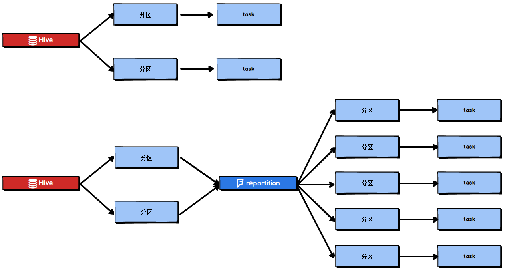
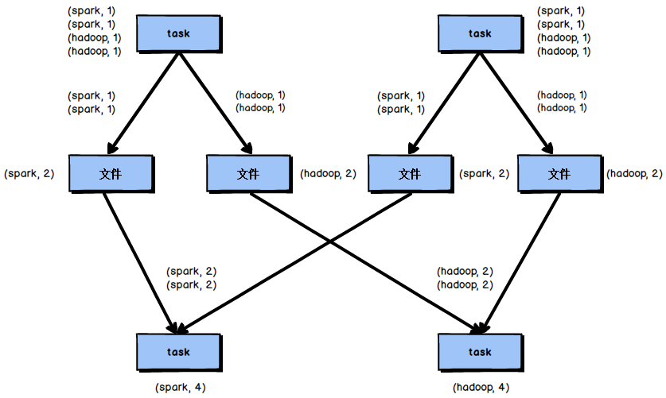

# 常规调优


## 最优资源配置

- 资源越多性能越好
- 资源分配在使用脚本提交Spark任务时指定

```scala
/usr/opt/modules/spark/bin/spark-submit \
--class com.xxx \
--num-executors 80 \
--driver-memory 6g \
--executor-memory 6g \
--executor-cores 3 \
/usr/opt/modules/spark/jar/spark.jar \
```

| **名称**          | **说明**                       |
| ----------------- | ------------------------------ |
| --num-executors   | 配置Executor的数量             |
| --driver-memory   | 配置Driver内存（影响不大）     |
| --executor-memory | 配置每个Executor的内存大小     |
| --executor-cores  | 配置每个Executor的CPU core数量 |

- 调节原则
  - ==尽量将任务分配的资源调节到可使用的资源的最大限度==

- Spark Standalone模式
  - 提交任务前，知道可使用的资源情况，在编写submit脚本时根据可用资源情况进行资源的分配
    - 如集群有15台机器，每台机器为8G内存，2个CPU core，就指定15个Executor，每个Executor分配8G内存，2个CPU core

- Spark Yarn模式
  - 由于Yarn使用==资源队列==进行资源的分配和调度，在表写submit脚本的时候，就根据Spark作业要提交到的资源队列，进行资源的分配
    - 如资源队列有400G内存，100个CPU core，则指定50个Executor，每个Executor分配8G内存，2个CPU core

- 各项资源进行了调节后，得到的性能提升如下
  - 增加核数，增加Executor的个数，本质等于增加Task执行的并行度
  - 增加内存，减少map和reduce阶段的IO操作，减少GC次数，提升性能

| 名称                           | 解析                                                         |
| ------------------------------ | ------------------------------------------------------------ |
| 增加Executor个数               | 在资源允许的情况下，增加Executor的个数可提高执行task的并行度。如有4个Executor，每个Executor有2个CPU core，那么可以并行执行8个task，如将Executor的个数增加到8个（资源允许的情况下），那么可以并行执行16个task，此时的并行能力提升了一倍 |
| 增加每个Executor的CPU core个数 | 在资源允许的情况下，增加每个Executor的Cpu core个数，可提高执行task的并行度。如4个Executor，每个Executor有2个CPU core，那么可以并行执行8个task，如将每个Executor的CPU core个数增加到4个，那么可以并行执行16个task，此时的并行能力提升了一倍 |
| 增加每个Executor的内存量       | 在资源允许的情况下，增加每个Executor的内存量以后，对性能的提升有三点：1. 可以缓存更多的数据（即对RDD进行cache），写入磁盘的数据相应减少，甚至可以不写入磁盘，减少了可能的磁盘IO；2. 可以为shuffle操作提供更多内存，即有更多空间来存放reduce端拉取的数据，写入磁盘的数据相应减少，甚至可以不写入磁盘，减少了可能的磁盘IO；3. 可以为task的执行提供更多内存，在task的执行过程中可能创建很多对象，内存较小时会引发频繁的GC，增加内存后，可以避免频繁的GC，提升整体性能 |

- 生产环境Spark Submit 脚本配置

```bash
/usr/local/spark/bin/spark-submit \
--class com.atguigu.spark.WordCount \
--num-executors 80 \
--driver-memory 6g \
--executor-memory 6g \
--executor-cores 3 \
--master yarn-cluster \
--queue root.default \
--conf spark.yarn.executor.memoryOverhead=2048 \
--conf spark.core.connection.ack.wait.timeout=300 \
/usr/local/spark/spark.jar
```

- 参数配置参考值
  - --num-executors：50~100
  - --driver-memory：1G~5G
  - --executor-memory：6G~10G
  - --executor-cores：3
  - --master：实际生产环境一定使用yarn-cluster


## RDD 复用

- 在对RDD进行算子时，要避免相同的算子和计算逻辑之下对RDD进行重复的计算


- 进行调整


## RDD 持久化

- 在Spark中，当多次对同一个RDD执行算子操作时，每一次都会对这个RDD以之前的父RDD重新计算一次，这种情况是必须要避免的，对同一个RDD的重复计算是对资源的极大浪费
  
- 必须对多次使用的RDD进行持久化，通过持久化将公共RDD的数据缓存到内存/磁盘中，之后对于公共RDD的计算都会从内存/磁盘中直接获取RDD数据
  
- 对于RDD的持久化

  - RDD的持久化是可以进行序列化的，当内存无法将RDD的数据完整的进行存放的时候，考虑使用序列化的方式减小数据体积，将数据完整存储在内存中

  - 如对于数据的可靠性要求很高，并且内存充足，可使用副本机制，对RDD数据进行持久化

    - 当持久化启用了复本机制时，对于持久化的每个数据单元都存储一个副本，放在其他节点上面，由此实现数据的容错，一旦一个副本数据丢失，不需要重新计算，还可以使用另外一个副本

      

## RDD 尽早filter操作

- 先把数据量变小

- 获取到初始RDD后，应该考虑尽早地过滤掉不需要的数据，进而减少对内存的占用，从而提升Spark作业的运行效率


## 并行度调节

- 并行度
  - 各个Stage的task数量
  - 不能尽可能大

- 如果并行度设置不合理而导致并行度过低，会导致资源的极大浪费
  - 如20个Executor，每个Executor分配3个CPU core，而Spark作业有40个task，这样每个Executor分配到的task个数是2个，使得每个Executor有一个CPU core空闲，导致资源的浪费
- 理想的并行度设置，应该是让并行度与资源相匹配
  - 在资源允许的前提下，并行度要设置的尽可能大，达到可以充分利用集群资源
  - 合理的设置并行度，可以提升整个Spark作业的性能和运行速度
- Spark官方推荐
  - ==task数量应该设置为Spark作业总CPU core数量的2~3倍==
  - 如果Task和Core数量相同，可能导致一部分core闲置而导致资源浪费，因为Task的数据可能正好保存在其中几个Core对应的Executor中，剩余的Core就不会执行任务了
  - 之所以没有推荐task数量与CPU core总数相等，是因为task的执行时间不同，有的task执行速度快而有的task执行速度慢，如果task数量与CPU core总数相等，那么执行快的task执行完成后，会出现CPU core空闲的情况
  - 如果task数量设置为CPU core总数的2~3倍，那么一个task执行完毕后，CPU core会立刻执行下一个task，降低了资源的浪费，同时提升了Spark作业运行的效率
- 并行度设置

```scala
val conf = new SparkConf().set("spark.default.parallelism", "500")
```


## 广播大变量

- 不要特别大
  - 100G内存，可以共享10G大变量

- 默认情况下task中的算子中如果使用了外部的变量，每个task都会获取一份变量的复本
  - 造成了内存的极大消耗
  - 如果后续对RDD进行持久化，可能就无法将RDD数据存入内存，只能写入磁盘，磁盘IO将会严重消耗性能
  - task在创建对象的时候，也许会发现堆内存无法存放新创建的对象，导致频繁的GC，GC会导致工作线程停止，进而导致Spark暂停工作一段时间，严重影响Spark性能
- 假设当前任务配置了20个Executor，指定500个task，有一个20M的变量被所有task共用，此时会在500个task中产生500个副本，耗费集群10G的内存，如果使用了广播变量， 那么每个Executor保存一个副本，一共消耗400M内存，内存消耗减少了5倍
- 广播变量在每个Executor保存一个副本，此Executor的所有task共用此广播变量，这让变量产生的副本数量大大减少
- 在初始阶段，广播变量只在Driver中有一份副本
- task在运行的时候，想要使用广播变量中的数据，此时首先会在自己本地的Executor对应的BlockManager中尝试获取变量，==如果本地没有，BlockManager就会从Driver或者其他节点的BlockManager上远程拉取变量的复本，并由本地的BlockManager进行管理==；之后此Executor的所有task都会直接从本地的BlockManager中获取变量


## Kryo序列化

- 序列化后的文件大小原小于java序列化后的文件大小

- 默认情况
  - Spark使用Java的序列化机制
  - Java的序列化机制使用方便，不需要额外的配置，在算子中使用的变量实现Serializable接口即可
  - Java序列化机制的效率不高，序列化速度慢并且序列化后的数据所占用的空间依然较大

- Kryo序列化机制比Java序列化机制性能提高10倍左右
  - Spark之所以没有默认使用Kryo作为序列化类库，由于它不支持所有对象的序列化
  - Kryo需要用户在使用前注册需要序列化的类型，不够方便
- 从Spark 2.0.0版本开始，简单类型、简单类型数组、字符串类型的Shuffling RDDs 已经默认使用Kryo序列化方式了

- Kryo序列化配置

```scala
public class MyKryoRegistrator implements KryoRegistrator{
  @Override
  public void registerClasses(Kryo kryo){
    kryo.register(StartupReportLogs.class);
  }
}

//创建SparkConf对象
val conf = new SparkConf().setMaster(…).setAppName(…)
//使用Kryo序列化库，如果要使用Java序列化库，需要把该行屏蔽掉
conf.set("spark.serializer", "org.apache.spark.serializer.KryoSerializer");  
//在Kryo序列化库中注册自定义的类集合，如果要使用Java序列化库，需要把该行屏蔽掉
conf.set("spark.kryo.registrator", "stt.com.MyKryoRegistrator"); 
```


## 调节本地化等待时长

- Spark作业运行过程中，Driver会对每一个stage的task进行分配
- 根据Spark的task分配算法，Spark希望task能够运行在它要计算的数据算在的节点（数据本地化思想），这样就可以避免数据的网络传输
- 通常来说，==task可能不会被分配到它处理的数据所在的节点==，因为这些节点可用的资源可能已经用尽，此时，Spark会等待一段时间，默认3s，如果等待指定时间后仍然无法在指定节点运行，那么会自动降级，尝试将task分配到比较差的本地化级别所对应的节点上，比如将task分配到离它要计算的数据比较近的一个节点，然后进行计算，如果当前级别仍然不行，那么继续降级

- 当task要处理的数据不在task所在节点上时，会发生数据的传输。task会通过所在节点的BlockManager获取数据，BlockManager发现数据不在本地时，通过网络传输组件从数据所在节点的BlockManager处获取数据

- 网络传输数据的情况是我们不愿意看到的，大量的网络传输会严重影响性能，因此希望通过调节本地化等待时长，如果在等待时长这段时间内，目标节点处理完成了一部分task，那么当前的task将有机会得到执行，这样就能够改善Spark作业的整体性能

- 本地化等级

| 名称          | 解析                                                         |
| ------------- | ------------------------------------------------------------ |
| PROCESS_LOCAL | 进程本地化，task和数据在同一个Executor中，性能最好。         |
| NODE_LOCAL    | 节点本地化，task和数据在同一个节点中，但是task和数据不在同一个Executor中，数据需要在进程间进行传输。 |
| RACK_LOCAL    | 机架本地化，task和数据在同一个机架的两个节点上，数据需要通过网络在节点之间进行传输。 |
| NO_PREF       | 对于task来说，从哪里获取都一样，没有好坏之分。               |
| ANY           | task和数据可以在集群的任何地方，而且不在一个机架中，性能最差。 |

- 在Spark项目开发阶段，可使用client模式对程序进行测试，可在本地看到比较全的日志信息，日志信息中有明确的task数据本地化的级别，如果大部分都是PROCESS_LOCAL，那么就无需进行调节，但是如果发现很多的级别都是NODE_LOCAL、ANY，那么需要对本地化的等待时长进行调节，通过延长本地化等待时长，看看task的本地化级别有没有提升，并观察Spark作业的运行时间有没有缩短

- 注意，过犹不及，不要将本地化等待时长延长地过长，导致因为大量的等待时长，使得Spark作业的运行时间反而增加了

- 设置等待时长

```scala
val conf = new SparkConf().set("spark.locality.wait", "6")
```


# 算子调优


## mapPartitions

- 普通的map算子对RDD中的每一个元素进行操作
- mapPartitions算子对RDD中每一个分区进行操作
- 如果是普通的map算子，假设一个partition有1万条数据，那么map算子中的function要执行1万次，也就是对每个元素进行操作
- 如果是mapPartition算子，由于一个task处理一个RDD的partition，那么一个task只会执行一次function，function一次接收所有的partition数据，效率比较高


- 场景当要把RDD中的所有数据通过JDBC写入数据

  - 如果使用map算子，需要对RDD中的每一个元素都创建一个数据库连接，对资源的消耗很大
  - 如果使用mapPartitions算子，那么针对一个分区的数据，只需要建立一个数据库连接

  

- mapPartitions缺点

  - 对于普通的map操作，一次处理一条数据，如果在处理了2000条数据后内存不足，那么可以将已经处理完的2000条数据从内存中垃圾回收掉
  - 使用mapPartitions算子当数据量非常大时，function一次处理一个分区的数据，如果一旦内存不足，此时无法回收内存（因为引用无法释放），就可能会OOM，即内存溢出

- mapPartitions算子适用于数据量不是特别大时使用mapPartitions算子对性能的提升效果还是不错的

  - 当数据量很大的时候，一旦使用mapPartitions算子，就会直接OOM

- 在项目中，应该首先估算一下RDD的数据量、每个partition的数据量，以及分配给每个Executor的内存资源，如果资源允许，可考虑使用mapPartitions算子代替map


## foreachPartition

- 优化数据库操作

- 在生产环境中，通常使用foreachPartition算子来完成数据库的写入，通过foreachPartition算子的特性，可以优化写数据库的性能
- 如果使用foreach算子完成数据库的操作，由于foreach算子是遍历RDD的每条数据，因此，每条数据都会建立一个数据库连接，这是对资源的极大浪费，因此，对于写数据库操作，我们应当使用foreachPartition算子
- 与mapPartitions算子非常相似，foreachPartition是将RDD的每个分区作为遍历对象，一次处理一个分区的数据，也就是说，如果涉及数据库的相关操作，一个分区的数据只需要创建一次数据库连接

 

- 使用了foreachPartition算子后，可以获得以下的性能提升
  - 对于我们写的function函数，一次处理一整个分区的数据
  - 对于一个分区内的数据，创建唯一的数据库连接
  - 只需要向数据库发送一次SQL语句和多组参数
- 在生产环境中，全部都会使用foreachPartition算子完成数据库操作
- foreachPartition算子的问题
  - 与mapPartitions算子类似，如果一个分区的数据量特别大，可能会造成OOM，即内存溢出
- 分析

```scala
// Driver
Connection conn = null;
// conn 存在于Driver，无法序列化传递到Executor

rdd.foreach(){
    // Executor
    // 只能在Executor中初始化conn
    Pstat pstat = conn.getStatement
	pstat.executeUpdate(sql,item)
}
```


## filter 与 coalesce 配合使用

- 在Spark任务中我们经常会使用filter算子完成RDD中数据的过滤，在任务初始阶段，从各个分区中加载到的数据量是相近的，但是一旦进过filter过滤后，每个分区的数据量有可能会存在较大差异

 

- 问题
  - ==每个partition的数据量变小==
    - 如果还按照之前与partition相等的task个数去处理当前数据，浪费task的计算资源
  - ==每个partition的数据量不一样==
    - 会导致后面的每个task处理每个partition数据的时候，每个task要处理的数据量不同，这很有可能导致数据倾斜问题
  - 第二个分区的数据过滤后只剩100条，而第三个分区的数据过滤后剩下800条，在相同的处理逻辑下，第二个分区对应的task处理的数据量与第三个分区对应的task处理的数据量差距达到了8倍，这也会导致运行速度可能存在数倍的差距，这也就是数据倾斜问题

- 针对上述的两个问题分析
  - 第一个问题，分区的数据量变小了，可对分区数据进行重新分配
    - 如原来4个分区的数据转化到2个分区中，只需要用后面的两个task进行处理即可，避免了资源的浪费
  - 第二个问题，解决方法和第一个问题的解决方法非常相似，对分区数据重新分配，让每个partition中的数据量差不多，这就避免了数据倾斜问题

- 那么具体应该如何实现上面的解决思路
  - 需要coalesce算子
  - repartition与coalesce都可以用来进行重分区
    - 其中repartition只是coalesce接口中shuffle为true的简易实现，coalesce默认情况下不进行shuffle
    - 可通过参数进行设置

- 假设将原本的分区个数A通过重新分区变为B，那么有以下几种情况
  - **多变少，差别大用shuffle，差别不大不shuffle**
  - **少变多，必须shuffle**

- 注意

  - local模式是进程内模拟集群运行，已经对并行度和分区数量有了一定的内部优化，因此不用去设置并行度和分区数量

    

## repartition解决SparkSQL低并行度问题

- ==并行度的设置对于Spark SQL是不生效的==
  - 用户设置的并行度只对于Spark SQL以外的所有Spark的stage生效
- Spark SQL的并行度不允许用户自己指定
- Spark SQL自己会默认根据hive表对应的HDFS文件的split个数自动设置Spark SQL所在的那个stage的并行度
- 用户自己通`spark.default.parallelism`参数指定的并行度，只会在没Spark SQL的stage中生效
- 由于Spark SQL所在stage的并行度无法手动设置，如果数据量较大，并且此stage中后续的transformation操作有着复杂的业务逻辑，而Spark SQL自动设置的task数量很少，意味着每个task要处理为数不少的数据量，还要执行非常复杂的处理逻辑，可能表现为第一个有Spark SQL的stage速度很慢，而后续的没有Spark SQL的stage运行速度非常快
- 为了解决Spark SQL无法设置并行度和task数量的问题，可使用repartition算子

 

- Spark SQL这一步的并行度和task数量肯定是没有办法改变，对于Spark SQL查询出来的RDD，立即使用repartition算子，去重新进行分区可重新分区为多个partition

  - 从repartition之后的RDD操作，由于不再设计Spark SQL，因此stage的并行度就会等于你手动设置的值
  - 避免了Spark SQL所在的stage只能用少量的task去处理大量数据并执行复杂的算法逻辑

  

## reduceByKey 预聚合

- reduceByKey相较于普通的shuffle操作一个显著的特点就是会进行map端的预先聚合
  - map端会先对本地的数据进行combine操作，然后将数据写入给下个stage的每个task创建的文件中
  - 在map端，对每一个key对应的value，执行reduceByKey算子函数

 

- 使用reduceByKey对性能的提升如下
  - 本地聚合后，在map端的数据量变少，减少了磁盘IO，也减少了对磁盘空间的占用
  - 本地聚合后，下一个stage拉取的数据量变少，减少了网络传输的数据量
  - 本地聚合后，在reduce端进行数据缓存的内存占用减少
  - 本地聚合后，在reduce端进行聚合的数据量减少

- 基于reduceByKey的本地聚合特征，应考虑使用reduceByKey代替其他的shuffle算子
  - 如groupByKey


# Shuffle调优


## 调节 map端缓冲区大小

- 调大后每次IO数据量增加，减少IO次数
- 在Spark任务运行过程中，如果shuffle的map端处理的数据量比较大，但是map端缓冲的大小是固定的，可能会出现map端缓冲数据频繁spill溢写到磁盘文件中的情况，使得性能非常低下
- 通过调节map端缓冲的大小，可避免频繁的磁盘IO操作，进而提升Spark任务的整体性能
- map端缓冲
  - 默认配置是32KB
  - 如果每个task处理640KB的数据，会发生640/32 = 20次溢写
  - 如果每个task处理64000KB的数据，会发生64000/32=2000此溢写，这对于性能的影响是非常严重的

```scala
val conf = new SparkConf().set("spark.shuffle.file.buffer", "64")
```


## 调节reduce端拉取数据缓冲区大小

- Spark Shuffle过程中，shuffle reduce task的buffer缓冲区大小决定了reduce task每次能够缓冲的数据量
  - 每次能够拉取的数据量
  - 如果内存资源较为充足，适当增加拉取数据缓冲区的大小，可减少拉取数据的次数，可减少网络传输的次数，进而提升性能

- reduce端数据拉取缓冲区的大小通过`spark.reducer.maxSizeInFlight`参数进行设置
  - 默认48MB

```scala
val conf = new SparkConf().set("spark.reducer.maxSizeInFlight", "96")
```


## 调节reduce端拉取数据重试次数

- Spark Shuffle过程中 reduce task拉取属于自己的数据时，如果因网络异常等原因导致失败会自动进行重试
- 对于那些包含了特别耗时的shuffle操作的作业，建议增加重试最大次数（比如60次），以避免由于JVM的full gc或者网络不稳定等因素导致的数据拉取失败
- 在实践中发现，对于针对超大数据量（数十亿~上百亿）的shuffle过程，调节该参数可以**大幅度提升稳定性**
- reduce端拉取数据重试次数可通过`spark.shuffle.io.maxRetries`参数进行设置
  - 代表可重试的最大次数
  - 默认3
- 如果在指定次数之内拉取还是没有成功，可能会导致作业执行失败

```scala
val conf = new SparkConf().set("spark.shuffle.io.maxRetries", "6")
```


## 调节reduce端拉取数据等待间隔

- 重试时间间隔

- Spark Shuffle过程中，reduce task拉取属于自己的数据时，如果因为网络异常等原因导致失败会自动进行重试，在一次失败后，会等待一定的时间间隔再进行重试，可通过加大间隔时长（比如60s）增加shuffle操作的稳定性

- reduce端拉取数据等待间隔通过`spark.shuffle.io.retryWait`参数进行设置
  - 默认值为5s

```scala
val conf = new SparkConf().set("spark.shuffle.io.retryWait", "60s")
```


## 调节 SortShuffle 排序操作阈值

- 对于SortShuffleManager，如果shuffle reduce task的数量小于某一阈值则shuffle write过程中不会进行排序操作，而是直接按照未经优化的HashShuffleManager的方式去写数据，最后会将每个task产生的所有临时磁盘文件都合并成一个文件，并会创建单独的索引文件
- 当使用SortShuffleManager时，如果的确不需要排序操作，建议将这个参数调大一些，大于shuffle read task的数量，那么map-side就不会进行排序了，减少了排序的性能开销
  - 这种方式下，依然会产生大量的磁盘文件，因此shuffle write性能有待提高
- SortShuffleManager排序操作阈值的设置通过`spark.shuffle.sort. bypassMergeThreshold`这一参数进行设置
  - 默认值为200

```scala
val conf = new SparkConf().set("spark.shuffle.sort.bypassMergeThreshold", "400")
```


# JVM调优

- 首先应该明确，full gc/minor gc 都会导致JVM的工作线程停止工作


## 降低cache操作的内存占比


### 静态内存管理机制

- 根据Spark静态内存管理机制堆内存被划分为了两块
  - Storage
    - 主要用于缓存RDD数据和broadcast数据
    - 占系统内存的60%
  - Execution
    - 主要用于缓存在shuffle过程中产生的中间数据
    - 占系统内存的20%
- Storage和Execution两者完全独立

- 一般情况下Storage的内存都提供给了cache操作，如果在某些情况下cache操作内存不是很紧张，而task的算子中创建的对象很多，Execution内存又相对较小，导致频繁的minor gc，甚至于频繁的full gc，进而导致Spark频繁的停止工作，性能影响会很大
- 在Spark UI中可以查看每个stage的运行情况，包括每个task的运行时间、gc时间等等，如果发现gc太频繁，时间太长，就可考虑调节Storage的内存占比，让task执行算子函数式，有更多的内存可以使用

- Storage内存区域可通过`spark.storage.memoryFraction`参数进行指定
  - 默认为0.6，即60%
  - 可逐级向下递减

```scala
val conf = new SparkConf().set("spark.storage.memoryFraction", "0.4")
```


### 统一内存管理机制

- 新版本由于动态内存，不再用这个方法优化

- 根据Spark统一内存管理机制堆内存被划分为了两块
  - Storage
    - 主要用于缓存数据
  - Execution
    - 主要用于缓存在shuffle过程中产生的中间数据
- Storage和Execution各占统一内存的50%
- 两者所组成的内存部分称为统一内存
- 由于动态占用机制的实现，shuffle过程需要的内存过大时，==会自动占用Storage的内存区域，无需手动进行调节==


## 调节Executor堆外内存

- Executor的堆外内存主要用于程序的共享库、Perm Space、 线程Stack和一些Memory mapping等, 或者类C方式allocate object
- 如果Spark作业处理的数据量非常大，达到几亿的数据量，此时运行Spark作业会时不时地报错，如shuffle output file cannot find，executor lost，task lost，out of memory等，这可能是Executor的堆外内存不太够用，导致Executor在运行的过程中内存溢出
- stage的task在运行的时候，可能要从一些Executor中去拉取shuffle map output文件，但是Executor可能已经由于内存溢出挂掉了，其关联的BlockManager也没有了，这就可能会报出shuffle output file cannot find，executor lost，task lost，out of memory等错误，此时，就可以考虑调节一下Executor的堆外内存，也就可以避免报错，与此同时，堆外内存调节的比较大的时候，对于性能来讲，也会带来一定的提升

- 默认情况下，Executor堆外内存上限大概为300多MB
- 在实际的生产环境下，对海量数据进行处理的时候，这里都会出现问题，导致Spark作业反复崩溃，无法运行，此时就调节这个参数，到至少1G，甚至于2G、4G
- Executor堆外内存的配置需要在spark-submit脚本里配置

```bash
--conf spark.yarn.executor.memoryOverhead=2048
```


## 调节连接等待时长

- 在Spark作业运行过程中，Executor优先从自己本地关联的BlockManager中获取某份数据，如果本地BlockManager没有的话，会通过TransferService远程连接其他节点上Executor的BlockManager来获取数据。

- 如果task在运行过程中创建大量对象或者创建的对象较大，会占用大量的内存导致频繁的垃圾回收，但是垃圾回收会导致工作现场全部停止，也就是说，垃圾回收一旦执行，Spark的Executor进程就会停止工作，无法响应，由于没有响应，无法建立网络连接，会导致网络连接超时

- 在生产环境下，有时会遇到file not found、file lost这类错误，在这种情况下，很有可能是Executor的BlockManager在拉取数据的时候，无法建立连接，然后超过默认的连接等待时长60s后，宣告数据拉取失败，如果反复尝试都拉取不到数据，可能会导致Spark作业的崩溃。这种情况也可能会导致DAGScheduler反复提交几次stage，TaskScheduler返回提交几次task，大大延长了我们的Spark作业的运行时间

- 调节连接的超时时长，连接等待时长要在spark-submit脚本中进行设置

```bash
--conf spark.core.connection.ack.wait.timeout=300
```

- 调节连接等待时长后，通常可以避免部分的XX文件拉取失败、XX文件lost等报错


