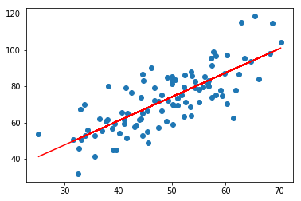

# 简单线性回归（最小二乘法）


### 0.引入依赖


```python
import numpy as np
import matplotlib.pyplot as plt
```

### 1.导入数据（data.csv --2个维度）


```python
points = np.genfromtxt('data.csv',delimiter=',') # 解析的是一个2*2矩阵
points[0] # 获取第一行
points[0][0] # 获取第一行第一列
points[0,0] # 同上，另一种写法
points[0][0:2] # 获取第一行第一列前2个元素，由于就2个元素，同points[0]
points[0,0:2] # 同上一个写法
points[0,:]# 效果同上，获取第一行所有元素
x = points[:,0]# 获取第一列所有元素
y = points[:,1]# 获取第二列所有元素

# 提取points中的2列数据，画图
plt.scatter(x,y)
plt.show()
```


### 2.定义损失函数


```python
# 损失函数式系数的函数，还要传入数据的x,y
def compute_cost(w, b, points):
    total_cost = 0
    M = len(points)
    
    # 逐点计算平方误差，然后求平均数
    for i in range(M):
        x = points[i, 0]
        y = points[i, 1]
        total_cost += (y - w * x - b) ** 2
    # python的除法计算后是一个浮点型 如果要取整数，如 1//3 = 0     
    return total_cost / M 
```

### 3.核心算法拟合函数


```python
# 定义求均值函数
def average(datas):
    sum = 0
    num = len(datas)
    for i in range(num):
        sum += datas[i]
    return sum / num

# 定义核心拟合函数
def fit(points):
    M = len(points)
    avg_x = average(points[:, 0])
    
    sum_yx = 0
    sum_x2 = 0
    sum_delta = 0
    
    for i in range(M):
        x = points[i, 0]
        y = points[i, 1]
        sum_yx += y * (x - avg_x)
        sum_x2 += x ** 2
    # 计算w        
    w =  sum_yx / (sum_x2 - M * (avg_x ** 2))
    
    for i in range(M):
        x = points[i, 0]
        y = points[i, 1]
        sum_delta += (y - w * x)
   # 计算b     
    b = sum_delta / M
    
    return w, b
```

### 4.测试 


```python
w, b = fit(points)
print("w is ",w)
print("b is ",b)

# 计算损失函数
cost = compute_cost(w, b, points)
print("cost is ",cost)
```

    w is  1.3224310227553846
    b is  7.991020982269173
    cost is  110.25738346621313


### 5.画出拟合曲线


```python
plt.scatter(x, y)
# 依据曲线计算y，使用numpy直接矩阵加乘计算
pred_y = w * x + b
plt.plot(x,pred_y,c='r')
plt.show
```




