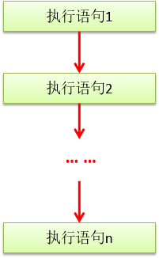
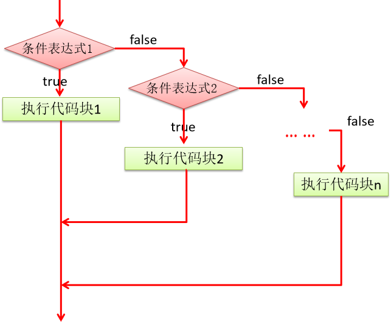

# 顺序控制

- 程序从上到下逐行地执行，中间没有任何判断和跳转

```scala
//Scala中定义变量时采用合法的前向引用。如：
def main(args : Array[String]) : Unit = {
        var num1 = 12
        var num2 = num1 + 2
}
//错误形式：
def main(args : Array[String]) : Unit = {
        var num2 = num1 + 2
        var num1 = 12
}
```




# 分支控制


## 单分支

- 基本语法

```scala
if (条件表达式) {
	执行代码块
}
说明：当条件表达式为ture 时，就会执行 { } 的代码
```

```scala
//import scala.io.StdIn //单独的引入一个StdIn
import scala.io._ // _表示将 scala.io 包的所有内容一起引入

object Demo01 {
  def main(args: Array[String]): Unit = {
    println("输入年龄")
    val age = StdIn.readInt()
    if (age > 18) {
      println("age > 18")
    }

    //小的技巧，如何查看某个包下包含的内容
    //1.比如我们想看 scala.io 包有什么内容
    //2.将光标放在 io上即可，输入ctrl +b
    //3.将光标放在 StdIn上即可，输入ctrl +b,看的是StdIn源码
    scala.io.StdIn
  }
}
```


## 双分支

```scala
//基本语法
if (条件表达式) {
    执行代码块1
} else {
    执行代码块2
}
//说明：当条件表达式成立，即执行代码块1，否则执行代码块2.
```

- 编写一个程序,可以输入人的年龄,如果该同志的年龄大于18岁,则输出 “age >18”。否则 ,输出 "age <= 18 "

```scala
object Demo02 {
    def main(args: Array[String]): Unit = {

        val age = 6
        if (age > 18) {
            println("age > 18")
        } else {
            println("age <= 18")
        }
    }
}
```


## 练习

- 编写程序，声明2个Int型变量并赋值。判断两数之和，如果大于等于50，打印“hello worl

- 编写程序，声明2个Double型变量并赋值。判断第一个数大于10.0，且第2个数小于20.0，打印两数之和。

- 【选作】定义两个变量Int，判断二者的和，是否既能被3又能被5整除，打印提示信息

- 判断一个年份是否是闰年，闰年的条件是符合下面二者之一：(1)年份能被4整除，但不能被100整除；(2)能被400整除

```scala
object Exercise01 {
  def main(args: Array[String]): Unit = {
    /*
    【选作】定义两个变量Int，判断二者的和，是否既能被3又能被5整除，打印提示信息
     */
    val num1 = 10
    val num2 = 5
    val sum = num1 + num2
    if (sum % 3 == 0 && sum % 5 == 0) {
      println("能被3又能被5整除")
    } else {
      println("能被3又能被5整除 不成立~")
    }

    /*
    判断一个年份是否是闰年，闰年的条件是符合下面二者之一：(1)年份能被4整除，但不能被100整除；(2)能被400整除
     */
    //定义一个变量保存年份
    val year = 2018
    if ((year % 4 == 0 && year % 100 != 0) || (year % 400 == 0)) {
      println(s"${year} 是闰年...")
    } else {
      println(s"${year} 不是闰年")
    }
  }
}
```


## 多分支

```scala
//基本语法
if (条件表达式1) {
    执行代码块1
}
else if (条件表达式2) {
    执行代码块2
}
……
else {
    执行代码块n
}
```




```scala
import scala.io.StdIn

object ifelsesDemo03 {
  def main(args: Array[String]): Unit = {
    /*
    岳小鹏参加scala考试，他和父亲岳不群达成承诺：
如果：
成绩为100分时，奖励一辆BMW；
成绩为(80，99]时，奖励一台iphone7plus；
当成绩为[60,80]时，奖励一个 iPad；
其它时，什么奖励也没有。
  成绩是从控制台输入
     */
    println("请输入成绩")
    val score = StdIn.readDouble()
    if (score == 100) {
      println("成绩为100分时，奖励一辆BMW")
    } else if (score > 80 && score <= 99) { //写法1使用范围，写法2就是严格的判断
      println("成绩为(80，99]时，奖励一台iphone7plus")
    } else if (score >= 60 && score <= 80) {
      println("奖励一个 iPad")
    } else {
      println("没有任何奖励")
    }
  }
}
```

- 求ax2+bx+c=0方程的根。a,b,c分别为函数的参数，如果：b2-4ac>0，则有两个解；

  b2-4ac=0，则有一个解；b2-4ac<0，则无解； [a=3 b=100 c=6]

  提示1：x1=(-b+sqrt(b2-4ac))/2a

  ​               X2=(-b-sqrt(b2-4ac))/2a

  提示2：sqrt(num)  在 scala 包中(默认引入的) 的math 的包对象有很多方法直接可用.

```scala
import scala.math._ // _ 表示将scala.math 的所有内容导入
object Exercise02 {
  def main(args: Array[String]): Unit = {

    /*
    求ax2+bx+c=0方程的根。a,b,c分别为函数的参数，如果：b2-4ac>0，则有两个解；
b2-4ac=0，则有一个解；b2-4ac<0，则无解； [a=3 b=100 c=6]
提示1：x1=(-b+sqrt(b2-4ac))/2a
               X2=(-b-sqrt(b2-4ac))/2a

提示2：sqrt(num)  在 scala 包中(默认引入的) 的math 的包对象有很多方法直接可用.

   思路的分析
   1. 定义三个变量a,b,c
   2. 使用多分支完成
   3. 因为 b2-4ac会多次使用，因此我们可以先计算，并保持到变量中
   4. 判断，写逻辑
     */
    val a = 3
    val b = 100
    val c = 6
    val m = b * b - 4 * a * c
    var x1 = 0.0
    var x2 = 0.0
    if (m > 0) {
      x1 = (-b + sqrt(m)) / 2 * a
      x2 = (-b - sqrt(m)) / 2 * a
      println("有两个解 x1=" + x1.formatted("%.2f") + "x2=" + x2.formatted("%.2f"))
    } else if (m == 0) {
      x1 = (-b + sqrt(m)) / 2 * a
      println("有一个解 x1=" + x1)
    } else {
      println("无解..")
    }
  }
}
```

- 注意事项
  - 如果大括号{}内的逻辑代码只有一行，大括号可以省略, 这点和java 的规定一样。
  - Scala中任意表达式都是有返回值的，也就意味着if else表达式其实是有返回结果的，具体返回结果的值取决于满足条件的代码体的最后一行内容.[案例演示]
  - Scala中是没有三元运算符

```scala
object Exercise03 {
    def main(args: Array[String]): Unit = {

        var sumVal = 9
        val result =
        if(sumVal > 20){
            "结果大于20"
        }
        println("res=" + result) //返回的是() 即 Unit
    }
}
```


# 嵌套分支

-  在**一个分支结构中又完整的嵌套了另一个完整的分支结构**，里面的分支的结构称为内层分支外面的分支结构称为外层分支
- 嵌套分支不要超过3层

```scala
import scala.io.StdIn

object Exercise04 {
  def main(args: Array[String]): Unit = {
    /*
    参加百米运动会，如果用时8秒以内进入决赛，否则提示淘汰。并且根据性别提示进入男子组或女子组。【可以让学员先练习下5min】, 输入成绩和性别，进行判断。
     */
    println("请输入运动员的成绩")
    val speed = StdIn.readDouble()
    if (speed <= 8) {
      println("请输入性别")
      val gender = StdIn.readChar()
      if (gender == '男') {
        println("进入男子组")
      } else {
        println("进入女子组")
      }
    } else {
      println("你被淘汰...")
    }
  }
}
```

```scala
import scala.io.StdIn

object Exercise05 {
  def main(args: Array[String]): Unit = {
    /*
    应用案例2
出票系统：根据淡旺季的月份和年龄，
打印票价 [考虑学生先做5min]

4_10 旺季：
	成人（18-60）：60
	儿童（<18）:半价
	老人（>60）:1/3

淡季：
	成人：40
	其他：20
    思路分析
    1. 定义至少三个变量 month , age, ticket
    2. 逻辑上有月份和年龄的判断因此，会使用嵌套分支
    3. 根据对应的业务逻辑完成代码
    走代码
     */
    println("输入月份")
    val month = StdIn.readInt()
    println("输入年龄")
    val age = StdIn.readInt()
    val tikcet = 60
    if (month >= 4 && month <= 10) {
      if (age >= 18 && age <= 60) {
        println("你的票价是" + tikcet)
      } else if (age < 18) {
        println("你的票价是" + tikcet / 2)
      } else {
        println("你的票价是" + tikcet / 3)
      }
    } else {
      if (age >= 18 && age <= 60) {
        println("你的票价是" + 40)
      } else {
        println("你的票价是" + 20)
      }
    }
  }
}
```


# switch分支

- 在scala中没有switch,而是**使用模式匹配来处理**。

- 模式匹配涉及到的知识点较为综合，因此放在**后面讲解**。

- match-case


# for循环

- Scala 也为for 循环这一常见的控制结构提供了非常多的特性
- 这些for 循环的特性被称为**for 推导式**（for comprehension）或**for 表达式**（for expression）


## 方式1

```scala
//范围 [1,3]
for(i <- 1 to 3){
  print(i + " ")
}
println()
```

- 说明
  - i 表示循环的变量， <- 规定好 to 规定
  - i 将会从 1-3 循环， 前后**闭合**

```scala
object ForDemo01 {
  def main(args: Array[String]): Unit = {
   
    val start = 1
    val end = 10
    //说明
    //1. start 从哪个数开始循环
    //2. to 是关键字
    //3. end 循环结束的值
    //4. start to end 表示前后闭合
    for (i <- start to end) {
      println("hello" + i)
    }

    //说明for 这种推导时，也可以直接对集合进行遍历
    var list = List("hello", 10, 30, "tom")
    for (item <- list) {
      println("item=" + item)
    }
  }
}
```


## 方式2

```scala
// 范围 [1,3)
for(i <- 1 until 3) {
  print(i + " ")
}
println()
```

- 说明
  - 这种方式和前面的区别在于 i 是从1 到 3-1
  - 前闭合后开的范围,和java的arr.length() 类似 for (int i = 0; i < arr.lenght; i++){}


## 循环守卫

```scala
for(i <- 1 to 3 if i != 2) {
  print(i + " ")
}
println()
// 等价于
for (i <- 1 to 3) {
    if (i != 2) {
        println(i+"")
    }
}
```

- 循环守卫
- 循环保护式（也称条件判断式，守卫）
- 保护式为true则进入循环体内部，为false则跳过，类似于continue


## 引入变量

```scala
// 没有关键字，所以范围后一定要加；来隔断逻辑
for(i <- 1 to 3; j = 4 - i) {
  print(j + " ")
}
// 等价于
for ( i <- 1 to 3) {
	val j = 4 –i
	print(j+"")
}
```


## 嵌套循环

```scala
// 没有关键字，所以范围后一定要加 ; 来隔断逻辑
for(i <- 1 to 3; j <- 1 to 3) {
    println(" i =" + i + " j = " + j)
}
// 等价于
for ( i <- 1 to 3) {
    for ( j <- 1to 3){
        println(i + " " + j + " ")	
    }
}
```


## 循环返回值 yield

- 将遍历过程中处理的结果返回到一个新Vector集合中，使用yield关键字

```scala
val res = for(i <- 1 to 10) yield i
println(res)
```

```scala
object yieldFor {
    def main(args: Array[String]): Unit = {
        //说明 val res = for(i <- 1 to 10) yield i 含义
        //1. 对1 to 10 进行遍历
        //2. yield i 将每次循环得到i 放入到集合Vector中，并返回给res
        //3. i 这里是一个代码块，这就意味我们可以对i进行处理
        //4. 下面的这个方式，就体现出scala一个重要的语法特点，就是将一个集合中个各个数据
        //    进行处理，并返回给新的集合

        val res = for(i <- 1 to 10) yield {
            if (i % 2 == 0) {
                i
            }else {
                "不是偶数"
            }
        }
        println(res)
    }
}
```


## 使用花括号{}代替小括号()

```scala
for(i <- 1 to 3; j =  i * 2) {
  println(" i= " + i + " j= " + j)
}
// 可以写成
for{
      i <- 1 to 3
      j = i * 2
} {
      println(" i= " + i + " j= " + j)
}
```

- {}和()对于for表达式来说都可以

- for 推导式有一个不成文的约定
  - 当 for 推导式仅包含单一表达式时使用圆括号
  - 当其包含多个表达式时使用大括号

- 当使用{} 来换行写表达式时，分号就不用写了


## 步长控制

```scala
object stepfor {
  def main(args: Array[String]): Unit = {

    for (i <- 1 to 10) {
      println("i=" + i)
    }
    //步长控制为2
    println("-------------")
    //Range(1,10,2)的对应的构建方法是
    //def apply(start: Int, end: Int, step: Int): Range = new Range(start, end, step)
    for (i <- Range(1, 10, 2)) {
      println("i=" + i)
    }

    //控制步长的第二种方式-for循环守卫
    println("**************************")
    for (i <- 1 to 10 if i % 2 == 1) {
      println("i=" + i)
    }
  }
}
```


# while循环

```scala
//循环变量初始化
while (循环条件) {
    循环体(语句)
    循环变量迭代
}
```

```scala
object WhileDemo01 {
    def main(args: Array[String]): Unit = {
        //1. 定义循环变量
        var i = 0
        //2. i < 10 条件
        while (i < 10){
            println("hello" + i) //循环体
            //循环变量迭代
            i += 1
        }
    }
}
```

-  循环条件是返回一个布尔值的表达式

- while循环是先判断再执行语句

- 与If语句不同，While语句本身没有值，即整个While语句的结果是Unit类型的()

- 因为while中没有返回值,所以当要用该语句来计算并返回结果时,就不可避免的使用变量 ，而变量需要声明在while循环的外部，那么就等同于循环的内部对外部的变量造成了影响
  - 不推荐使用，而是**推荐使用for循环**


## do...while循环

```scala
// 循环变量初始化
do{
    循环体(语句)
    循环变量迭代
} while(循环条件)
```

```scala
object Demo01 {
  def main(args: Array[String]): Unit = {
    var i = 0 // for
    do {
      printf(i + "hello\n" )
      i += 1
    } while (i < 10)
  }
}
```

- 循环条件是返回一个布尔值的表达式

- do..while循环是**先执行，再判**断

- 和while 一样，因为do…while中没有返回值,所以当要用该语句来计算并返回结果时,就不可避免的使用变量 ，而变量需要声明在do...while循环的外部，那么就等同于循环的内部对外部的变量造成了影响
  - 不推荐使用，而是**推荐使用for循**环


# 多重循环

- 将一个循环放在另一个循环体内，就形成了嵌套循环。其中，for ,while ,do…while均可以作为外层循环和内层循环。【建议一般使用两层，最多不要超过3层】

- 实质上，嵌套循环就是把内层循环当成外层循环的循环体。当只有内层循环的循环条件为false时，才会完全跳出内层循环，才可结束外层的当次循环，开始下一次的循环。

- 设外层循环次数为m次，内层为n次， 则内层循环体实际上需要执行m*n=mn次


# 循环的中断

- Scala内置控制结构特地去掉了**break和continue**
- 为更好的适应函数化编程
- 推荐使用函数式的风格解决break和contine的功能，而不是一个关键字


## break

```scala
import util.control.Breaks._

object WhileBreak {
    def main(args: Array[String]): Unit = {

        var n = 1
        //breakable()函数
        //说明
        //1. breakable 是一个高阶函数：可以接收函数的函数就是高阶函数（后面详解）

        //2. def breakable(op: => Unit) {
        //    try {
        //      op
        //    } catch {
        //      case ex: BreakControl =>
        //        if (ex ne breakException) throw ex
        //    }
        //  }
        // (1) op: => Unit 表示接收的参数是一个没有输入，也没有返回值的函数
        // (2) 即可以简单理解可以接收一段代码块
        // 3. breakable 对break()抛出的异常做了处理,代码就继续执行
        // 4. 当我们传入的是代码块，scala程序员会将() 改成{}
        breakable {
            while (n <= 20) {
                n += 1
                println("n=" + n)
                if (n == 18) {
                    //中断while
                    //说明
                    //1. 在scala中使用函数式的break函数中断循环
                    //2. def break(): Nothing = { throw breakException }
                    break()
                }
            }
        }
        println("ok~~")
    }
}
```


## continue

- Scala内置控制结构特地也去掉了continue，是为了更好的适应函数化编程
- 可使用if – else 或循环守卫实现continue的效果

```scala
for (i <- 1 to 10 if (i != 2 && i != 3)) {
    println("i=" + i)
}
```

