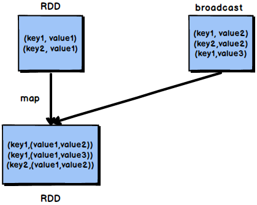
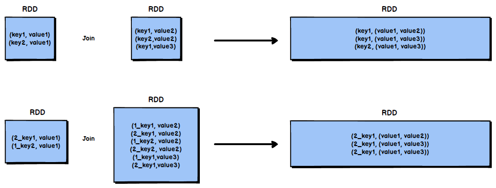

# 性能调优


## 常规调优


### 最优资源配置

- 资源越多性能越好
- 资源分配在使用脚本提交Spark任务时指定

```scala
/usr/opt/modules/spark/bin/spark-submit \
--class com.atguigu.spark.Analysis \
--num-executors 80 \
--driver-memory 6g \
--executor-memory 6g \
--executor-cores 3 \
/usr/opt/modules/spark/jar/spark.jar \
```

| **名称**          | **说明**                       |
| ----------------- | ------------------------------ |
| --num-executors   | 配置Executor的数量             |
| --driver-memory   | 配置Driver内存（影响不大）     |
| --executor-memory | 配置每个Executor的内存大小     |
| --executor-cores  | 配置每个Executor的CPU core数量 |

- 调节原则
  - ==尽量将任务分配的资源调节到可使用的资源的最大限度==

- Spark Standalone模式
  - 提交任务前，知道可使用的资源情况，在编写submit脚本时根据可用资源情况进行资源的分配
    - 如集群有15台机器，每台机器为8G内存，2个CPU core，就指定15个Executor，每个Executor分配8G内存，2个CPU core

- Spark Yarn模式
  - 由于Yarn使用==资源队列==进行资源的分配和调度，在表写submit脚本的时候，就根据Spark作业要提交到的资源队列，进行资源的分配
    - 如资源队列有400G内存，100个CPU core，则指定50个Executor，每个Executor分配8G内存，2个CPU core

- 各项资源进行了调节后，得到的性能提升如下
  - 增加核数，增加Executor的个数，本质等于增加Task执行的并行度
  - 增加内存，减少map和reduce阶段的IO操作，减少GC次数，提升性能

| 名称                           | 解析                                                         |
| ------------------------------ | ------------------------------------------------------------ |
| 增加Executor个数               | 在资源允许的情况下，增加Executor的个数可提高执行task的并行度。如有4个Executor，每个Executor有2个CPU core，那么可以并行执行8个task，如将Executor的个数增加到8个（资源允许的情况下），那么可以并行执行16个task，此时的并行能力提升了一倍 |
| 增加每个Executor的CPU core个数 | 在资源允许的情况下，增加每个Executor的Cpu core个数，可提高执行task的并行度。如4个Executor，每个Executor有2个CPU core，那么可以并行执行8个task，如将每个Executor的CPU core个数增加到4个，那么可以并行执行16个task，此时的并行能力提升了一倍 |
| 增加每个Executor的内存量       | 在资源允许的情况下，增加每个Executor的内存量以后，对性能的提升有三点：1. 可以缓存更多的数据（即对RDD进行cache），写入磁盘的数据相应减少，甚至可以不写入磁盘，减少了可能的磁盘IO；2. 可以为shuffle操作提供更多内存，即有更多空间来存放reduce端拉取的数据，写入磁盘的数据相应减少，甚至可以不写入磁盘，减少了可能的磁盘IO；3. 可以为task的执行提供更多内存，在task的执行过程中可能创建很多对象，内存较小时会引发频繁的GC，增加内存后，可以避免频繁的GC，提升整体性能 |

- 生产环境Spark Submit 脚本配置

```bash
/usr/local/spark/bin/spark-submit \
--class com.atguigu.spark.WordCount \
--num-executors 80 \
--driver-memory 6g \
--executor-memory 6g \
--executor-cores 3 \
--master yarn-cluster \
--queue root.default \
--conf spark.yarn.executor.memoryOverhead=2048 \
--conf spark.core.connection.ack.wait.timeout=300 \
/usr/local/spark/spark.jar
```

- 参数配置参考值
  - --num-executors：50~100
  - --driver-memory：1G~5G
  - --executor-memory：6G~10G
  - --executor-cores：3
  - --master：实际生产环境一定使用yarn-cluster


### RDD 优化


#### RDD 复用

- 在对RDD进行算子时，要避免相同的算子和计算逻辑之下对RDD进行重复的计算

  

- 进行调整


#### RDD 持久化

- 在Spark中，当多次对同一个RDD执行算子操作时，每一次都会对这个RDD以之前的父RDD重新计算一次，这种情况是必须要避免的，对同一个RDD的重复计算是对资源的极大浪费
  - 必须对多次使用的RDD进行持久化，通过持久化将公共RDD的数据缓存到内存/磁盘中，之后对于公共RDD的计算都会从内存/磁盘中直接获取RDD数据

- 对于RDD的持久化

  - RDD的持久化是可以进行序列化的，当内存无法将RDD的数据完整的进行存放的时候，可以考虑使用序列化的方式减小数据体积，将数据完整存储在内存中

  - 如对于数据的可靠性要求很高，并且内存充足，可使用副本机制，对RDD数据进行持久化

    - 当持久化启用了复本机制时，对于持久化的每个数据单元都存储一个副本，放在其他节点上面，由此实现数据的容错，一旦一个副本数据丢失，不需要重新计算，还可以使用另外一个副本

      

#### RDD 尽早filter操作

- 先把数据量变小

- 获取到初始RDD后，应该考虑尽早地过滤掉不需要的数据，进而减少对内存的占用，从而提升Spark作业的运行效率


### 并行度调节

- 并行度
  - 各个Stage的task数量
  - 不能尽可能大

- 如果并行度设置不合理而导致并行度过低，会导致资源的极大浪费
  - 如20个Executor，每个Executor分配3个CPU core，而Spark作业有40个task，这样每个Executor分配到的task个数是2个，使得每个Executor有一个CPU core空闲，导致资源的浪费
- 理想的并行度设置，应该是让并行度与资源相匹配
  - 在资源允许的前提下，并行度要设置的尽可能大，达到可以充分利用集群资源
  - 合理的设置并行度，可以提升整个Spark作业的性能和运行速度
- Spark官方推荐
  - ==task数量应该设置为Spark作业总CPU core数量的2~3倍==
  - 如果Task和Core数量相同，可能导致一部分core闲置而导致资源浪费，因为Task的数据可能正好保存在其中几个Core对应的Executor中，剩余的Core就不会执行任务了
  - 之所以没有推荐task数量与CPU core总数相等，是因为task的执行时间不同，有的task执行速度快而有的task执行速度慢，如果task数量与CPU core总数相等，那么执行快的task执行完成后，会出现CPU core空闲的情况
  - 如果task数量设置为CPU core总数的2~3倍，那么一个task执行完毕后，CPU core会立刻执行下一个task，降低了资源的浪费，同时提升了Spark作业运行的效率
- 并行度设置

```scala
val conf = new SparkConf().set("spark.default.parallelism", "500")
```


### 广播大变量

- 不要特别大
  - 100G内存，可以共享10G大变量

- 默认情况下task中的算子中如果使用了外部的变量，每个task都会获取一份变量的复本
  - 造成了内存的极大消耗
  - 如果后续对RDD进行持久化，可能就无法将RDD数据存入内存，只能写入磁盘，磁盘IO将会严重消耗性能
  - task在创建对象的时候，也许会发现堆内存无法存放新创建的对象，导致频繁的GC，GC会导致工作线程停止，进而导致Spark暂停工作一段时间，严重影响Spark性能
- 假设当前任务配置了20个Executor，指定500个task，有一个20M的变量被所有task共用，此时会在500个task中产生500个副本，耗费集群10G的内存，如果使用了广播变量， 那么每个Executor保存一个副本，一共消耗400M内存，内存消耗减少了5倍
- 广播变量在每个Executor保存一个副本，此Executor的所有task共用此广播变量，这让变量产生的副本数量大大减少
- 在初始阶段，广播变量只在Driver中有一份副本
- task在运行的时候，想要使用广播变量中的数据，此时首先会在自己本地的Executor对应的BlockManager中尝试获取变量，==如果本地没有，BlockManager就会从Driver或者其他节点的BlockManager上远程拉取变量的复本，并由本地的BlockManager进行管理==；之后此Executor的所有task都会直接从本地的BlockManager中获取变量


### Kryo序列化

- 序列化后的文件大小原小于java序列化后的文件大小

- 默认情况
  - Spark使用Java的序列化机制
  - Java的序列化机制使用方便，不需要额外的配置，在算子中使用的变量实现Serializable接口即可
  - Java序列化机制的效率不高，序列化速度慢并且序列化后的数据所占用的空间依然较大

- Kryo序列化机制比Java序列化机制性能提高10倍左右
  - Spark之所以没有默认使用Kryo作为序列化类库，由于它不支持所有对象的序列化
  - Kryo需要用户在使用前注册需要序列化的类型，不够方便
- 从Spark 2.0.0版本开始，简单类型、简单类型数组、字符串类型的Shuffling RDDs 已经默认使用Kryo序列化方式了

- Kryo序列化配置

```scala
public class MyKryoRegistrator implements KryoRegistrator{
  @Override
  public void registerClasses(Kryo kryo){
    kryo.register(StartupReportLogs.class);
  }
}

//创建SparkConf对象
val conf = new SparkConf().setMaster(…).setAppName(…)
//使用Kryo序列化库，如果要使用Java序列化库，需要把该行屏蔽掉
conf.set("spark.serializer", "org.apache.spark.serializer.KryoSerializer");  
//在Kryo序列化库中注册自定义的类集合，如果要使用Java序列化库，需要把该行屏蔽掉
conf.set("spark.kryo.registrator", "stt.com.MyKryoRegistrator"); 
```


### 调节本地化等待时长

- Spark作业运行过程中，Driver会对每一个stage的task进行分配
- 根据Spark的task分配算法，Spark希望task能够运行在它要计算的数据算在的节点（数据本地化思想），这样就可以避免数据的网络传输
- 通常来说，==task可能不会被分配到它处理的数据所在的节点==，因为这些节点可用的资源可能已经用尽，此时，Spark会等待一段时间，默认3s，如果等待指定时间后仍然无法在指定节点运行，那么会自动降级，尝试将task分配到比较差的本地化级别所对应的节点上，比如将task分配到离它要计算的数据比较近的一个节点，然后进行计算，如果当前级别仍然不行，那么继续降级

- 当task要处理的数据不在task所在节点上时，会发生数据的传输。task会通过所在节点的BlockManager获取数据，BlockManager发现数据不在本地时，户通过网络传输组件从数据所在节点的BlockManager处获取数据

- 网络传输数据的情况是我们不愿意看到的，大量的网络传输会严重影响性能，因此希望通过调节本地化等待时长，如果在等待时长这段时间内，目标节点处理完成了一部分task，那么当前的task将有机会得到执行，这样就能够改善Spark作业的整体性能

- 本地化等级

| 名称          | 解析                                                         |
| ------------- | ------------------------------------------------------------ |
| PROCESS_LOCAL | 进程本地化，task和数据在同一个Executor中，性能最好。         |
| NODE_LOCAL    | 节点本地化，task和数据在同一个节点中，但是task和数据不在同一个Executor中，数据需要在进程间进行传输。 |
| RACK_LOCAL    | 机架本地化，task和数据在同一个机架的两个节点上，数据需要通过网络在节点之间进行传输。 |
| NO_PREF       | 对于task来说，从哪里获取都一样，没有好坏之分。               |
| ANY           | task和数据可以在集群的任何地方，而且不在一个机架中，性能最差。 |

- 在Spark项目开发阶段，可使用client模式对程序进行测试，可在本地看到比较全的日志信息，日志信息中有明确的task数据本地化的级别，如果大部分都是PROCESS_LOCAL，那么就无需进行调节，但是如果发现很多的级别都是NODE_LOCAL、ANY，那么需要对本地化的等待时长进行调节，通过延长本地化等待时长，看看task的本地化级别有没有提升，并观察Spark作业的运行时间有没有缩短

- 注意，过犹不及，不要将本地化等待时长延长地过长，导致因为大量的等待时长，使得Spark作业的运行时间反而增加了

- 设置等待时长

```scala
val conf = new SparkConf().set("spark.locality.wait", "6")
```


## 算子调优


### mapPartitions

- 普通的map算子对RDD中的每一个元素进行操作
- mapPartitions算子对RDD中每一个分区进行操作
- 如果是普通的map算子，假设一个partition有1万条数据，那么map算子中的function要执行1万次，也就是对每个元素进行操作
- 如果是mapPartition算子，由于一个task处理一个RDD的partition，那么一个task只会执行一次function，function一次接收所有的partition数据，效率比较高


- 场景当要把RDD中的所有数据通过JDBC写入数据

  - 如果使用map算子，需要对RDD中的每一个元素都创建一个数据库连接，对资源的消耗很大
  - 如果使用mapPartitions算子，那么针对一个分区的数据，只需要建立一个数据库连接

  

- mapPartitions缺点

  - 对于普通的map操作，一次处理一条数据，如果在处理了2000条数据后内存不足，那么可以将已经处理完的2000条数据从内存中垃圾回收掉
  - 使用mapPartitions算子当数据量非常大时，function一次处理一个分区的数据，如果一旦内存不足，此时无法回收内存（因为引用无法释放），就可能会OOM，即内存溢出

- mapPartitions算子适用于数据量不是特别大的时使用mapPartitions算子对性能的提升效果还是不错的

  - 当数据量很大的时候，一旦使用mapPartitions算子，就会直接OOM

- 在项目中，应该首先估算一下RDD的数据量、每个partition的数据量，以及分配给每个Executor的内存资源，如果资源允许，可考虑使用mapPartitions算子代替map


### foreachPartition

- 优化数据库操作

- 在生产环境中，通常使用foreachPartition算子来完成数据库的写入，通过foreachPartition算子的特性，可以优化写数据库的性能
- 如果使用foreach算子完成数据库的操作，由于foreach算子是遍历RDD的每条数据，因此，每条数据都会建立一个数据库连接，这是对资源的极大浪费，因此，对于写数据库操作，我们应当使用foreachPartition算子
- 与mapPartitions算子非常相似，foreachPartition是将RDD的每个分区作为遍历对象，一次处理一个分区的数据，也就是说，如果涉及数据库的相关操作，一个分区的数据只需要创建一次数据库连接


- 使用了foreachPartition算子后，可以获得以下的性能提升
  - 对于我们写的function函数，一次处理一整个分区的数据
  - 对于一个分区内的数据，创建唯一的数据库连接
  - 只需要向数据库发送一次SQL语句和多组参数
- 在生产环境中，全部都会使用foreachPartition算子完成数据库操作
- foreachPartition算子的问题
  - 与mapPartitions算子类似，如果一个分区的数据量特别大，可能会造成OOM，即内存溢出
- 分析

```scala
// Driver
Connection conn = null;
// conn 存在于Driver，无法序列化传递到Executor

rdd.foreach(){
    // Executor
    // 只能在Executor中初始化conn
    Pstat pstat = conn.getStatement
	pstat.executeUpdate(sql,item)
}
```


### filter 与 coalesce 配合使用

- 在Spark任务中我们经常会使用filter算子完成RDD中数据的过滤，在任务初始阶段，从各个分区中加载到的数据量是相近的，但是一旦进过filter过滤后，每个分区的数据量有可能会存在较大差异


- 问题
  - ==每个partition的数据量变小==
    - 如果还按照之前与partition相等的task个数去处理当前数据，浪费task的计算资源
  - ==每个partition的数据量不一样==
    - 会导致后面的每个task处理每个partition数据的时候，每个task要处理的数据量不同，这很有可能导致数据倾斜问题
  - 第二个分区的数据过滤后只剩100条，而第三个分区的数据过滤后剩下800条，在相同的处理逻辑下，第二个分区对应的task处理的数据量与第三个分区对应的task处理的数据量差距达到了8倍，这也会导致运行速度可能存在数倍的差距，这也就是数据倾斜问题

- 针对上述的两个问题分析
  - 第一个问题，分区的数据量变小了，可对分区数据进行重新分配
    - 如原来4个分区的数据转化到2个分区中，只需要用后面的两个task进行处理即可，避免了资源的浪费
  - 第二个问题，解决方法和第一个问题的解决方法非常相似，对分区数据重新分配，让每个partition中的数据量差不多，这就避免了数据倾斜问题

- 那么具体应该如何实现上面的解决思路
  - 需要coalesce算子
  - repartition与coalesce都可以用来进行重分区
    - 其中repartition只是coalesce接口中shuffle为true的简易实现，coalesce默认情况下不进行shuffle
    - 可通过参数进行设置

- 假设将原本的分区个数A通过重新分区变为B，那么有以下几种情况
  - **多变少，差别大用shuffle，差别不大不shuffle**
  - **少变多，必须shuffle**

- 注意

  - local模式是进程内模拟集群运行，已经对并行度和分区数量有了一定的内部优化，因此不用去设置并行度和分区数量

    

### repartition解决SparkSQL低并行度问题

- ==并行度的设置对于Spark SQL是不生效的==
  - 用户设置的并行度只对于Spark SQL以外的所有Spark的stage生效
- Spark SQL的并行度不允许用户自己指定
- Spark SQL自己会默认根据hive表对应的HDFS文件的split个数自动设置Spark SQL所在的那个stage的并行度
- 用户自己通`spark.default.parallelism`参数指定的并行度，只会在没Spark SQL的stage中生效
- 由于Spark SQL所在stage的并行度无法手动设置，如果数据量较大，并且此stage中后续的transformation操作有着复杂的业务逻辑，而Spark SQL自动设置的task数量很少，意味着每个task要处理为数不少的数据量，还要执行非常复杂的处理逻辑，可能表现为第一个有Spark SQL的stage速度很慢，而后续的没有Spark SQL的stage运行速度非常快
- 为了解决Spark SQL无法设置并行度和task数量的问题，可使用repartition算子


- Spark SQL这一步的并行度和task数量肯定是没有办法改变，对于Spark SQL查询出来的RDD，立即使用repartition算子，去重新进行分区可重新分区为多个partition

  - 从repartition之后的RDD操作，由于不再设计Spark SQL，因此stage的并行度就会等于你手动设置的值
  - 避免了Spark SQL所在的stage只能用少量的task去处理大量数据并执行复杂的算法逻辑

  

### reduceByKey 预聚合

- reduceByKey相较于普通的shuffle操作一个显著的特点就是会进行map端的预先聚合
  - map端会先对本地的数据进行combine操作，然后将数据写入给下个stage的每个task创建的文件中
  - 在map端，对每一个key对应的value，执行reduceByKey算子函数


- 使用reduceByKey对性能的提升如下
  - 本地聚合后，在map端的数据量变少，减少了磁盘IO，也减少了对磁盘空间的占用
  - 本地聚合后，下一个stage拉取的数据量变少，减少了网络传输的数据量
  - 本地聚合后，在reduce端进行数据缓存的内存占用减少
  - 本地聚合后，在reduce端进行聚合的数据量减少

- 基于reduceByKey的本地聚合特征，应考虑使用reduceByKey代替其他的shuffle算子
  - 如groupByKey


## Shuffle调优


### 调节 map端缓冲区大小

- 调大后每次IO数据量增加，可以减少IO次数
- 在Spark任务运行过程中，如果shuffle的map端处理的数据量比较大，但是map端缓冲的大小是固定的，可能会出现map端缓冲数据频繁spill溢写到磁盘文件中的情况，使得性能非常低下
- 通过调节map端缓冲的大小，可避免频繁的磁盘IO操作，进而提升Spark任务的整体性能
- map端缓冲
  - 默认配置是32KB
  - 如果每个task处理640KB的数据，会发生640/32 = 20次溢写
  - 如果每个task处理64000KB的数据，会发生64000/32=2000此溢写，这对于性能的影响是非常严重的

```scala
val conf = new SparkConf().set("spark.shuffle.file.buffer", "64")
```


### 调节reduce端拉取数据缓冲区大小

- Spark Shuffle过程中，shuffle reduce task的buffer缓冲区大小决定了reduce task每次能够缓冲的数据量
  - 每次能够拉取的数据量
  - 如果内存资源较为充足，适当增加拉取数据缓冲区的大小，可减少拉取数据的次数，可减少网络传输的次数，进而提升性能

- reduce端数据拉取缓冲区的大小通过`spark.reducer.maxSizeInFlight`参数进行设置
  - 默认48MB

```scala
val conf = new SparkConf().set("spark.reducer.maxSizeInFlight", "96")
```


### 调节reduce端拉取数据重试次数

- Spark Shuffle过程中 reduce task拉取属于自己的数据时，如果因网络异常等原因导致失败会自动进行重试
- 对于那些包含了特别耗时的shuffle操作的作业，建议增加重试最大次数（比如60次），以避免由于JVM的full gc或者网络不稳定等因素导致的数据拉取失败
- 在实践中发现，对于针对超大数据量（数十亿~上百亿）的shuffle过程，调节该参数可以**大幅度提升稳定性**
- reduce端拉取数据重试次数可通过`spark.shuffle.io.maxRetries`参数进行设置
  - 代表可重试的最大次数
  - 默认3
- 如果在指定次数之内拉取还是没有成功，可能会导致作业执行失败

```scala
val conf = new SparkConf().set("spark.shuffle.io.maxRetries", "6")
```


### 调节reduce端拉取数据等待间隔

- 重试时间间隔

- Spark Shuffle过程中，reduce task拉取属于自己的数据时，如果因为网络异常等原因导致失败会自动进行重试，在一次失败后，会等待一定的时间间隔再进行重试，可通过加大间隔时长（比如60s）增加shuffle操作的稳定性

- reduce端拉取数据等待间隔通过`spark.shuffle.io.retryWait`参数进行设置
  - 默认值为5s

```scala
val conf = new SparkConf().set("spark.shuffle.io.retryWait", "60s")
```


### 调节 SortShuffle 排序操作阈值

- 对于SortShuffleManager，如果shuffle reduce task的数量小于某一阈值则shuffle write过程中不会进行排序操作，而是直接按照未经优化的HashShuffleManager的方式去写数据，最后会将每个task产生的所有临时磁盘文件都合并成一个文件，并会创建单独的索引文件
- 当使用SortShuffleManager时，如果的确不需要排序操作，建议将这个参数调大一些，大于shuffle read task的数量，那么map-side就不会进行排序了，减少了排序的性能开销
  - 这种方式下，依然会产生大量的磁盘文件，因此shuffle write性能有待提高
- SortShuffleManager排序操作阈值的设置通过`spark.shuffle.sort. bypassMergeThreshold`这一参数进行设置
  - 默认值为200

```scala
val conf = new SparkConf().set("spark.shuffle.sort.bypassMergeThreshold", "400")
```


## JVM调优

- 首先应该明确，full gc/minor gc 都会导致JVM的工作线程停止工作


### 降低cache操作的内存占比


#### 静态内存管理机制

- 根据Spark静态内存管理机制堆内存被划分为了两块
  - Storage
    - 主要用于缓存RDD数据和broadcast数据
    - 占系统内存的60%
  - Execution
    - 主要用于缓存在shuffle过程中产生的中间数据
    - 占系统内存的20%
- Storage和Execution两者完全独立

- 一般情况下Storage的内存都提供给了cache操作，如果在某些情况下cache操作内存不是很紧张，而task的算子中创建的对象很多，Execution内存又相对较小，导致频繁的minor gc，甚至于频繁的full gc，进而导致Spark频繁的停止工作，性能影响会很大
- 在Spark UI中可以查看每个stage的运行情况，包括每个task的运行时间、gc时间等等，如果发现gc太频繁，时间太长，就可考虑调节Storage的内存占比，让task执行算子函数式，有更多的内存可以使用

- Storage内存区域可通过`spark.storage.memoryFraction`参数进行指定
  - 默认为0.6，即60%
  - 可逐级向下递减

```scala
val conf = new SparkConf().set("spark.storage.memoryFraction", "0.4")
```


#### 统一内存管理机制

- 新版本由于动态内存，不再用这个方法优化

- 根据Spark统一内存管理机制堆内存被划分为了两块
  - Storage
    - 主要用于缓存数据
  - Execution
    - 主要用于缓存在shuffle过程中产生的中间数据
- Storage和Execution各占统一内存的50%
- 两者所组成的内存部分称为统一内存
- 由于动态占用机制的实现，shuffle过程需要的内存过大时，==会自动占用Storage的内存区域，无需手动进行调节==


### 调节Executor堆外内存

- Executor的堆外内存主要用于程序的共享库、Perm Space、 线程Stack和一些Memory mapping等, 或者类C方式allocate object
- 如果Spark作业处理的数据量非常大，达到几亿的数据量，此时运行Spark作业会时不时地报错，如shuffle output file cannot find，executor lost，task lost，out of memory等，这可能是Executor的堆外内存不太够用，导致Executor在运行的过程中内存溢出
- stage的task在运行的时候，可能要从一些Executor中去拉取shuffle map output文件，但是Executor可能已经由于内存溢出挂掉了，其关联的BlockManager也没有了，这就可能会报出shuffle output file cannot find，executor lost，task lost，out of memory等错误，此时，就可以考虑调节一下Executor的堆外内存，也就可以避免报错，与此同时，堆外内存调节的比较大的时候，对于性能来讲，也会带来一定的提升

- 默认情况下，Executor堆外内存上限大概为300多MB
- 在实际的生产环境下，对海量数据进行处理的时候，这里都会出现问题，导致Spark作业反复崩溃，无法运行，此时就调节这个参数，到至少1G，甚至于2G、4G
- Executor堆外内存的配置需要在spark-submit脚本里配置

```bash
--conf spark.yarn.executor.memoryOverhead=2048
```


### 调节连接等待时长

- 在Spark作业运行过程中，Executor优先从自己本地关联的BlockManager中获取某份数据，如果本地BlockManager没有的话，会通过TransferService远程连接其他节点上Executor的BlockManager来获取数据。

- 如果task在运行过程中创建大量对象或者创建的对象较大，会占用大量的内存导致频繁的垃圾回收，但是垃圾回收会导致工作现场全部停止，也就是说，垃圾回收一旦执行，Spark的Executor进程就会停止工作，无法响应，由于没有响应，无法建立网络连接，会导致网络连接超时

- 在生产环境下，有时会遇到file not found、file lost这类错误，在这种情况下，很有可能是Executor的BlockManager在拉取数据的时候，无法建立连接，然后超过默认的连接等待时长60s后，宣告数据拉取失败，如果反复尝试都拉取不到数据，可能会导致Spark作业的崩溃。这种情况也可能会导致DAGScheduler反复提交几次stage，TaskScheduler返回提交几次task，大大延长了我们的Spark作业的运行时间

- 调节连接的超时时长，连接等待时长要在spark-submit脚本中进行设置

```bash
--conf spark.core.connection.ack.wait.timeout=300
```

- 调节连接等待时长后，通常可以避免部分的XX文件拉取失败、XX文件lost等报错


# 数据倾斜

- Spark中的数据倾斜问题主要指shuffle过程中出现的数据倾斜问题，是由于不同的key对应的数据量不同导致的不同task所处理的数据量不同的问题

- 如reduce点一共要处理100万条数据
  - 第一个和第二个task分别被分配到了1万条数据
    - 计算5分钟内完成
  - 第三个task分配到了98万数据
    - 可能需要10个小时完成
    - 使整个Spark作业需要10个小时才能运行完成，这就是数据倾斜所带来的后果

- **注意，要区分开数据倾斜与数据量过量这两种情况**
  - **数据倾斜是指少数task被分配了绝大多数的数据，因此少数task运行缓慢**
  - **数据过量是指所有task被分配的数据量都很大，相差不多，所有task都运行缓慢**

- 数据倾斜的表现
  - Spark作业的大部分task都执行迅速，只有有限的几个task执行的非常慢，此时可能出现了数据倾斜，作业可以运行，但是运行得非常慢
  - Spark作业的大部分task都执行迅速，但是有的task在运行过程中会突然报出OOM，反复执行几次都在某一个task报出OOM错误，此时可能出现了数据倾斜，作业无法正常运行

- 定位数据倾斜问题
  - 查阅代码中的shuffle算子，例如reduceByKey、countByKey、groupByKey、join等算子，根据代码逻辑判断此处是否会出现数据倾斜
  - 查看Spark作业的log文件，log文件对于错误的记录会精确到代码的某一行，可根据异常定位到的代码位置来明确错误发生在第几个stage，对应的shuffle算子是哪一个


## 聚合原数据

> 避免shuffle过程

- 绝大多数情况下，Spark作业的数据来源都是Hive表
  - Hive表基本都是经过ETL之后的昨天的数据

- 为了避免数据倾斜，可考虑避免shuffle过程，如果避免了shuffle过程，那么从根本上就消除了发生数据倾斜问题的可能

- 如果Spark作业的数据来源于Hive表，可先在Hive表中对数据进行聚合
  - 如按照key进行分组，将同一key对应的所有value用一种特殊的格式拼接到一个字符串里去
    - 一个key就只有一条数据了
    - 对一个key的所有value进行处理时只要进行map操作，无需再进行任何的shuffle操作
  - 通过上述方式就避免了执行shuffle操作，也就不可能会发生任何的数据倾斜问题

- 对于Hive表中数据的操作，不一定是拼接成一个字符串，也可以是直接对key的每一条数据进行累计计算

- **要区分开，处理的数据量大和数据倾斜的区别**


> 缩小key粒度（增大数据倾斜可能性，降低每个task的数据量）

- key的数量增加，可能使数据倾斜更严重

> 增大key粒度（减小数据倾斜可能性，增大每个task的数据量）

- 如果没有办法对每个key聚合出来一条数据，在特定场景下，可以考虑扩大key的聚合粒度
  - 如有10万条用户数据，当前key的粒度是（省，城市，区，日期）
    - 扩大粒度，将key的粒度扩大为（省，城市，日期）
    - key的数量会减少，key之间的数据量差异也有可能会减少
    - 可减轻数据倾斜的现象和问题
  - 此方法只针对特定类型的数据有效，当应用场景不适宜时，会加重数据倾斜


## 提高shuffle操作中的reduce并行度

- 增加分区数，之前放到同一分区的数据就可能分布到不同的分区中

- 之前方案对于数据倾斜的处理没有很好的效果时，可考虑提高shuffle过程中的reduce端并行度
- reduce端并行度的提高就增加了reduce端task的数量，则每个task分配到的数据量就会相应减少，由此缓解数据倾斜问题

- reduce端并行度的设置
  - 在大部分的shuffle算子中，都可以传入一个并行度的设置参数
    - 如reduceByKey(500)，这个参数会决定shuffle过程中reduce端的并行度，在进行shuffle操作的时候，就会对应着创建指定数量的reduce task
    - 对于Spark SQL中的shuffle类语句，比如group by、join等，需要设置一个参数
      - 即`spark.sql.shuffle.partitions`
        - 默认是200
        - 对于很多场景来说都有点过小
      - 代表了shuffle read task的并行度
  - 增加shuffle read task的数量，让原本分配给一个task的多个key分配给多个task，让每个task处理比原来更少的数据。如果原本有5个key，每个key对应10条数据，这5个key都是分配给一个task的，那么这个task就要处理50条数据。而增加了shuffle read task以后，每个task就分配到一个key，即每个task就处理10条数据，那么自然每个task的执行时间都会变短

- 不足
  - 提高reduce端并行度并没有从根本上改变数据倾斜的本质和问题
  - 只是尽可能地去缓解和减轻shuffle reduce task的数据压力，以及数据倾斜的问题，适用于有较多key对应的数据量都比较大的情况
  - 该方案通常无法彻底解决数据倾斜，因为如果出现一些极端情况，如某个key对应的数据量有100万，那么无论你的task数量增加到多少，这个对应着100万数据的key肯定还是会分配到一个task中去处理，因此还是会发生数据倾斜的
  - 这种方案只能说是在发现数据倾斜时尝试使用的第一种手段，尝试去用嘴简单的方法缓解数据倾斜而已，或者是和其他方案结合起来使用
  - 在理想情况下，reduce端并行度提升后，会在一定程度上减轻数据倾斜的问题，甚至基本消除数据倾斜
  - 一些情况下，只会让原来由于数据倾斜而运行缓慢的task运行速度稍有提升，或者避免了某些task的OOM问题，但是仍然运行缓慢


## 使用随机key实现双重聚合

- 在key前面加一个随机数，让相同的key分布到不同的分区中

- 当使用了类似于groupByKey、reduceByKey这样的算子时，考虑使用随机key实现双重聚合


- 首先通过map算子给每个数据的key添加随机数前缀，对key进行打散，将原先一样的key变成不一样的key
- 然后进行第一次聚合，可以让原本被一个task处理的数据分散到多个task上去做局部聚合
- 随后去除掉每个key的前缀，再次进行聚合
- 此方法对于由groupByKey、reduceByKey这类算子造成的数据倾斜由比较好的效果
  - 仅适用于聚合类的shuffle操作，适用范围相对较窄
  - 如果是join类的shuffle操作，还得用其他的解决方案。


## 将reduce join转换为map join

- 正常情况下join操作都会执行shuffle过程，并且执行的是reduce join，先将所有相同的key和对应的value汇聚到一个reduce task中进行join


- 普通的join是会走shuffle过程的，而一旦shuffle，就相当于会将相同key的数据拉取到一个shuffle read task中再进行join，此时就是reduce join
- 如果一个RDD是比较小的，则可以采用广播小RDD全量数据+map算子来实现与join同样的效果，也就是map join，此时就不会发生shuffle操作，也就不会发生数据倾斜

- 注意，RDD是并不能进行广播的，只能将RDD内部的数据通过collect拉取到Driver内存然后再进行广播

- 核心思路
  - 不使用join算子进行连接操作，而使用Broadcast变量与map类算子实现join操作，进而完全规避掉shuffle类的操作，彻底避免数据倾斜的发生和出现
  - 将较小RDD中的数据直接通过collect算子拉取到Driver端的内存中来，然后对其创建一个Broadcast变量
  - 接着对另外一个RDD执行map类算子，在算子函数内，从Broadcast变量中获取较小RDD的全量数据，与当前RDD的每一条数据按照连接key进行比对，如果连接key相同的话，那么就将两个RDD的数据用需要的方式连接起来
  - 根据上述思路，根本不会发生shuffle操作，从根本上杜绝了join操作可能导致的数据倾斜问题
  - 当join操作有数据倾斜问题并且其中一个RDD的数据量较小时，可优先考虑这种方式，效果非常好



- 不适合场景
  - 由于Spark的广播变量是在每个Executor中保存一个副本，如果两个RDD数据量都比较大，那么如果将一个数据量比较大的RDD做成广播变量，那么很有可能会造成内存溢出


## sample采样对倾斜key单独进行join

- 在Spark中，如果某个RDD只有一个key，那么在shuffle过程中会默认将此key对应的数据打散，由不同的reduce端task进行处理
- ==当由单个key导致数据倾斜时==，可有将发生数据倾斜的key单独提取出来，组成一个RDD，然后用这个原本会导致倾斜的key组成的RDD根其他RDD单独join，此时根据Spark的运行机制，此RDD中的数据会在shuffle阶段被分散到多个task中去进行join操作


- 适合场景
  - 对于RDD中的数据，可以将其转换为一个中间表，或者是直接使用countByKey()的方式，看一个这个RDD中各个key对应的数据量
  - 如果你发现整个RDD就一个key的数据量特别多，可以考虑使用这种方法
  - 当数据量非常大时，可考虑使用sample采样获取10%的数据，然后分析这10%的数据中哪个key可能会导致数据倾斜，然后将这个key对应的数据单独提取出来

- 不适合场景
  - 如果一个RDD中导致数据倾斜的key很多，那么此方案不适用


## 使用随机数以及扩容进行join

- 如果在进行join操作时，RDD中有大量的key导致数据倾斜，那么进行分拆key也没什么意义，对于join操作可考虑对其中一个RDD数据进行扩容，另一个RDD进行稀释后再join

- 将原先一样的key通过附加随机前缀变成不一样的key，将这些处理后的“不同key”分散到多个task中去处理，而不是让一个task处理大量的相同key
- 这种方案是针对有大量倾斜key的情况，没法将部分key拆分出来进行单独处理，需要对整个RDD进行数据扩容，对内存资源要求很高

- 核心思想
  - 选择一个RDD，使用flatMap进行扩容，对每条数据的key添加数值前缀（1~N的数值），将一条数据映射为多条数据（扩容）
  - 选择另外一个RDD，进行map映射操作，每条数据的key都打上一个随机数作为前缀（1~N的随机数）（稀释）
  - 将两个处理后的RDD，进行join操作



- 局限性
  - 如果两个RDD都很大，那么将RDD进行N倍的扩容显然行不通
  - 使用扩容的方式只能缓解数据倾斜，不能彻底解决数据倾斜问题

- 分析
  - 当RDD中有几个key导致数据倾斜时，方案5不再适用，而方案6又非常消耗资源，此时可以引入方案6的思想完善方案5
    - 对包含少数几个数据量过大的key的那个RDD，通过sample算子采样出一份样本来，然后统计一下每个key的数量，计算出来数据量最大的是哪几个key
    - 然后将这几个key对应的数据从原来的RDD中拆分出来，形成一个单独的RDD，并给每个key都打上n以内的随机数作为前缀，而不会导致倾斜的大部分key形成另外一个RDD
    - 接着将需要join的另一个RDD，也过滤出来那几个倾斜key对应的数据并形成一个单独的RDD，将每条数据膨胀成n条数据，这n条数据都按顺序附加一个0~n的前缀，不会导致倾斜的大部分key也形成另外一个RDD
    - 再将附加了随机前缀的独立RDD与另一个膨胀n倍的独立RDD进行join，此时就可以将原先相同的key打散成n份，分散到多个task中去进行join了
    - 而另外两个普通的RDD就照常join即可
    - 最后将两次join的结果使用union算子合并起来即可，就是最终的join结果


# 故障排除


## 控制reduce端缓冲大小以避免OOM

- 在Shuffle过程，reduce端task并不是等到map端task将其数据全部写入磁盘后再去拉取，而是map端写一点数据，reduce端task就会拉取一小部分数据，然后立即进行后面的聚合、算子函数的使用等操作

- reduce端task能够拉取多少数据，由reduce拉取数据的缓冲区buffer来决定，因为拉取过来的数据都是先放在buffer中，然后再进行后续的处理，buffer的默认大小为48MB

- ==reduce端task会一边拉取一边计算，不一定每次都会拉满48MB的数据，可能大多数时候拉取一部分数据就处理掉了==

- 虽然说增大reduce端缓冲区大小可以减少拉取次数，提升Shuffle性能，但是有时map端的数据量非常大，写出的速度非常快，此时reduce端的所有task在拉取的时候，有可能全部达到自己缓冲的最大极限值，即48MB，此时，再加上reduce端执行的聚合函数的代码，可能会创建大量的对象，这可难会导致内存溢出，即OOM
- 如果一旦出现reduce端内存溢出的问题，我们可以考虑减小reduce端拉取数据缓冲区的大小，例如减少为12MB
- 在实际生产环境中是出现过这种问题的，这是典型的以性能换执行的原理。reduce端拉取数据的缓冲区减小，不容易导致OOM，但是相应的，reudce端的拉取次数增加，造成更多的网络传输开销，造成性能的下降
- ==注意，要保证任务能够运行，再考虑性能的优化==


## JVM GC导致的shuffle文件拉取失败

- 在Spark作业中，有时会出现shuffle file not found的错误，这是非常常见的一个报错，有时出现这种错误以后，选择重新执行一遍，就不再报出这种错误
- 出现上述问题可能的原因是Shuffle操作中，后面stage的task想要去上一个stage的task所在的Executor拉取数据，结果对方正在执行GC，执行GC会导致Executor内所有的工作现场全部停止，比如BlockManager、基于netty的网络通信等，这就会导致后面的task拉取数据拉取了半天都没有拉取到，就会报出shuffle file not found的错误，而第二次再次执行就不会再出现这种错误
- 可通过调整reduce端拉取数据重试次数和reduce端拉取数据时间间隔这两个参数来对Shuffle性能进行调整，增大参数值，使得reduce端拉取数据的重试次数增加，并且每次失败后等待的时间间隔加长

```scala
val conf = new SparkConf()
.set("spark.shuffle.io.maxRetries", "60")
.set("spark.shuffle.io.retryWait", "60s")
```


## 解决各种序列化导致的报错

- 当Spark作业在运行过程中报错，而且报错信息中含有Serializable等类似词汇，那么可能是序列化问题导致的报错
- 序列化问题要注意以下三点
  - 作为RDD的元素类型的自定义类，必须是可以序列化的
  - 算子函数里可以使用的外部的自定义变量，必须是可以序列化的
  - 不可以在RDD的元素类型、算子函数里使用第三方的不支持序列化的类型
    - 如Connection


## 解决算子函数返回NULL导致的问题

- 在一些算子函数里，需要我们有一个返回值，但是在一些情况下我们不希望有返回值，此时我们如果直接返回NULL，会报错，例如Scala.Math(NULL)异常
- 如果你遇到某些情况，不希望有返回值，那么可以通过下述方式解决
  - 返回特殊值，不返回NULL，例如“-1”
  - 在通过算子获取到了一个RDD之后，可以对这个RDD执行filter操作，进行数据过滤，将数值为-1的数据给过滤掉
  - 在使用完filter算子后，继续调用coalesce算子进行优化


## 解决YARN-CLIENT模式导致的网卡流量激增问题

- 测试环境下会出现，生产环境是YARN-CLUSTER模式

- 在YARN-client模式下，Driver启动在本地机器上，而Driver负责所有的任务调度，需要与YARN集群上的多个Executor进行频繁的通信。

  假设有100个Executor， 1000个task，那么每个Executor分配到10个task，之后，Driver要频繁地跟Executor上运行的1000个task进行通信，通信数据非常多，并且通信品类特别高。这就导致有可能在Spark任务运行过程中，由于频繁大量的网络通讯，本地机器的网卡流量会激增。

  注意，YARN-client模式只会在测试环境中使用，而之所以使用YARN-client模式，是由于可以看到详细全面的log信息，通过查看log，可以锁定程序中存在的问题，避免在生产环境下发生故障。

  在生产环境下，使用的一定是YARN-cluster模式。在YARN-cluster模式下，就不会造成本地机器网卡流量激增问题，如果YARN-cluster模式下存在网络通信的问题，需要运维团队进行解决


## 解决YARN-CLUSTER模式的JVM栈内存溢出无法执行问题

- 当Spark作业中包含SparkSQL的内容时，可能会碰到YARN-client模式下可以运行，但是YARN-cluster模式下无法提交运行（报出OOM错误）的情况
- YARN-client模式下，Driver是运行在本地机器上的，Spark使用的JVM的PermGen的配置，是本地机器上的spark-class文件，JVM永久代的大小是128MB，这个是没有问题的，但是在YARN-cluster模式下，Driver运行在YARN集群的某个节点上，使用的是没有经过配置的默认设置，PermGen永久代大小为82MB
- SparkSQL的内部要进行很复杂的SQL的语义解析、语法树转换等等，非常复杂，如果sql语句本身就非常复杂，那么很有可能会导致性能的损耗和内存的占用，特别是对PermGen的占用会比较大
- 所以，此时如果PermGen的占用好过了82MB，但是又小于128MB，就会出现YARN-client模式下可以运行，YARN-cluster模式下无法运行的情况
- 解决上述问题的方法时增加PermGen的容量，需要在spark-submit脚本中对相关参数进行设置

```scala
--conf spark.driver.extraJavaOptions="-XX:PermSize=128M -XX:MaxPermSize=256M"
```

- 通过上述方法就设置了Driver永久代的大小，默认为128MB，最大256MB，这样就可以避免上面所说的问题


## 解决SparkSQL导致的JVM栈内存溢出

- 当SparkSQL的sql语句有成百上千的or关键字时，就可能会出现Driver端的JVM栈内存溢出
- JVM栈内存溢出基本上就是由于调用的方法层级过多，产生了大量的，非常深的，超出了JVM栈深度限制的递归。（我们猜测SparkSQL有大量or语句的时候，在解析SQL时，例如转换为语法树或者进行执行计划的生成的时候，对于or的处理是递归，or非常多时，会发生大量的递归）
- 此时，建议将一条sql语句拆分为多条sql语句来执行，每条sql语句尽量保证100个以内的子句
- ==根据实际的生产环境试验，一条sql语句的or关键字控制在100个以内，通常不会导致JVM栈内存溢出==


## 持久化与checkpoint的使用

- Spark持久化在大部分情况下是没有问题的，但是有时数据可能会丢失，如果数据一旦丢失，就需要对丢失的数据重新进行计算，计算完后再缓存和使用，为了避免数据的丢失，可以选择对这个RDD进行checkpoint，也就是将数据持久化一份到容错的文件系统上（比如HDFS）。

- 一个RDD缓存并checkpoint后，如果一旦发现缓存丢失，就会优先查看checkpoint数据存不存在，如果有，就会使用checkpoint数据，而不用重新计算。也即是说，checkpoint可以视为cache的保障机制，如果cache失败，就使用checkpoint的数据

- 使用checkpoint的优点在于提高了Spark作业的可靠性，一旦缓存出现问题，不需要重新计算数据，缺点在于，checkpoint时需要将数据写入HDFS等文件系统，对性能的消耗较大