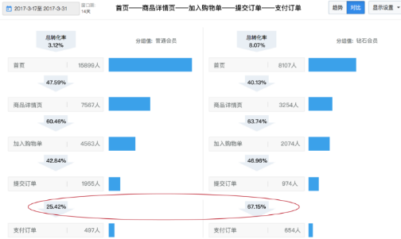
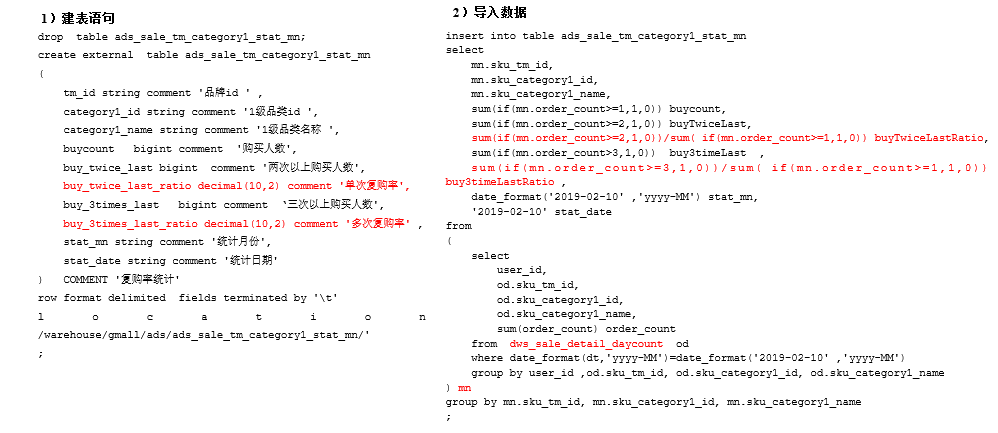

## GMV成交总额

- GMV
  - Gross  Merchandise Volume
  - 是一定时间段内的成交总额（比如一天、一个月、一年）
- 在电商网站定义里面是网站成交金额。这个实际指的是拍下订单金额，包含付款和未付款的部分
  - GMV是电商平台非常重视的统计指标，甚至写在招股书里


### ADS层 [ads_gmv_sum_day]

- 建表语句

```sql
drop table if exists ads_gmv_sum_day;
create external table ads_gmv_sum_day(
    `dt` string comment '统计日期',
    `gmv_count` bigint comment '当日gmv订单个数',
    `gmv_amount` decimal(16,2) comment '当日gmv订单总金额',
    `gmv_payment` decimal(16,2) comment '当日支付金额'
) comment 'GMV'
row format delimited fields terminated by '\t'
location '/warehouse/gmall/ads/ads_gmv_sum_day/';
```

- 数据导入
  - 使用group by dt进行去重

```sql
insert overwrite table ads_gmv_sum_day
select
    '2019-02-10' dt,
    sum(order_count) gmv_count,
    sum(order_amount) gmv_amount,
    sum(payment_amount) gmv_payment
from dws_user_action
where dt='2019-02-10'
group by dt;
```

- 数据导入脚本
  - 在/home/ttshe/bin 目录下创建脚本ads_db_gmv.sh

```bash
[ttshe@hadoop102 bin]$ touch ads_db_gmv.sh
[ttshe@hadoop102 bin]$ chmod 777 ads_db_gmv.sh
[ttshe@hadoop102 bin]$ vim ads_db_gmv.sh
```

```bash
#!/bin/bash

# 定义变量方便修改
APP=gmall
hive=/opt/module/hive/bin/hive

# 如果是输入的日期按照取输入日期；如果没输入日期取当前时间的前一天
if [ -n "$1" ] ;then
	do_date=$1
else 
	do_date=`date -d "-1 day" +%F`
fi 

sql="
insert into table "$APP".ads_gmv_sum_day 
select 
    '$do_date' dt,
    sum(order_count)  gmv_count,
    sum(order_amount) gmv_amount,
    sum(payment_amount) payment_amount 
from "$APP".dws_user_action 
where dt ='$do_date'
group by dt;
"

$hive -e "$sql"
```

- 导入数据

```bash
[ttshe@hadoop102 bin]$ ads_db_gmv.sh 2019-02-11
```

- 查询

```sql
hive (gmall)> select * from dws_user_action where dt='2019-02-11' limit 2;
```


## 用户新鲜度转化率

- 转化率
  - 如实际下单的用户占单日总活跃用户中的比例
  - 等于单日消费用户数/日活数
- 新访问用户转化率
  - 单日新访问设备数/日活数
- 新注册用户转化率
  - 单日新注册用户数/日活数
- 新付费用户转化率
  - 单日新付费用户数/日活数
- 用户新鲜度
  - 新增用户占日活跃用户比率

### ADS层 [ads_user_convert_day]

- 建表语句

```sql
drop table if exists ads_user_convert_day;
create external table ads_user_convert_day(
    `dt` string comment '统计日期',
    `uv_m_count` bigint comment '当日活跃设备',
    `new_m_count` bigint comment '当日新增设备',
    `new_m_ratio` decimal(10,2) comment '当日新增占日活的比率'
) comment '转化率'
row format delimited fields terminated by '\t'
location '/warehouse/gmall/ads/ads_user_convert_day/';
```

- 导入数据
  - 重点是union all的掌握，以及sum，cast的理解

```sql
insert overwrite table ads_user_convert_day
select 
    '2019-02-10' dt,
    sum(tmp.dc) sum_dc,
    sum(tmp.nmc) sum_nmc,
    cast(sum(tmp.nmc)/sum(tmp.dc)*100 as decimal(10,2)) ratio
from (
    select
        day_count dc,
        0 nmc
    from ads_uv_count
    where dt='2019-02-10'
    union all
    select
        0 dc,
        new_mid_count nmc
    from ads_new_mid_count
    where create_date='2019-02-10'
) tmp;
```

- 查看数据

```sql
hive (gmall)> select * from ads_user_convert_day
```


## 用户行为漏斗分析




### ADS层 [ads_user_action_convert_day]

- 建表语句

```sql
drop table if exists ads_user_action_convert_day;
create external table ads_user_action_convert_day(
    `dt` string comment '统计日期',
    `total_visitor_m_count` bigint comment '总访问人数',
    `order_u_count` bigint comment '下单人数',
    `visitor2order_convert_ratio` decimal(10,2) comment '访问到下单转化率',
    `payment_u_count` bigint comment '支付人数',
    `order2payment_convert_ratio` decimal(10,2) comment '下单到支付的转化率'
)comment '用户行为漏斗分析'
row format delimited  fields terminated by '\t'
location '/warehouse/gmall/ads/ads_user_action_convert_day/';
```

- 数据导入

```sql
insert into table ads_user_action_convert_day
select
    '2019-02-10' dt,
    uv.day_count,
    ua.order_count,
    cast(ua.order_count/uv.day_count*100 as decimal(10,2)) visitor2order_convert_ratio,
    ua.payment_count,
    cast(ua.payment_count/ua.order_count*100 as decimal(10,2)) order2payment_convert_ratio
from(
    select
        dt,
        sum(if(order_count>0,1,0)) order_count,
        sum(if(payment_count>0,1,0)) payment_count
    from dws_user_action
    where dt='2019-02-10'
    group by dt
)ua join ads_uv_count uv on ua.dt=uv.dt;
```

- 查询

```sql
hive (gmall)> select * from ads_user_action_convert_day;
```


## 品牌复购率

- 需求：以月为单位统计，购买2次以上商品的用户


### DWS层之用户购买明细宽表

- 创建表

```sql
drop table if exists dws_sale_detail_daycount;
create external table dws_sale_detail_daycount(
    user_id string comment '用户id',
    sku_id string comment '商品id',
    user_gender string comment '用户性别',
    user_age string comment '用户年龄',
    user_level string comment '用户等级',
    order_price decimal(10,2) comment '商品价格',
    sku_name string comment '商品名称',
    sku_tm_id string comment '品牌id',
    sku_category3_id string comment '商品三级品类id',
    sku_category2_id string comment '商品二级品类id',
    sku_category1_id string comment '商品一级品类id',
    sku_category3_name string comment '商品三级品类名称',
    sku_category2_name string comment '商品二级品类名称',
    sku_category1_name string comment '商品一级品类名称',
    spu_id  string comment '商品 spu',
    sku_num  int comment '购买个数',
    order_count string comment '当日下单单数',
    order_amount string comment '当日下单金额'
) comment '用户购买商品明细表'
partitioned by (`dt` string)
stored as parquet
location '/warehouse/gmall/dws/dws_user_sale_detail_daycount/'
tblproperties ("parquet.compression"="snappy");
```

- 导入数据

```sql
with tmp_detail as (
    select
        user_id,
        sku_id,
        sum(sku_num) sku_sum,
        count(1) order_count,
        sum(order_price*sku_num) order_amount
    from dwd_order_detail
    where dt = '2019-02-10'
    group by user_id,sku_id
)
insert overwrite table dws_sale_detail_daycount
partition(dt='2019-02-10')
select
    tmp_detail.user_id,
    tmp_detail.sku_id,
    u.gender,
    months_between('2019-02-10',u.birthday)/12 age,
    u.user_level,
    sku.price,
    sku.sku_name,
    sku.tm_id,
    sku.category3_id,
    sku.category2_id,
    sku.category1_id,
    sku.category3_name,
    sku.category2_name,
    sku.category1_name,
    sku.spu_id,
    tmp_detail.sku_sum,
    tmp_detail.order_count,
    tmp_detail.order_amount
from tmp_detail 
left join dwd_user_info u on u.id = tmp_detail.user_id and u.dt='2019-02-10'
left join dwd_sku_info sku on sku.id = tmp_detail.sku_id and sku.dt='2019-02-10';
```

- 导入脚本
  - 在/home/ttshe/bin目录下创建脚本dws_sale.sh

```bash
[ttshe@hadoop102 bin]$ touch dws_sale.sh
[ttshe@hadoop102 bin]$ chmod 777 dws_sale.sh 
[ttshe@hadoop102 bin]$ vim dws_sale.sh 
```

```bash
#!/bin/bash

# 定义变量方便修改
APP=gmall
hive=/opt/module/hive/bin/hive

# 如果是输入的日期按照取输入日期；如果没输入日期取当前时间的前一天
if [ -n "$1" ] ;then
	do_date=$1
else 
	do_date=`date -d "-1 day" +%F`  
fi 

sql="

set hive.exec.dynamic.partition.mode=nonstrict;

with
tmp_detail as
(
    select 
        user_id,
        sku_id, 
        sum(sku_num) sku_num,   
        count(*) order_count, 
        sum(od.order_price*sku_num)  order_amount
    from "$APP".dwd_order_detail od
    where od.dt='$do_date'
    group by user_id, sku_id
)  
insert overwrite table "$APP".dws_sale_detail_daycount partition(dt='$do_date')
select 
    tmp_detail.user_id,
    tmp_detail.sku_id,
    u.gender,
    months_between('$do_date', u.birthday)/12  age, 
    u.user_level,
    price,
    sku_name,
    tm_id,
    category3_id,
    category2_id,
    category1_id,
    category3_name,
    category2_name,
    category1_name,
    spu_id,
    tmp_detail.sku_num,
    tmp_detail.order_count,
    tmp_detail.order_amount 
from tmp_detail 
left join "$APP".dwd_user_info u 
on tmp_detail.user_id=u.id and u.dt='$do_date'
left join "$APP".dwd_sku_info s on tmp_detail.sku_id =s.id  and s.dt='$do_date';

"
$hive -e "$sql"
```

- 执行脚本

```bash
[ttshe@hadoop102 bin]$ dws_sale.sh 2019-02-11
```

- 查看导入数据

```bash
hive (gmall)> select * from dws_sale_detail_daycount limit 2;
```


### ADS层品牌复购率



- 建表语句

```sql
drop table ads_sale_tm_category1_stat_mn;
create external table ads_sale_tm_category1_stat_mn
(   
    tm_id string comment '品牌id',
    category1_id string comment '1级品类id ',
    category1_name string comment '1级品类名称 ',
    buycount   bigint comment  '购买人数',
    buy_twice_last bigint  comment '两次以上购买人数',
    buy_twice_last_ratio decimal(10,2)  comment  '单次复购率',
    buy_3times_last   bigint comment   '三次以上购买人数',
    buy_3times_last_ratio decimal(10,2)  comment  '多次复购率',
    stat_mn string comment '统计月份',
    stat_date string comment '统计日期' 
) COMMENT '复购率统计'
row format delimited fields terminated by '\t'
location '/warehouse/gmall/ads/ads_sale_tm_category1_stat_mn/';
```

- 导入数据

```sql
insert into table ads_sale_tm_category1_stat_mn
select
    tmp.sku_tm_id,
    tmp.sku_category1_id,
    tmp.sku_category1_name,
    sum(if(order_count >= 1,1,0)) buycount,
    sum(if(order_count >= 2,1,0)) buy_twice_last,
    cast(sum(if(order_count >= 2,1,0))/sum(if(order_count >=1,1,0))*100 as decimal(10,2)),
    sum(if(order_count >=3,1,0)) buy_3times_last,
    cast(sum(if(order_count >=3,1,0))/sum(if(order_count >=1,1,0))*100 as decimal(10,2)),
    date_format('2019-02-10','yyyy-MM') stat_mn,
    '2019-02-10' stat_date
from(
    select
        user_id,
        sku_tm_id,
        sku_category1_id,
        sku_category1_name,
        sum(order_count) order_count
    from dws_sale_detail_daycount sd
    where date_format(dt,'yyyy-MM')=date_format('2019-02-10','yyyy-MM')
    group by user_id,sku_tm_id,sku_category1_id,sku_category1_name
)tmp
group by tmp.sku_tm_id,tmp.sku_category1_id,tmp.sku_category1_name;
```

- 查询

```sql
select * from ads_sale_tm_category1_stat_mn;
```

- 编写脚本
  - 在/home/ttshe/bin目录下创建脚本ads_sale.sh

```bash
[ttshe@hadoop102 bin]$ touch ads_sale.sh
[ttshe@hadoop102 bin]$ chmod 777 ads_sale.sh
[ttshe@hadoop102 bin]$ vim ads_sale.sh
```

```bash
#!/bin/bash

# 定义变量方便修改
APP=gmall
hive=/opt/module/hive/bin/hive

# 如果是输入的日期按照取输入日期；如果没输入日期取当前时间的前一天
if [ -n "$1" ] ;then
	do_date=$1
else 
	do_date=`date -d "-1 day" +%F`  
fi 

sql="

set hive.exec.dynamic.partition.mode=nonstrict;

insert into table "$APP".ads_sale_tm_category1_stat_mn
select   
    mn.sku_tm_id,
    mn.sku_category1_id,
    mn.sku_category1_name,
    sum(if(mn.order_count>=1,1,0)) buycount,
    sum(if(mn.order_count>=2,1,0)) buyTwiceLast,
    sum(if(mn.order_count>=2,1,0))/sum( if(mn.order_count>=1,1,0)) buyTwiceLastRatio,
    sum(if(mn.order_count>=3,1,0)) buy3timeLast,
    sum(if(mn.order_count>=3,1,0))/sum( if(mn.order_count>=1,1,0)) buy3timeLastRatio ,
    date_format('$do_date' ,'yyyy-MM') stat_mn,
    '$do_date' stat_date
from 
(     
select 
        user_id, 
        od.sku_tm_id, 
        od.sku_category1_id,
        od.sku_category1_name,  
        sum(order_count) order_count
    from "$APP".dws_sale_detail_daycount  od 
    where date_format(dt,'yyyy-MM')=date_format('$do_date' ,'yyyy-MM')
    group by user_id, od.sku_tm_id, od.sku_category1_id, od.sku_category1_name
) mn
group by mn.sku_tm_id, mn.sku_category1_id, mn.sku_category1_name;

"
$hive -e "$sql"
```

- 导入数据

```bash
[ttshe@hadoop102 bin]$ ads_sale.sh 2019-02-11
```


## 每个等级的用户对应的复购率前十的商品排行

- 每个等级，每种商品，买一次的用户数，买两次的用户数-->得出复购率
- 利用开窗函数，取每个等级的前十

```sql
select
    user_level,
    sku_id,
    sku_name,
    ratio,
    r,
    '2019-02-10' stat_date
from(
    select
        t1.user_level,
        t1.sku_id,
        t1.sku_name,
        t1.ratio,
        row_number() over(partition by t1.user_level order by t1.ratio desc) r
    from(
        select
            tmp.user_level,
            tmp.sku_id,
            tmp.sku_name,
            cast(sum(if(order_count >= 2,1,0))/sum(if(order_count >=1,1,0))*100 as decimal(10,2)) ratio
        from(
            select 
                user_id,
                user_level,
                sku_id,
                sku_name,
                sum(order_count) order_count
            from dws_sale_detail_daycount sd
            where dt<='2019-02-10'
            group by user_id,user_level,sku_id,sku_name
        )tmp
        group by tmp.user_level,tmp.sku_id,tmp.sku_name
    )t1
)t2
where t2.r <=10;
```


# 