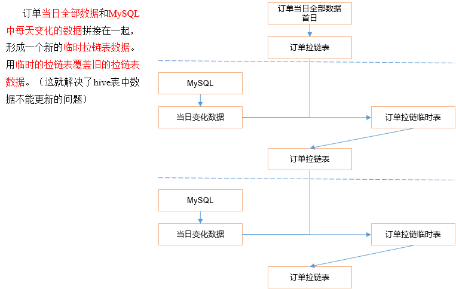

# 订单拉链表

拉链表，它是一种维护历史状态，以及最新状态数据的一种表。**拉链表也是分区表**，有些不变的数据或者是已经达到状态终点的数据就会把它放在分区里面，**分区字段一般为开始时间：start_date和结束时间：end_date**。一般在该天有效的数据，它的end_date是大于等于该天的日期的。获取某一天全量的数据，可以通过表中的start_date和end_date来做筛选，选出固定某一天的数据。例如我想取截止到20190813的全量数据，其where过滤条件就是where start_date<='20190813' and end_date>=20190813


- 什么是拉链表
  - 增量更新
  - 拉链表，记录每条信息的生命周期，一旦一条记录的生命周期结束，就重新开始一条新的记录，并把当前日期放入生效开始日期
  - 如当前信息至今有效，在生效结束日期中填入一个极大值
    - 如9999-99-99 


- 为什么要有拉链表
  - 拉链表适合于
    - 数据会发生变化，但是大部分是不变的
      - ==即缓慢变化维==
    - 如订单信息从未支付、已支付、未发货、已完成等状态经历了一周，大部分时间是不变化的
    - 如果数据量有一定规模，按照每日全量的方式保存效率很低
    - 如1亿用户*365天，每天一份用户信息
      - ==做每日全量效率低==


- 拉链表

 


## 如何使用

  


## 拉链表形成过程

- 依赖于订单的创建时间和更新时间
  - 如果没有这2个字段，可使用canal框架，监听mysql中数据的变化，增加更新时间字段


## 拉链表制作过程



### 初始化拉链表


- 生成10条原始订单数据

```sql
CALL init_data('2019-02-13',10,5,10,TRUE);
```

```bash
[ttshe@hadoop102 bin]$ sqoop_import.sh all 2019-02-13
[ttshe@hadoop102 bin]$ ods_db.sh 2019-02-13
[ttshe@hadoop102 bin]$ dwd_db.sh 2019-02-13
```

- 建立拉链表
  - 比之前的order_info增加start_date和end_date

```sql
drop table if exists dwd_order_info_his;
create external table dwd_order_info_his(
    `id` string COMMENT '订单编号',
    `total_amount` decimal(10,2) COMMENT '订单金额',
    `order_status` string COMMENT '订单状态',
    `user_id` string COMMENT '用户id' ,
    `payment_way` string COMMENT '支付方式',
    `out_trade_no` string COMMENT '支付流水号',
    `create_time` string COMMENT '创建时间',
    `operate_time` string COMMENT '操作时间',
    `start_date` string COMMENT '有效开始日期',
    `end_date` string COMMENT '有效结束日期'
) COMMENT '订单拉链表'
stored as parquet
location '/warehouse/gmall/dwd/dwd_order_info_his/'
tblproperties ("parquet.compression"="snappy");
```

- 初始化拉链表

```sql
hive (gmall)>
insert overwrite table dwd_order_info_his
select
    id,
    total_amount,
    order_status,
    user_id,
    payment_way,
    out_trade_no,
    create_time,
    operate_time,
    '2019-02-13',
    '9999-99-99'
from ods_order_info oi
where oi.dt='2019-02-13';
```

- 查询

```sql
hive (gmall)> select * from dwd_order_info_his limit 2;
```


### 制作当日变动数据每日执行

- 如何获得每日变动表
  - 最好表内有创建时间和变动时间
  - 如果没有，可以利用第三方工具监控比如canal，监控MySQL的实时变化进行记录(麻烦)
  - 逐行对比前后两天的数据, 检查md5(concat(全部有可能变化的字段))是否相同(low)
  - 要求业务数据库提供变动流水
- 因为dwd_order_info本身导入过来就是新增变动明细的表，所以不用处理
  - 2019-02-14日新增2条订单数据
  - 通过Sqoop把2019-02-14日所有数据导入
  - ODS层数据导入
  - DWD层数据导入

```sql
CALL init_data('2019-02-14',2,5,10,TRUE);
```

```bash
sqoop_import.sh all 2019-02-14
ods_db.sh 2019-02-14
dwd_db.sh 2019-02-14
```


### 合并变动信息，追加新增信息，插入到临时表中

- 建立临时表

```sql
drop table if exists dwd_order_info_his_tmp;
create external table dwd_order_info_his_tmp(
    `id` string COMMENT '订单编号',
    `total_amount` decimal(10,2) COMMENT '订单金额',
    `order_status` string COMMENT '订单状态',
    `user_id` string COMMENT '用户id' ,
    `payment_way` string COMMENT '支付方式',
    `out_trade_no` string COMMENT '支付流水号',
    `create_time` string COMMENT '创建时间',
    `operate_time` string COMMENT '操作时间',
    `start_date` string COMMENT '有效开始日期',
    `end_date` string COMMENT '有效结束日期'
) COMMENT '订单拉链临时表'
stored as parquet
location '/warehouse/gmall/dwd/dwd_order_info_his_tmp/'
tblproperties ("parquet.compression"="snappy");
```

- 导入脚本


```sql
insert overwrite table dwd_order_info_his_tmp
select * from (
    select 
        id,
        total_amount,
        order_status,
        user_id,
        payment_way,
        out_trade_no,
        create_time,
        operate_time,
        '2019-02-14' start_date,
        '9999-99-99' end_date
    from dwd_order_info where dt='2019-02-14' /*新增*/
    union all
    
    select
        oh.id,
        oh.total_amount,
        oh.order_status,
        oh.user_id,
        oh.payment_way,
        oh.out_trade_no,
        oh.create_time,
        oh.operate_time,
        oh.start_date,
        if(oi.id is null, oh.end_date, date_add(oi.dt,-1)) end_date /*为null的继续9999*/
    from dwd_order_info_his oh 
    left join ( 
        select * 
        from dwd_order_info 
        where dt='2019-02-14'
    ) oi 
    on oh.id=oi.id and oh.end_date='9999-99-99' /*对id相同的数据进行状态更新*/
) his 
order by his.id, start_date;
```


### 临时表覆盖给拉链表

- 导入数据

```sql
hive (gmall)>
insert overwrite table dwd_order_info_his 
select * from dwd_order_info_his_tmp;
```

- 查询

```sql
hive (gmall)> select * from dwd_order_info_his;
```


### 整理为每日脚本