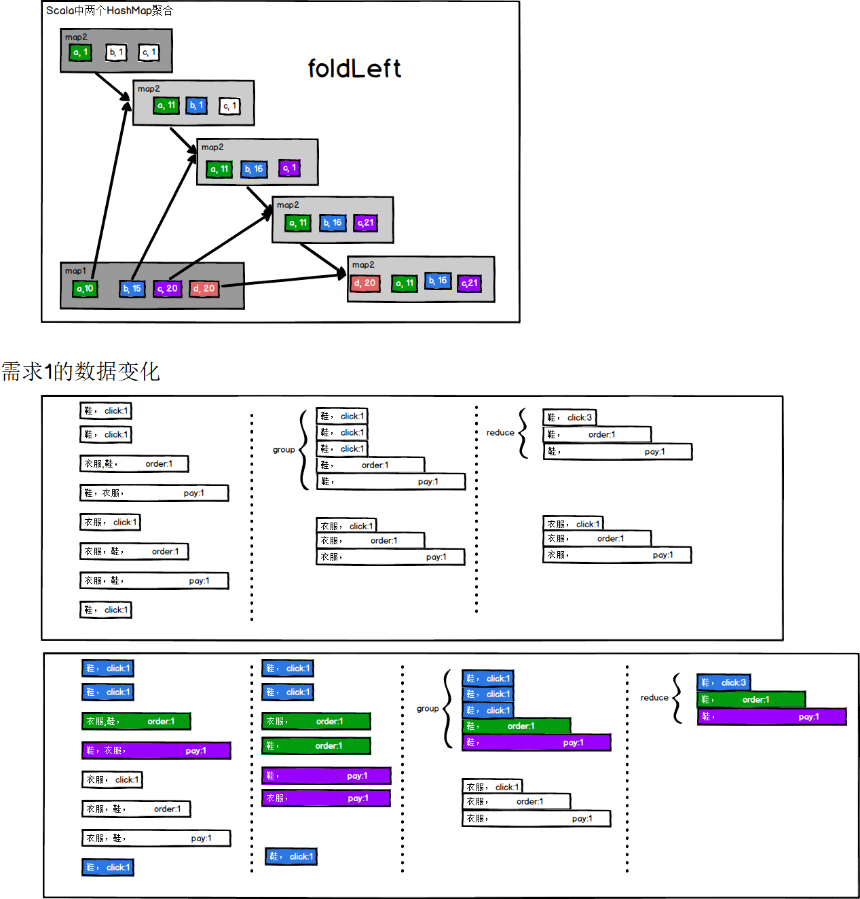
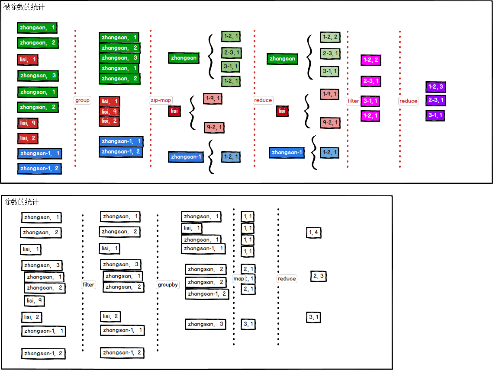
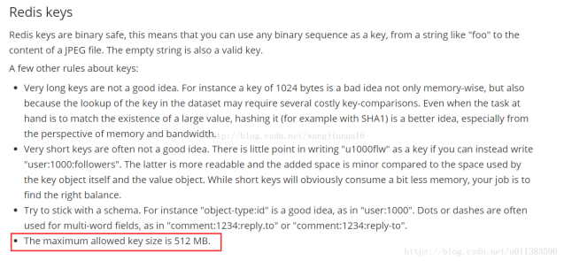
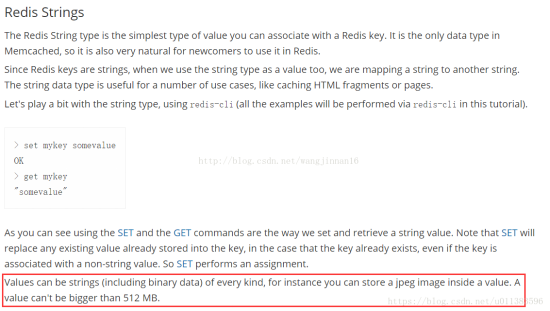
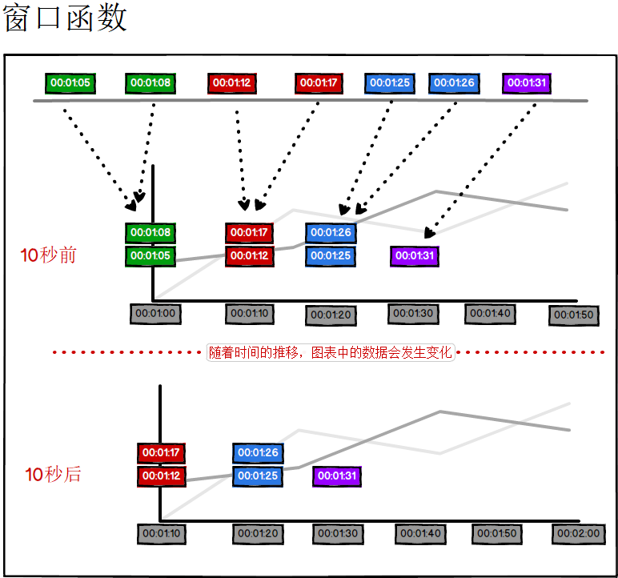
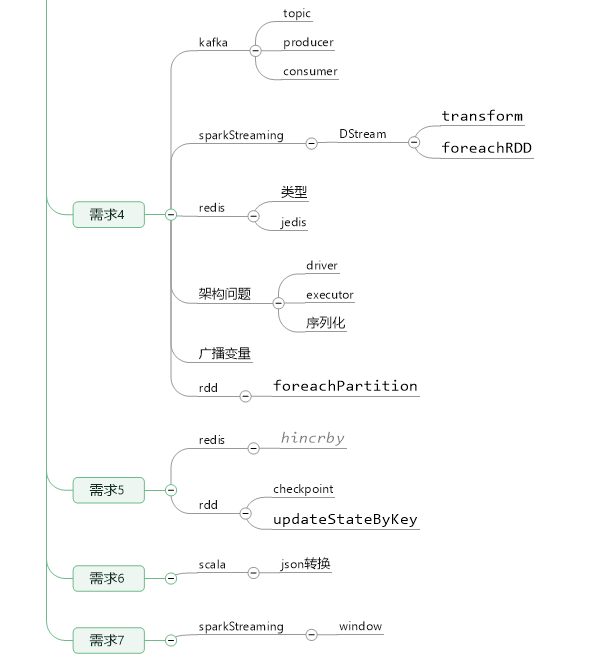

# 离线统计


## 创建Offline项目


### pom

```xml
<?xml version="1.0" encoding="UTF-8"?>
<project xmlns="http://maven.apache.org/POM/4.0.0"
         xmlns:xsi="http://www.w3.org/2001/XMLSchema-instance"
         xsi:schemaLocation="http://maven.apache.org/POM/4.0.0 http://maven.apache.org/xsd/maven-4.0.0.xsd">
    <parent>
        <artifactId>spark-mall</artifactId>
        <groupId>com.stt.spark</groupId>
        <version>1.0-SNAPSHOT</version>
    </parent>
    <modelVersion>4.0.0</modelVersion>
    <description>离线项目</description>
    <artifactId>offline</artifactId>

    <dependencies>
        <dependency>
            <groupId>com.stt.spark</groupId>
            <artifactId>common</artifactId>
            <version>1.0-SNAPSHOT</version>
        </dependency>

        <dependency>
            <groupId>org.apache.spark</groupId>
            <artifactId>spark-sql_2.11</artifactId>
        </dependency>

        <dependency>
            <groupId>org.apache.spark</groupId>
            <artifactId>spark-hive_2.11</artifactId>
        </dependency>

    </dependencies>

</project>
```


# 需求1 Top10 热门类品

- 获取点击、下单和支付数量排名前 10 的品类

在符合条件的 session 中，获取点击、下单和支付数量排名前 10 的品类。数据中的每个 session 可能都会对一些品类的商品进行点击、下单和支付等等行为，那么现在就需要获取这些 session 点击、下单和支付数量排名前 10 的最热门的品类。

也就是说，要计算出所有这些 session 对各个品类的点击、下单和支付的次数，然后按照这三个属性进行排序（**可以按照点击、下单、支付的优先顺序进行排序**，也可以通过权重算出综合分数进行排序），获取前 10 个品类。这个功能，很重要，就可以让我们明白，就是符合条件的用户，他最感兴趣的商品是什么种类。这个可以让公司里的人，清晰地了解到不同层次、不同类型的用户的心理和喜好。 

计算完成之后，将数据保存到 MySQL 数据库中


## 数据表


### user_visit_action

注意

- 在一条记录中点击和搜索和下单是互斥操作

| **字段名称**           | **说明**                                                     |
| ---------------------- | ------------------------------------------------------------ |
| **date**               | 日期，代表这个用户点击行为是在哪一天发生的                   |
| **user_id**            | 用户 ID，唯一标识某个用户                                    |
| **session_id**         | Session ID，唯一标识某个用户的一个访问 session               |
| **page_id**            | 页面 ID，点击了某些商品/品类，也可能是搜索了某个关键词，然后进入了某个页面，页面的 id |
| **action_time**        | 动作时间，这个点击行为发生的时间点                           |
| **search_keyword**     | 搜索关键词，如果用户执行的是一个搜索行为，比如说在网站/app 中，搜索了某个关键词，然后会跳转到商品列表页面； |
| **click_category_id**  | 点击品类 ID，可能是在网站首页，点击了某个品类（美食、电子设备、电脑） |
| **click_product_id**   | 点击商品 ID，可能是在网站首页，或者是在商品列表页，点击了某个商品（比如呷哺呷哺火锅 XX 路店 3 人套餐、iphone 6s） |
| **order_category_ids** | 下单品类 ID，代表了可能将某些商品加入了购物车，然后一次性对购物车中的商品下了一个订单，这就代表了某次下单的行为中，有哪些商品品类，可能有 6 个商品，但是就对应了 2 个品类，比如有 3 根火腿肠（食品品类），3 个电池（日用品品类） |
| **order_product_ids**  | 下单商品 ID，某次下单，具体对哪些商品下的订单                |
| **pay_category_ids**   | 付款品类 ID，对某个订单，或者某几个订单，进行了一次支付的行为，对应了哪些品类 |
| **pay_product_ids**    | 付款商品 ID，支付行为下，对应的哪些具体的商品                |
| **city_id**            | 城市 ID，代表该用户行为发生在哪个城市 ,和城市信息表做关联    |


## 思路

- 从Hive中获取数据
  - 使用SparkSQL来获取数据
  - 将获取的数据转换为RDD

- 对数据进行统计分析
  - 将品类聚合成不同属性的数据（category, sumClick）,(category, sumOrder),(Category, sumPay)
  - 将多条数据通过join方式组合在一起，形成特殊的结构（效率不高，不推荐使用）
  - 使用累加器累加聚合数据（**推荐使用**）
  - 将聚合的数据融合在一起（category, (sumClick, sumOrder, sumPay)）
  - 将聚合的数据根据要求进行倒序排列，取前10条

- 将分析结果保存到MySQL中
  - 将统计结果使用JDBC存储到Mysql中


  


## 代码

```scala
package com.stt.spark.mall.offline

import java.sql.{Connection, DriverManager, PreparedStatement}
import java.util.UUID

import com.stt.spark.mall.common.{CommonUtil, ConfigurationUtil}
import com.stt.spark.mall.model.{CategoryTop10, UserVisitAction}
import org.apache.spark.SparkConf
import org.apache.spark.rdd.RDD
import org.apache.spark.sql.{DataFrame, SparkSession}
import org.apache.spark.util.AccumulatorV2

import scala.collection.{immutable, mutable}

// 需求1 获取点击，下单，支付数量top10
object Req01CategoryTop10App {

    def main(args: Array[String]): Unit = {
        // 使用sparkSql获取数据
        val conf = new SparkConf().setMaster("local[*]").setAppName("Req01")

        val spark = SparkSession.builder()
        .config(conf)
        .enableHiveSupport()
        .getOrCreate()

        // 引入隐式转换
        import spark.implicits._

        spark.sql("use "+ConfigurationUtil.getValueByKey("hive.database"))

        var sql = new StringBuilder("select * from user_visit_action where 1 = 1")

        var startDate = ConfigurationUtil.getCondValue("startDate")
        var endDate = ConfigurationUtil.getCondValue("endDate")

        if(!CommonUtil.isEmpty(startDate)){
            sql.append(" and action_time >='").append(startDate).append("'")
        }

        if(!CommonUtil.isEmpty(endDate)){
            sql.append(" and action_time <='").append(endDate).append("'")
        }

        val actionDF: DataFrame = spark.sql(sql.toString)

        // 转换DataSet到RDD
        val actionRDD: RDD[UserVisitAction] = actionDF.as[UserVisitAction].rdd

        println(actionRDD.count())

        // 对数据进行统计分析
        // 将品类聚合成不同属性的数据(category,sumClick),(category,sumOrder),(category,sumPay)
        // 通过join的方式组合在一起，效率低下，不推荐使用
        // 使用累加器聚合数据
        val categoryCountAccumulator = new CategoryCountAccumulator

        // 注册累加器
        spark.sparkContext.register(categoryCountAccumulator)

        actionRDD.foreach(
            actionLog => {
                if(actionLog.click_category_id != -1){ categoryCountAccumulator.add(actionLog.click_category_id+"_click")
                }else if(actionLog.order_category_ids != null){
                    actionLog.order_category_ids.split(",").foreach(id=>{
                        categoryCountAccumulator.add(id+"_order")
                    })
                }else if(actionLog.pay_category_ids != null){
                    actionLog.pay_category_ids.split(",").foreach(id=>{
                        categoryCountAccumulator.add(id+"_pay")
                    })
                }
            }
        )
        // 获取累加器的结果
        // (category_click, sumClick)(category_order, sumOrder)(category_pay, sumPay)
        val categorySumMap: mutable.HashMap[String, Long] = categoryCountAccumulator.value

        // 将聚合的数据融合在一起(category,(sumClick,sumOrder,sumPay))
        val statMap: Map[String, mutable.HashMap[String, Long]] =
        categorySumMap.groupBy {
            case (k, v) => {
                k.split("_")(0) // 结果Map的key是categoryId
            }
        }

        val taskId = UUID.randomUUID().toString

        val mapResultData: immutable.Iterable[CategoryTop10] = statMap.map {
            case (categoryId, map) => {
                CategoryTop10(
                    taskId,
                    categoryId,
                    map.getOrElse(categoryId + "_click", 0L),
                    map.getOrElse(categoryId + "_order", 0L),
                    map.getOrElse(categoryId + "_pay", 0L)
                )
            }
        }

        println(mapResultData.toList.size)

        // 进行排序
        val top10Data: List[CategoryTop10] = mapResultData.toList.sortWith {
            case (left, right) => {
                // 返回数据，不要使用卫语句，可能会有异常情况
                if (left.clickCount == right.clickCount) {
                    if (left.orderCount == right.orderCount) {
                        left.payCount > right.payCount
                    }else{
                        left.orderCount > right.orderCount
                    }
                }else{
                    left.clickCount > right.clickCount
                }
            }
        }.take(10)

        // 连接数据库,将数据库插入表中
        val driverClass = ConfigurationUtil.getValueByKey("jdbc.driver.class")
        val url = ConfigurationUtil.getValueByKey("jdbc.url")
        val user = ConfigurationUtil.getValueByKey("jdbc.user")
        val password = ConfigurationUtil.getValueByKey("jdbc.password")

        var statement: PreparedStatement  = null
        var connection: Connection = null
        try{
            // 加载驱动
            Class.forName(driverClass)
            val insertSql = "insert into category_top10 values ( ?, ?, ?, ?, ?)"
            connection = DriverManager.getConnection(url,user,password)
            statement= connection.prepareStatement(insertSql)
            for(data <- top10Data){
                statement.setObject(1,data.taskId)
                statement.setObject(2,data.categoryId)
                statement.setObject(3,data.clickCount)
                statement.setObject(4,data.orderCount)
                statement.setObject(5,data.payCount)
                statement.executeUpdate()
            }
        }catch {
            case e:Exception=> e.printStackTrace()
        }finally {
            statement.close()
            connection.close()
        }
        spark.stop()
    }
}

/**
  * 参数类型： IN , OUT
  * category 品类总和累加器(category_click,sumClick) (category_order,sumOrder),(category_pay,numPay)
  */
class CategoryCountAccumulator extends AccumulatorV2[String,mutable.HashMap[String,Long]] {

    var map = new mutable.HashMap[String,Long]()

    override def isZero: Boolean = {
        map.isEmpty
    }

    // 复制累加器
    override def copy(): AccumulatorV2[String, mutable.HashMap[String, Long]] = {
        new CategoryCountAccumulator
    }

    override def reset(): Unit = {
        map.clear()
    }

    // 累加器增加数据
    override def add(v: String): Unit = {
        map(v) = map.getOrElse(v,0L) + 1L
    }

    // 多个累加器合并
    override def merge(other: AccumulatorV2[String, mutable.HashMap[String, Long]]): Unit = {
        // 使用左折叠将2个HashMap做合并
        //    map = map.foldLeft(other.value)((otherMap,item)=>{
        //      if(otherMap.contains(item._1)){
        //        otherMap(item._1) += item._2
        //      }else{
        //        otherMap(item._1) = item._2
        //      }
        //      otherMap
        //    })

        map = map.foldLeft(other.value){
            case (otherMap,(category,count)) => {
                otherMap(category) = otherMap.getOrElse(category,0L) + count
                otherMap
            }
        }
    }

    override def value: mutable.HashMap[String, Long] = {
        map
    }
}
```


## 建表语句

```sql
CREATE TABLE `category_top10` (
  `taskId` text,
  `category_id` text,
  `click_count` bigint(20) DEFAULT NULL,
  `order_count` bigint(20) DEFAULT NULL,
  `pay_count` bigint(20) DEFAULT NULL
) ENGINE=InnoDB DEFAULT CHARSET=utf8
```


# 需求2 Top10 热门品类中 Top10 活跃 Session 统计

对于排名前 10 的品类，**分别**获取其**点击次数**排名前 10 的 sessionId。 

这个就是说，对于 top10 的品类，每一个都要获取对它点击次数排名前 10 的 sessionId。 

这个功能，可以让我们看到，对某个用户群体最感兴趣的品类，各个品类最感兴趣最典型的用户的 session 的行为。计算完成之后，将数据保存到 MySQL 数据库中


## 思路

- 基于需求1获取热门品类的Top10的数据（需求1）
- 将日志数据进行过滤，保留Top10品类的数据
- 将日志数据进行结构转换->(  categoryId + sessionId, 1L )
- 将转换结构后的数据进行聚合：(  categoryId + sessionId, 1L )-> (  categoryId + sessionId, sum)
- 将聚合的数据进行机构转换：(  categoryId + sessionId, sum)->( categoryId, (sessionId, sum) )
- 将转换结构后的数据进行分组：( categoryId, (sessionId, sum) )->( categoryId, List(sessionId, sum) )
- 将分组后的数据进行排序（倒序），取前10条
- 将结构通过JDBC保存到Mysql中

## 代码

```scala
package com.stt.spark.mall.offline

import java.sql.{Connection, DriverManager, PreparedStatement}
import java.util.UUID

import com.stt.spark.mall.common.{CommonUtil, ConfigurationUtil}
import com.stt.spark.mall.model.{CategoryTop10, UserVisitAction}
import org.apache.spark.SparkConf
import org.apache.spark.rdd.RDD
import org.apache.spark.sql.{DataFrame, SparkSession}

import scala.collection.{immutable, mutable}

// 需求2
object Req02CategorySessionTop10App {

  def main(args: Array[String]): Unit = {
    // 使用sparkSql获取数据
    val conf = new SparkConf().setMaster("local[*]").setAppName("Req02")

    val spark = SparkSession.builder()
      .config(conf)
      .enableHiveSupport()
      .getOrCreate()

    // 引入隐式转换
    import spark.implicits._

    spark.sql("use " + ConfigurationUtil.getValueByKey("hive.database"))

    var sql = new StringBuilder("select * from user_visit_action where 1 = 1")

    var startDate = ConfigurationUtil.getCondValue("startDate")
    var endDate = ConfigurationUtil.getCondValue("endDate")

    if (!CommonUtil.isEmpty(startDate)) {
      sql.append(" and action_time >='").append(startDate).append("'")
    }

    if (!CommonUtil.isEmpty(endDate)) {
      sql.append(" and action_time <='").append(endDate).append("'")
    }

    val actionDF: DataFrame = spark.sql(sql.toString)

    // 转换DataSet到RDD
    val actionRDD: RDD[UserVisitAction] = actionDF.as[UserVisitAction].rdd

    println(actionRDD.count())

    // 对数据进行统计分析
    // 将品类聚合成不同属性的数据(category,sumClick),(category,sumOrder),(category,sumPay)
    // 通过join的方式组合在一起，效率低下，不推荐使用
    // 使用累加器聚合数据
    val categoryCountAccumulator = new CategoryCountAccumulator

    // 注册累加器
    spark.sparkContext.register(categoryCountAccumulator)

    actionRDD.foreach(
      actionLog => {
        if (actionLog.click_category_id != -1) {
          categoryCountAccumulator.add(actionLog.click_category_id + "_click")
        } else if (actionLog.order_category_ids != null) {
          actionLog.order_category_ids.split(",").foreach(id => {
            categoryCountAccumulator.add(id + "_order")
          })
        } else if (actionLog.pay_category_ids != null) {
          actionLog.pay_category_ids.split(",").foreach(id => {
            categoryCountAccumulator.add(id + "_pay")
          })
        }
      }
    )
    // 获取累加器的结果
    // (category_click, sumClick)(category_order, sumOrder)(category_pay, sumPay)
    val categorySumMap: mutable.HashMap[String, Long] = categoryCountAccumulator.value

    // 将聚合的数据融合在一起(category,(sumClick,sumOrder,sumPay))
    val statMap: Map[String, mutable.HashMap[String, Long]] =
      categorySumMap.groupBy {
        case (k, v) => {
          k.split("_")(0) // 结果Map的key是categoryId
        }
      }

    val taskId = UUID.randomUUID().toString

    val mapResultData: immutable.Iterable[CategoryTop10] = statMap.map {
      case (categoryId, map) => {
        CategoryTop10(
          taskId,
          categoryId,
          map.getOrElse(categoryId + "_click", 0L),
          map.getOrElse(categoryId + "_order", 0L),
          map.getOrElse(categoryId + "_pay", 0L)
        )
      }
    }

    // 进行排序
    val top10Data: List[CategoryTop10] = mapResultData.toList.sortWith {
      case (left, right) => {
        // 返回数据，不要使用卫语句，可能会有异常情况
        if (left.clickCount == right.clickCount) {
          if (left.orderCount == right.orderCount) {
            left.payCount > right.payCount
          } else {
            left.orderCount > right.orderCount
          }
        } else {
          left.clickCount > right.clickCount
        }
      }
    }.take(10)

    // TODO 如果在filter算子中使用top10Data,需要对top10Data进行广播变量传递
    val ids: Set[String] = top10Data.map(_.categoryId).toSet

    // 基于需求1获取热门品类的Top10的数据（需求1）
    // 将日志数据进行过滤，保留Top10品类的数据
    val filterRDD: RDD[UserVisitAction] = actionRDD.filter(log => {
      ids.contains(log.click_category_id.toString)
    })
    //将日志数据进行结构转换->(categoryId + sessionId, 1L )
    //将转换结构后的数据进行聚合：(categoryId + sessionId, 1L)-> (categoryId +sessionId, sum)
    //将聚合的数据进行机构转换：(categoryId + sessionId, sum)->(categoryId,(sessionId, sum))
    //将转换结构后的数据进行分组：(categoryId, (sessionId, sum))->(categoryId, List(sessionId, sum))
    val groupRDD: RDD[(String, Iterable[(String, Long)])] = filterRDD
      .map(log => {
        (log.click_category_id + "_" + log.session_id, 1L)
      }).reduceByKey(_ + _)
      .map {
        case (categoryId_sessionId, sum) => {
          var ids = categoryId_sessionId.split("_")
          (ids(0), (ids(1), sum))
        }
      }.groupByKey()

    val resultData: RDD[(String, List[(String, Long)])] = groupRDD.mapValues(datas => datas.toList.sortWith {
        case (left, right) => left._2 > right._2
      }.take(10))

    //    - 将分组后的数据进行排序（倒序），取前10条
    //    - 将结构通过JDBC保存到Mysql中
    val driverClass = ConfigurationUtil.getValueByKey("jdbc.driver.class")
    val url = ConfigurationUtil.getValueByKey("jdbc.url")
    val user = ConfigurationUtil.getValueByKey("jdbc.user")
    val password = ConfigurationUtil.getValueByKey("jdbc.password")

    // 该foreach是算子，在Executor中执行，statement 需要序列化
    // 此处优化可使用foreachPartition 进行数据连接处理
    resultData.foreach {
      case (categoryId, list) => {

        // 在此处statement 进行初始化
        var statement: PreparedStatement = null
        var connection: Connection = null
        try {
          // 加载驱动
          Class.forName(driverClass)
          val insertSql = "insert into category_top10_session_count values ( ?, ?, ?, ?)"
          connection = DriverManager.getConnection(url, user, password)
          statement = connection.prepareStatement(insertSql)

          list.foreach {
            case (sessionId, sum) => {
              statement.setObject(1, taskId)
              statement.setObject(2, categoryId)
              statement.setObject(3, sessionId)
              statement.setObject(4, sum)
              statement.executeUpdate()
            }
          }
        } catch {
          case e: Exception => e.printStackTrace()
        } finally {
          statement.close()
          connection.close()
        }
      }
    }
    spark.stop()
  }
}
```


## 建表语句

```sql
CREATE TABLE `category_top10_session_count` (
  `taskId` TEXT,
  `categoryId` TEXT,
  `sessionId` TEXT,
  `clickCount` BIGINT(20) DEFAULT NULL
) ENGINE=INNODB DEFAULT CHARSET=utf8
```


# 需求3 页面单跳转化率统计

计算页面单跳转化率，什么是页面单跳转换率，比如一个用户在一次 Session 过程中访问的页面路径 3,5,7,9,10,21，那么页面 3 跳到页面 5 叫一次单跳，7-9 也叫一次单跳，那么单跳转化率就是要统计页面点击的概率，比如：计算 3-5 的单跳转化率，先获取符合条件的 Session 对于页面 3 的访问次数（PV）为 A，然后获取符合条件的 Session 中访问了页面 3 又紧接着访问了页面 5 的次数为 B，那么 B/A 就是 3-5 的页面单跳转化率

 

 

产品经理和运营总监，可以根据这个指标，去尝试分析，整个网站，产品，各个页面的表现怎么样，是不是需要去优化产品的布局；吸引用户最终可以进入最后的支付页面

数据分析师，可以此数据做更深一步的计算和分析。

企业管理层，可以看到整个公司的网站，各个页面的之间的跳转的表现如何，可以适当调整公司的经营战略或策略

在该模块中，需要根据查询对象中设置的 Session 过滤条件，先将对应得 Session 过滤出来，然后根据查询对象中设置的页面路径，计算页面单跳转化率，比如查询的页面路径为：3、5、7、8，那么就要计算 3-5、5-7、7-8 的页面单跳转化率

需要注意的一点是，页面的访问时有先后的，要做好排序


## 思路

- 获取Hive中保存日志数据
- 将日志数据根据session进行分组排序，获取同一个session中的页面跳转路径
- 将页面跳转路径形成拉链效果  A--->B.B--->C
- 统计拉链后的数据点击总次数（A）
- 将符合条件的日志数据根据页面ID进行分组聚合（B）
- 将计算结果A / B,获取转换率
- 将转换率通过JDBC保存到Mysql中




## 代码

```scala
package com.stt.spark.mall.offline

import com.stt.spark.mall.common.{CommonUtil, ConfigurationUtil}
import com.stt.spark.mall.model.UserVisitAction
import org.apache.spark.SparkConf
import org.apache.spark.rdd.RDD
import org.apache.spark.sql.{DataFrame, SparkSession}

// 需求3 页面跳转转化率
object Req03PageJumpRateApp {

  def main(args: Array[String]): Unit = {
    // 使用sparkSql获取数据
    val conf = new SparkConf().setMaster("local[*]").setAppName("Req03")

    val spark = SparkSession.builder()
      .config(conf)
      .enableHiveSupport()
      .getOrCreate()

    // 引入隐式转换
    import spark.implicits._

    spark.sql("use " + ConfigurationUtil.getValueByKey("hive.database"))

    var sql = new StringBuilder("select * from user_visit_action where 1 = 1")

    var startDate = ConfigurationUtil.getCondValue("startDate")
    var endDate = ConfigurationUtil.getCondValue("endDate")

    if (!CommonUtil.isEmpty(startDate)) {
      sql.append(" and action_time >='").append(startDate).append("'")
    }

    if (!CommonUtil.isEmpty(endDate)) {
      sql.append(" and action_time <='").append(endDate).append("'")
    }

    val actionDF: DataFrame = spark.sql(sql.toString)

    // 转换DataSet到RDD
    val actionRDD: RDD[UserVisitAction] = actionDF.as[UserVisitAction].rdd

    // **************************************************
//    - 获取Hive中保存日志数据
//    - 将日志数据根据session进行分组排序，获取同一个session中的页面跳转路径
//    - 将页面跳转路径形成拉链效果  A--->B.B--->C
    val sessionRDD: RDD[(String, Iterable[UserVisitAction])] = actionRDD.groupBy(log => {
      log.session_id
    })

    val zipPageIdCountRDD: RDD[(String, List[(String, Long)])] = sessionRDD.mapValues(datas => {
      // 按照时间进行排序
      val pageFlow: List[UserVisitAction] = datas.toList.sortWith {
        case (left, right) => {
          left.action_time < right.action_time
        }
      }
      // 只需要 pageId
      // 1 - 2 - 3 - 4
      val pageIdFlow1: List[Long] = pageFlow.map(log => {
        log.page_id
      })
      // 去除第一个，zip后形成拉链表
      // 2 - 3 - 4
      val pageIdFlow2: List[Long] = pageIdFlow1.tail

      // 形成拉链表List[(1,2),(2,3),(3,4)]
      // 注意使用scala原生的zip操作
      val zipPageIdFlow: List[(Long, Long)] = pageIdFlow1.zip(pageIdFlow2)

      // 对拉链表进行组合成key
      zipPageIdFlow.map {
        case (pId1, pId2) => (pId1 + "_" + pId2, 1L)
      }
    })
    //    - 统计拉链后的数据点击总次数（A）
      // 直接写flatMap(_) 运行时会出错，无法推测是类型还是方法
      val flatZipToCountRDD: RDD[(String, Long)] = zipPageIdCountRDD.map(_._2).flatMap(x=>x)
    // 获取条件参数
    val targetIds: Array[String] = ConfigurationUtil.getCondValue("targetPageFlow").split(",")

    val targetPageFlow = targetIds.zip(targetIds.tail).map {
      case (id1, id2) => id1 + "_" + id2
    }
    // - 将符合条件的日志数据根据页面ID进行分组聚合（B）
    val filterZipToCountRDD: RDD[(String, Long)] = flatZipToCountRDD.filter {
      case (pageFlow, count) => {
        targetPageFlow.contains(pageFlow)
      }
    }
    // 分子
    val reduceZipToSumRDD: RDD[(String, Long)] = filterZipToCountRDD.reduceByKey(_+_)

    // 过滤
    val actionFilterRDD: RDD[UserVisitAction] = actionRDD.filter(log => {
      targetIds.contains(log.page_id.toString)
    })

    // 分母
    val pageActionRDD: RDD[(Long, Long)] = actionFilterRDD.map(log => (log.page_id,1L)).reduceByKey(_+_)

    // 将RDD转换为map
    val pageActionMap: Map[Long, Long] = pageActionRDD.collect().toMap

//    - 将计算结果A / B,获取转换率
    reduceZipToSumRDD.foreach{
      case (pageFlow,sum) => {
        var pageId = pageFlow.split("_")(0).toLong
        var rate = (sum.toDouble / pageActionMap(pageId) * 100).toInt

        println((pageFlow,rate))
      }
    }

//    - 将转换率通过JDBC保存到Mysql中
    spark.stop()
  }
}
```


# 实时统计


## 预备知识

什么是DStream

​    DSream 代表了一系列连续的RDD，DStream中每个RDD包含特定时间间隔的数据

 

### 常用算子  

转换操作：

| 算子名称                 | 说明                                                         |
| ------------------------ | ------------------------------------------------------------ |
| map                      | 对每个传入的元素，返回一个新的元素                           |
| flatMap                  | 对每个传入的元素，返回一个或多个元素                         |
| fliter                   | 对传入的元素返回 true 或 false，返回 false 的元素将会被过滤掉 |
| union                    | 将连个 Dsrteam 进行合并                                      |
| count                    | 返回元素的个数                                               |
| reduce                   | 对所有 value 进行聚合                                        |
| countByKey               | 对元素按照值进行分组，对每个组进行计数，最后返回<K, V>的格式 |
| reduceByKey              | 对 Key 对应的 values 进行聚合                                |
| join                     | 对两个 Dstream 进行 join 操作，每个链接起来的 pair，作为新 Dstream 的 RDD 的一个元素 |
| ==transform {rdd=>rdd}== | //driver  整个任务只执行一次xxxxDstream.transform{    //driver  周期性执行 xxxrdd=>rdd.map{//executor 中执行}}xxxxDstream.map{  //executor} |
| ==updateStateByKey==     | 为每一个rdd中的key ，保留状态，持续更新，在大规模数据场景下，可以用redis替代 |
| ==window==               | 滑动窗口，滑动窗口和滑动步长必须是取数周期的整数倍           |

 

### 输出操作

| **算子名称**          | **说明**                      |
| --------------------- | ----------------------------- |
| **saveAsTextFiles**   | 保存到文件系统                |
| **saveAsHadoopFiles** | 保存到Hdfs中                  |
| ==**foreachRDD**==    | 针对每个时间点的RDD做相应操作 |


## 数据准备 mock

- 模拟数据生产的类，在mock工程中添加

```scala
package com.stt.spark.mock

import java.util.{Properties, Random}

import com.stt.spark.mall.common.ConfigurationUtil
import com.stt.spark.mall.model.CityInfo
import org.apache.kafka.clients.producer.{KafkaProducer, ProducerConfig, ProducerRecord}

import scala.collection.mutable.ArrayBuffer

object MockRealTimeGenerator {
    /**
    * 模拟的数据
    * 格式 ：timestamp area city userid adid
    * 某个时间点 某个地区 某个城市 某个用户 某个广告
    */
    def generateMockData(): Array[String] = {
        val array = ArrayBuffer[String]()
        val CityRandomOpt = RandomOptions(RanOpt(CityInfo(1,"北京","华北"),30),
                                          RanOpt(CityInfo(1,"上海","华东"),30),
                                          RanOpt(CityInfo(1,"广州","华南"),10),
                                          RanOpt(CityInfo(1,"深圳","华南"),20),
                                          RanOpt(CityInfo(1,"天津","华北"),10))

        val random = new Random()
        // 模拟实时数据：
        // timestamp province city userid adid
        for (i <- 0 to 50) {
            val timestamp = System.currentTimeMillis()
            val cityInfo = CityRandomOpt.getRandomOpt()
            val city = cityInfo.city_name
            val area = cityInfo.area
            val adid = 1+random.nextInt(6)
            val userid = 1+random.nextInt(6)
            // 拼接实时数据
            array += timestamp + " " + area + " " + city + " " + userid + " " + adid
        }
        array.toArray
    }

    def createKafkaProducer(broker: String): KafkaProducer[String, String] = {
        // 创建配置对象
        val prop = new Properties()
        // 添加配置
        prop.put(ProducerConfig.BOOTSTRAP_SERVERS_CONFIG, broker)
        prop.put(ProducerConfig.KEY_SERIALIZER_CLASS_CONFIG, "org.apache.kafka.common.serialization.StringSerializer")
        prop.put(ProducerConfig.VALUE_SERIALIZER_CLASS_CONFIG, "org.apache.kafka.common.serialization.StringSerializer")
        // 根据配置创建Kafka生产者
        new KafkaProducer[String, String](prop)
    }

    def main(args: Array[String]): Unit = {
        // 获取配置文件commerce.properties中的Kafka配置参数
        val broker = ConfigurationUtil.getValueByKey("kafka.broker.list")
        val topic =  "ads_log"
        // 创建Kafka消费者
        val kafkaProducer = createKafkaProducer(broker)

        while (true) {
            // 随机产生实时数据并通过Kafka生产者发送到Kafka集群中
            for (line <- generateMockData()) {
                kafkaProducer.send(new ProducerRecord[String, String](topic, line))
                println(line)
            }
            Thread.sleep(2000)
        }
    }
}
```


## 创建realtime项目


## pom

```xml
<?xml version="1.0" encoding="UTF-8"?>
<project xmlns="http://maven.apache.org/POM/4.0.0"
         xmlns:xsi="http://www.w3.org/2001/XMLSchema-instance"
         xsi:schemaLocation="http://maven.apache.org/POM/4.0.0 http://maven.apache.org/xsd/maven-4.0.0.xsd">
    <parent>
        <artifactId>spark-mall</artifactId>
        <groupId>com.stt.spark</groupId>
        <version>1.0-SNAPSHOT</version>
    </parent>
    <modelVersion>4.0.0</modelVersion>
    <description>实时项目</description>
    <artifactId>realtime</artifactId>
    <dependencies>
        <dependency>
            <groupId>com.stt.spark</groupId>
            <artifactId>common</artifactId>
            <version>1.0-SNAPSHOT</version>
        </dependency>

        <dependency>
            <groupId>org.apache.spark</groupId>
            <artifactId>spark-core_2.11</artifactId>
        </dependency>

        <dependency>
            <groupId>org.apache.spark</groupId>
            <artifactId>spark-sql_2.11</artifactId>
        </dependency>

        <dependency>
            <groupId>org.apache.spark</groupId>
            <artifactId>spark-streaming_2.11</artifactId>
        </dependency>

        <dependency>
            <groupId>org.apache.spark</groupId>
            <artifactId>spark-hive_2.11</artifactId>
        </dependency>
    </dependencies>
</project>
```


# 需求4 广告黑名单实时统计

实现实时的动态黑名单机制：将**每天**对某个广告**点击**超过 **100** 次的用户拉黑。

注：黑名单保存到redis中。

​       已加入黑名单的用户不在进行检查


## 数据源

timestamp province city userid adid

| 字段名        |                                           |
| ------------- | ----------------------------------------- |
| **timestamp** | **当前时间毫秒**                          |
| **area**      | **地区：华北、华南**                      |
| **city**      | **城市名： 北京、上海、广州、深圳、天津** |
| **userid**    | **用户id 1-6**                            |
| **adid**      | **广告id 1-6**                            |

topic:  ads_log


## 目标数据字段

 redis  type: set   

| key           | value                |
| ------------- | -------------------- |
| **blacklist** | 存储黑名单用户userId |


## 思路

- 获取用户点击广告的数据

- 判断当前数据中是否含有黑名单数据，如果存在进行过滤

- 在redis中聚合用户点击广告的次数：hash -> (  date:userid:adid,sumClick )

- 获取聚合后的点击次数进行阈值（100）判断

- 如果点击次数超过阈值，那么会将用户加入redis的黑名单中：set


## 代码

```scala
package com.stt.spark.realtime

import java.text.SimpleDateFormat
import java.util.Date

import com.stt.spark.mall.common.{MallKafkaUtil, RedisUtil}
import com.stt.spark.mall.model.KafkaMsg
import org.apache.kafka.clients.consumer.ConsumerRecord
import org.apache.spark.SparkConf
import org.apache.spark.streaming.dstream.{DStream, InputDStream}
import org.apache.spark.streaming.{Seconds, StreamingContext}
import redis.clients.jedis.Jedis

object Req04BlackListApp {

  def main(args: Array[String]): Unit = {

    val conf = new SparkConf().setAppName("Req04").setMaster("local[*]")
    val ssc = new StreamingContext(conf, Seconds(5))
    val topic = "ads_log"// 注意kafka的topic最好自己创建好

    // 获取kafka的数据
    val kafkaDStream: InputDStream[ConsumerRecord[String, String]] =
      MallKafkaUtil.getKafkaStream(topic, ssc)

    val msgDStream: DStream[KafkaMsg] = kafkaDStream.map(record => {
      val line = record.value()
      val datas = line.split(" ")
      KafkaMsg(datas(0), datas(1), datas(2), datas(3), datas(4))
    })

    //    - 获取用户点击广告的数据
    //    - 判断当前数据中是否含有黑名单数据，如果存在进行过滤
    // 从redis中获取黑名单
    //    val client: Jedis = RedisUtil.getJedisClient
    // 黑名单是set集合
   	// 该方法有空指针异常
    //    val blackUserList: util.Set[String] = client.smembers("blackList")
    //    client.close()
    // 将kafka获取的数据进行过滤
    val filterMsgDStream: DStream[KafkaMsg] = msgDStream.filter(msg => {
      //      if(blackUserList != null){
      //        !blackUserList.contains(msg.userId)
      //      }else{
      //        true
      //      }
      //      println((msg.adId,msg.userId))
      val client = RedisUtil.getJedisClient
        // 需要优化，效率低
      val flg: Boolean = client.sismember("blackList", msg.userId)
      client.close()
      !flg
    })

//    filterMsgDStream.foreachRDD(rdd => {
//      rdd.foreach(msg => {
//        val client1: Jedis = RedisUtil.getJedisClient
//
//        println((msg.userId, msg.adId))
//
//        // 在redis中聚合用户点击广告的次数：hash -> (  date:userid:adid,sumClick )
//        // 对该hash中的该key的value+1
//        // 将时间戳转换为日期
//        val date: Date = new Date(msg.ts.toLong)
//        val sdf = new SimpleDateFormat("yyyy-MM-dd")
//        var keyField = sdf.format(date) + ":" + msg.userId + ":" + msg.adId
//        client1.hincrBy("date:user:advert:clickcount", keyField, 1)
//        //    - 获取聚合后的点击次数进行阈值（100）判断
//        val sum = client1.hget("date:user:advert:clickcount", keyField).toLong
//        if (sum >= 100) {
//          //    - 如果点击次数超过阈值，那么会将用户加入redis的黑名单中：set
//          client1.sadd("blackList", msg.userId)
//        }
//        client1.close()
//      })
//    })

    filterMsgDStream.foreachRDD(rdd => {
      //       优化方案
      rdd.foreachPartition(datas => {
        val client1: Jedis = RedisUtil.getJedisClient
        datas.foreach(msg => {
          // 在redis中聚合用户点击广告的次数：hash -> (  date:userid:adid,sumClick )
          // 对该hash中的该key的value+1
          // 将时间戳转换为日期
          println((msg.userId, msg.adId))

          val date: Date = new Date(msg.ts.toLong)
          val sdf = new SimpleDateFormat("yyyy-MM-dd")
          var keyField = sdf.format(date) + ":" + msg.userId + ":" + msg.adId
          client1.hincrBy("date:user:advert:clickcount", keyField, 1)
          //    - 获取聚合后的点击次数进行阈值（100）判断
          val sum = client1.hget("date:user:advert:clickcount", keyField).toLong
          if (sum >= 100) {
            //    - 如果点击次数超过阈值，那么会将用户加入redis的黑名单中：set
            client1.sadd("blackList", msg.userId)
          }
        })
        client1.close()
      })
    })

    // 接收器启动
    ssc.start()

    // 接收器要阻塞，Driver要一直启动
    ssc.awaitTermination()
  }
}
```


## 问题处理

```scala
package com.stt.spark.realtime

import java.text.SimpleDateFormat
import java.util
import java.util.Date

import com.stt.spark.mall.common.{MallKafkaUtil, RedisUtil}
import com.stt.spark.mall.model.KafkaMsg
import org.apache.kafka.clients.consumer.ConsumerRecord
import org.apache.spark.SparkConf
import org.apache.spark.streaming.dstream.{DStream, InputDStream}
import org.apache.spark.streaming.{Seconds, StreamingContext}
import redis.clients.jedis.Jedis

object Req04BlackListApp2 {

  def main(args: Array[String]): Unit = {

    val conf = new SparkConf().setAppName("Req04-2").setMaster("local[*]")
    val ssc = new StreamingContext(conf, Seconds(5))
    val topic = "ads_log"

    // 获取kafka的数据
    val kafkaDStream: InputDStream[ConsumerRecord[String, String]] =
      MallKafkaUtil.getKafkaStream(topic, ssc)

    val msgDStream: DStream[KafkaMsg] = kafkaDStream.map(record => {
      val line = record.value()
      val datas = line.split(" ")
      KafkaMsg(datas(0), datas(1), datas(2), datas(3), datas(4))
    })

    //    - 获取用户点击广告的数据
    //    - 判断当前数据中是否含有黑名单数据，如果存在进行过滤
    // 从redis中获取黑名单
        val client: Jedis = RedisUtil.getJedisClient
    // 黑名单是set集合，注意转换为数组，支持将Driver中的对象进行序列化到filter的Executor中
      val blackUserList: Array[AnyRef] = client.smembers("blackList").toArray
        client.close()
    // 将kafka获取的数据进行过滤
    val filterMsgDStream: DStream[KafkaMsg] = msgDStream.filter(msg => {
          !blackUserList.contains(msg.userId)
    })
    //       优化方案
    filterMsgDStream.foreachRDD(rdd => {
      rdd.foreachPartition(datas => {
        val client1: Jedis = RedisUtil.getJedisClient
        datas.foreach(msg => {
          // 在redis中聚合用户点击广告的次数：hash -> (  date:userid:adid,sumClick )
          // 对该hash中的该key的value+1
          // 将时间戳转换为日期
          println((msg.userId, msg.adId))
          val date: Date = new Date(msg.ts.toLong)
          val sdf = new SimpleDateFormat("yyyy-MM-dd")
          var keyField = sdf.format(date) + ":" + msg.userId + ":" + msg.adId
          client1.hincrBy("date:user:advert:clickcount", keyField, 1)
          //    - 获取聚合后的点击次数进行阈值（100）判断
          val sum = client1.hget("date:user:advert:clickcount", keyField).toLong
          if (sum >= 100) {
            //    - 如果点击次数超过阈值，那么会将用户加入redis的黑名单中：set
            client1.sadd("blackList", msg.userId)
          }
        })
        client1.close()
      })
    })

    // 接收器启动
    ssc.start()

    // 接收器要阻塞，Driver要一直启动
    ssc.awaitTermination()
  }

}
```

- 关于序列化的问题

```scala
client.smembers("blackList") // 该方法返回的set在Driver中进行序列化的时候有临时变量

public Set<String> smembers(final String key) {
    checkIsInMultiOrPipeline();
    client.smembers(key);
    final List<String> members = client.getMultiBulkReply();
    if (members == null) {
        return Collections.emptySet();
    }
    return SetFromList.of(members);
}


protected static class SetFromList<E> extends AbstractSet<E> implements Serializable {
    private static final long serialVersionUID = -2850347066962734052L;
    // *** 此处的List是非序列化的
    private final transient List<E> list;

    private SetFromList(List<E> list) {
      if (list == null) {
        throw new NullPointerException("list");
      }
      this.list = list;
    }

    
    // 而上面的代码中的filter是在Executor中执行的，因此会序列化丢失，导致blackUserList.contains(msg.userId) 报出空指针异常
    // 解决办法1，将client.smembers("blackList")方法返回的对象转换为数组（支持序列化）
    // 解决思路2：广播变量，每个Executor中一份，解决方法1是每个filter方法中有一份
    // 为啥广播变量可以，由于spark使用的序列化框架是Kryo，而之前方案的序列化框架是java自带的
    // Kryo序列化框架支持 transient 变量的序列化
    var broadCastBlackUserList:Broadcast[util.Set[String]] = ssc.sparkContext.broadcast(blackUserList)
val filterMsgDStream: DStream[KafkaMsg] = msgDStream.filter(msg => {
      !broadCastBlackUserList.contains(msg.userId)
})
```


### 逻辑bug

- 每次filter使用的blackList是旧的，没有读取更新的blackList

```scala
// Driver中执行1次
val client: Jedis = RedisUtil.getJedisClient
// 黑名单是set集合，注意转换为数组，支持将Driver中的对象进行序列化到filter的Executor中
val blackUserList: Array[AnyRef] = client.smembers("blackList").toArray
client.close()
var broadCastBlackUserList:Broadcast[util.Set[String]] = ssc.sparkContext.broadcast(blackUserList)


val filterMsgDStream: DStream[KafkaMsg] = msgDStream.filter(msg => {
    // Executor中执行多次
      !broadCastBlackUserList.contains(msg.userId)
})
```

- 使用transform算子

```scala
//driver  整个任务只执行一次
xxxxDstream.transform{    
    //driver  周期性执行 
    xxxrdd=>rdd.map{
        //executor 中执行
    }
}
xxxxDstream.map{  
    //executor
}
```


## 最终代码

```scala
package com.stt.spark.realtime

import java.text.SimpleDateFormat
import java.util
import java.util.Date

import com.stt.spark.mall.common.{MallKafkaUtil, RedisUtil}
import com.stt.spark.mall.model.KafkaMsg
import org.apache.kafka.clients.consumer.ConsumerRecord
import org.apache.spark.SparkConf
import org.apache.spark.broadcast.Broadcast
import org.apache.spark.streaming.dstream.{DStream, InputDStream}
import org.apache.spark.streaming.{Seconds, StreamingContext}
import redis.clients.jedis.Jedis

object Req04BlackListApp3 {

  def main(args: Array[String]): Unit = {

    val conf = new SparkConf().setAppName("Req04-3").setMaster("local[*]")
    val ssc = new StreamingContext(conf, Seconds(5))
    val topic = "ads_log"

    // 获取kafka的数据
    val kafkaDStream: InputDStream[ConsumerRecord[String, String]] =
      MallKafkaUtil.getKafkaStream(topic, ssc)

    val msgDStream: DStream[KafkaMsg] = kafkaDStream.map(record => {
      val line = record.value()
      val datas = line.split(" ")
      KafkaMsg(datas(0), datas(1), datas(2), datas(3), datas(4))
    })

    // TODO Driver执行一次
    val transformDStream: DStream[KafkaMsg] = msgDStream.transform(rdd => {
      // TODO Driver 周期执行
      //    - 获取用户点击广告的数据
      //    - 判断当前数据中是否含有黑名单数据，如果存在进行过滤
      // 从redis中获取黑名单
      val client: Jedis = RedisUtil.getJedisClient
      val blackUserSet = client.smembers("blackList")
      client.close()
      // 使用广播变量,每个Executor中一份
      val broadCastBlackList: Broadcast[util.Set[String]] = ssc.sparkContext.broadcast(blackUserSet)
      rdd.filter(msg => {
        // TODO Executor 执行
        !broadCastBlackList.value.contains(msg.userId)
      })
    })

    //       优化方案
    transformDStream.foreachRDD(rdd => {
      rdd.foreachPartition(datas => {
        val client1: Jedis = RedisUtil.getJedisClient
        datas.foreach(msg => {
          // 在redis中聚合用户点击广告的次数：hash -> (  date:userid:adid,sumClick )
          // 对该hash中的该key的value+1
          // 将时间戳转换为日期
          println((msg.userId, msg.adId))
          val date: Date = new Date(msg.ts.toLong)
          val sdf = new SimpleDateFormat("yyyy-MM-dd")
          var keyField = sdf.format(date) + ":" + msg.userId + ":" + msg.adId
          client1.hincrBy("date:user:advert:clickcount", keyField, 1)
          //    - 获取聚合后的点击次数进行阈值（100）判断
          val sum = client1.hget("date:user:advert:clickcount", keyField).toLong
          if (sum >= 100) {
            //    - 如果点击次数超过阈值，那么会将用户加入redis的黑名单中：set
            client1.sadd("blackList", msg.userId)
          }
        })
        client1.close()
      })
    })

    // 接收器启动
    ssc.start()

    // 接收器要阻塞，Driver要一直启动
    ssc.awaitTermination()
  }

}
```


# 需求5 广告点击量实时统计

每天各地区各城市各广告的点击流量实时统计


## 数据源

timestamp province city userid adid

| 字段名        |                                           |
| ------------- | ----------------------------------------- |
| **timestamp** | **当前时间毫秒**                          |
| **area**      | **地区：华北、华南**                      |
| **city**      | **城市名： 北京、上海、广州、深圳、天津** |
| **userid**    | **用户id 1-6**                            |
| **adid**      | **广告id 1-6**                            |

kafka消息队列主题：

topic:  ads_log


## 目标数据字段

redis保存为一条hash结构 的kv

| key                    |                                                 |
| ---------------------- | ----------------------------------------------- |
| **date:area:city:ads** | field:  2018-11-26:华北:北京:5     value: 12001 |

- 问题
  - fieldId组合太多
    - 可能的组合数值`365*30*20*1000` 
    - 定期存储到msyql中，在redis中设置超时时间

- 注意：redis的key和value的限制

```txt
What is the maximum number of keys a single Redis instance can hold? and what the max number of elements in a Hash, List, Set, Sorted Set?
Redis can handle up to 2^32 keys, and was tested in practice to handle at least 250 million keys per instance.
Every hash, list, set, and sorted set, can hold 2^32 elements.

// key 21亿多个 限制个数，每个实例2.5个亿
// hash list set ... 处理元素个数也是21亿个

In other words your limit is likely the available memory in your system.
```






## 思路

- 获取kafka中传递的数据

- 将数据转换结构：（Message）--> (ts:area:city:advert, 1L)

- 将转换后的数据进行聚合统计(ts:area:city:advert, 1L)--> (ts:area:city:advert, sum)

- 将结果保存起来
  - 方式1：将结果保存到Redis中：hincrby
  - 方式2：使用有状态RDD，将数据保存到CP，同时更新Redis


## 代码


### 方式1（推荐）

```scala
package com.stt.spark.realtime

import java.text.SimpleDateFormat
import java.util.Date

import com.stt.spark.mall.common.{MallKafkaUtil, RedisUtil}
import com.stt.spark.mall.model.KafkaMsg
import org.apache.kafka.clients.consumer.ConsumerRecord
import org.apache.spark.SparkConf
import org.apache.spark.streaming.dstream.{DStream, InputDStream}
import org.apache.spark.streaming.{Seconds, StreamingContext}
import redis.clients.jedis.Jedis

object Req05TimeAreaCityAdvertClickApp1 {

  def main(args: Array[String]): Unit = {

    val conf = new SparkConf().setAppName("Req05-1").setMaster("local[*]")
    val ssc = new StreamingContext(conf, Seconds(5))
    val topic = "ads_log"

    // 获取kafka的数据
    val kafkaDStream: InputDStream[ConsumerRecord[String, String]] =
      MallKafkaUtil.getKafkaStream(topic, ssc)

    val msgDStream: DStream[KafkaMsg] = kafkaDStream.map(record => {
      val line = record.value()
      val datas = line.split(" ")
      KafkaMsg(datas(0), datas(1), datas(2), datas(3), datas(4))
    })

    //    - 获取kafka中传递的数据
    //    - 将数据转换结构：（Message）--> (ts:area:city:advert, 1L)
    val msgMapDStream: DStream[(String, Long)] = msgDStream.map(msg => {
      val date: Date = new Date(msg.ts.toLong)
      val sdf = new SimpleDateFormat("yyyy-MM-dd")
      var keyField = sdf.format(date) + ":" + msg.area + ":" + msg.city + ":" + msg.adId
      (keyField, 1L)
    })
    //  将转换后的数据进行聚合统计(ts:area:city:advert, 1L)--> (ts:area:city:advert, sum)
    //  将结果保存起来
    //  方式1：将结果保存到Redis中：hincrby
    val msgReduceDStream: DStream[(String, Long)] = msgMapDStream.reduceByKey(_ + _)

    msgReduceDStream.foreachRDD(rdd => {
      rdd.foreachPartition(datas => {
        // 操作redis
        val client: Jedis = RedisUtil.getJedisClient
        datas.foreach {
          case (date_area_city_ads, sum) =>
            client.hincrBy("date:area:city:ads", date_area_city_ads, sum)
        }
        client.close()
      })

    })
    // 方式2：使用有状态RDD，将数据保存到CP，同时更新Redis

    // 接收器启动
    ssc.start()
    // 接收器要阻塞，Driver要一直启动
    ssc.awaitTermination()
  }
}
```


### 方式2

```scala
package com.stt.spark.realtime

import java.text.SimpleDateFormat
import java.util.Date

import com.stt.spark.mall.common.{MallKafkaUtil, RedisUtil}
import com.stt.spark.mall.model.KafkaMsg
import org.apache.kafka.clients.consumer.ConsumerRecord
import org.apache.spark.SparkConf
import org.apache.spark.streaming.dstream.{DStream, InputDStream}
import org.apache.spark.streaming.{Seconds, StreamingContext}
import redis.clients.jedis.Jedis

object Req05TimeAreaCityAdvertClickApp2 {

  def main(args: Array[String]): Unit = {

    val conf = new SparkConf().setAppName("Req05-2").setMaster("local[*]")
    val ssc = new StreamingContext(conf, Seconds(5))
    val topic = "ads_log"

    // 获取kafka的数据
    val kafkaDStream: InputDStream[ConsumerRecord[String, String]] =
      MallKafkaUtil.getKafkaStream(topic, ssc)

    val msgDStream: DStream[KafkaMsg] = kafkaDStream.map(record => {
      val line = record.value()
      val datas = line.split(" ")
      KafkaMsg(datas(0), datas(1), datas(2), datas(3), datas(4))
    })

    //    - 获取kafka中传递的数据
    //    - 将数据转换结构：（Message）--> (ts:area:city:advert, 1L)
    val msgMapDStream: DStream[(String, Long)] = msgDStream.map(msg => {
      val date: Date = new Date(msg.ts.toLong)
      val sdf = new SimpleDateFormat("yyyy-MM-dd")
      var keyField = sdf.format(date) + ":" + msg.area + ":" + msg.city + ":" + msg.adId
      (keyField, 1L)
    })
    //    - 将转换后的数据进行聚合统计(ts:area:city:advert, 1L)--> (ts:area:city:advert, sum)
    //    - 将结果保存起来
    //    - 方式2：使用有状态RDD，将数据保存到CP，同时更新Redis
    ssc.sparkContext.setCheckpointDir("cp")

    val sumClickDStream: DStream[(String, Long)] = msgMapDStream.updateStateByKey {
      // 第一个参数是相同key 的seq -->[(keyField, 1L),..]
      // 第二个参数是checkpoint
      case (seq, checkpoint) => {
        val sum = checkpoint.getOrElse(0L) + seq.sum
        // 返回值会放回checkpoint中
        Option(sum)
      }
    }
    // 此时获得的是最终的sum结果
    sumClickDStream.foreachRDD(rdd => {
      rdd.foreachPartition(datas => {
        var client = RedisUtil.getJedisClient
        for ((key, sum) <- datas) {
          client.hset("data:area:city:ads", key, sum.toString)
        }
        client.close()
      })
    })

    // 接收器启动
    ssc.start()
    // 接收器要阻塞，Driver要一直启动
    ssc.awaitTermination()
  }
}
```


# 需求6 每天各地区 top3 热门广告


## 目标数据

- redis保存为一条hash结构 的kv

- 需要使用scala的json转换

| key                             | value                                                        |
| ------------------------------- | ------------------------------------------------------------ |
| **top3_ads_per_day:2018-11-26** | field:   华北      value:  {“2”:1200, “9”:1100, “13”:910}   field: 东北    value:{“11”:1900, “17”:1820, “5”:1700} |

- 每天一个key值用当天日期作为后缀，field保存各个地区，value保存每个地区对应的三个广告id及其点击数


Scala对象转换json格式

```scala
import org.json4s.JsonDSL._
JsonMethods.compact(JsonMethods.render(scala对象))
```

Scala集合转换为Java集合

```scala
import  collection.JavaConversions._
```


## 思路

- 获取需求5的数据：（ date:area:city:advert, sum ）
- 将数据进行转换：（ date:area:city:advert, sum ）-->（ date:area:advert, sum1 ）, （ date:area:advert, sum2 ）, （ date:area:advert, sum3 ）
- 将转换后的数据进行聚合：（ date:area:advert, sumTotal ）
- 将聚合后的数据进行结构转换：（ date:area:advert, sumTotal ）--> （ (date,area）(advert, sumTotal )）
- 将转换结构后的数据进行分组排序，获取前三的数据
- 将结果保存到Redis中（json的转换）


## 代码

```scala
package com.stt.spark.realtime

import java.text.SimpleDateFormat
import java.util.Date

import com.stt.spark.mall.common.{MallKafkaUtil, RedisUtil}
import com.stt.spark.mall.model.KafkaMsg
import org.apache.kafka.clients.consumer.ConsumerRecord
import org.apache.spark.SparkConf
import org.apache.spark.streaming.dstream.{DStream, InputDStream}
import org.apache.spark.streaming.{Seconds, StreamingContext}
import org.json4s.native.JsonMethods

// 每天热门地区广告top3
object Req06TimeAreaAdvertClickTop3App {

  def main(args: Array[String]): Unit = {

    val conf = new SparkConf().setAppName("Req06").setMaster("local[*]")
    val ssc = new StreamingContext(conf, Seconds(5))
    val topic = "ads_log"

    // 获取kafka的数据
    val kafkaDStream: InputDStream[ConsumerRecord[String, String]] =
      MallKafkaUtil.getKafkaStream(topic, ssc)

    val msgDStream: DStream[KafkaMsg] = kafkaDStream.map(record => {
      val line = record.value()
      val datas = line.split(" ")
      KafkaMsg(datas(0), datas(1), datas(2), datas(3), datas(4))
    })

    //    - 获取kafka中传递的数据
    //    - 将数据转换结构：（Message）--> (ts:area:city:advert, 1L)
    val msgMapDStream: DStream[(String, Long)] = msgDStream.map(msg => {
      val date: Date = new Date(msg.ts.toLong)
      val sdf = new SimpleDateFormat("yyyy-MM-dd")
      var keyField = sdf.format(date) + ":" + msg.area + ":" + msg.city + ":" + msg.adId
      (keyField, 1L)
    })

    //    - 将转换后的数据进行聚合统计(ts:area:city:advert, 1L)--> (ts:area:city:advert, sum)
    //    - 将结果保存起来
    //    - 方式2：使用有状态RDD，将数据保存到CP，同时更新Redis
    ssc.sparkContext.setCheckpointDir("cp")

    val sumClickDStream: DStream[(String, Long)] = msgMapDStream.updateStateByKey {
      // 第一个参数是相同key 的seq -->[(keyField, 1L),..]
      // 第二个参数是checkpoint
      case (seq, checkpoint) => {
        val sum = checkpoint.getOrElse(0L) + seq.sum
        // 返回值会放回checkpoint中
        Option(sum)
      }
    }
    // 此时获得的是最终的sum结果
    sumClickDStream.foreachRDD(rdd => {
      rdd.foreachPartition(datas => {
        var client = RedisUtil.getJedisClient
        for ((key, sum) <- datas) {
          client.hset("data:area:city:ads", key, sum.toString)
        }
        client.close()
      })
    })

    // *************************
    //获取需求5的数据：（ 'date:area:city:advert', sum ）
    //将数据进行转换：（ date:area:city:advert, sum ）-->（ date:area:advert, sum1 ）, （ date:area:advert, sum2 ）, （ date:area:advert, sum3 ）
    // 将数据转换结构：（Message）--> (ts:area:advert, 1L)
    val sumClickMapDStream: DStream[(String, Long)] = sumClickDStream.map {
      case (fields, sum) => {
        val fieldList = fields.split(":")
        (fieldList(0) + ":" + fieldList(1) + ":" + fieldList(3), sum)
      }
    }
    //将转换后的数据进行聚合：（ date:area:advert, sumTotal ）
    val sumTotalClickDStream: DStream[(String, Long)] = sumClickMapDStream.reduceByKey(_ + _)
    //将聚合后的数据进行结构转换：（ date:area:advert, sumTotal ）-> （ (date,area）(advert, sumTotal )）
    val sumTotalMapDStream: DStream[((String, String), (String, Long))] = sumTotalClickDStream.map {
      case (date_area_ad, sum) => {
        val fields: Array[String] = date_area_ad.split(":")
        ((fields(0), fields(1)), (fields(2), sum))
      }
    }

    //将转换结构后的数据进行分组排序，获取前三的数据
    val top3ResultDStream: DStream[((String, String), List[(String, Long)])] =
      sumTotalMapDStream.groupByKey().mapValues(datas => {
        datas.toList.sortWith {
          case (left, right) => {
            left._2 > right._2
          }
        }.take(3)
      })

    //将结果保存到Redis中（json的转换）
    top3ResultDStream.foreachRDD(rdd => {
      rdd.foreachPartition(datas => {
        val client = RedisUtil.getJedisClient
        datas.foreach {
          case ((date, area), adSumList) => {
            var key = "top3_ads_per_day:" + date
            // 将list转换为map
            val adSumMap: Map[String, Long] = adSumList.toMap
            // 隐式转换
            import org.json4s.JsonDSL._

            var ads_click_json = JsonMethods.compact(JsonMethods.render(adSumMap))
            client.hset(key, area, ads_click_json)
          }
        }
        client.close()
      })
    })

    // 接收器启动
    ssc.start()
    // 接收器要阻塞，Driver要一直启动
    ssc.awaitTermination()
  }
}
```


# 需求7 最近1小时广告点击量的趋势

- 使用滑动窗口


## 思路

- 当前的时间除以10s，得到key，进行分组 




## 代码

```scala
package com.stt.spark.realtime

import java.text.SimpleDateFormat
import java.util.Date

import com.stt.spark.mall.common.{MallKafkaUtil, RedisUtil}
import com.stt.spark.mall.model.KafkaMsg
import org.apache.kafka.clients.consumer.ConsumerRecord
import org.apache.spark.SparkConf
import org.apache.spark.streaming.dstream.{DStream, InputDStream}
import org.apache.spark.streaming.{Seconds, StreamingContext}
import org.json4s.native.JsonMethods

// 最近1小时广告流量的趋势
object Req07TimeAreaAdvertClickTrendApp {

  def main(args: Array[String]): Unit = {

    val conf = new SparkConf().setAppName("Req07").setMaster("local[*]")
    val ssc = new StreamingContext(conf, Seconds(5))
    val topic = "ads_log"

    // 获取kafka的数据
    val kafkaDStream: InputDStream[ConsumerRecord[String, String]] =
      MallKafkaUtil.getKafkaStream(topic, ssc)

    val msgDStream: DStream[KafkaMsg] = kafkaDStream.map(record => {
      val line = record.value()
      val datas = line.split(" ")
      KafkaMsg(datas(0), datas(1), datas(2), datas(3), datas(4))
    })

    // 将一定时间范围内的数据当成一个整体进行统计
    val windowDStream: DStream[KafkaMsg] = msgDStream.window(Seconds(60),Seconds(10))
    // 对时间进行转换
    val windowMapDStream: DStream[(String, Long)] = windowDStream.map(msg => {
      // ts是ms单位
      val ts = msg.ts.toLong
      // 获取时间戳的转换，将尾部余数s去除-->重点
      var tsStr = ts / 10000 + "0000"
      (tsStr + ":" + msg.adId, 1L)
    })
    // 汇总
    val windowSumClickDStream: DStream[(String, Long)] = windowMapDStream.reduceByKey(_+_)
    // 转换格式
    val adToSumDStream: DStream[(String, (String, Long))] = windowSumClickDStream.map {
      case (ts_ad, sum) => {
        val keys = ts_ad.split(":")
        // (ad,(ts,sum))
        val date: Date = new Date(keys(0).toLong)
        val sdf = new SimpleDateFormat("mm:ss")
        (keys(1), (sdf.format(date), sum))
      }
    }
    //
    // 将指定的数据的广告点击次数进行统计
    // 将统计结果按照时间进行排序
    val resultDStream: DStream[(String, List[(String, Long)])] = adToSumDStream.groupByKey().mapValues(datas => {
      datas.toList.sortWith {
        case (left, right) => {
          left._1 < right._1
        }
      }
    })
    // 将结果保存到redis中 key:ads_sumclick_trend value: ad List[(date,sum)]
    // 保存数据时需要考虑到格式List，趋势是按照时间排序的
    resultDStream.foreachRDD(rdd=>{
      rdd.foreachPartition(datas =>{
        var client = RedisUtil.getJedisClient
        datas.foreach{
          case (ad,ts_sum_list) =>{
              import org.json4s.JsonDSL._
              var ads_click_json = JsonMethods.compact(JsonMethods.render(ts_sum_list))
              client.hset("ads:sumclick:trend",ad,ads_click_json)
          }
        }
        client.close()
//        等价于
//        for((key,list) <- datas){
//            ...
//        }
      })
    })
    // 接收器启动
    ssc.start()
    // 接收器要阻塞，Driver要一直启动
    ssc.awaitTermination()
  }
}
```


# 关于redis

- 添加--raw 可以查看中文的key，而非编码

```bash
[ttshe@hadoop102 redis-3.0.4]$ redis-cli --raw

# 清空数据库
flushall 

[ttshe@hadoop102 bin]$ sudo netstat -nlp | grep 6379
tcp        0      0 0.0.0.0:6379                0.0.0.0:*                   LISTEN      37015/redis-server  
tcp        0      0 :::6379                     :::*                        LISTEN      37015/redis-server  
[ttshe@hadoop102 bin]$ sudo kill -9 37015
[ttshe@hadoop102 bin]$ sudo netstat -nlp | grep 6379
```


# 总结




- driver中的变量传递使用java序列化

- 广播变量传递使用spark自带kryo序列化
- foreachRDD
  - 默认情况下，一个DStream是一个RDD
  - 如果是窗口函数，是多个

- updateStateByKey
  - case(seq,cp)
  - Option(xxx)
    - 为什么要用Option需要注意