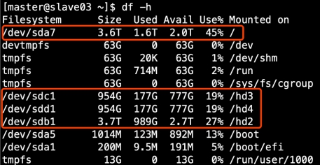
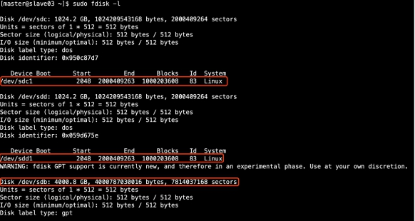

# 关于flume


## Flume组件介绍


### Source

- Taildir Source相比Exec Source、Spooling Directory Source的优势（自我介绍时的亮点）
  - 答：1.7版本之前，实现实时采集日志的Source只有Exec Source，但此Source可能会丢失数据（见官网描述）
    大家为了实现实时采集的效果，又保证数据安全，只能每隔半分钟产生一个并移动到Spooling Directory监控的目录中，此类做法会在web server中产生非常多的日志小文件，不利于管理
    1.7版本之后，出现了Taildir Source，即可以实时采集数据，又保证了数据安全，内部实现了类似断点续传的功能

- batchSize大小如何设置？
  - 答：event1K左右时，500-1000合适（默认为100）


### Channel

- FileChannel和MemoryChannel区别(面试题)
  - MemoryChannel传输数据速度更快，但因为数据保证在JVM的堆内存中，agent进程挂掉会导致数据丢失，适用于对数据质量要求不高的需求
  - FileChannel传输速度相对于Memory慢，但数据安全保障高，agent进程挂掉也可以从失败中恢复数据

- FileChannel优化
  - 通过配置dataDirs指向多个路径，每个路径对应不同的硬盘，增大Flume==吞吐量==

- 官方说明如下
  - Comma separated list of directories for storing log files. Using multiple directories on separate disks can improve file channel peformance

- checkpointDir和backupCheckpointDir也尽量配置在不同硬盘对应的目录中，保证checkpoint坏掉后，可以快速使用backupCheckpointDir恢复数据
  - 如何查看目录对应哪块硬盘? df -h,fdisk -l命令

  

 


### Sink：HDFS Sink（解决小文件问题）

- 官方默认的这三个参数配置写入HDFS后会产生==小文件==
  - hdfs.rollInterval
  - hdfs.rollSize
  - hdfs.rollCount

- HDFS存入大量小文件，有什么影响？（面试题）
  - 元数据层面：每个小文件都有一份元数据，其中包括文件路径，文件名，所有者，所属组，权限，创建时间等，这些信息都保存在Namenode内存中。所以小文件过多，会占用Namenode服务器大量内存，影响Namenode性能和使用寿命
  - 计算层面：默认情况下MR会对每个小文件启用一个Map任务计算，非常影响计算性能。同时也影响磁盘寻址时间。

- 现实生活中理解小文件 -- 年会游戏方案设计

- 生产环境HDFS Sink建议配置

```bash
a1.sinks.k1.type=hdfs
a1.sinks.k1.hdfs.path=hdfs://hadoop102:9000/test/%Y%m%d
a1.sinks.k1.hdfs.fileType=DataStream
a1.sinks.k1.hdfs.writeFormat=TEXT
# 每1800秒滚动一个文件
a1.sinks.k1.hdfs.rollInterval=1800
# 每128M滚动一个文件
a1.sinks.k1.hdfs.rollSize=134217728
a1.sinks.k1.hdfs.rollCount=0
# 每次拉取1000个event写入HDFS
a1.sinks.k1.hdfs.batchsize=1000
a1.sinks.k1.hdfs.threadsPoolSize=16
a1.sinks.k1.channel=c1
a1.sinks.k1.hdfs.filePrefix=test.%Y%m%d%H%M
a1.sinks.k1.hdfs.idelTimeout=600
a1.sinks.k1.hdfs.round=true
a1.sinks.k1.hdfs.roundValue=10
a1.sinks.k1.hdfs.roundUnit= minute
```

- 基于以上hdfs.rollInterval=1800，hdfs.rollSize=134217728，hdfs.roundValue=10，hdfs.roundUnit= minute几个参数综合作用，效果如下
  - tmp文件在达到128M时会滚动生成正式文件
  - tmp文件创建超30分钟时会滚动生成正式文件
  - 举例：在2018-01-01 05:23的的时侯sink接收到数据，那会产生如下tmp文件：/guolong/20180101/guolong.201801010520.tmp<即使文件内容没有达到128M，也会在05:33时滚动生成正式文件

- 测试启动脚本 
  - bin/flume-ng agent -n a1(agent的名称) -c conf -f conf/example(配置文件名称) **-Dflume.root.logger=DEBUG,console**


## 分层


### 采集层

- 使用supervior方式保证agent挂掉后自动重启

 

- 因为要采集业务日志，所以需要部署在业务服务器上
- 根据服务器配置设置JVM heap，一般设置512M – 1G


### 渠聚层

- 使用load_balance
- JVM heap一般设置为4G或更高
- 部署在单独的服务器上（4核8线程16G内存）


## JVM调优

- -Xmx与-Xms设置一样，减少内存抖动带来的性能影响，防止fullGC


## 是否丢失数据

- 基于以上双层架构配置，分析Flume如何保证数据至少处理一次

- 采集层agent挂掉：因为使用了Taildir Source，所以可以断点续传
- 汇聚层agent挂掉：因为使用load balance，实现了负载均衡和高可用
- Flume的source向channel写入数据、sink从channel拉取数据本身带有事务机制


## 积压数据处理

- 汇聚层向HDFS写数据时，channel中积压了大量数据，如何处理
  - 增加汇聚层agent个体
  - 增加汇聚层agent中sink的个数
  - 配置增加汇聚层agent的内存


# 日志采集flume配置

- flume初步架构搭建双层


## 测试taildir

```bash
a1.sources=r1
a1.sinks=k1
a1.channels=c1

a1.sources.r1.type=TAILDIR
a1.sources.r1.positionFile=/opt/module/flume/data/taildir_postition.json
# 监控的目录
a1.sources.r1.filegroups=f1
# 这里是.*log，注意*号的位置，查看官网示例可知
a1.sources.r1.filegroups.f1=/opt/module/flume/data/.*log
a1.sources.r1.fileHeader=true
a1.sources.r1.interceptors=i1
# 必须开启，用于%Y%m%d/%H%M的处理
a1.sources.r1.interceptors.i1.type=timestamp

a1.sinks.k1.type=hdfs
a1.sinks.k1.hdfs.path=hdfs://hadoop102:9000/flume-offline/%Y%m%d/%H%M
a1.sinks.k1.hdfs.useLocalTimeStamp=true
# 上传文件前缀
a1.sinks.k1.hdfs.filePrefix=upload-
a1.sinks.k1.hdfs.fileSuffix=.log
# 每个文件滚动大小128M
a1.sinks.k1.hdfs.rollSize=134217700
# 滚动个数与event数量无关
a1.sinks.k1.hdfs.rollCount=0
# 滚动间隔，没有达到滚动大小的128M也进行创建新文件，每隔60s创建一个文件
a1.sinks.k1.hdfs.rollInterval=60
# 安装时间滚动创建新文件夹
a1.sinks.k1.hdfs.round=true
# 多少时间单位创建一个新的文件,5分钟创建一个新文件夹
a1.sinks.k1.hdfs.roundValue=5
a1.sinks.k1.hdfs.roundUnit=minute
# 多少个event就flush到hdfs上
a1.sinks.k1.hdfs.batchSize= 100
a1.sinks.k1.hdfs.fileType=DataStream
a1.sinks.k1.hdfs.writeFormat=Text
a1.sinks.k1.hdfs.minBlockReplicas= 1

a1.channels.c1.type=file
a1.channels.c1.checkpointDir=/opt/module/flume/data/checkpoint
a1.channels.c1.dataDirs=/opt/module/flume/data
a1.channels.c1.capacity = 10000000
a1.channels.c1.transactionCapacity = 5000

a1.sources.r1.channels=c1
a1.sinks.k1.channel=c1
```

- 启动flume
  - 使用-D表示当前会话配置修改，配置文件在flume-ng文件内
  - -D 表示Dynamic

```bash
[ttshe@hadoop102 flume]$ bin/flume-ng agent --name a1 --conf conf/ --conf-file job/flume2hdfs.conf -Dflume.root.logger=INFO,console
```

- 脚本

```bash
[ttshe@hadoop102 job]$ cat 1.sh
#!/bin/bash
echo time $(date "+%Y-%m-%d-%H-%M-%S") 1.log >> /opt/module/flume/data/1.log
echo 2.log >> /opt/module/flume/data/2.log
echo 3.log >> /opt/module/flume/data/3.log

[ttshe@hadoop102 job]$ crontab -e
* * * * * sh /opt/module/flume/job/1.sh
```

- 结果显示每5分钟建立一个文件夹，每1分钟建立一个文件，每个文件是该1分钟内的全部数据
  - 数据内容如下，将读取的所有.log文件合并成一个hdfs文件

```bash
2.log
time 2020-01-19-20-16-01 1.log
3.log
```

- 再次测试
- flume2hdfs.conf

```bash
a1.sources=r1
a1.sinks=k1
a1.channels=c1

a1.sources.r1.type=taildir
a1.sources.r1.postitionFile=/opt/module/flume/data/taildir_postition.json
a1.sources.r1.filegroups=f1
a1.sources.r1.filegroups.f1=/opt/module/flume/data/.*log
a1.sources.r1.fileHeader=true
a1.sources.r1.interceptors=i1
a1.sources.r1.interceptors.i1.type=timestamp
a1.sources.r1.channels=c1

a1.sinks.k1.type=hdfs
a1.sinks.k1.hdfs.path=hdfs://hadoop102:9000/flume/%Y%m%d
a1.sinks.k1.hdfs.fileType=DataStream
a1.sinks.k1.hdfs.writeFormat=text
# 60s滚动创建一个文件，一般配置半小时，依据日志增长大小判断
a1.sinks.k1.hdfs.rollInterval=60
# 128M则创建一个文件，与上面的条件满足其中一个就成立
a1.sinks.k1.hdfs.rollSize=134217728
# 设置event为0进行滚动，就是不依据event的个数进行滚动，默认是10
a1.sinks.k1.hdfs.rollCount=0
# 每次拉取1000个event写入HDFS
a1.sinks.k1.hdfs.batchSize=1000
a1.sinks.k1.hdfs.threadPoolSize=16
# 
a1.sinks.k1.hdfs.filePrefix=flume.%Y%m%d%H%M
a1.sinks.k1.hdfs.idelTimeout=600
# 生成文件夹,生成的时间是按照整数确定的，10,20,30等为界
a1.sinks.k1.hdfs.round=true
a1.sinks.k1.hdfs.roundValue=10
a1.sinks.k1.hdfs.roundUint=minute
a1.sinks.k1.channel=c1

a1.channels.c1.type=file
a1.channels.c1.checkpointDir=/opt/module/data/checkpoint
# 配置到不同的硬盘上，可以提升效率，官网上示例可以配置多个，用逗号分隔
a1.channels.c1.dataDirs=/opt/module/flume/data
a1.channels.c1.capacity = 10000000
a1.channels.c1.transactionCapacity = 5000
```

- 启动

```bash
bin/flume-ng agent --name a1 --conf conf/ --conf-file job/flume2hdfs.conf -Dflume.root.logger=DEBUG,console
```


## 第一层Flume [hadoop103]

- 第一层 hadoop103上flume配置文件file2flume.conf
  - sink端使用负载均衡发送给第二层

```bash
a1.sources=r1
a1.channels=c1
a1.sinkgroups=g1
a1.sinks = k1 k2

# 输入源
a1.sources.r1.type=taildir
a1.sources.r1.positionFile=/opt/module/flume/data/log_postition.json
a1.sources.r1.filegroups= f1
# 这里是.*log，注意*号的位置，查看官网示例可知
a1.sources.r1.filegroups.f1=/opt/module/flume/data/.*log
a1.sources.r1.fileHeader=true
a1.sources.r1.channels = c1

# channel
a1.channels.c1.type=file
a1.channels.c1.checkpointDir=/opt/module/flume/data/checkpoint
# 可以配置backdataDirs 提高容错性
a1.channels.c1.dataDirs=/opt/module/flume/data/behavior
a1.channels.c1.maxFileSize=104857600
# 依据内存的大小，event的大小设置容量
a1.channels.c1.capacity=10000000
a1.channels.c1.keep-alive=60

# 输出源
a1.sinks.k1.type=avro
a1.sinks.k1.channel=c1
a1.sinks.k1.hostname=hadoop102
a1.sinks.k1.port=2222

a1.sinks.k2.type=avro
a1.sinks.k2.channel=c1
a1.sinks.k2.hostname=hadoop102
a1.sinks.k2.port=2223

# 输出组
# round_robin轮询
a1.sinkgroups.g1.processor.type=load_balance
a1.sinkgroups.g1.processor.backoff=true
a1.sinkgroups.g1.processor.selector=round_robin
a1.sinkgroups.g1.processor.selector.maxTimeOut=10000
a1.sinkgroups.g1.sinks =k1 k2
```


## 第二层flume [hadoop102]

- 第二层，hadoop102的配置文件 flume2kafka_1.conf

```bash
a2.sources=r1
a2.sinks=k1
a2.channels=c1

a2.sources.r1.type=avro
a2.sources.r1.bind=hadoop102
a2.sources.r1.port=2222

a2.sinks.k1.type=org.apache.flume.sink.kafka.KafkaSink
a2.sinks.k1.topic=user-behavior
a2.sinks.k1.brokerList=hadoop102:9092,hadoop103:9092,hadoop104:9092
a2.sinks.k1.requiredAcks=1
a2.sinks.k1.kafka.producer.type=sync
a2.sinks.k1.batchSize=1

a2.channels.c1.type=memory
a2.channels.c1.capacity=1000
a2.channels.c1.transactionCapacity=100

a2.sources.r1.channels=c1
a2.sinks.k1.channel=c1
```

- flume2kafka_2.conf

```bash
a2.sources=r1
a2.sinks=k1
a2.channels=c1

a2.sources.r1.type=avro
a2.sources.r1.bind=hadoop102
a2.sources.r1.port=2223

a2.sinks.k1.type=org.apache.flume.sink.kafka.KafkaSink
a2.sinks.k1.topic=user-behavior
a2.sinks.k1.brokerList=hadoop102:9092,hadoop103:9092,hadoop104:9092
a2.sinks.k1.requiredAcks=1
a2.sinks.k1.kafka.producer.type=sync
a2.sinks.k1.batchSize=1

a2.channels.c1.type=memory
a2.channels.c1.capacity=1000
a2.channels.c1.transactionCapacity=100

a2.sources.r1.channels=c1
a2.sinks.k1.channel=c1
```


## 第三层flume [hadoop104]

- kafka2flume2hdfs.conf

```bash
a3.sources=r1
a3.sinks=k1
a3.channels=c1

a3.sources.r1.type=org.apache.flume.source.kafka.KafkaSource
a3.sources.r1.batchSize=1000
a3.sources.r1.kafka.bootstrap.servers=hadoop102:9092
a3.sources.r1.kafka.topics=user-behavior
a3.sources.r1.kafka.consumer.group.id=test
a3.sources.r1.interceptors=i1
a3.sources.r1.interceptors.i1.type=timestamp

a3.sinks.k1.type=hdfs
a3.sinks.k1.hdfs.path=hdfs://hadoop102:9000/flume/%Y%m%d
a3.sinks.k1.hdfs.fileType=DataStream
a3.sinks.k1.hdfs.writeFormat=text
a3.sinks.k1.hdfs.useLocalTimeStamp=true
# 上传文件前缀
a3.sinks.k1.hdfs.filePrefix=upload-
a3.sinks.k1.hdfs.fileSuffix=.log
# 每个文件滚动大小128M
a3.sinks.k1.hdfs.rollSize=134217700
# 滚动个数与event数量无关
a3.sinks.k1.hdfs.rollCount=0
# 滚动间隔，没有达到滚动大小的128M也进行创建新文件，每隔60s创建一个文件
a3.sinks.k1.hdfs.rollInterval=60
# 安装时间滚动创建新文件夹
a3.sinks.k1.hdfs.round=true
# 多少时间单位创建一个新的文件,5分钟创建一个新文件夹
a3.sinks.k1.hdfs.roundValue=5
a3.sinks.k1.hdfs.roundUnit=minute
# 多少个event就flush到hdfs上
a3.sinks.k1.hdfs.batchSize= 100
a3.sinks.k1.hdfs.fileType=DataStream
a3.sinks.k1.hdfs.writeFormat=Text
a3.sinks.k1.hdfs.minBlockReplicas= 1

a3.channels.c1.type=memory
a3.channels.c1.maxFileSize = 2146435071
a3.channels.c1.capacity = 1000000

a3.sources.r1.channels=c1
a3.sinks.k1.channel=c1
```


## 启动

- 先启动kafka
- 启动消费者

```bash
[ttshe@hadoop102 kafka]$ bin/kafka-topic.sh --zookeeper hadoop102 --list
[ttshe@hadoop102 kafka]$ bin/kafka-console-consumer.sh --zookeeper hadoop102:2181 --from-beginning --topic user-behavior
```

- 启动第二层flume2kafka.conf
  - 注意需要拷贝2个flume的jar文件夹进行执行

```bash
[ttshe@hadoop102 module]$ cp -r flume/ flume-2/

[ttshe@hadoop102 flume-2]$ bin/flume-ng agent --name a2 --conf conf/ --conf-file job/flume2kafka_1.conf -Dflume.root.logger=INFO,console

[ttshe@hadoop102 flume]$ bin/flume-ng agent --name a2 --conf conf/ --conf-file job/flume2kafka_2.conf -Dflume.root.logger=INFO,console
```

- 启动第一层flume

```bash
[ttshe@hadoop103 flume]$ bin/flume-ng agent --name a1 --conf conf/ --conf-file job/file2flume.conf -Dflume.root.logger=INFO,console
```

- 在kafka上收到消息后开启第三层flume

```bash
[ttshe@hadoop104 flume]$ bin/flume-ng agent --name a3 --conf conf/ --conf-file job/kafka2flume2hdfs.conf -Dflume.root.logger=INFO,console
```


# 为什么使用flume双层

- Flume为什么分两层
  - 如果只有一层，日志采集服务器非常多，会有很多个Flume agent，同时向HDFS写数据会产生多个client，对HDFS来说压力过大
  - 只有一层时，部分业务配置只能在这层配置，如后续配置修改，则要修改的位置太多，不利于后期维护
- FileChannel和MemoryChannel区别
  - MemoryChannel传输数据速度更快，但因为数据保证在JVM的堆内存中，agent进程挂掉会导致数据丢失，适用于对数据质量要求不高的需求
  - FileChannel传输速度相对于Memory慢，但数据安全保障高，agent进程挂掉也可以从失败中恢复数据
- HDFS存入大量小文件，有什么影响
  - 元数据层面
    - 每个小文件都有一份元数据，其中包括文件路径，文件名，所有者，所属组，权限，创建时间等，这些信息都保存在Namenode内存中
    - 小文件过多，会占用Namenode服务器大量内存，影响Namenode性能和使用寿命
  - 计算层面
    - 默认情况下MR会对每个小文件启用一个Map任务计算，非常影响计算性能
    - 同时也影响磁盘寻址时间

